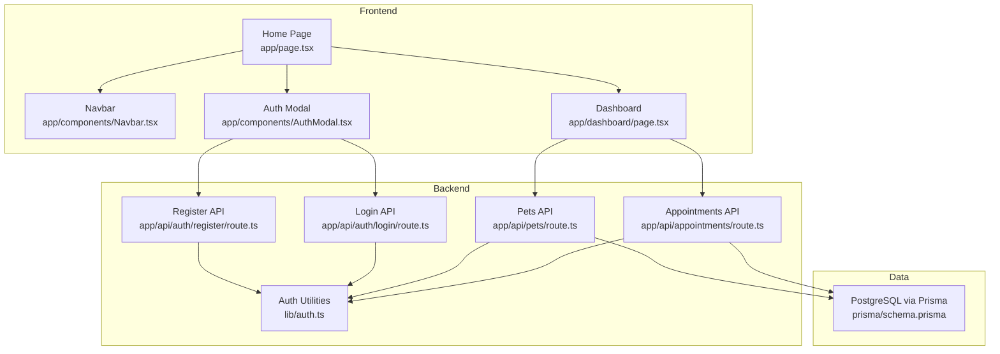
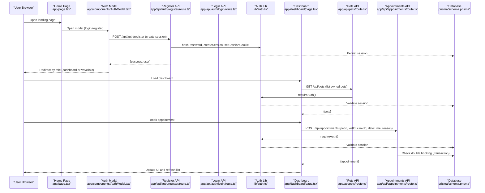
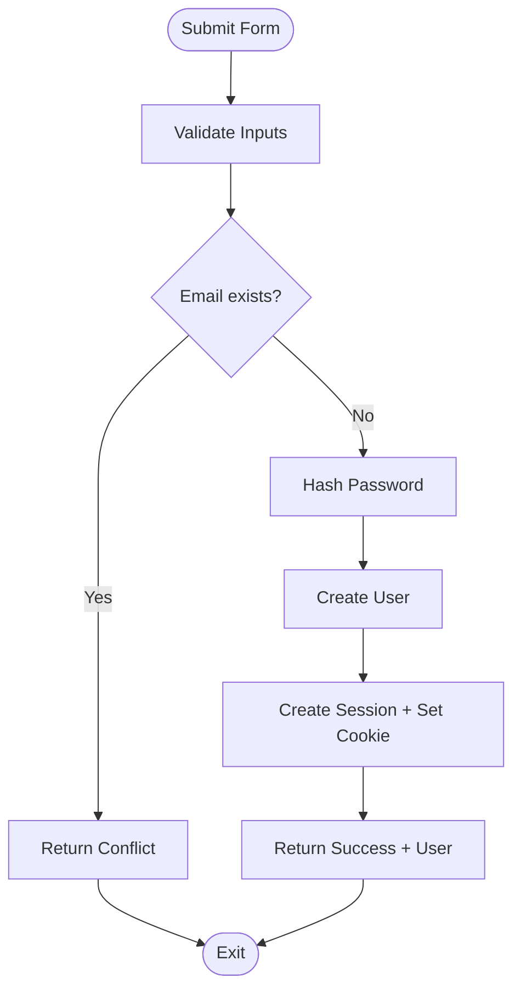
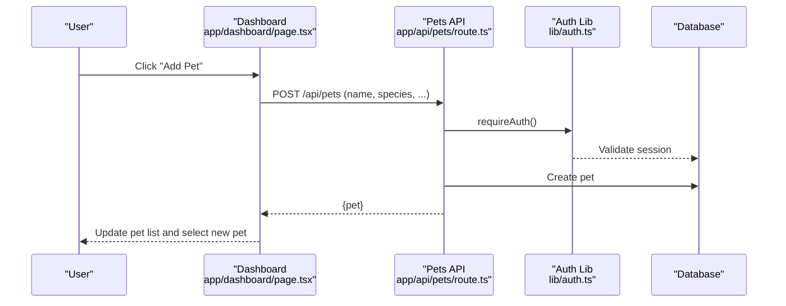
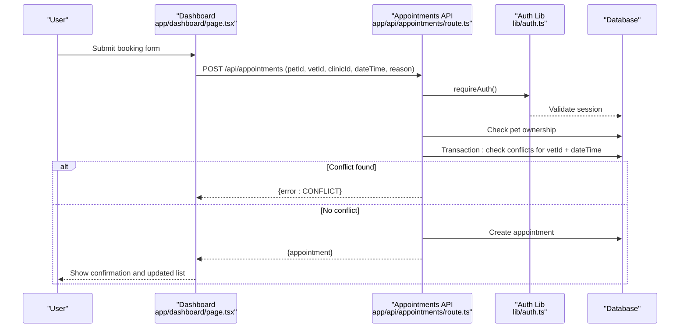
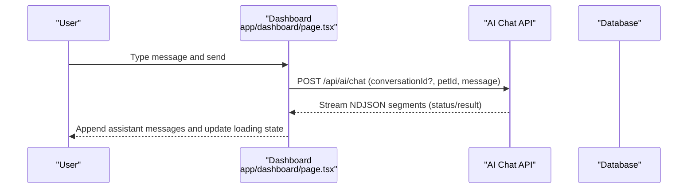
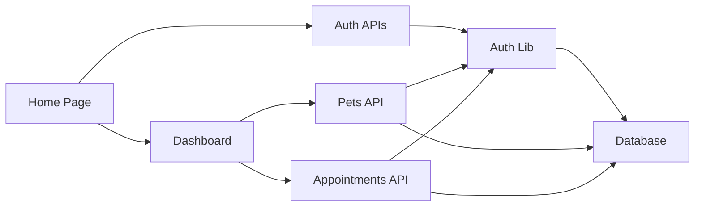

# End-to-End Testing

<cite>
**Referenced Files in This Document**
- [package.json](file://package.json)
- [README.md](file://README.md)
- [app/layout.tsx](file://app/layout.tsx)
- [app/page.tsx](file://app/page.tsx)
- [app/components/Navbar.tsx](file://app/components/Navbar.tsx)
- [app/components/AuthModal.tsx](file://app/components/AuthModal.tsx)
- [app/dashboard/page.tsx](file://app/dashboard/page.tsx)
- [app/api/auth/register/route.ts](file://app/api/auth/register/route.ts)
- [app/api/auth/login/route.ts](file://app/api/auth/login/route.ts)
- [app/api/appointments/route.ts](file://app/api/appointments/route.ts)
- [app/api/pets/route.ts](file://app/api/pets/route.ts)
- [lib/auth.ts](file://lib/auth.ts)
- [prisma/schema.prisma](file://prisma/schema.prisma)
- [test_booking.ts](file://test_booking.ts)
</cite>

## Table of Contents
1. Introduction
2. Project Structure
3. Core Components
4. Architecture Overview
5. Detailed Component Analysis
6. Dependency Analysis
7. Performance Considerations
8. Troubleshooting Guide
9. Conclusion
10. Appendices

## Introduction
This document provides comprehensive end-to-end (E2E) testing guidance for the PETIVA application, focusing on critical user journeys such as pet owner registration, pet profile creation, appointment booking, and veterinary consultation flows. It outlines strategies for testing multi-step processes including authentication, dashboard interactions, and real-time features. It also covers React component and UI interaction testing, complex workflow examples, suitable testing utilities and frameworks for Next.js applications, responsive design testing, and best practices to ensure stable, maintainable E2E suites integrated into continuous integration.

## Project Structure
PETIVA is a Next.js application with:
- App Router pages and client components under app/
- API routes under app/api/
- Shared server-side auth utilities under lib/
- Database schema and migrations under prisma/
- A sample test script under test_booking.ts

**Diagram sources**
- [app/page.tsx:1-223](file://app/page.tsx#L1-L223)
- [app/components/Navbar.tsx:1-49](file://app/components/Navbar.tsx#L1-L49)
- [app/components/AuthModal.tsx:1-205](file://app/components/AuthModal.tsx#L1-L205)
- [app/dashboard/page.tsx:1-800](file://app/dashboard/page.tsx#L1-L800)
- [app/api/auth/register/route.ts:1-78](file://app/api/auth/register/route.ts#L1-L78)
- [app/api/auth/login/route.ts:1-58](file://app/api/auth/login/route.ts#L1-L58)
- [app/api/pets/route.ts:1-69](file://app/api/pets/route.ts#L1-L69)
- [app/api/appointments/route.ts:1-143](file://app/api/appointments/route.ts#L1-L143)
- [lib/auth.ts:1-125](file://lib/auth.ts#L1-L125)
- [prisma/schema.prisma:1-312](file://prisma/schema.prisma#L1-L312)

**Section sources**
- [package.json:1-35](file://package.json#L1-L35)
- [README.md:1-37](file://README.md#L1-L37)
- [app/layout.tsx:1-16](file://app/layout.tsx#L1-L16)

## Core Components
Key areas that drive E2E scenarios:
- Authentication flow: Registration and login endpoints create sessions and set cookies; home page handles Google OAuth callback and redirects by role.
- Pet management: Create, list, update, delete pets via API; dashboard orchestrates state and UI updates.
- Appointment booking: Validate ownership, prevent double bookings within transactions, persist appointments, and return enriched data.
- Real-time AI chat: Streaming responses handled in the dashboard; tests should assert message ordering and conversation continuity.

Testing focus:
- Verify form submissions trigger correct API calls and handle success/error states.
- Assert navigation after successful authentication based on roles.
- Validate authorization checks (e.g., pet ownership).
- Ensure concurrency safety (double-booking prevention).
- Confirm real-time streaming behavior and UI updates.

**Section sources**
- [app/page.tsx:1-223](file://app/page.tsx#L1-L223)
- [app/components/AuthModal.tsx:1-205](file://app/components/AuthModal.tsx#L1-L205)
- [app/api/auth/register/route.ts:1-78](file://app/api/auth/register/route.ts#L1-L78)
- [app/api/auth/login/route.ts:1-58](file://app/api/auth/login/route.ts#L1-L58)
- [app/api/pets/route.ts:1-69](file://app/api/pets/route.ts#L1-L69)
- [app/api/appointments/route.ts:1-143](file://app/api/appointments/route.ts#L1-L143)
- [app/dashboard/page.tsx:1-800](file://app/dashboard/page.tsx#L1-L800)
- [lib/auth.ts:1-125](file://lib/auth.ts#L1-L125)

## Architecture Overview
The E2E architecture spans browser interactions, Next.js pages, API routes, and database operations. The following diagram maps actual code paths used during key workflows.

**Diagram sources**
- [app/page.tsx:1-223](file://app/page.tsx#L1-L223)
- [app/components/AuthModal.tsx:1-205](file://app/components/AuthModal.tsx#L1-L205)
- [app/api/auth/register/route.ts:1-78](file://app/api/auth/register/route.ts#L1-L78)
- [app/api/auth/login/route.ts:1-58](file://app/api/auth/login/route.ts#L1-L58)
- [app/dashboard/page.tsx:1-800](file://app/dashboard/page.tsx#L1-L800)
- [app/api/pets/route.ts:1-69](file://app/api/pets/route.ts#L1-L69)
- [app/api/appointments/route.ts:1-143](file://app/api/appointments/route.ts#L1-L143)
- [lib/auth.ts:1-125](file://lib/auth.ts#L1-L125)
- [prisma/schema.prisma:1-312](file://prisma/schema.prisma#L1-L312)

## Detailed Component Analysis

### Authentication Flow (Registration/Login)
- Registration validates required fields, enforces password length, prevents duplicates, hashes passwords, creates sessions, and sets secure cookies.
- Login verifies credentials, creates sessions, and sets cookies.
- Home page initializes Google SDK, fetches config, and handles callbacks; it also redirects users by role post-authentication.

**Diagram sources**
- [app/api/auth/register/route.ts:1-78](file://app/api/auth/register/route.ts#L1-L78)
- [lib/auth.ts:1-125](file://lib/auth.ts#L1-L125)

**Section sources**
- [app/page.tsx:1-223](file://app/page.tsx#L1-L223)
- [app/components/AuthModal.tsx:1-205](file://app/components/AuthModal.tsx#L1-L205)
- [app/api/auth/register/route.ts:1-78](file://app/api/auth/register/route.ts#L1-L78)
- [app/api/auth/login/route.ts:1-58](file://app/api/auth/login/route.ts#L1-L58)
- [lib/auth.ts:1-125](file://lib/auth.ts#L1-L125)

### Pet Profile Creation and Management
- Pets API lists and creates pets scoped to authenticated owners.
- Dashboard manages adding/editing pets, selecting a pet, and loading timelines.

**Diagram sources**
- [app/dashboard/page.tsx:1-800](file://app/dashboard/page.tsx#L1-L800)
- [app/api/pets/route.ts:1-69](file://app/api/pets/route.ts#L1-L69)
- [lib/auth.ts:1-125](file://lib/auth.ts#L1-L125)

**Section sources**
- [app/api/pets/route.ts:1-69](file://app/api/pets/route.ts#L1-L69)
- [app/dashboard/page.tsx:1-800](file://app/dashboard/page.tsx#L1-L800)

### Appointment Booking Workflow
- Booking requires authentication, validates pet ownership, prevents double bookings using a transaction, and persists the appointment with status REQUESTED.
- Dashboard posts booking form, updates local state, and refreshes the appointment list.

**Diagram sources**
- [app/dashboard/page.tsx:1-800](file://app/dashboard/page.tsx#L1-L800)
- [app/api/appointments/route.ts:1-143](file://app/api/appointments/route.ts#L1-L143)
- [lib/auth.ts:1-125](file://lib/auth.ts#L1-L125)

**Section sources**
- [app/api/appointments/route.ts:1-143](file://app/api/appointments/route.ts#L1-L143)
- [app/dashboard/page.tsx:1-800](file://app/dashboard/page.tsx#L1-L800)

### Real-Time AI Chat Interaction
- Dashboard sends messages to /api/ai/chat, handling both JSON and streaming NDJSON responses.
- Tests should verify message ordering, conversation persistence, and error states.

**Diagram sources**
- [app/dashboard/page.tsx:1-800](file://app/dashboard/page.tsx#L1-L800)

**Section sources**
- [app/dashboard/page.tsx:1-800](file://app/dashboard/page.tsx#L1-L800)

## Dependency Analysis
- Frontend components depend on API routes for data and actions.
- API routes depend on shared auth utilities for session validation and cookie handling.
- Data layer uses Prisma client against PostgreSQL per schema definitions.
- Test script demonstrates direct database setup and tool-based booking validations.

**Diagram sources**
- [app/page.tsx:1-223](file://app/page.tsx#L1-L223)
- [app/dashboard/page.tsx:1-800](file://app/dashboard/page.tsx#L1-L800)
- [app/api/auth/register/route.ts:1-78](file://app/api/auth/register/route.ts#L1-L78)
- [app/api/auth/login/route.ts:1-58](file://app/api/auth/login/route.ts#L1-L58)
- [app/api/pets/route.ts:1-69](file://app/api/pets/route.ts#L1-L69)
- [app/api/appointments/route.ts:1-143](file://app/api/appointments/route.ts#L1-L143)
- [lib/auth.ts:1-125](file://lib/auth.ts#L1-L125)

**Section sources**
- [prisma/schema.prisma:1-312](file://prisma/schema.prisma#L1-L312)
- [test_booking.ts:1-149](file://test_booking.ts#L1-L149)

## Performance Considerations
- Use efficient queries with appropriate includes and order-by clauses to minimize round trips.
- Leverage transactions for concurrency-sensitive operations like double-booking checks.
- Avoid excessive re-renders in dashboards by batching state updates and only refreshing necessary lists.
- For streaming AI responses, process chunks incrementally to keep UI responsive.

[No sources needed since this section provides general guidance]

## Troubleshooting Guide
Common issues and how to address them:
- Authentication failures: Ensure cookies are properly set and present in subsequent requests; validate session expiration logic.
- Authorization errors: Confirm pet ownership checks before creating appointments; verify user roles when accessing vet/clinic dashboards.
- Double-booking conflicts: Inspect transactional checks and time zone handling for date comparisons.
- Real-time chat errors: Handle non-NDJSON fallbacks and network interruptions gracefully; assert error messages shown to users.

**Section sources**
- [lib/auth.ts:1-125](file://lib/auth.ts#L1-L125)
- [app/api/appointments/route.ts:1-143](file://app/api/appointments/route.ts#L1-L143)
- [app/dashboard/page.tsx:1-800](file://app/dashboard/page.tsx#L1-L800)

## Conclusion
This E2E testing guide aligns test strategies with PETIVA’s core workflows: authentication, pet management, appointment booking, and real-time AI interactions. By validating API contracts, UI behaviors, and database constraints, you can build robust, stable test suites that cover full-stack scenarios and integrate smoothly into CI pipelines.

[No sources needed since this section summarizes without analyzing specific files]

## Appendices

### Recommended E2E Frameworks and Setup for Next.js
- Playwright: Headless browser automation with strong assertions and tracing; supports cross-browser testing and mobile emulation.
- Cypress: Developer-friendly E2E framework with interactive debugging and component testing capabilities.
- Integration with Next.js: Use Next.js dev server or built-in test runner where applicable; configure environment variables for APIs and databases.

[No sources needed since this section provides general guidance]

### Test Data Management
- Use fixtures or factories to create consistent test data (users, pets, vets, clinics).
- Seed databases before suites and clean up after runs to avoid flaky tests.
- Reference existing patterns in test scripts for setting up entities and relationships.

**Section sources**
- [test_booking.ts:1-149](file://test_booking.ts#L1-L149)

### Responsive Design and Browser Compatibility
- Test across viewports (mobile, tablet, desktop) to ensure layout integrity and interactions work as expected.
- Validate accessibility attributes and keyboard navigation for forms and modals.
- Use device emulators in your chosen E2E framework to simulate different screen sizes and browsers.

[No sources needed since this section provides general guidance]

### Best Practices for Stable E2E Suites
- Isolate tests and reset state between runs to prevent cross-test interference.
- Prefer explicit waits and assertions over arbitrary timeouts.
- Mock external services when possible; for internal APIs, use a controlled test database.
- Log and capture artifacts (screenshots, traces) on failure for faster debugging.
- Integrate test execution into CI with parallelization and caching to speed feedback loops.

[No sources needed since this section provides general guidance]