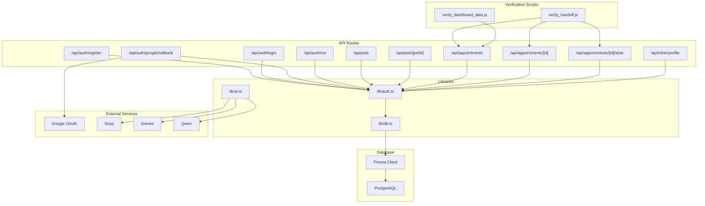
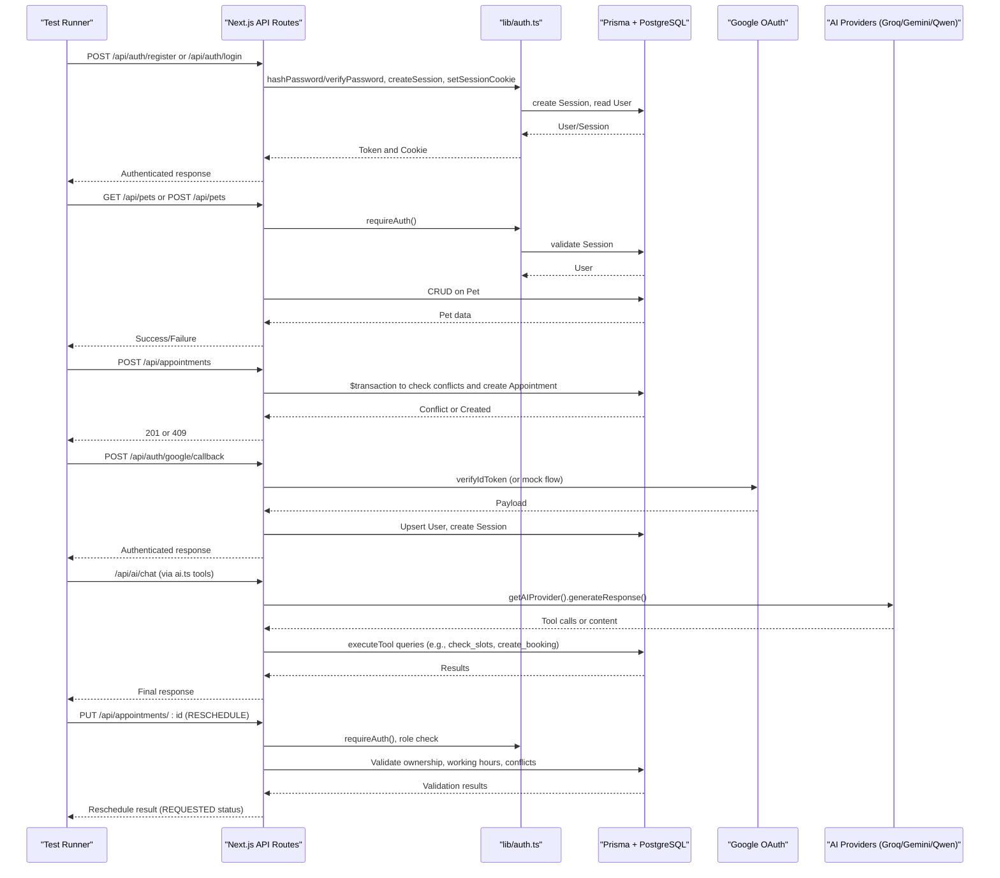
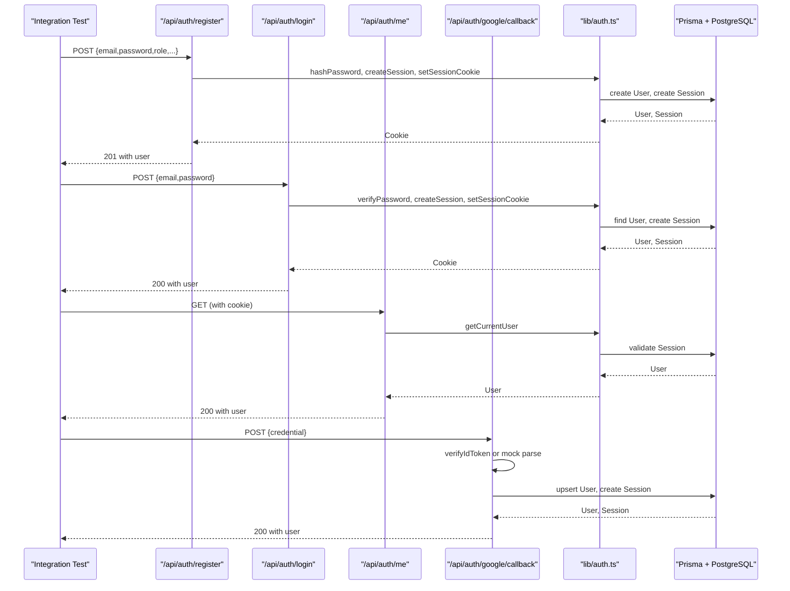
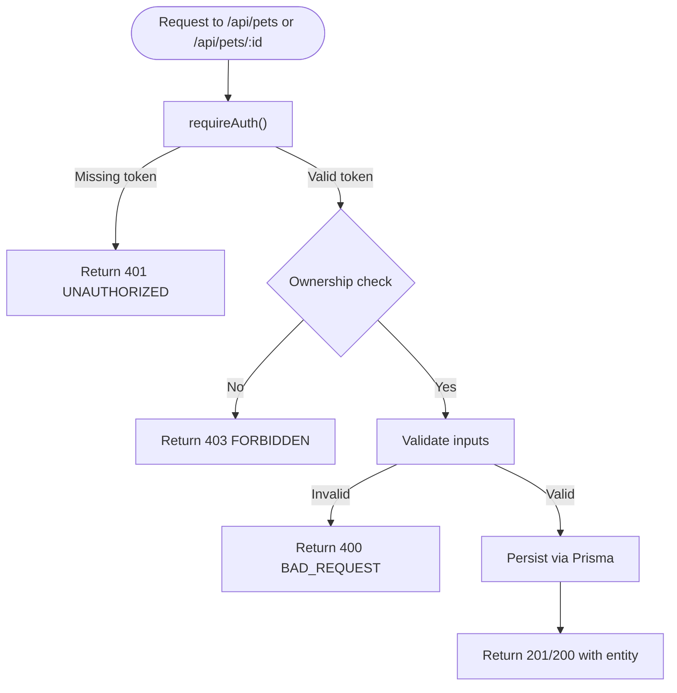
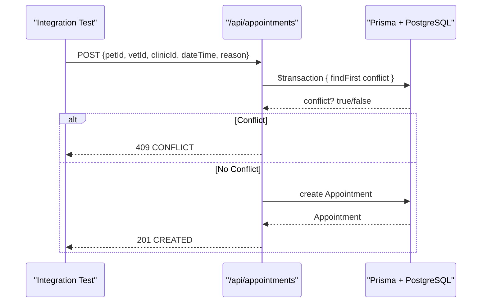
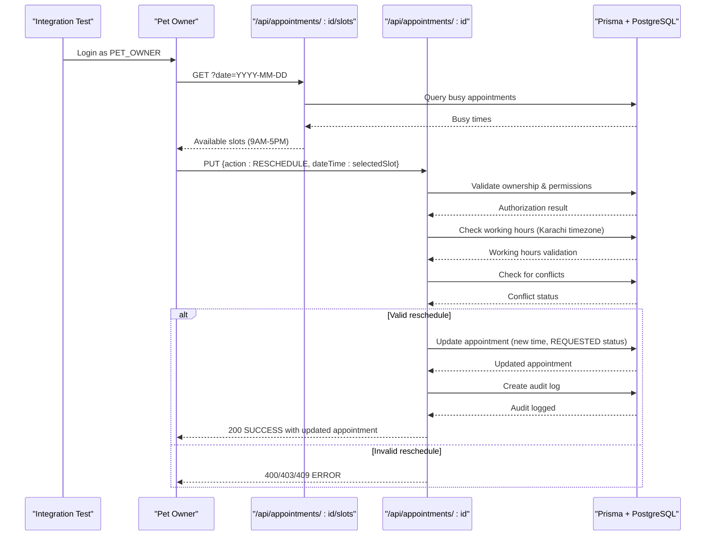
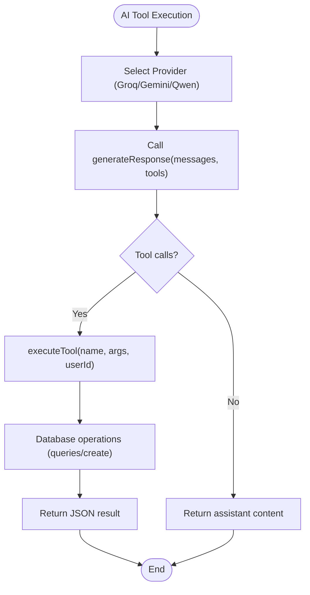
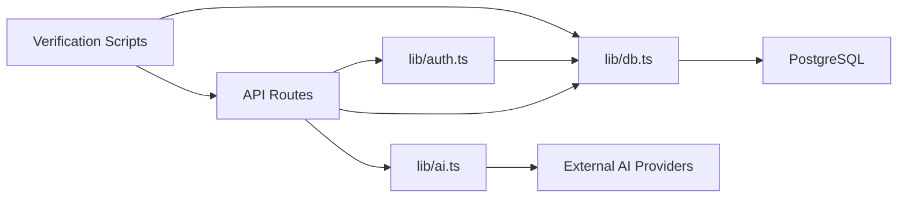

# Integration Testing

<cite>
**Referenced Files in This Document**
- [package.json](file://package.json)
- [schema.prisma](file://prisma/schema.prisma)
- [db.ts](file://lib/db.ts)
- [auth.ts](file://lib/auth.ts)
- [ai.ts](file://lib/ai.ts)
- [register route.ts](file://app/api/auth/register/route.ts)
- [login route.ts](file://app/api/auth/login/route.ts)
- [google callback route.ts](file://app/api/auth/google/callback/route.ts)
- [me route.ts](file://app/api/auth/me/route.ts)
- [pets route.ts](file://app/api/pets/route.ts)
- [pet detail route.ts](file://app/api/pets/[petId]/route.ts)
- [appointments route.ts](file://app/api/appointments/route.ts)
- [appointment detail route.ts](file://app/api/appointments/[appointmentId]/route.ts)
- [appointment slots route.ts](file://app/api/appointments/[appointmentId]/slots/route.ts)
- [clinic profile route.ts](file://app/api/clinic/profile/route.ts)
- [seed.js](file://prisma/seed.js)
- [verify_handoff.js](file://verify_handoff.js)
- [verify_dashboard_data.js](file://verify_dashboard_data.js)
</cite>

## Update Summary
**Changes Made**
- Added comprehensive rescheduling test cases covering slot validation, permission checks, and working hours enforcement
- Enhanced appointment endpoint testing with detailed reschedule workflow validation
- Updated testing strategies for appointment management endpoints
- Added new verification scripts for end-to-end rescheduling scenarios
- Expanded authorization testing for reschedule operations

## Table of Contents
1. Introduction
2. Project Structure
3. Core Components
4. Architecture Overview
5. Detailed Component Analysis
6. Dependency Analysis
7. Performance Considerations
8. Troubleshooting Guide
9. Conclusion
10. Appendices

## Introduction
This document provides comprehensive integration testing guidance for the PETIVA application. It focuses on validating REST API endpoints, database operations with Prisma and PostgreSQL, and external service integrations such as Google OAuth and AI providers (Groq, Gemini, Qwen). It also covers end-to-end workflows like user registration via OAuth, pet profile creation with medical records, and appointment booking with availability checks. **Updated** to include comprehensive rescheduling test cases that validate slot availability, permission enforcement, and working hours constraints. Guidance is included for test environment setup, mocking strategies, authentication and authorization testing, and best practices for isolation, cleanup, and performance.

## Project Structure
The application uses Next.js API routes under app/api, a Prisma schema defining the data model, shared libraries for database access and authentication, and an AI orchestration layer that integrates multiple LLM providers. A seed script populates realistic test data, and comprehensive verification scripts demonstrate direct API interactions useful for integration tests.

**Diagram sources**
- [register route.ts:1-78](file://app/api/auth/register/route.ts#L1-L78)
- [login route.ts:1-58](file://app/api/auth/login/route.ts#L1-L58)
- [google callback route.ts:1-98](file://app/api/auth/google/callback/route.ts#L1-L98)
- [me route.ts:1-33](file://app/api/auth/me/route.ts#L1-L33)
- [pets route.ts:1-69](file://app/api/pets/route.ts#L1-L69)
- [pet detail route.ts:1-141](file://app/api/pets/[petId]/route.ts#L1-L141)
- [appointments route.ts:1-143](file://app/api/appointments/route.ts#L1-L143)
- [appointment detail route.ts:1-242](file://app/api/appointments/[appointmentId]/route.ts#L1-L242)
- [appointment slots route.ts:1-117](file://app/api/appointments/[appointmentId]/slots/route.ts#L1-L117)
- [clinic profile route.ts:1-95](file://app/api/clinic/profile/route.ts#L1-L95)
- [auth.ts:1-125](file://lib/auth.ts#L1-L125)
- [db.ts:1-33](file://lib/db.ts#L1-L33)
- [ai.ts:1-467](file://lib/ai.ts#L1-L467)
- [verify_handoff.js:1-352](file://verify_handoff.js#L1-L352)
- [verify_dashboard_data.js:1-39](file://verify_dashboard_data.js#L1-L39)

**Section sources**
- [package.json:1-35](file://package.json#L1-L35)
- [schema.prisma:1-312](file://prisma/schema.prisma#L1-L312)

## Core Components
- Authentication and session management: password hashing, session token lifecycle, cookie handling, role-based access control helpers.
- Database layer: Prisma client with pg adapter, connection pooling, and environment-aware initialization.
- AI orchestration: provider selection, tool execution, and fallback strategy across Groq, Gemini, and Qwen.
- API routes: REST endpoints for auth, pets, appointments, and clinic management with consistent error handling and authorization.
- **Enhanced Verification Scripts**: Comprehensive test suites for rescheduling workflows including slot validation, permission checks, and working hours enforcement.

Key responsibilities and relationships are implemented across lib/auth.ts, lib/db.ts, lib/ai.ts, the API routes listed above, and the verification scripts.

**Section sources**
- [auth.ts:1-125](file://lib/auth.ts#L1-L125)
- [db.ts:1-33](file://lib/db.ts#L1-L33)
- [ai.ts:1-467](file://lib/ai.ts#L1-L467)
- [register route.ts:1-78](file://app/api/auth/register/route.ts#L1-L78)
- [login route.ts:1-58](file://app/api/auth/login/route.ts#L1-L58)
- [google callback route.ts:1-98](file://app/api/auth/google/callback/route.ts#L1-L98)
- [me route.ts:1-33](file://app/api/auth/me/route.ts#L1-L33)
- [pets route.ts:1-69](file://app/api/pets/route.ts#L1-L69)
- [pet detail route.ts:1-141](file://app/api/pets/[petId]/route.ts#L1-L141)
- [appointments route.ts:1-143](file://app/api/appointments/route.ts#L1-L143)
- [appointment detail route.ts:1-242](file://app/api/appointments/[appointmentId]/route.ts#L1-L242)
- [appointment slots route.ts:1-117](file://app/api/appointments/[appointmentId]/slots/route.ts#L1-L117)
- [clinic profile route.ts:1-95](file://app/api/clinic/profile/route.ts#L1-L95)
- [verify_handoff.js:1-352](file://verify_handoff.js#L1-L352)
- [verify_dashboard_data.js:1-39](file://verify_dashboard_data.js#L1-L39)

## Architecture Overview
Integration tests should validate the full request/response cycle including authentication, authorization, database transactions, and external calls. The following diagram maps the primary flows used by integration tests, **including the enhanced rescheduling workflow**.

**Diagram sources**
- [register route.ts:1-78](file://app/api/auth/register/route.ts#L1-L78)
- [login route.ts:1-58](file://app/api/auth/login/route.ts#L1-L58)
- [google callback route.ts:1-98](file://app/api/auth/google/callback/route.ts#L1-L98)
- [pets route.ts:1-69](file://app/api/pets/route.ts#L1-L69)
- [pet detail route.ts:1-141](file://app/api/pets/[petId]/route.ts#L1-L141)
- [appointments route.ts:1-143](file://app/api/appointments/route.ts#L1-L143)
- [appointment detail route.ts:1-242](file://app/api/appointments/[appointmentId]/route.ts#L1-L242)
- [appointment slots route.ts:1-117](file://app/api/appointments/[appointmentId]/slots/route.ts#L1-L117)
- [auth.ts:1-125](file://lib/auth.ts#L1-L125)
- [ai.ts:1-467](file://lib/ai.ts#L1-L467)

## Detailed Component Analysis

### Authentication Endpoints
- Registration: validates input, hashes password, creates user, issues session, sets cookie.
- Login: verifies credentials, creates session, sets cookie.
- Me: returns current user from session.
- Google OAuth callback: verifies token (or uses mock), upserts user, creates session, sets cookie.

Testing strategies:
- Validate status codes and response shapes for success and failure cases (missing fields, invalid roles, duplicate email, wrong password).
- Assert cookie presence and expiration behavior.
- For Google OAuth, test both real verification path and development mock path using a special token prefix.

**Diagram sources**
- [register route.ts:1-78](file://app/api/auth/register/route.ts#L1-L78)
- [login route.ts:1-58](file://app/api/auth/login/route.ts#L1-L58)
- [me route.ts:1-33](file://app/api/auth/me/route.ts#L1-L33)
- [google callback route.ts:1-98](file://app/api/auth/google/callback/route.ts#L1-L98)
- [auth.ts:1-125](file://lib/auth.ts#L1-L125)

**Section sources**
- [register route.ts:1-78](file://app/api/auth/register/route.ts#L1-L78)
- [login route.ts:1-58](file://app/api/auth/login/route.ts#L1-L58)
- [me route.ts:1-33](file://app/api/auth/me/route.ts#L1-L33)
- [google callback route.ts:1-98](file://app/api/auth/google/callback/route.ts#L1-L98)
- [auth.ts:1-125](file://lib/auth.ts#L1-L125)

### Pets Endpoints
- List pets: requires authentication, filters by owner.
- Create pet: requires authentication, validates required fields, persists pet.
- Detail/update/delete pet: requires authentication, enforces ownership, performs CRUD.

Testing strategies:
- Unauthenticated requests must return 401.
- Ownership checks must return 403 when accessing another user's pet.
- Validation errors must return 400 with appropriate messages.
- Successful operations must return expected entities and status codes.

**Diagram sources**
- [pets route.ts:1-69](file://app/api/pets/route.ts#L1-L69)
- [pet detail route.ts:1-141](file://app/api/pets/[petId]/route.ts#L1-L141)
- [auth.ts:1-125](file://lib/auth.ts#L1-L125)

**Section sources**
- [pets route.ts:1-69](file://app/api/pets/route.ts#L1-L69)
- [pet detail route.ts:1-141](file://app/api/pets/[petId]/route.ts#L1-L141)

### Appointments Endpoints

#### Basic Appointment Operations
- List appointments: role-based filtering (PET_OWNER, VETERINARIAN, CLINIC_ADMIN).
- Create appointment: requires authentication, validates ownership, prevents double booking within a transaction, persists appointment.

Testing strategies:
- Role-based visibility: ensure each role sees only permitted appointments.
- Double booking prevention: assert 409 conflict when attempting to book an already requested or confirmed slot.
- Transactional integrity: confirm atomicity of conflict check and creation.

**Diagram sources**
- [appointments route.ts:1-143](file://app/api/appointments/route.ts#L1-L143)

#### Enhanced Rescheduling Workflow
**Updated** The rescheduling functionality includes comprehensive validation and permission checks:

- **Permission Enforcement**: Only PET_OWNER role can reschedule their own appointments
- **Slot Validation**: Validates date format, rejects past dates, ensures future dates only
- **Working Hours Enforcement**: Restricts rescheduling to 9 AM - 5 PM Karachi time (UTC+5)
- **Conflict Detection**: Prevents double booking during reschedule
- **Status Management**: Resets appointment status to REQUESTED after successful reschedule
- **Audit Logging**: Records all reschedule actions for security tracking

Testing strategies for rescheduling:
- Verify owner-only access: non-owners receive 403 FORBIDDEN
- Test working hours validation: off-hours requests return OUTSIDE_WORKING_HOURS error
- Validate same-time rejection: cannot reschedule to the same time
- Confirm conflict detection: overlapping appointments are rejected
- Verify status reset: successful reschedules reset status to REQUESTED
- Test audit logging: ensure reschedule actions are recorded

**Diagram sources**
- [appointment detail route.ts:17-137](file://app/api/appointments/[appointmentId]/route.ts#L17-L137)
- [appointment slots route.ts:15-103](file://app/api/appointments/[appointmentId]/slots/route.ts#L15-L103)

**Section sources**
- [appointments route.ts:1-143](file://app/api/appointments/route.ts#L1-L143)
- [appointment detail route.ts:1-242](file://app/api/appointments/[appointmentId]/route.ts#L1-L242)
- [appointment slots route.ts:1-117](file://app/api/appointments/[appointmentId]/slots/route.ts#L1-L117)

### Clinic Management Endpoints
- Clinic profile: requires CLINIC_ADMIN role and associated clinicId; supports GET and PUT updates.

Testing strategies:
- Enforce role-based access: non-admin users receive 403.
- Validate missing associations: return 400 if no clinic linked to admin.
- Update operations: assert persisted changes and correct responses.

**Section sources**
- [clinic profile route.ts:1-95](file://app/api/clinic/profile/route.ts#L1-L95)

### External Service Integrations

#### Google OAuth Flow
- Callback endpoint verifies Google ID tokens in production and supports a mock flow in development/testing environments using a special token prefix.
- On success, upserts user and creates a session with cookie.

Testing strategies:
- Production path: configure GOOGLE_CLIENT_ID and use valid tokens; assert session creation and user existence.
- Development/mock path: send credential starting with the recognized prefix; assert same outcomes without network calls.

**Section sources**
- [google callback route.ts:1-98](file://app/api/auth/google/callback/route.ts#L1-L98)

#### AI Provider Calls (Groq, Gemini, Qwen)
- AI orchestration selects provider based on environment configuration and executes tool functions that interact with the database (e.g., getMyPets, check_slots, create_booking).
- Fallback strategy switches between providers on failure.

Testing strategies:
- Mock external HTTP calls to AI providers to avoid flaky network dependencies.
- Validate tool execution paths: ensure proper parameter validation, ownership checks, working hours constraints, past date checks, and double booking prevention.
- Assert database state changes after tool-driven bookings.

**Diagram sources**
- [ai.ts:1-467](file://lib/ai.ts#L1-L467)

**Section sources**
- [ai.ts:1-467](file://lib/ai.ts#L1-L467)

### Enhanced Verification Scripts

#### Comprehensive Rescheduling Test Suite
**New** The `verify_handoff.js` script provides comprehensive testing for rescheduling workflows:

- **Slot Validation Tests**: Validates date format, past date rejection, and working hours enforcement
- **Permission Checks**: Ensures only pet owners can access reschedule slots and perform rescheduling
- **Working Hours Enforcement**: Tests 9 AM - 5 PM Karachi timezone restrictions
- **Conflict Detection**: Verifies double booking prevention during reschedule
- **Status Management**: Confirms appointment status resets to REQUESTED after reschedule
- **Audit Trail**: Validates that reschedule actions are properly logged

#### Dashboard Data Verification
**New** The `verify_dashboard_data.js` script validates that seeded data is correctly served through APIs for different user roles.

Testing strategies:
- Run against live development server to validate end-to-end workflows
- Test cross-user authorization boundaries
- Verify timezone handling for working hours validation
- Validate appointment status transitions and data consistency

**Section sources**
- [verify_handoff.js:1-352](file://verify_handoff.js#L1-L352)
- [verify_dashboard_data.js:1-39](file://verify_dashboard_data.js#L1-L39)

### End-to-End Workflows

#### User Registration with OAuth
- Steps: call Google OAuth callback with credential (real or mock), verify user upsert, assert session cookie, retrieve current user via /api/auth/me.
- Assertions: 200 success, user fields present, cookie set, subsequent authenticated requests succeed.

#### Pet Profile Creation with Medical Records
- Steps: register/login user, create pet via /api/pets, optionally create related records (vaccinations, medications, allergies, conditions, metrics) through AI tool flows or direct DB seeding.
- Assertions: pet created with correct ownerId, related records exist, timeline queries return expected data.

#### Enhanced Appointment Booking and Rescheduling with Availability Checking
**Updated** Steps: authenticate as pet owner, call /api/appointments POST with valid data, assert 201 created; attempt duplicate booking to assert 409 conflict; list appointments to verify inclusion; **test rescheduling workflow with slot validation, permission checks, and working hours enforcement**.
- Assertions: conflict detection works, role-based listing returns correct subsets, timestamps and statuses are correct; **rescheduling validates permissions, working hours, and availability**.

[No sources needed since this section synthesizes previously analyzed components]

## Dependency Analysis
The application's integration surface depends on:
- Next.js API routes for HTTP entry points.
- Shared libraries for authentication and database access.
- Prisma client configured with PostgreSQL adapter and connection pooling.
- External services for OAuth and AI providers.
- **Enhanced verification scripts for comprehensive testing coverage**.

**Diagram sources**
- [db.ts:1-33](file://lib/db.ts#L1-L33)
- [auth.ts:1-125](file://lib/auth.ts#L1-L125)
- [ai.ts:1-467](file://lib/ai.ts#L1-L467)
- [verify_handoff.js:1-352](file://verify_handoff.js#L1-L352)
- [verify_dashboard_data.js:1-39](file://verify_dashboard_data.js#L1-L39)

**Section sources**
- [package.json:1-35](file://package.json#L1-L35)
- [db.ts:1-33](file://lib/db.ts#L1-L33)
- [auth.ts:1-125](file://lib/auth.ts#L1-L125)
- [ai.ts:1-467](file://lib/ai.ts#L1-L467)
- [verify_handoff.js:1-352](file://verify_handoff.js#L1-L352)
- [verify_dashboard_data.js:1-39](file://verify_dashboard_data.js#L1-L39)

## Performance Considerations
- Use a dedicated test database per test suite run to avoid contention and enable parallelism where safe.
- Prefer transactional rollback or deterministic cleanup to reset state quickly between tests.
- Minimize external calls by mocking AI providers and OAuth verification in tests to reduce flakiness and latency.
- Reuse authenticated sessions within a test scenario to reduce overhead.
- Batch operations where possible (e.g., seeding related entities) to reduce round trips.
- **Optimize rescheduling tests**: Cache slot availability data and minimize repeated API calls during comprehensive test suites.

[No sources needed since this section provides general guidance]

## Troubleshooting Guide
Common issues and how to address them in integration tests:
- Missing DATABASE_URL or misconfigured connection pool: ensure environment variables are set and the test runner can connect to PostgreSQL.
- Duplicate key collisions during seeding: use idempotent upserts and delete dependent rows before re-inserting to support reruns.
- Flaky OAuth verification: rely on the mock flow in development/test environments to avoid network dependencies.
- AI provider failures: implement retries or fallbacks in tests; assert graceful degradation when providers are unavailable.
- Authorization errors: verify cookies/tokens are correctly passed and sessions are validated; assert 401/403 responses for unauthorized/forbidden scenarios.
- **Rescheduling test failures**: Verify timezone handling for Karachi (UTC+5), ensure working hours validation matches business rules, and confirm proper error codes for different failure scenarios.

**Section sources**
- [seed.js:1-430](file://prisma/seed.js#L1-L430)
- [google callback route.ts:1-98](file://app/api/auth/google/callback/route.ts#L1-L98)
- [ai.ts:1-467](file://lib/ai.ts#L1-L467)
- [verify_handoff.js:1-352](file://verify_handoff.js#L1-L352)

## Conclusion
Robust integration tests for PETIVA should cover authentication, authorization, database transactions, and external service interactions. By leveraging the provided API routes, shared libraries, Prisma schema, seed data, **and enhanced verification scripts**, you can build reliable tests that validate critical workflows such as OAuth login, pet management, and appointment booking with availability checks. **The comprehensive rescheduling test suite ensures thorough validation of slot availability, permission enforcement, and working hours constraints.** Mocking external services and isolating test databases will improve stability and speed while ensuring correctness across the system.

[No sources needed since this section summarizes without analyzing specific files]

## Appendices

### Test Environment Setup
- Database:
  - Configure DATABASE_URL pointing to a test PostgreSQL instance.
  - Run migrations and seed data before tests using prisma migrate and seed.js.
- Mock Services:
  - Use the Google OAuth mock flow by sending credentials with the recognized prefix to bypass network calls.
  - Mock AI provider HTTP calls to avoid external dependencies; assert tool execution paths and database effects.
- Test Data Seeding:
  - Use seed.js to populate clinics, users, veterinarians, pets, appointments, medical records, and related entities.
  - For additional ad-hoc data, reference patterns in verification scripts to create minimal fixtures.
- **Enhanced Verification Scripts**:
  - Run `verify_handoff.js` against live development server for comprehensive rescheduling workflow testing.
  - Use `verify_dashboard_data.js` to validate dashboard data presentation across different user roles.

**Section sources**
- [seed.js:1-430](file://prisma/seed.js#L1-L430)
- [verify_handoff.js:1-352](file://verify_handoff.js#L1-L352)
- [verify_dashboard_data.js:1-39](file://verify_dashboard_data.js#L1-L39)
- [google callback route.ts:1-98](file://app/api/auth/google/callback/route.ts#L1-L98)

### Authentication and Authorization Testing Checklist
- Unauthenticated requests return 401.
- Invalid credentials return 401.
- Valid login/registration sets session cookie and allows subsequent authenticated requests.
- Role-based endpoints enforce restrictions (e.g., clinic profile requires CLINIC_ADMIN).
- Ownership checks prevent cross-user access (e.g., pet detail/update/delete).
- **Enhanced Rescheduling Authorization**:
  - Only PET_OWNER role can reschedule appointments
  - Users can only reschedule their own appointments (not others')
  - Non-owners attempting reschedule receive 403 FORBIDDEN
  - Cross-owner reschedule attempts are properly blocked

**Section sources**
- [auth.ts:1-125](file://lib/auth.ts#L1-L125)
- [register route.ts:1-78](file://app/api/auth/register/route.ts#L1-L78)
- [login route.ts:1-58](file://app/api/auth/login/route.ts#L1-L58)
- [clinic profile route.ts:1-95](file://app/api/clinic/profile/route.ts#L1-L95)
- [pet detail route.ts:1-141](file://app/api/pets/[petId]/route.ts#L1-L141)
- [appointment detail route.ts:17-42](file://app/api/appointments/[appointmentId]/route.ts#L17-L42)

### Best Practices for Integration Tests
- Isolation:
  - Use separate test databases or schemas per test suite.
  - Wrap test steps in transactions when feasible and roll back at the end.
- Cleanup:
  - Delete created entities or reset state deterministically after each test.
  - Use idempotent seeding to support repeated runs.
- Performance:
  - Avoid unnecessary external calls; mock third-party APIs.
  - Reuse authenticated contexts within a single scenario.
- Reliability:
  - Assert both success and failure paths.
  - Include timeouts and retries for external services when necessary.
- **Enhanced Testing Coverage**:
  - Test timezone handling for working hours validation (Karachi UTC+5)
  - Validate all error codes and messages for rescheduling operations
  - Ensure comprehensive coverage of permission and authorization scenarios
  - Test edge cases like same-time reschedule attempts and cancelled appointment rescheduling

[No sources needed since this section provides general guidance]