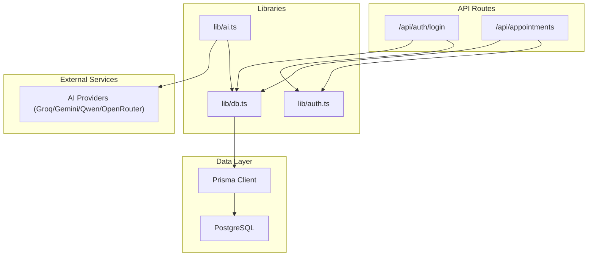
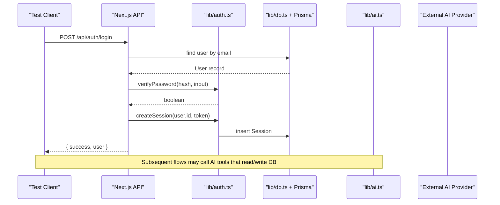
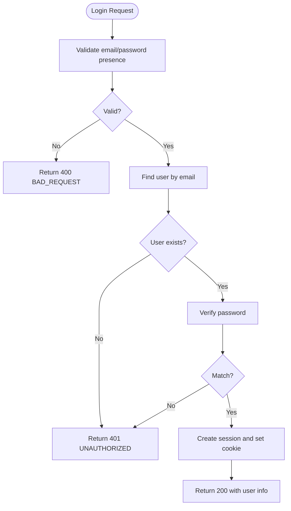
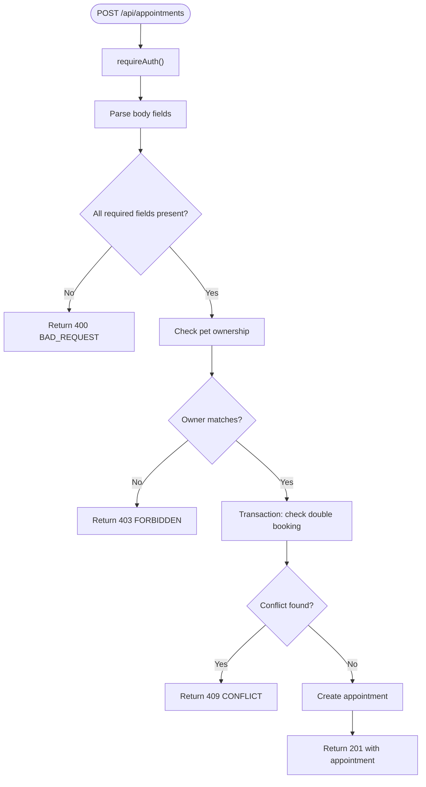
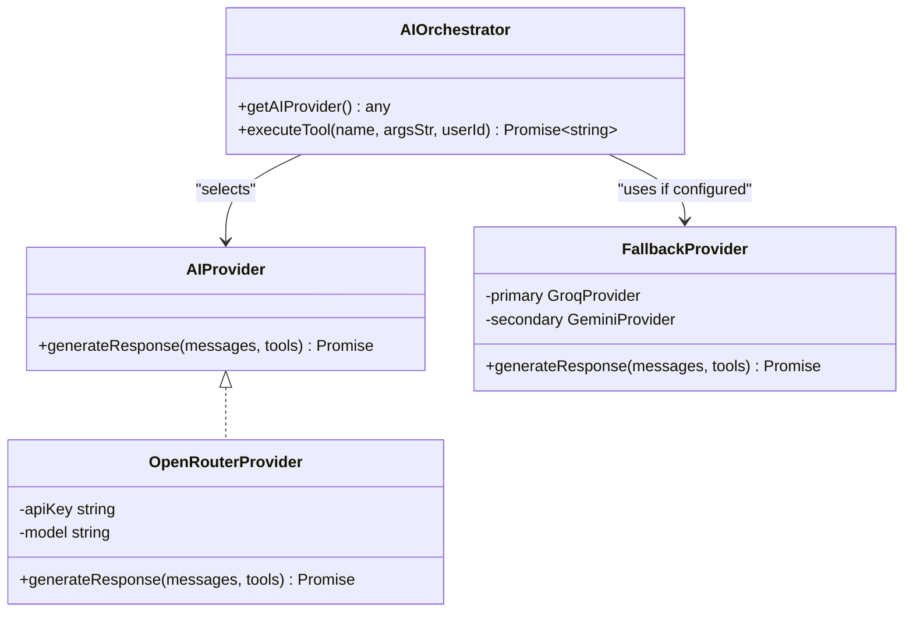
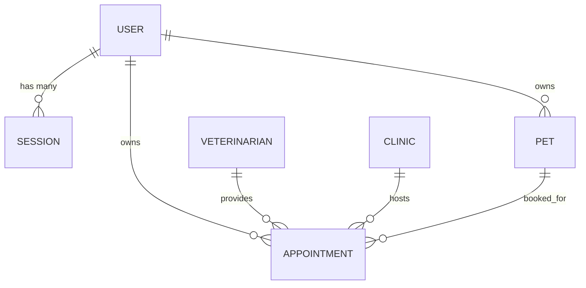
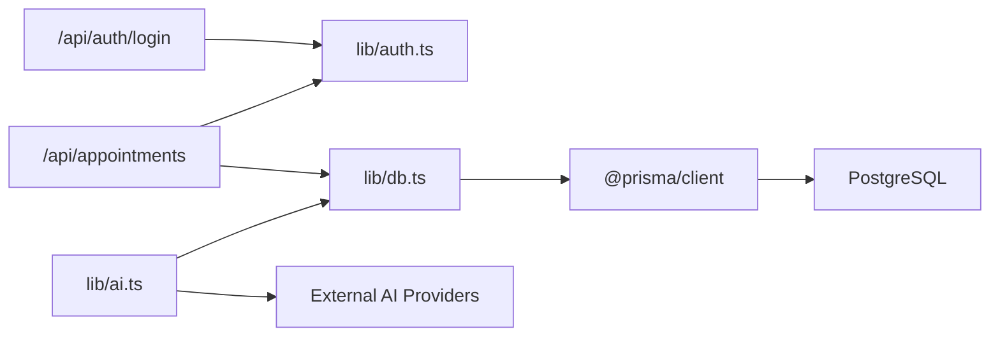

# Testing Strategy

<cite>
**Referenced Files in This Document**
- [package.json](file://package.json)
- [next.config.ts](file://next.config.ts)
- [lib/db.ts](file://lib/db.ts)
- [lib/auth.ts](file://lib/auth.ts)
- [lib/ai.ts](file://lib/ai.ts)
- [prisma/schema.prisma](file://prisma/schema.prisma)
- [app/api/auth/login/route.ts](file://app/api/auth/login/route.ts)
- [app/api/appointments/route.ts](file://app/api/appointments/route.ts)
- [test_booking.ts](file://test_booking.ts)
</cite>

## Table of Contents
1. [Introduction](#introduction)
2. [Project Structure](#project-structure)
3. [Core Components](#core-components)
4. [Architecture Overview](#architecture-overview)
5. [Detailed Component Analysis](#detailed-component-analysis)
6. [Dependency Analysis](#dependency-analysis)
7. [Performance Considerations](#performance-considerations)
8. [Troubleshooting Guide](#troubleshooting-guide)
9. [Conclusion](#conclusion)
10. [Appendices](#appendices)

## Introduction
This document defines the testing strategy for PETIVA, covering unit, integration, and end-to-end testing across authentication, AI interactions, API endpoints, database operations, and critical user workflows such as appointment booking and pet profile management. It also outlines test utilities, data management practices, CI setup guidance, coverage requirements, and performance testing approaches tailored to this Next.js application with Prisma and external AI providers.

## Project Structure
PETIVA is a Next.js application using:
- Server-side APIs under app/api
- Shared libraries for auth, database, and AI integrations under lib
- Prisma schema defining domain models and relationships
- A small ad-hoc script for manual integration tests

**Diagram sources**
- [app/api/auth/login/route.ts:1-58](file://app/api/auth/login/route.ts#L1-L58)
- [app/api/appointments/route.ts:1-143](file://app/api/appointments/route.ts#L1-L143)
- [lib/auth.ts:1-125](file://lib/auth.ts#L1-L125)
- [lib/db.ts:1-33](file://lib/db.ts#L1-L33)
- [lib/ai.ts:1-467](file://lib/ai.ts#L1-L467)

**Section sources**
- [package.json:1-35](file://package.json#L1-L35)
- [next.config.ts:1-8](file://next.config.ts#L1-L8)

## Core Components
- Authentication and session management: password hashing, session creation/validation, cookie handling, role-based guards.
- Database access: Prisma client initialization with connection pooling and environment-aware configuration.
- AI orchestration: provider selection, tool definitions, tool execution with authorization checks, and fallback strategies.
- API endpoints: login flow and appointment CRUD with authorization and conflict detection.

Key responsibilities and test targets:
- Auth utilities: hash/verify password, session token lifecycle, cookie helpers, requireAuth/requireRole.
- DB layer: ensure isolated connections/pools per environment and stable Prisma client usage.
- AI tools: verify ownership checks, working hours validation, past date prevention, double-booking prevention, slot availability queries.
- Endpoints: validate request/response shapes, status codes, and error paths.

**Section sources**
- [lib/auth.ts:1-125](file://lib/auth.ts#L1-L125)
- [lib/db.ts:1-33](file://lib/db.ts#L1-L33)
- [lib/ai.ts:1-467](file://lib/ai.ts#L1-L467)
- [app/api/auth/login/route.ts:1-58](file://app/api/auth/login/route.ts#L1-L58)
- [app/api/appointments/route.ts:1-143](file://app/api/appointments/route.ts#L1-L143)

## Architecture Overview
The system integrates authentication, business logic, and external services behind Next.js API routes. Tests should cover:
- Unit-level behavior of pure functions and utility methods
- Integration-level flows through API routes into DB and AI providers
- End-to-end user journeys via HTTP requests against a running server or test harness

**Diagram sources**
- [app/api/auth/login/route.ts:1-58](file://app/api/auth/login/route.ts#L1-L58)
- [lib/auth.ts:1-125](file://lib/auth.ts#L1-L125)
- [lib/db.ts:1-33](file://lib/db.ts#L1-L33)

## Detailed Component Analysis

### Authentication and Sessions
Focus areas:
- Password hashing and verification
- Session token generation, hashing, storage, and expiration
- Cookie setting/clearing
- Authorization guards (requireAuth, requireRole)

Recommended tests:
- Unit tests for hash/verify password, token generation/hashing, and session CRUD
- Integration tests for login endpoint asserting correct status codes, cookies, and response shape
- Negative cases: invalid credentials, missing fields, expired sessions

**Diagram sources**
- [app/api/auth/login/route.ts:1-58](file://app/api/auth/login/route.ts#L1-L58)
- [lib/auth.ts:1-125](file://lib/auth.ts#L1-L125)

**Section sources**
- [lib/auth.ts:1-125](file://lib/auth.ts#L1-L125)
- [app/api/auth/login/route.ts:1-58](file://app/api/auth/login/route.ts#L1-L58)

### Appointment Booking and Conflict Handling
Focus areas:
- Ownership verification for pets
- Double-booking prevention within transactions
- Working hours and past-date validations
- Role-based listing of appointments

Recommended tests:
- Unit tests for ownership checks and time validations
- Integration tests for POST /api/appointments asserting 201 on success, 409 on conflicts, and 403 on unauthorized access
- GET /api/appointments for each role ensuring correct filtering and includes

**Diagram sources**
- [app/api/appointments/route.ts:1-143](file://app/api/appointments/route.ts#L1-L143)

**Section sources**
- [app/api/appointments/route.ts:1-143](file://app/api/appointments/route.ts#L1-L143)

### AI Tools and Orchestrator
Focus areas:
- Provider selection and fallback
- Tool definitions and parameter validation
- executeTool implementation including authorization and business rules
- Error propagation from external providers

Recommended tests:
- Unit tests for executeTool branches: getMyPets, getPetProfile, getPetHealthTimeline, vaccinations, medications, allergies, appointments, find_vet, check_slots, create_booking
- Mock external AI provider calls when testing orchestrator logic
- Assert ownership enforcement and business rule outcomes (past dates, outside working hours, double bookings)

**Diagram sources**
- [lib/ai.ts:1-467](file://lib/ai.ts#L1-L467)

**Section sources**
- [lib/ai.ts:1-467](file://lib/ai.ts#L1-L467)

### Data Model and Relationships
The Prisma schema defines core entities and constraints relevant to testing:
- Users, Roles, Sessions
- Pets, Veterinarians, Clinics, Vet-Clinic Associations
- Appointments with statuses and indexes
- Medical records, versions, prescriptions, vaccinations, medications, allergies, health conditions/metrics
- AI conversations and messages
- Audit logs

Testing implications:
- Use schema enums and relations to build fixtures
- Ensure tests respect unique constraints and cascades
- Leverage indexes in integration tests for query correctness

**Diagram sources**
- [prisma/schema.prisma:30-182](file://prisma/schema.prisma#L30-L182)

**Section sources**
- [prisma/schema.prisma:1-312](file://prisma/schema.prisma#L1-L312)

## Dependency Analysis
- API routes depend on shared libraries for auth and DB access.
- AI module depends on DB for tool execution and on external providers for LLM responses.
- DB module configures Prisma differently in production vs development to avoid pool leaks.

**Diagram sources**
- [app/api/auth/login/route.ts:1-58](file://app/api/auth/login/route.ts#L1-L58)
- [app/api/appointments/route.ts:1-143](file://app/api/appointments/route.ts#L1-L143)
- [lib/auth.ts:1-125](file://lib/auth.ts#L1-L125)
- [lib/db.ts:1-33](file://lib/db.ts#L1-L33)
- [lib/ai.ts:1-467](file://lib/ai.ts#L1-L467)

**Section sources**
- [lib/db.ts:1-33](file://lib/db.ts#L1-L33)
- [lib/ai.ts:1-467](file://lib/ai.ts#L1-L467)

## Performance Considerations
- Connection pooling: The DB module uses a single pool per process in development and a dedicated pool in production; tests should reuse pools where possible and ensure proper teardown.
- Transactional writes: Appointment creation uses a transaction to prevent race conditions; tests should assert both success and contention scenarios.
- External AI latency: When testing AI flows, mock provider calls to avoid flakiness and measure internal logic performance without network variance.
- Load/stress testing: For high-throughput scenarios (e.g., many concurrent booking attempts), use load testing tools to simulate concurrent requests and monitor DB locks and API throughput.

[No sources needed since this section provides general guidance]

## Troubleshooting Guide
Common issues and how to diagnose them:
- Authentication failures:
  - Verify password hashing and comparison paths
  - Ensure session cookie is set correctly and not blocked by SameSite/Secure settings
- Appointment conflicts:
  - Confirm double-booking checks run inside transactions
  - Validate timezone handling for working hours and date comparisons
- AI tool errors:
  - Check provider configuration and environment variables
  - Inspect tool argument parsing and ownership checks
  - Review fallback provider behavior when primary fails

**Section sources**
- [lib/auth.ts:1-125](file://lib/auth.ts#L1-L125)
- [app/api/appointments/route.ts:1-143](file://app/api/appointments/route.ts#L1-L143)
- [lib/ai.ts:1-467](file://lib/ai.ts#L1-L467)

## Conclusion
A robust testing strategy for PETIVA combines unit tests for utilities and business rules, integration tests for API endpoints and database interactions, and end-to-end tests for critical user journeys. Leveraging the existing libraries and schema ensures consistent, reliable tests that protect authentication, scheduling, and AI-driven features. Adopting clear organization, naming conventions, and CI automation will improve confidence and maintainability as the platform evolves.

[No sources needed since this section summarizes without analyzing specific files]

## Appendices

### Test Organization and Naming Conventions
- Group tests by feature: auth, appointments, ai-tools, db-layer
- Use descriptive names indicating scenario and expected outcome
- Separate unit, integration, and e2e suites with distinct entry points and configurations

### Test Utilities and Helpers
- Database seeding and cleanup utilities to prepare isolated environments per test suite
- Session helpers to create authenticated contexts without real cookies
- AI mocking utilities to stub provider responses and tool executions deterministically

### Test Data Management
- Fixtures for users, pets, vets, clinics, and appointments aligned with the Prisma schema
- Seed scripts for common scenarios (e.g., owner-vet-clinic triads)
- Isolated test databases or transactional rollbacks to ensure test independence

### Continuous Integration
- Add scripts to run unit, integration, and e2e suites in CI
- Configure environment variables for test DB and optional AI mocks
- Enforce code coverage thresholds and fail builds below thresholds
- Cache dependencies and database migrations to speed up pipelines

### Example Scenarios (by reference)
- Authentication testing: validate login endpoint responses, status codes, and session cookie behavior
- API endpoint validation: assert request validation, authorization, and data integrity for appointments
- Component rendering tests: render UI components with mocked data and assert structure and interactions
- AI interaction testing: invoke executeTool with controlled inputs and assert outputs and side effects

**Section sources**
- [test_booking.ts:1-149](file://test_booking.ts#L1-L149)
- [package.json:1-35](file://package.json#L1-L35)