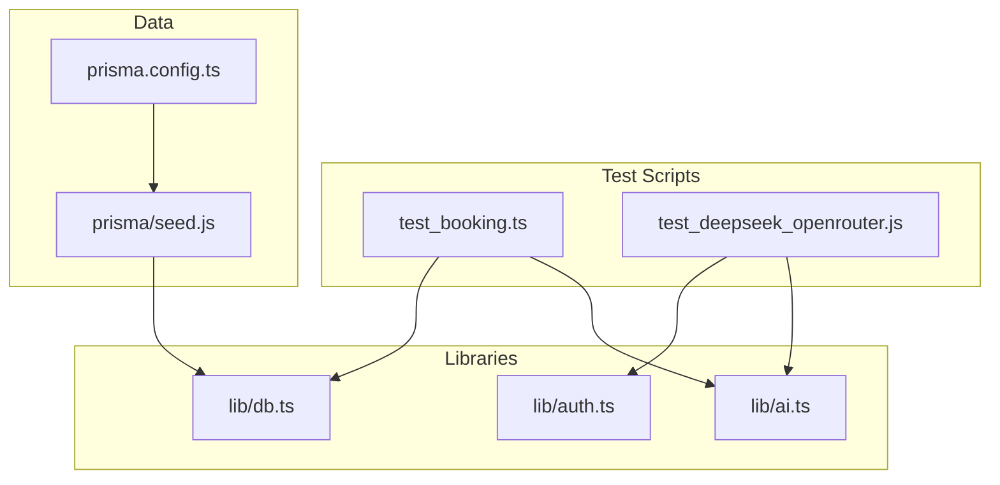
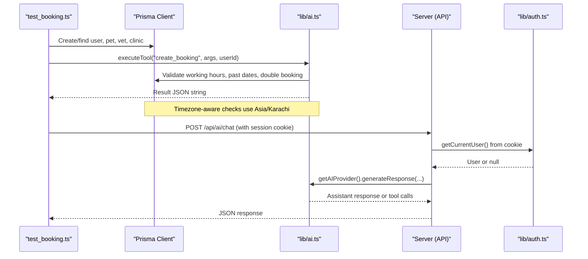
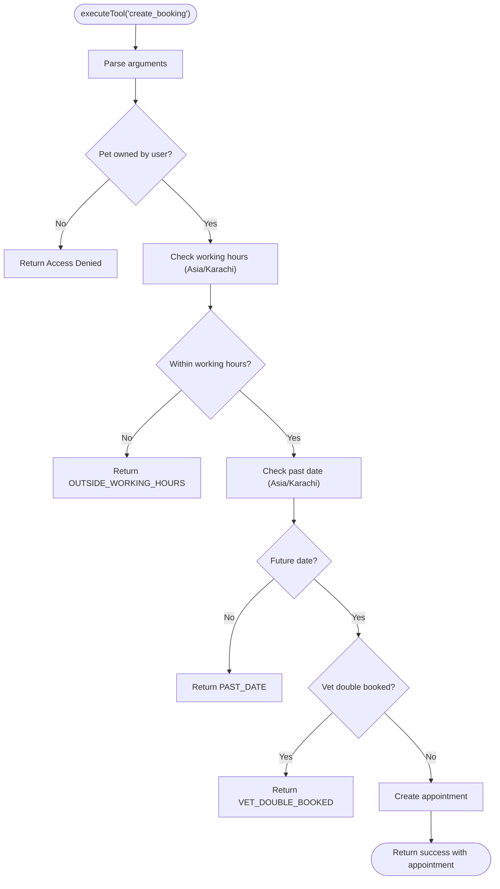
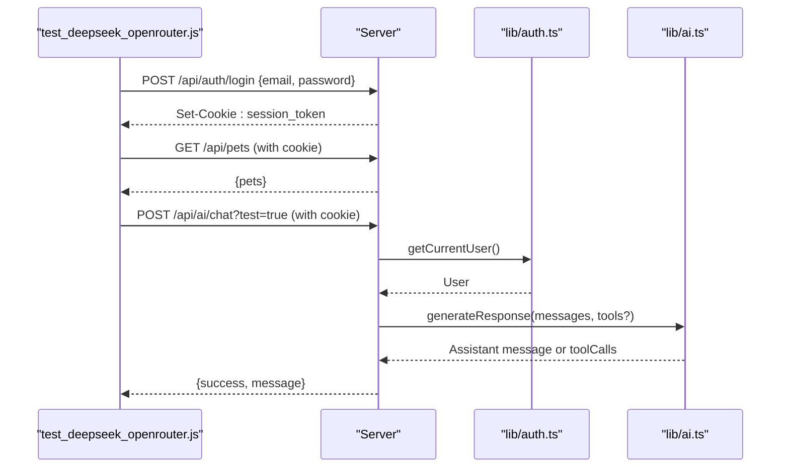
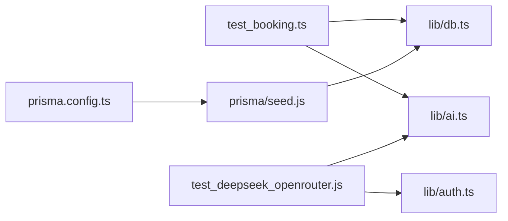

# Testing Utilities and Helpers

<cite>
**Referenced Files in This Document**
- [test_booking.ts](file://test_booking.ts)
- [test_deepseek_openrouter.js](file://test_deepseek_openrouter.js)
- [lib/db.ts](file://lib/db.ts)
- [lib/auth.ts](file://lib/auth.ts)
- [lib/ai.ts](file://lib/ai.ts)
- [prisma/seed.js](file://prisma/seed.js)
- [prisma.config.ts](file://prisma.config.ts)
</cite>

## Table of Contents
1. [Introduction](#introduction)
2. [Project Structure](#project-structure)
3. [Core Components](#core-components)
4. [Architecture Overview](#architecture-overview)
5. [Detailed Component Analysis](#detailed-component-analysis)
6. [Dependency Analysis](#dependency-analysis)
7. [Performance Considerations](#performance-considerations)
8. [Troubleshooting Guide](#troubleshooting-guide)
9. [Conclusion](#conclusion)
10. [Appendices](#appendices)

## Introduction
This document explains the testing utilities and helper functions used across the PETIVA application’s test suite. It focuses on:
- Database testing helpers, including seed data and ad-hoc setup scripts
- Authentication testing helpers for creating sessions and simulating authenticated requests
- AI service testing utilities for invoking tools and validating conversation flows
- Test data management strategies using seed files and environment isolation
- Guidance for time-based operations, timezone handling, and date validation in tests
- Best practices for maintaining and sharing reusable test utilities

## Project Structure
The repository includes:
- A Prisma client configuration that manages database connections and pooling
- An authentication module providing session creation, validation, and cookie helpers
- An AI module exposing tool execution and provider selection
- A comprehensive seed script to populate a realistic dataset for tests
- Standalone test scripts to exercise booking flows and AI integrations

**Diagram sources**
- [test_booking.ts:1-149](file://test_booking.ts#L1-L149)
- [test_deepseek_openrouter.js:1-132](file://test_deepseek_openrouter.js#L1-L132)
- [lib/db.ts:1-33](file://lib/db.ts#L1-L33)
- [lib/auth.ts:1-125](file://lib/auth.ts#L1-L125)
- [lib/ai.ts:1-423](file://lib/ai.ts#L1-L423)
- [prisma/seed.js:1-430](file://prisma/seed.js#L1-L430)
- [prisma.config.ts:1-15](file://prisma.config.ts#L1-L15)

**Section sources**
- [lib/db.ts:1-33](file://lib/db.ts#L1-L33)
- [lib/auth.ts:1-125](file://lib/auth.ts#L1-L125)
- [lib/ai.ts:1-423](file://lib/ai.ts#L1-L423)
- [prisma/seed.js:1-430](file://prisma/seed.js#L1-L430)
- [prisma.config.ts:1-15](file://prisma.config.ts#L1-L15)
- [test_booking.ts:1-149](file://test_booking.ts#L1-L149)
- [test_deepseek_openrouter.js:1-132](file://test_deepseek_openrouter.js#L1-L132)

## Core Components
- Database connection and pooling via Prisma with environment-aware initialization
- Authentication utilities for password hashing, session token generation/validation, and cookie management
- AI tooling layer that executes domain tools (e.g., bookings, schedules) and integrates with multiple providers
- Seed script that creates clinics, users, veterinarians, pets, appointments, medical records, and related entities
- Test scripts that exercise booking logic and AI endpoints, including authenticated flows

Key responsibilities:
- lib/db.ts: Provides a singleton Prisma client and connection pool with safe reuse in development
- lib/auth.ts: Encapsulates session lifecycle and role-based access helpers
- lib/ai.ts: Defines tool descriptions, ownership verification, and tool execution; selects active AI provider
- prisma/seed.js: Idempotent seeding with upserts and cleanup steps for deterministic test data
- test_booking.ts: End-to-end style script to set up test entities and validate booking rules
- test_deepseek_openrouter.js: HTTP-based integration tests for AI endpoints, including auth flow and response assertions

**Section sources**
- [lib/db.ts:1-33](file://lib/db.ts#L1-L33)
- [lib/auth.ts:1-125](file://lib/auth.ts#L1-L125)
- [lib/ai.ts:1-423](file://lib/ai.ts#L1-L423)
- [prisma/seed.js:1-430](file://prisma/seed.js#L1-L430)
- [test_booking.ts:1-149](file://test_booking.ts#L1-L149)
- [test_deepseek_openrouter.js:1-132](file://test_deepseek_openrouter.js#L1-L132)

## Architecture Overview
The testing architecture combines direct database interactions, server-side helpers, and HTTP-based integration tests.

**Diagram sources**
- [test_booking.ts:1-149](file://test_booking.ts#L1-L149)
- [lib/ai.ts:141-423](file://lib/ai.ts#L141-L423)
- [lib/auth.ts:82-125](file://lib/auth.ts#L82-L125)
- [lib/db.ts:1-33](file://lib/db.ts#L1-L33)

## Detailed Component Analysis

### Database Testing Utilities
- Connection management: The Prisma client is initialized once per process in development to avoid pool exhaustion, while production uses a dedicated pool.
- Seeding strategy: The seed script uses upserts to ensure idempotency and deletes dependent rows before re-insertion to prevent collisions.
- Test isolation: Tests can rely on seed data for baseline state and create additional temporary entities within test scripts.

Recommendations:
- Use the seed script to establish a known baseline before running tests
- For unit-style tests, prefer isolated transactions or a separate test database when possible
- Centralize entity creation patterns into reusable helpers if tests grow in complexity

**Section sources**
- [lib/db.ts:1-33](file://lib/db.ts#L1-L33)
- [prisma/seed.js:1-430](file://prisma/seed.js#L1-L430)
- [prisma.config.ts:1-15](file://prisma.config.ts#L1-L15)

### Authentication Testing Helpers
- Session tokens are generated server-side and stored as hashed values in the database; cookies carry the plaintext token to clients.
- Cookie helpers set secure, httpOnly cookies appropriate for the environment.
- Integration tests can log in via the API and extract session cookies to authenticate subsequent requests.

Testing approach:
- Use the login endpoint to obtain a session cookie
- Attach the cookie to subsequent requests to simulate authenticated users
- Validate role-based behavior by logging in as different roles (owner, vet, admin)

**Section sources**
- [lib/auth.ts:1-125](file://lib/auth.ts#L1-L125)
- [test_deepseek_openrouter.js:54-132](file://test_deepseek_openrouter.js#L54-L132)

### AI Service Testing Utilities
- Tool definitions and execution: Tools are declared with parameters and descriptions; execution validates inputs, enforces ownership, and performs business rules.
- Provider selection: The active provider is chosen via an environment variable; fallback logic exists for resilience.
- Conversation flows: Tests can call chat endpoints with messages and verify system prompts and responses.

Testing approach:
- Invoke tools directly in scripts to validate business logic without full HTTP overhead
- Use HTTP-based tests to validate end-to-end flows, including provider selection and error paths
- Assert on structured JSON results returned by tools

**Section sources**
- [lib/ai.ts:141-423](file://lib/ai.ts#L141-L423)
- [test_deepseek_openrouter.js:72-132](file://test_deepseek_openrouter.js#L72-L132)

### Booking Flow Validation
The booking tool enforces:
- Working hours validation based on a specific timezone
- Past date prevention
- Double-booking prevention for vets at the same slot

**Diagram sources**
- [lib/ai.ts:366-418](file://lib/ai.ts#L366-L418)

**Section sources**
- [test_booking.ts:81-146](file://test_booking.ts#L81-L146)
- [lib/ai.ts:331-418](file://lib/ai.ts#L331-L418)

### Integration Tests for AI Endpoints
- HTTP helper: A small utility constructs requests, handles headers, and parses JSON responses
- Authenticated flow: Login to obtain session cookie, then call chat endpoints with context
- Assertions: Validate status codes, success flags, and presence of expected content

**Diagram sources**
- [test_deepseek_openrouter.js:6-132](file://test_deepseek_openrouter.js#L6-L132)
- [lib/auth.ts:100-125](file://lib/auth.ts#L100-L125)
- [lib/ai.ts:127-139](file://lib/ai.ts#L127-L139)

**Section sources**
- [test_deepseek_openrouter.js:1-132](file://test_deepseek_openrouter.js#L1-L132)

### Test Data Management Strategies
- Seed data: The seed script establishes a consistent baseline with clinics, users, vets, pets, appointments, medical records, and documents
- Idempotency: Upserts and targeted deletions allow repeated runs without conflicts
- Environment isolation: Use DATABASE_URL to point tests to an isolated database instance

Best practices:
- Keep seed data minimal but representative of real-world relationships
- Delete transient test data after tests complete
- Avoid hardcoding IDs where possible; resolve them dynamically in tests

**Section sources**
- [prisma/seed.js:1-430](file://prisma/seed.js#L1-L430)
- [prisma.config.ts:1-15](file://prisma.config.ts#L1-L15)

### File Uploads, Image Processing, and Media Handling
- The seed script includes document metadata entries referencing OSS keys and file types
- Tests can assert that document records exist and reference correct entities
- Actual upload processing is not implemented in the analyzed files; tests should focus on metadata and references

Guidance:
- When adding upload features, introduce mocks for storage services in tests
- Validate file type and size constraints in tests
- Ensure document metadata remains consistent with actual uploads

**Section sources**
- [prisma/seed.js:380-391](file://prisma/seed.js#L380-L391)

### Reusable Test Helpers for Common Scenarios
Examples derived from existing scripts:
- Creating test pets: Find or create a pet under a test owner
- Generating medical records: Use seed data as a baseline; insert additional records as needed
- Simulating appointment bookings: Call the booking tool with valid parameters and assert outcomes

Implementation tips:
- Extract repeated setup logic into shared helpers
- Parameterize helpers for different roles and scenarios
- Clean up created resources after each test run

**Section sources**
- [test_booking.ts:5-77](file://test_booking.ts#L5-L77)
- [lib/ai.ts:366-418](file://lib/ai.ts#L366-L418)

### Time-Based Operations, Timezone Handling, and Date Validation
- Working hours and past-date checks are performed using Asia/Karachi timezone formatting
- Tests must supply ISO datetime strings and understand timezone implications
- Slot checking queries filter appointments within the target day boundaries

Recommendations:
- Always normalize input datetimes to UTC before persistence
- Use timezone-aware comparisons for business rules
- Include explicit tests for edge cases around midnight and DST transitions

**Section sources**
- [lib/ai.ts:331-392](file://lib/ai.ts#L331-L392)

## Dependency Analysis
The following diagram shows how test scripts depend on core libraries and data layers.

**Diagram sources**
- [test_booking.ts:1-149](file://test_booking.ts#L1-L149)
- [test_deepseek_openrouter.js:1-132](file://test_deepseek_openrouter.js#L1-L132)
- [lib/db.ts:1-33](file://lib/db.ts#L1-L33)
- [lib/auth.ts:1-125](file://lib/auth.ts#L1-L125)
- [lib/ai.ts:1-423](file://lib/ai.ts#L1-L423)
- [prisma/seed.js:1-430](file://prisma/seed.js#L1-L430)
- [prisma.config.ts:1-15](file://prisma.config.ts#L1-L15)

**Section sources**
- [test_booking.ts:1-149](file://test_booking.ts#L1-L149)
- [test_deepseek_openrouter.js:1-132](file://test_deepseek_openrouter.js#L1-L132)
- [lib/db.ts:1-33](file://lib/db.ts#L1-L33)
- [lib/auth.ts:1-125](file://lib/auth.ts#L1-L125)
- [lib/ai.ts:1-423](file://lib/ai.ts#L1-L423)
- [prisma/seed.js:1-430](file://prisma/seed.js#L1-L430)
- [prisma.config.ts:1-15](file://prisma.config.ts#L1-L15)

## Performance Considerations
- Reuse Prisma client and pool to avoid connection churn in development
- Prefer batched operations in seed and tests to reduce round trips
- Use selective field projections in queries to minimize payload sizes
- Isolate test databases to prevent contention and speed up teardown

[No sources needed since this section provides general guidance]

## Troubleshooting Guide
Common issues and resolutions:
- Missing environment variables: Ensure OPENROUTER_API_KEY and other required variables are set when testing AI features
- Timezone mismatches: Confirm that test datetimes align with Asia/Karachi expectations for working hours and past-date checks
- Duplicate data: Rerun seed to reset baseline; tests should clean up temporary entities
- Authentication failures: Verify session cookie extraction and attachment in HTTP-based tests

Actionable checks:
- Validate login flow returns a session cookie
- Inspect tool execution logs for parameter parsing errors
- Confirm database connectivity and schema migrations applied

**Section sources**
- [lib/ai.ts:45-47](file://lib/ai.ts#L45-L47)
- [lib/ai.ts:331-392](file://lib/ai.ts#L331-L392)
- [test_deepseek_openrouter.js:87-107](file://test_deepseek_openrouter.js#L87-L107)

## Conclusion
The PETIVA testing utilities combine robust database seeding, clear authentication helpers, and a flexible AI tooling layer to support both unit-style validations and end-to-end integration tests. By leveraging the provided scripts and libraries, teams can reliably test booking workflows, AI-driven conversations, and role-based access control while maintaining predictable environments and clear failure modes.

[No sources needed since this section summarizes without analyzing specific files]

## Appendices

### Example Workflows

#### Create Test Pets and Book Appointments
- Setup: Ensure seed data is present
- Create: Use test script to find or create a test owner and pet
- Book: Execute the booking tool with valid parameters and assert success or expected errors

**Section sources**
- [test_booking.ts:5-77](file://test_booking.ts#L5-L77)
- [lib/ai.ts:366-418](file://lib/ai.ts#L366-L418)

#### Simulate Authenticated Chat Requests
- Login: Call the login endpoint and capture session cookie
- Request: Send chat messages with pet context and assert response structure
- Validate: Check system prompt inclusion and successful completion

**Section sources**
- [test_deepseek_openrouter.js:87-121](file://test_deepseek_openrouter.js#L87-L121)
- [lib/auth.ts:100-125](file://lib/auth.ts#L100-L125)