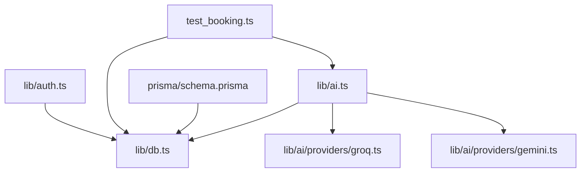
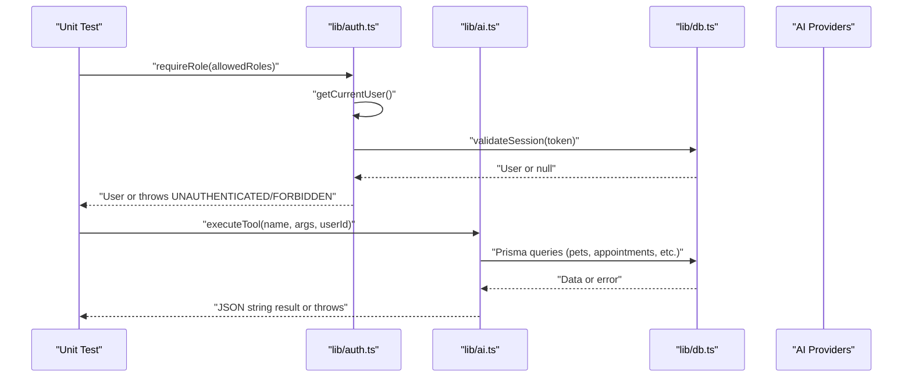
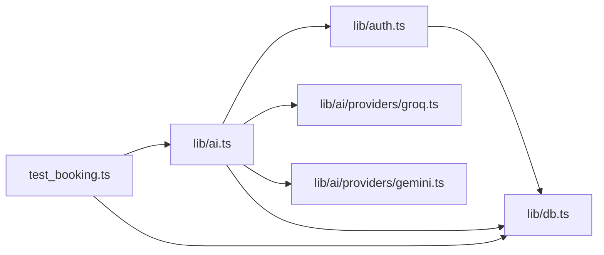

# Unit Testing

<cite>
**Referenced Files in This Document**
- [lib/auth.ts](file://lib/auth.ts)
- [lib/ai.ts](file://lib/ai.ts)
- [lib/db.ts](file://lib/db.ts)
- [prisma/schema.prisma](file://prisma/schema.prisma)
- [lib/ai/providers/groq.ts](file://lib/ai/providers/groq.ts)
- [lib/ai/providers/gemini.ts](file://lib/ai/providers/gemini.ts)
- [test_booking.ts](file://test_booking.ts)
</cite>

## Table of Contents
1. Introduction
2. Project Structure
3. Core Components
4. Architecture Overview
5. Detailed Component Analysis
6. Dependency Analysis
7. Performance Considerations
8. Troubleshooting Guide
9. Conclusion

## Introduction
This document provides comprehensive unit testing guidance for the PETIVA application, focusing on:
- Authentication functions in lib/auth.ts (password hashing, session management, role-based authorization)
- AI service functions in lib/ai.ts (tool execution, provider abstraction, error handling)
- Database operations using Prisma with robust mocking strategies
- Testing utilities and helpers to isolate business logic from external dependencies
- Concrete test scenarios: user validation, pet profile creation, appointment scheduling logic, and AI tool execution
- Best practices for organization, naming, assertions, mock data, async operations, errors, and edge cases

The goal is to enable reliable, fast, and isolated tests that validate behavior without depending on live services or databases during unit tests.

## Project Structure
PETIVA organizes authentication, AI tooling, and database access into focused modules:
- Authentication and sessions: lib/auth.ts
- AI orchestration and tools: lib/ai.ts and providers under lib/ai/providers
- Database client: lib/db.ts
- Data model: prisma/schema.prisma
- Example integration-style script: test_booking.ts

**Diagram sources**
- [lib/auth.ts:1-125](file://lib/auth.ts#L1-L125)
- [lib/ai.ts:1-467](file://lib/ai.ts#L1-L467)
- [lib/db.ts:1-33](file://lib/db.ts#L1-L33)
- [lib/ai/providers/groq.ts:1-77](file://lib/ai/providers/groq.ts#L1-L77)
- [lib/ai/providers/gemini.ts:1-77](file://lib/ai/providers/gemini.ts#L1-L77)
- [prisma/schema.prisma:1-312](file://prisma/schema.prisma#L1-L312)
- [test_booking.ts:1-149](file://test_booking.ts#L1-L149)

**Section sources**
- [lib/auth.ts:1-125](file://lib/auth.ts#L1-L125)
- [lib/ai.ts:1-467](file://lib/ai.ts#L1-L467)
- [lib/db.ts:1-33](file://lib/db.ts#L1-L33)
- [prisma/schema.prisma:1-312](file://prisma/schema.prisma#L1-L312)
- [test_booking.ts:1-149](file://test_booking.ts#L1-L149)

## Core Components
Key components to unit test:
- Authentication module: password hashing/verification, session token generation/hashing, create/validate/invalidate sessions, cookie helpers, getCurrentUser, requireAuth, requireRole
- AI module: provider selection, executeTool routing, ownership verification, scheduling validations, and error handling
- Database layer: Prisma client initialization and connection pooling strategy

Testing objectives:
- Validate correctness of pure functions (hashing, token generation)
- Isolate side effects (DB calls, HTTP requests) via mocks
- Ensure robust error paths and edge cases are covered
- Maintain deterministic, fast unit tests by avoiding real network and DB calls

**Section sources**
- [lib/auth.ts:10-125](file://lib/auth.ts#L10-L125)
- [lib/ai.ts:21-139](file://lib/ai.ts#L21-L139)
- [lib/ai.ts:283-467](file://lib/ai.ts#L283-L467)
- [lib/db.ts:1-33](file://lib/db.ts#L1-L33)

## Architecture Overview
High-level flow for authenticated AI tool execution:

**Diagram sources**
- [lib/auth.ts:99-125](file://lib/auth.ts#L99-L125)
- [lib/ai.ts:297-467](file://lib/ai.ts#L297-L467)
- [lib/db.ts:1-33](file://lib/db.ts#L1-L33)

## Detailed Component Analysis

### Authentication Module Testing (lib/auth.ts)
Focus areas:
- Password hashing and verification
- Session token lifecycle: generate, hash, create, validate, invalidate
- Cookie helpers and current user retrieval
- Authorization guards: requireAuth, requireRole

Recommended unit tests:
- Password hashing
  - Verify hashPassword returns a non-empty string
  - Verify verifyPassword returns true for correct password and false otherwise
  - Edge case: empty or very long passwords
- Session tokens
  - Verify generateSessionToken produces a hex string of expected length
  - Verify hashSessionToken produces consistent SHA-256 hashes
- Session operations
  - Mock Prisma to assert createSession inserts tokenHash, userId, expiresAt
  - Mock Prisma to assert validateSession returns null for missing/expired sessions
  - Mock Prisma to assert sliding window extension updates expiresAt when near expiry
  - Mock Prisma to assert invalidateSession deletes matching session
- Cookies and user context
  - Mock Next cookies API to assert setSessionCookie sets HttpOnly, secure, sameSite, expires
  - Mock getCurrentUser to return null when no cookie and User when valid
- Authorization
  - requireAuth should throw UNAUTHENTICATED when no user
  - requireRole should throw FORBIDDEN when user role not allowed

Mocking strategy:
- Use dependency injection or module mocking to replace prisma and Next cookies
- For auth functions that call cookies(), mock the cookies() function to return a controllable cookie store
- For DB-backed sessions, mock prisma.session methods

Example test structure outline:
- Setup: mock prisma.session.* and cookies()
- Tests:
  - "hashPassword returns a string"
  - "verifyPassword validates correctly"
  - "createSession stores hashed token and expiry"
  - "validateSession returns null for expired session"
  - "validateSession extends expiry near end"
  - "invalidateSession deletes session"
  - "setSessionCookie sets correct attributes"
  - "getCurrentUser returns null without cookie"
  - "requireAuth throws UNAUTHENTICATED"
  - "requireRole throws FORBIDDEN for wrong role"

**Section sources**
- [lib/auth.ts:10-125](file://lib/auth.ts#L10-L125)

### AI Service Module Testing (lib/ai.ts)
Focus areas:
- Provider abstraction and selection
- Tool execution routing and validation
- Ownership checks and scheduling constraints
- Error handling and provider fallback

Recommended unit tests:
- Provider selection
  - getAIProvider returns correct provider based on BOOKING_ASSISTANT_PROVIDER env
  - FallbackProvider delegates to primary then secondary on failure
- Tool execution
  - executeTool('getMyPets', ...) returns JSON with pets list for given userId
  - executeTool('getPetProfile', ...) verifies ownership and returns pet or throws
  - executeTool('getPetHealthTimeline', ...) aggregates multiple entities
  - executeTool('find_vet', ...) filters by specialization
  - executeTool('check_slots', ...) validates past dates and returns busy slots
  - executeTool('create_booking', ...) enforces working hours, past date, double booking, then creates appointment
- Error handling
  - Unknown tool throws error
  - Missing parameters throw descriptive errors
  - Provider errors propagate with meaningful messages

Mocking strategy:
- Mock prisma methods used by executeTool to avoid real DB calls
- Mock fetch for provider classes if testing provider integration paths
- For environment-dependent behavior, control BOOKING_ASSISTANT_PROVIDER and provider keys

Example test structure outline:
- Setup: mock prisma.* methods; set env variables
- Tests:
  - "getAIProvider selects Groq/Gemini/Qwen/Fallback"
  - "executeTool getMyPets returns owner's pets"
  - "executeTool getPetProfile denies access for non-owner"
  - "executeTool check_slots rejects past dates"
  - "executeTool create_booking rejects outside working hours"
  - "executeTool create_booking prevents double booking"
  - "executeTool create_booking succeeds and returns appointment"
  - "executeTool unknown tool throws error"

**Section sources**
- [lib/ai.ts:21-139](file://lib/ai.ts#L21-L139)
- [lib/ai.ts:283-467](file://lib/ai.ts#L283-L467)

### Database Layer Testing (lib/db.ts)
Focus areas:
- Prisma client initialization and connection pooling differences between dev and production
- Ensuring tests do not leak connections or rely on global state

Recommended unit tests:
- Verify PrismaClient instantiation path based on NODE_ENV
- Confirm pool reuse in development to prevent hot-reload issues
- In tests, prefer isolating DB interactions by mocking prisma methods rather than connecting to a real database

Mocking strategy:
- Replace prisma instance with a test-specific stubbed client
- Provide deterministic responses for all prisma.* calls used by tested code
- Avoid running migrations or seeding in unit tests; use fixtures in integration tests only

**Section sources**
- [lib/db.ts:1-33](file://lib/db.ts#L1-L33)

### AI Providers Testing (lib/ai/providers/*.ts)
Focus areas:
- Provider-specific request/response handling
- Error propagation for invalid responses or missing API keys
- Tool call argument normalization

Recommended unit tests:
- GroqProvider
  - Throws when GROQ_API_KEY is missing
  - Sends correct payload and headers
  - Parses tool_calls and normalizes arguments
  - Throws on non-OK response
- GeminiProvider
  - Same behaviors as GroqProvider but for Gemini endpoint
- FallbackProvider
  - Tries primary provider first
  - Falls back to secondary on error

Mocking strategy:
- Mock fetch to simulate provider responses
- Control environment variables for API keys
- Assert constructed payloads and parsed outputs

**Section sources**
- [lib/ai/providers/groq.ts:1-77](file://lib/ai/providers/groq.ts#L1-L77)
- [lib/ai/providers/gemini.ts:1-77](file://lib/ai/providers/gemini.ts#L1-L77)
- [lib/ai.ts:112-139](file://lib/ai.ts#L112-L139)

### Data Model and Constraints (prisma/schema.prisma)
Use the schema to guide test data design and assertion expectations:
- User roles: PET_OWNER, VETERINARIAN, CLINIC_ADMIN, PLATFORM_ADMIN
- Appointment statuses: REQUESTED, CONFIRMED, CANCELLED, COMPLETED, NO_SHOW
- Relationships: Pet -> Owner, Appointment -> Pet/Owner/Vet/Clinic, Veterinarian -> User, Clinic associations

Testing implications:
- Create minimal fixture data aligned with schema constraints
- Validate that tests enforce referential integrity through proper IDs
- Use enums consistently in test inputs and assertions

**Section sources**
- [prisma/schema.prisma:9-312](file://prisma/schema.prisma#L9-L312)

### Practical Test Scenarios

#### User Validation
- Verify password hashing and verification workflows
- Ensure requireAuth and requireRole enforce boundaries
- Test session creation and validation flows with mocked DB

#### Pet Profile Creation
- Validate ownership checks when accessing pet profiles
- Ensure tests cover missing petId and unauthorized access

#### Appointment Scheduling Logic
- Enforce working hours and past date restrictions
- Prevent double bookings for the same vet at the same time
- Validate successful creation and returned appointment structure

#### AI Tool Execution
- Route tool calls to correct handlers
- Validate parameter requirements and ownership checks
- Handle provider errors and fallback behavior

**Section sources**
- [lib/ai.ts:297-467](file://lib/ai.ts#L297-L467)
- [lib/auth.ts:99-125](file://lib/auth.ts#L99-L125)

## Dependency Analysis
Component coupling and cohesion:
- lib/auth.ts depends on lib/db.ts for session persistence and Next cookies API
- lib/ai.ts depends on lib/auth.ts for authentication and lib/db.ts for data access
- Providers depend on fetch and environment configuration
- test_booking.ts demonstrates end-to-end usage of executeTool against a real DB (integration style)

Potential circular dependencies:
- None detected; imports are directional from higher-level modules to lower-level utilities

External dependencies:
- Next cookies API
- PostgreSQL via Prisma
- External AI providers via HTTP

**Diagram sources**
- [lib/auth.ts:1-125](file://lib/auth.ts#L1-L125)
- [lib/ai.ts:1-467](file://lib/ai.ts#L1-L467)
- [lib/db.ts:1-33](file://lib/db.ts#L1-L33)
- [lib/ai/providers/groq.ts:1-77](file://lib/ai/providers/groq.ts#L1-L77)
- [lib/ai/providers/gemini.ts:1-77](file://lib/ai/providers/gemini.ts#L1-L77)
- [test_booking.ts:1-149](file://test_booking.ts#L1-L149)

**Section sources**
- [lib/auth.ts:1-125](file://lib/auth.ts#L1-L125)
- [lib/ai.ts:1-467](file://lib/ai.ts#L1-L467)
- [lib/db.ts:1-33](file://lib/db.ts#L1-L33)
- [test_booking.ts:1-149](file://test_booking.ts#L1-L149)

## Performance Considerations
- Keep unit tests fast by mocking DB and network calls
- Avoid real Prisma connections in unit tests; use stubs for prisma.* methods
- Minimize test setup complexity; use small, focused fixtures
- Batch related assertions per test case to reduce overhead
- For provider tests, mock fetch to avoid network latency

[No sources needed since this section provides general guidance]

## Troubleshooting Guide
Common issues and resolutions:
- Missing API keys in providers
  - Ensure required environment variables are set or provide mocks
  - Expect explicit errors when keys are absent
- Unexpected timezone behavior in scheduling
  - Working hours and past-date checks use Asia/Karachi timezone; ensure test dates align with expected timezone conversions
- Double booking conflicts
  - Validate that tests create conflicting appointments and assert rejection
- Session expiration and sliding window
  - Mock timestamps to trigger expiry and near-expiry conditions
- Cookie handling in tests
  - Mock Next cookies API to simulate presence/absence of session tokens

**Section sources**
- [lib/ai.ts:375-436](file://lib/ai.ts#L375-L436)
- [lib/auth.ts:46-80](file://lib/auth.ts#L46-L80)

## Conclusion
Adopting these unit testing strategies will ensure PETIVA’s authentication, AI tooling, and scheduling logic are robust, maintainable, and resilient to changes. By isolating external dependencies through mocking, enforcing clear test organization and naming, and covering both happy paths and error conditions, the team can confidently evolve the system while preserving correctness and performance.

[No sources needed since this section summarizes without analyzing specific files]