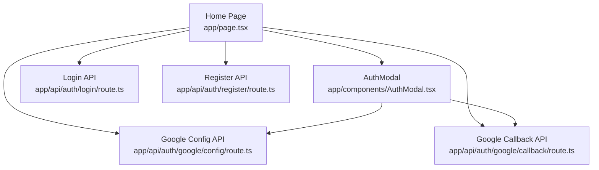
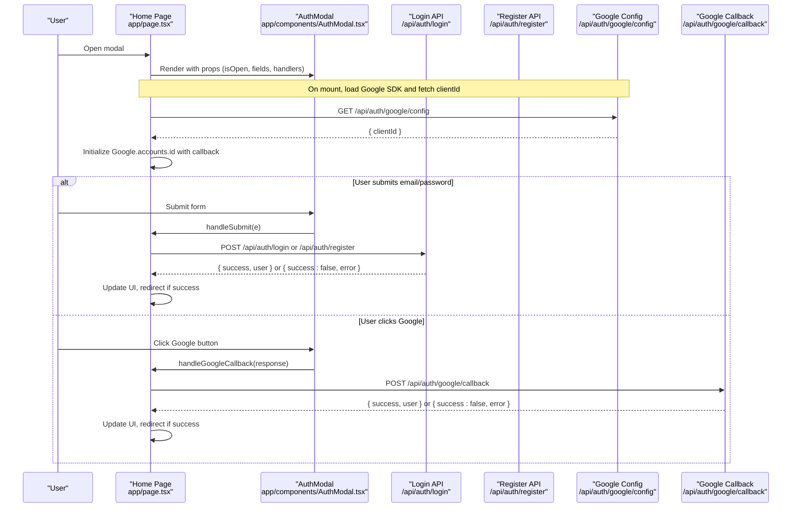
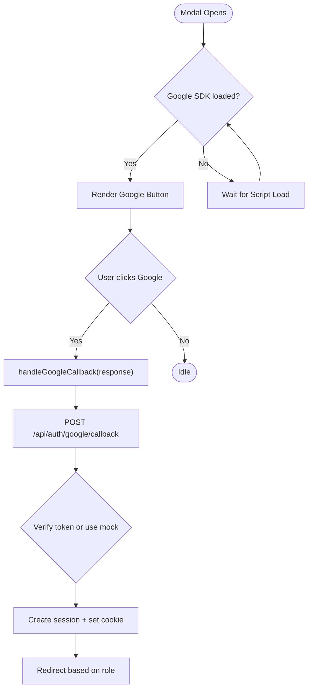
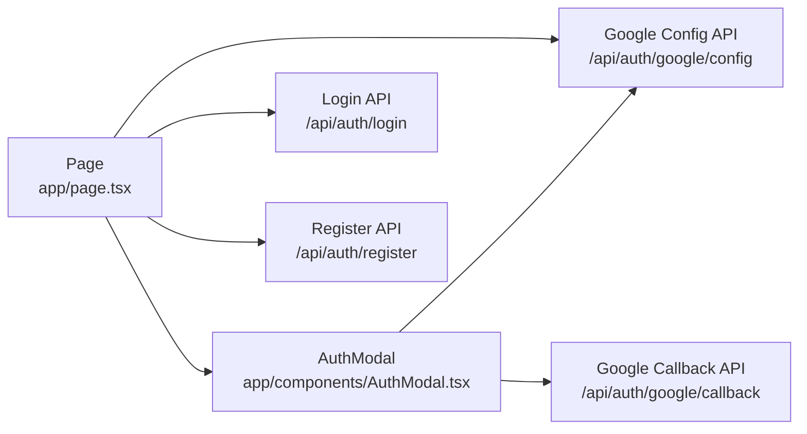

# Auth Modal Component

<cite>
**Referenced Files in This Document**
- [AuthModal.tsx](file://app/components/AuthModal.tsx)
- [page.tsx](file://app/page.tsx)
- [login route](file://app/api/auth/login/route.ts)
- [register route](file://app/api/auth/register/route.ts)
- [Google callback route](file://app/api/auth/google/callback/route.ts)
- [Google config route](file://app/api/auth/google/config/route.ts)
</cite>

## Table of Contents
1. [Introduction](#introduction)
2. [Project Structure](#project-structure)
3. [Core Components](#core-components)
4. [Architecture Overview](#architecture-overview)
5. [Detailed Component Analysis](#detailed-component-analysis)
6. [Dependency Analysis](#dependency-analysis)
7. [Performance Considerations](#performance-considerations)
8. [Troubleshooting Guide](#troubleshooting-guide)
9. [Conclusion](#conclusion)
10. [Appendices](#appendices)

## Introduction
This document provides comprehensive documentation for the AuthModal component, a client-side modal that supports both login and registration workflows with Google OAuth integration. It explains the props interface, form state management, validation patterns, error handling, loading states, event handlers, dual-mode switching between login and registration, Google OAuth flow (including development mock support), accessibility considerations, and security aspects related to form data and OAuth token processing.

## Project Structure
The AuthModal is a reusable React component rendered within the application’s landing page. The parent page manages authentication state, handles form submissions, and orchestrates Google OAuth flows via API routes.

**Diagram sources**
- [page.tsx:16-223](file://app/page.tsx#L16-L223)
- [AuthModal.tsx:1-205](file://app/components/AuthModal.tsx#L1-L205)
- [login route:1-58](file://app/api/auth/login/route.ts#L1-L58)
- [register route:1-78](file://app/api/auth/register/route.ts#L1-L78)
- [Google config route:1-8](file://app/api/auth/google/config/route.ts#L1-L8)
- [Google callback route:1-98](file://app/api/auth/google/callback/route.ts#L1-L98)

**Section sources**
- [page.tsx:16-223](file://app/page.tsx#L16-L223)
- [AuthModal.tsx:1-205](file://app/components/AuthModal.tsx#L1-L205)

## Core Components
- AuthModal: A controlled modal that renders either a login or registration form based on an isRegistering flag. It integrates Google OAuth via the Google Identity Services SDK and exposes a developer-only mock button in development mode.
- Home Page: Owns all authentication-related state (email, password, firstName, lastName, phone, role, error, loading, isRegistering, modal visibility) and implements handleSubmit and handleGoogleCallback logic. It also dynamically loads the Google SDK and initializes it with a client ID fetched from the server.

Key responsibilities:
- AuthModal: UI rendering, field binding, mode toggling, Google button lifecycle, and invoking callbacks passed down by the parent.
- Home Page: State management, API calls for login/register/Google callback, routing after successful authentication, and Google SDK initialization.

**Section sources**
- [AuthModal.tsx:7-53](file://app/components/AuthModal.tsx#L7-L53)
- [page.tsx:16-161](file://app/page.tsx#L16-L161)

## Architecture Overview
The authentication architecture combines local form submission and Google OAuth flows.

**Diagram sources**
- [page.tsx:34-111](file://app/page.tsx#L34-L111)
- [page.tsx:113-149](file://app/page.tsx#L113-L149)
- [AuthModal.tsx:55-69](file://app/components/AuthModal.tsx#L55-L69)
- [AuthModal.tsx:174-187](file://app/components/AuthModal.tsx#L174-L187)
- [Google config route:1-8](file://app/api/auth/google/config/route.ts#L1-L8)
- [Google callback route:1-98](file://app/api/auth/google/callback/route.ts#L1-L98)
- [login route:1-58](file://app/api/auth/login/route.ts#L1-L58)
- [register route:1-78](file://app/api/auth/register/route.ts#L1-L78)

## Detailed Component Analysis

### Props Interface
AuthModal accepts a comprehensive set of props to control its behavior and bind form state:
- Visibility and lifecycle: isOpen, onClose
- Mode toggle: isRegistering, setIsRegistering
- Form fields and setters: email/setEmail, password/setPassword, firstName/setFirstName, lastName/setLastName, phone/setPhone, role/setRole
- UI state: error/setError, loading
- Event handlers: handleSubmit(e), handleGoogleCallback(response)

These props enable full two-way binding of form inputs and centralized state management in the parent component.

**Section sources**
- [AuthModal.tsx:7-29](file://app/components/AuthModal.tsx#L7-L29)

### Dual-Mode Functionality
- Login mode: Displays email and password fields; submit triggers login endpoint.
- Registration mode: Adds first name, last name, phone, and role selection; submit triggers registration endpoint.
- Toggle behavior: A link at the bottom switches modes and clears errors.

This design keeps a single modal for both flows while conditionally rendering additional fields.

**Section sources**
- [AuthModal.tsx:98-166](file://app/components/AuthModal.tsx#L98-L166)
- [AuthModal.tsx:189-199](file://app/components/AuthModal.tsx#L189-L199)

### Form Fields and Validation Patterns
- Email: Required, type email.
- Password: Required, type password.
- First Name, Last Name: Required when registering.
- Phone: Optional during registration.
- Role: Select dropdown with options for Pet Owner and Veterinarian during registration.

Validation:
- Client-side: HTML required attributes enforce presence for visible fields.
- Server-side: Registration enforces minimum password length and validates role against allowed values. Login verifies credentials and returns appropriate errors.

Note: No custom regex patterns are implemented in the modal; rely on browser validation and server-side checks.

**Section sources**
- [AuthModal.tsx:98-166](file://app/components/AuthModal.tsx#L98-L166)
- [register route:10-30](file://app/api/auth/register/route.ts#L10-L30)
- [login route:5-32](file://app/api/auth/login/route.ts#L5-L32)

### Error Handling and Loading States
- Errors: Displayed in a dedicated area above the form; cleared before each submission.
- Loading: Submit button disabled and text changes to indicate processing; loading state reset after response.
- Network and server errors: Caught and surfaced to the user via error messages.

**Section sources**
- [AuthModal.tsx:92-96](file://app/components/AuthModal.tsx#L92-L96)
- [AuthModal.tsx:160-166](file://app/components/AuthModal.tsx#L160-L166)
- [page.tsx:84-111](file://app/page.tsx#L84-L111)
- [page.tsx:113-149](file://app/page.tsx#L113-L149)

### Google OAuth Integration
- Dynamic button rendering: When the modal opens, the component re-renders the Google sign-in button into a container element using the Google Identity Services SDK.
- SDK initialization: The home page dynamically loads the Google script, fetches the client ID from the config API, and initializes the SDK with a callback function.
- Callback processing: On successful Google sign-in, the credential is sent to the backend callback API, which verifies the token (or uses a mock path in development), creates or finds the user, sets a session cookie, and returns user info for redirection.
- Development mock support: In development, a special “Continue with Mock Google” button is shown to simulate the OAuth flow without requiring real credentials.

**Diagram sources**
- [AuthModal.tsx:55-69](file://app/components/AuthModal.tsx#L55-L69)
- [AuthModal.tsx:174-187](file://app/components/AuthModal.tsx#L174-L187)
- [page.tsx:34-82](file://app/page.tsx#L34-L82)
- [page.tsx:84-111](file://app/page.tsx#L84-L111)
- [Google callback route:1-98](file://app/api/auth/google/callback/route.ts#L1-L98)

**Section sources**
- [AuthModal.tsx:55-69](file://app/components/AuthModal.tsx#L55-L69)
- [AuthModal.tsx:174-187](file://app/components/AuthModal.tsx#L174-L187)
- [page.tsx:34-111](file://app/page.tsx#L34-L111)
- [Google callback route:1-98](file://app/api/auth/google/callback/route.ts#L1-L98)

### Accessibility Features
- Keyboard navigation: Standard focus order follows DOM structure; users can tab through fields and buttons. Close button is reachable via keyboard.
- ARIA attributes: The modal does not include explicit ARIA roles or attributes in the current implementation. For improved accessibility, consider adding aria-modal, role="dialog", aria-labelledby, and aria-describedby to the modal container and ensuring focus trapping and escape key handling.
- Screen reader support: Labels are present for inputs; however, dynamic content updates (e.g., error messages) should be announced to screen readers. Consider using live regions for error announcements.

Recommendations:
- Add role="dialog" and aria-modal="true" to the modal overlay.
- Bind aria-labelledby to the heading inside the modal.
- Implement focus trap on open and return focus to trigger on close.
- Announce errors via aria-live region.

[No sources needed since this section provides general guidance]

### Security Considerations
- Form data handling:
  - Use HTTPS for all requests.
  - Validate and sanitize inputs on the server side.
  - Do not log sensitive fields like passwords.
- Password storage:
  - Passwords are hashed server-side before storage.
  - Minimum password length enforced during registration.
- OAuth token processing:
  - Tokens are verified server-side using Google’s library; in development, a mock path is used for convenience but must not be enabled in production.
  - Sessions are created and stored securely via cookies.
- Environment configuration:
  - Ensure GOOGLE_CLIENT_ID is configured and not exposed beyond necessary endpoints.
  - Avoid exposing secrets in client code.

**Section sources**
- [register route:10-30](file://app/api/auth/register/route.ts#L10-L30)
- [login route:5-32](file://app/api/auth/login/route.ts#L5-L32)
- [Google callback route:21-54](file://app/api/auth/google/callback/route.ts#L21-L54)
- [Google config route:1-8](file://app/api/auth/google/config/route.ts#L1-L8)

## Dependency Analysis
The following diagram shows how the components and APIs depend on each other:

**Diagram sources**
- [page.tsx:16-223](file://app/page.tsx#L16-L223)
- [AuthModal.tsx:1-205](file://app/components/AuthModal.tsx#L1-L205)
- [login route:1-58](file://app/api/auth/login/route.ts#L1-L58)
- [register route:1-78](file://app/api/auth/register/route.ts#L1-L78)
- [Google config route:1-8](file://app/api/auth/google/config/route.ts#L1-L8)
- [Google callback route:1-98](file://app/api/auth/google/callback/route.ts#L1-L98)

**Section sources**
- [page.tsx:16-223](file://app/page.tsx#L16-L223)
- [AuthModal.tsx:1-205](file://app/components/AuthModal.tsx#L1-L205)

## Performance Considerations
- Conditional rendering: The modal returns null when closed to avoid unnecessary DOM overhead.
- Google SDK lifecycle: The modal re-renders the Google button only when opened to prevent redundant initialization.
- Debounced rendering: A small timeout is used to ensure the container exists before rendering the Google button.
- Network efficiency: Single script load for Google SDK; config fetched once on mount.

Optimization opportunities:
- Memoize expensive computations in the parent if scaling up.
- Consider lazy-loading the Google SDK only when the modal is about to open.
- Cache the Google config response to avoid repeated fetches.

[No sources needed since this section provides general guidance]

## Troubleshooting Guide
Common issues and resolutions:
- Google button not rendering:
  - Ensure the Google script has loaded and the container element exists before calling renderButton.
  - Verify that the modal is open and the useEffect dependency triggers re-render.
- Authentication failures:
  - Check server responses for error messages and status codes.
  - Confirm environment variables (e.g., GOOGLE_CLIENT_ID) are correctly set.
- Redirects not happening:
  - Verify that the user role is returned correctly and routing logic is executed after successful authentication.
- Development mock not working:
  - Ensure the environment is set to development so the mock button is visible and functional.

**Section sources**
- [AuthModal.tsx:55-69](file://app/components/AuthModal.tsx#L55-L69)
- [page.tsx:84-111](file://app/page.tsx#L84-L111)
- [Google callback route:21-54](file://app/api/auth/google/callback/route.ts#L21-L54)

## Conclusion
The AuthModal component provides a streamlined, dual-mode authentication experience with robust integration of Google OAuth. It leverages controlled props for state management, clear error and loading feedback, and conditional rendering for optimal performance. The parent page centralizes authentication logic and ensures secure session handling. While the current implementation offers a solid foundation, enhancements in accessibility and input validation would further improve usability and security.

[No sources needed since this section summarizes without analyzing specific files]

## Appendices

### Usage Example Summary
- Parent state: Manage isRegistering, email, password, firstName, lastName, phone, role, error, loading, and modal visibility.
- Handlers:
  - handleSubmit: Determines endpoint based on mode, sends payload, handles success/failure, and redirects.
  - handleGoogleCallback: Sends credential to backend, handles success/failure, and redirects.
- Rendering: Pass all state and handlers to AuthModal to enable seamless interaction.

**Section sources**
- [page.tsx:16-161](file://app/page.tsx#L16-L161)
- [page.tsx:113-149](file://app/page.tsx#L113-L149)
- [page.tsx:84-111](file://app/page.tsx#L84-L111)