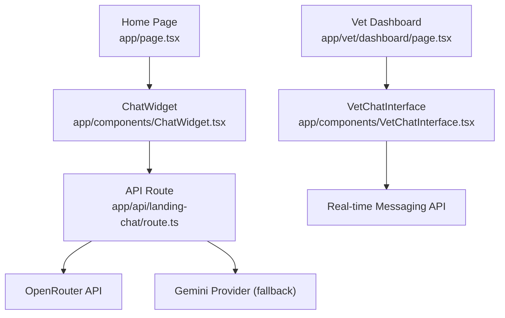
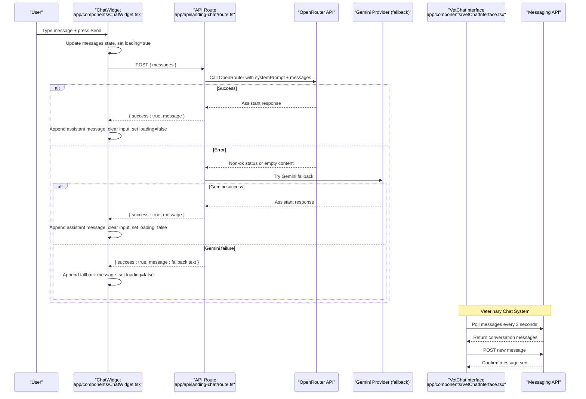
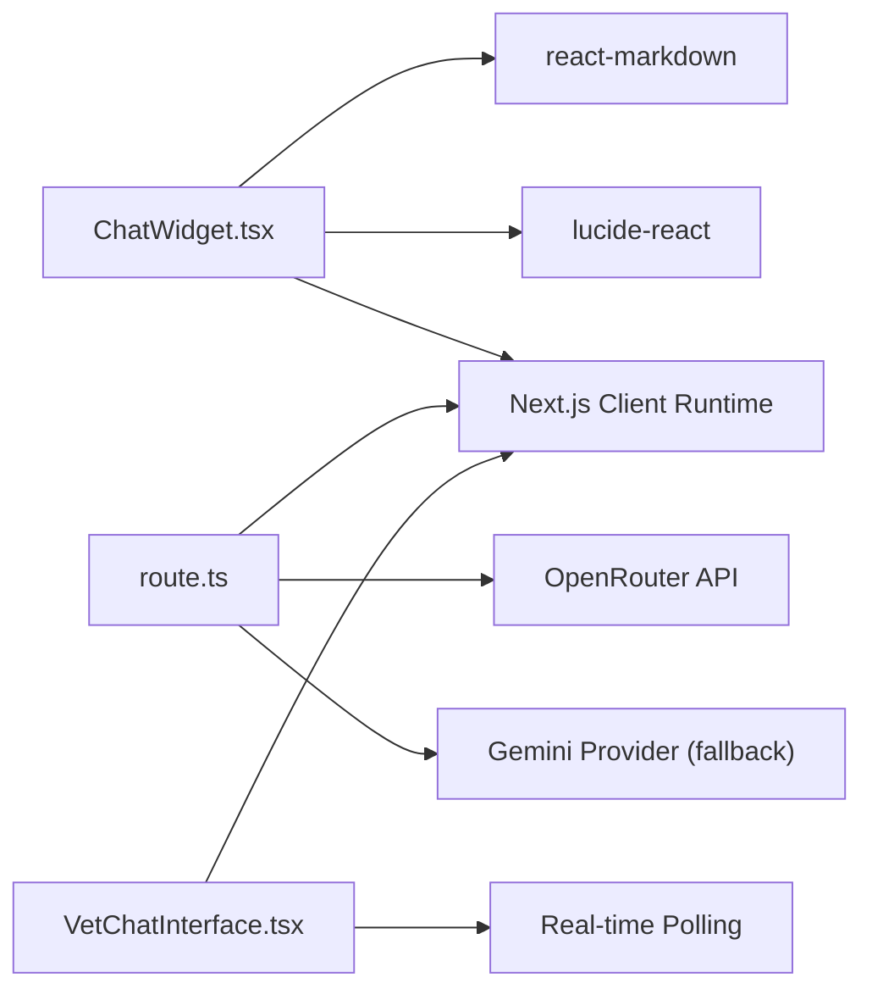
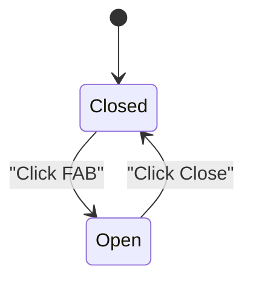
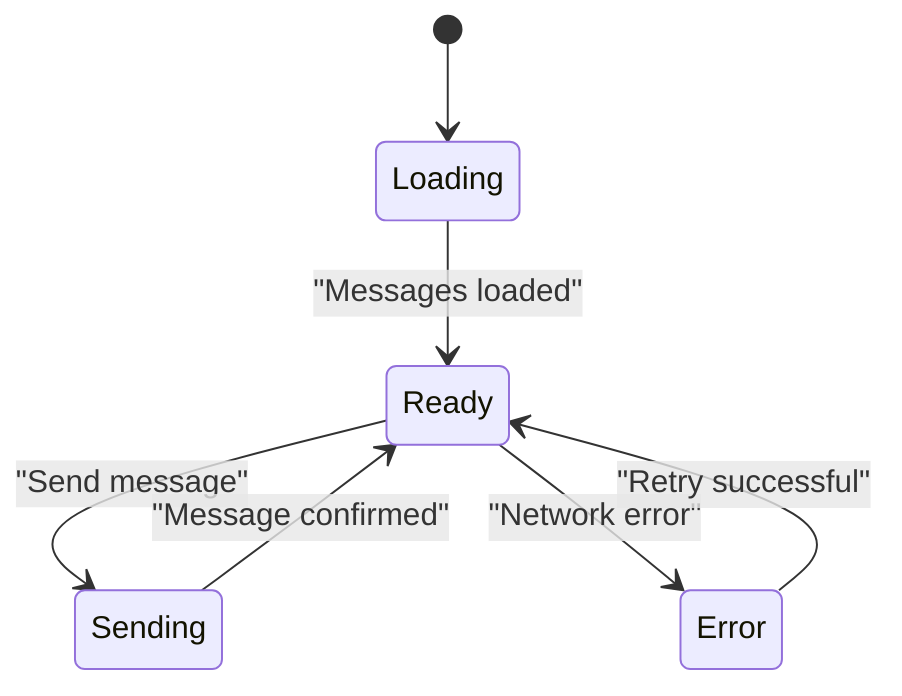

# Chat Widget Component

<cite>
**Referenced Files in This Document**
- [ChatWidget.tsx](file://app/components/ChatWidget.tsx)
- [VetChatInterface.tsx](file://app/components/VetChatInterface.tsx)
- [route.ts](file://app/api/landing-chat/route.ts)
- [page.tsx](file://app/page.tsx)
- [package.json](file://package.json)
</cite>

## Update Summary
**Changes Made**
- Enhanced input handling with improved textarea functionality and keyboard navigation
- Updated styling with better visual design, animations, and responsive behavior
- Added veterinary chat system integration with real-time messaging capabilities
- Improved user interactions with enhanced loading states and error handling
- Expanded markdown rendering capabilities for better formatted responses

## Table of Contents
1. [Introduction](#introduction)
2. [Project Structure](#project-structure)
3. [Core Components](#core-components)
4. [Architecture Overview](#architecture-overview)
5. [Detailed Component Analysis](#detailed-component-analysis)
6. [Veterinary Chat Integration](#veterinary-chat-integration)
7. [Dependency Analysis](#dependency-analysis)
8. [Performance Considerations](#performance-considerations)
9. [Troubleshooting Guide](#troubleshooting-guide)
10. [Conclusion](#conclusion)
11. [Appendices](#appendices)

## Introduction
The ChatWidget is an enhanced floating, client-side chat interface that provides AI-powered assistance for PETIVA platform inquiries on the public landing page. It features an improved floating action button that toggles an expandable chat panel with enhanced message history management, real-time conversation flow, and sophisticated markdown rendering. The widget integrates with a Next.js API route to call external AI models and returns friendly, concise answers about the platform's features, pricing, sign-up instructions, and navigation. Additionally, it now includes seamless integration with the veterinary chat system for direct communication between veterinarians and pet owners.

## Project Structure
The ChatWidget lives as a reusable client component and is mounted at the root of the public landing page. Its backend integration is implemented via a Next.js server route that handles POST requests from the frontend and calls external AI providers with fallback logic. The veterinary chat system provides real-time messaging capabilities through a separate interface component.

**Diagram sources**
- [page.tsx:14-14](file://app/page.tsx#L14-L14)
- [page.tsx:218-219](file://app/page.tsx#L218-L219)
- [ChatWidget.tsx:36-40](file://app/components/ChatWidget.tsx#L36-L40)
- [route.ts:54-112](file://app/api/landing-chat/route.ts#L54-L112)
- [VetChatInterface.tsx:56-85](file://app/components/VetChatInterface.tsx#L56-L85)

**Section sources**
- [page.tsx:14-14](file://app/page.tsx#L14-L14)
- [page.tsx:218-219](file://app/page.tsx#L218-L219)
- [ChatWidget.tsx:1-149](file://app/components/ChatWidget.tsx#L1-L149)
- [VetChatInterface.tsx:1-222](file://app/components/VetChatInterface.tsx#L1-L222)
- [route.ts:1-113](file://app/api/landing-chat/route.ts#L1-L113)

## Core Components
- **Enhanced Floating Action Button**: Toggles the chat panel open/closed with improved visual feedback, animations, and accessibility attributes.
- **Improved Expandable Chat Panel**: Contains enhanced header with branding, scrollable message area with smooth scrolling, and advanced input form with textarea support.
- **Advanced Message History Management**: Maintains a messages array with roles and content; auto-scrolls to latest message with smooth animations.
- **Enhanced Input Handling**: Uses textarea with validation for non-empty input, prevents duplicate submissions during loading, supports Enter to send and Shift+Enter for line breaks.
- **Improved Loading States**: Shows "Writing..." indicator with animated spinner while awaiting backend response.
- **Enhanced Markdown Rendering**: Renders assistant responses with ReactMarkdown using custom components for headings, lists, paragraphs, and strong text with improved styling.
- **Robust API Integration**: Sends chat history to /api/landing-chat and updates UI based on success or error responses with comprehensive error handling.
- **Veterinary Chat Integration**: Real-time messaging interface for veterinarian-patient conversations with polling-based updates.

**Section sources**
- [ChatWidget.tsx:8-19](file://app/components/ChatWidget.tsx#L8-L19)
- [ChatWidget.tsx:21-53](file://app/components/ChatWidget.tsx#L21-L53)
- [ChatWidget.tsx:55-149](file://app/components/ChatWidget.tsx#L55-L149)
- [VetChatInterface.tsx:43-85](file://app/components/VetChatInterface.tsx#L43-L85)

## Architecture Overview
The chat flow begins when a user submits a message through the widget. The component sends the current conversation history to the server route, which constructs a system prompt and forwards the full message list to an AI provider. On success, the assistant's response is returned and rendered with markdown formatting. Errors are handled gracefully with user-friendly messages. The veterinary chat system operates independently with real-time polling for message synchronization.

**Diagram sources**
- [ChatWidget.tsx:21-53](file://app/components/ChatWidget.tsx#L21-L53)
- [route.ts:54-112](file://app/api/landing-chat/route.ts#L54-L112)
- [VetChatInterface.tsx:56-85](file://app/components/VetChatInterface.tsx#L56-L85)
- [VetChatInterface.tsx:87-128](file://app/components/VetChatInterface.tsx#L87-L128)

## Detailed Component Analysis

### Enhanced Floating Action Button and Panel
- **Improved Button Design**: Enhanced visual feedback with hover effects, scale animations, and proper accessibility attributes.
- **Advanced Panel Layout**: Includes enhanced header with branding, close button, and improved responsive width with fixed positioning for overlay behavior.
- **Smooth Animations**: CSS animations for panel appearance with slide-in effects and proper z-index management.

**Section sources**
- [ChatWidget.tsx:55-81](file://app/components/ChatWidget.tsx#L55-L81)

### Advanced Message History and Auto-Scroll
- **Enhanced Messages Array**: Stores objects with role and content with improved state management.
- **Smooth Scrolling**: On each update, the view scrolls to the bottom smoothly using refs with optimized performance.

**Section sources**
- [ChatWidget.tsx:10-19](file://app/components/ChatWidget.tsx#L10-L19)

### Enhanced Input Handling and Sending Flow
- **Textarea Implementation**: Prevents default form submission, guards against empty input or concurrent requests, supports multi-line input.
- **Keyboard Navigation**: Enter key submits the message; Shift+Enter allows line breaks for better user experience.
- **Immediate UI Updates**: Appends user message immediately to UI for responsiveness with proper state management.
- **Conversation Context**: Sends entire conversation history to backend to preserve context across multiple messages.

**Section sources**
- [ChatWidget.tsx:21-40](file://app/components/ChatWidget.tsx#L21-L40)
- [ChatWidget.tsx:122-143](file://app/components/ChatWidget.tsx#L122-L143)

### Robust API Integration and Response Processing
- **Enhanced Error Handling**: Posts JSON payload with messages to /api/landing-chat with comprehensive try-catch blocks.
- **Success Response Handling**: On success, appends assistant message; on failure, shows a generic error message with user-friendly feedback.
- **Network Error Management**: Network errors display a connection error message with retry options.

**Section sources**
- [ChatWidget.tsx:30-53](file://app/components/ChatWidget.tsx#L30-L53)
- [route.ts:54-81](file://app/api/landing-chat/route.ts#L54-L81)

### Enhanced Markdown Rendering
- **Advanced ReactMarkdown Integration**: Assistant messages are rendered with ReactMarkdown using custom components.
- **Improved Styling**: Custom components style headings, paragraphs, lists, and emphasis for readability within the chat bubble with better typography.

**Section sources**
- [ChatWidget.tsx:97-110](file://app/components/ChatWidget.tsx#L97-L110)
- [package.json:21-21](file://package.json#L21-L21)

### Backend Routing and Fallback Logic
- **Enhanced Validation**: Validates incoming messages array with proper error handling.
- **System Prompt Enhancement**: Prepends a system prompt defining scope and tone with improved instructions.
- **Model Fallback Chain**: Calls OpenRouter with model fallback chain; if all fail, attempts Gemini provider fallback.
- **Consistent Response Format**: Returns a consistent JSON envelope with success flag and message.

**Section sources**
- [route.ts:3-52](file://app/api/landing-chat/route.ts#L3-L52)
- [route.ts:54-112](file://app/api/landing-chat/route.ts#L54-L112)

### Usage Example: Integrating the Widget
- **Enhanced Integration**: Import and render the ChatWidget in the home page layout so it appears across the landing experience with proper positioning.

**Section sources**
- [page.tsx:14-14](file://app/page.tsx#L14-L14)
- [page.tsx:218-219](file://app/page.tsx#L218-L219)

### Customization Options
- **Enhanced Styling**: Adjust Tailwind classes for colors, sizes, and spacing to match brand guidelines with more customization points.
- **Behavior Modification**: Modify placeholder text, initial greeting, and error messages directly in the component with improved flexibility.
- **Markdown Extension**: Extend or override ReactMarkdown components to support additional elements like links or code blocks with better theming.

### Enhanced Accessibility Features
- **Improved Keyboard Navigation**: Enter key submits the message; Shift+Enter allows line breaks with proper focus management.
- **Enhanced Focus Management**: Input has visible focus ring styling for keyboard users with proper tab order.
- **Screen Reader Support**: Buttons include titles; semantic HTML elements provide structure with ARIA attributes.

**Section sources**
- [ChatWidget.tsx:122-143](file://app/components/ChatWidget.tsx#L122-L143)
- [ChatWidget.tsx:58-64](file://app/components/ChatWidget.tsx#L58-L64)

### Responsive Design Behavior
- **Enhanced Responsiveness**: Fixed position ensures the widget remains accessible on all screen sizes with improved mobile optimization.
- **Adaptive Panel Width**: Panel width adapts between mobile and larger screens for optimal readability with better breakpoints.

**Section sources**
- [ChatWidget.tsx:56-69](file://app/components/ChatWidget.tsx#L56-L69)

### Performance Optimizations
- **Enhanced UI Updates**: Immediate UI update for user messages reduces perceived latency with optimized state management.
- **Smooth Scrolling Optimization**: Smooth scrolling avoids layout thrashing by using refs with requestAnimationFrame.
- **Efficient Markdown Rendering**: Markdown rendering is scoped to assistant messages only, minimizing overhead with memoization.

**Section sources**
- [ChatWidget.tsx:17-19](file://app/components/ChatWidget.tsx#L17-L19)
- [ChatWidget.tsx:25-28](file://app/components/ChatWidget.tsx#L25-L28)
- [ChatWidget.tsx:97-110](file://app/components/ChatWidget.tsx#L97-L110)

### Security Considerations
- **Enhanced Input Validation**: Input is validated for emptiness before sending with length limits and sanitization considerations.
- **Secure API Communication**: Server route validates request shape and uses environment variables for secrets; ensure OPENROUTER_API_KEY is configured securely.
- **Provider Resilience**: Fallback logic mitigates service outages; monitor logs for errors and adjust timeouts as necessary.

**Section sources**
- [ChatWidget.tsx:21-24](file://app/components/ChatWidget.tsx#L21-L24)
- [route.ts:10-13](file://app/api/landing-chat/route.ts#L10-L13)
- [route.ts:56-63](file://app/api/landing-chat/route.ts#L56-L63)

## Veterinary Chat Integration

### Real-time Messaging Interface
The veterinary chat system provides a dedicated interface for veterinarians to communicate with pet owners about specific appointments and medical concerns. This system operates independently from the public AI assistant and focuses on secure, real-time messaging.

### Key Features
- **Real-time Polling**: Messages are automatically refreshed every 3 seconds to ensure both parties see updates promptly.
- **Conversation Context**: Each chat is tied to a specific appointment, pet, and participants (veterinarian and owner).
- **Enhanced Message Display**: Messages are displayed with timestamps, sender identification, and proper formatting.
- **Error Handling**: Comprehensive error handling with retry mechanisms and user feedback.

### Technical Implementation
- **Polling Mechanism**: Uses setInterval to fetch new messages periodically without requiring WebSocket connections.
- **Optimistic Updates**: Temporary messages are shown immediately while waiting for server confirmation.
- **Message Synchronization**: Ensures message consistency across all connected clients through server-side validation.

**Section sources**
- [VetChatInterface.tsx:56-85](file://app/components/VetChatInterface.tsx#L56-L85)
- [VetChatInterface.tsx:87-128](file://app/components/VetChatInterface.tsx#L87-L128)
- [VetChatInterface.tsx:134-222](file://app/components/VetChatInterface.tsx#L134-L222)

### Integration with Vet Dashboard
The veterinary chat interface is seamlessly integrated into the vet dashboard, allowing veterinarians to access patient conversations alongside their other dashboard functions.

**Section sources**
- [page.tsx:742-750](file://app/vet/dashboard/page.tsx#L742-L750)

## Dependency Analysis
The ChatWidget depends on React hooks for state and effects, ReactMarkdown for rendering, and Lucide icons for UI elements. The backend route depends on Next.js server utilities and external AI providers. The veterinary chat system adds real-time messaging dependencies.

**Diagram sources**
- [ChatWidget.tsx:1-6](file://app/components/ChatWidget.tsx#L1-L6)
- [package.json:16-21](file://package.json#L16-L21)
- [route.ts:1-7](file://app/api/landing-chat/route.ts#L1-L7)
- [route.ts:17-31](file://app/api/landing-chat/route.ts#L17-L31)
- [route.ts:86-103](file://app/api/landing-chat/route.ts#L86-L103)
- [VetChatInterface.tsx:3-4](file://app/components/VetChatInterface.tsx#L3-L4)

**Section sources**
- [package.json:16-21](file://package.json#L16-L21)
- [ChatWidget.tsx:1-6](file://app/components/ChatWidget.tsx#L1-L6)
- [route.ts:1-7](file://app/api/landing-chat/route.ts#L1-L7)
- [VetChatInterface.tsx:3-4](file://app/components/VetChatInterface.tsx#L3-L4)

## Performance Considerations
- **Minimize Re-renders**: Keep message objects lightweight and avoid unnecessary state updates with optimized React patterns.
- **Memoization**: Use memoization for expensive markdown rendering if message volume grows significantly.
- **Debounced Inputs**: Debounce rapid inputs if needed to reduce network requests and improve performance.
- **Monitoring**: Monitor API response times and implement retry/backoff strategies for robustness.
- **Polling Optimization**: Veterinary chat polling interval is optimized to balance freshness with performance.

## Troubleshooting Guide
- **Empty or Invalid Messages**: Ensure the messages array is present and well-formed before sending with proper validation.
- **Network Errors**: Check connectivity and verify that the API endpoint is reachable with retry mechanisms.
- **Provider Failures**: If OpenRouter fails, the route attempts Gemini fallback; review logs for detailed errors.
- **Missing Environment Variables**: Confirm OPENROUTER_API_KEY is set in the server environment.
- **Veterinary Chat Issues**: Check polling intervals and network connectivity for real-time message synchronization.

**Section sources**
- [ChatWidget.tsx:30-53](file://app/components/ChatWidget.tsx#L30-L53)
- [route.ts:10-13](file://app/api/landing-chat/route.ts#L10-L13)
- [route.ts:33-51](file://app/api/landing-chat/route.ts#L33-L51)
- [route.ts:82-111](file://app/api/landing-chat/route.ts#L82-L111)
- [VetChatInterface.tsx:56-85](file://app/components/VetChatInterface.tsx#L56-L85)

## Conclusion
The enhanced ChatWidget delivers a polished, accessible, and responsive AI-powered chat experience on the PETIVA landing page with significant improvements in input handling, styling, and user interactions. It manages conversation state efficiently, renders formatted responses with enhanced markdown capabilities, and integrates robustly with backend AI services through a resilient routing layer. The addition of the veterinary chat system provides real-time communication capabilities for professional consultations. With straightforward customization points, comprehensive error handling, and seamless integration options, it can be adapted to various branding and functional requirements while maintaining performance and security best practices.

## Appendices

### API Contract Summary
- **Endpoint**: POST /api/landing-chat
- **Request body**: { messages: [{ role: 'user' | 'assistant', content: string }] }
- **Response**: { success: boolean, message?: string, error?: string }

**Section sources**
- [ChatWidget.tsx:36-40](file://app/components/ChatWidget.tsx#L36-L40)
- [route.ts:54-81](file://app/api/landing-chat/route.ts#L54-L81)

### State Diagram: Chat Widget Visibility

### Veterinary Chat State Management

[No sources needed since these diagrams show conceptual workflows, not actual code structure]