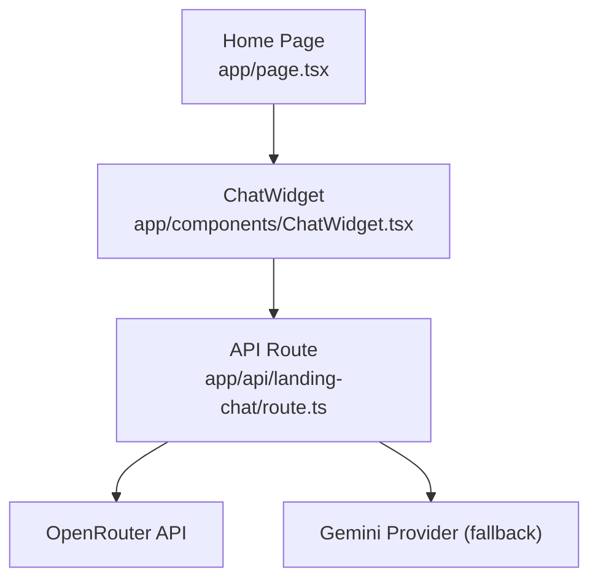
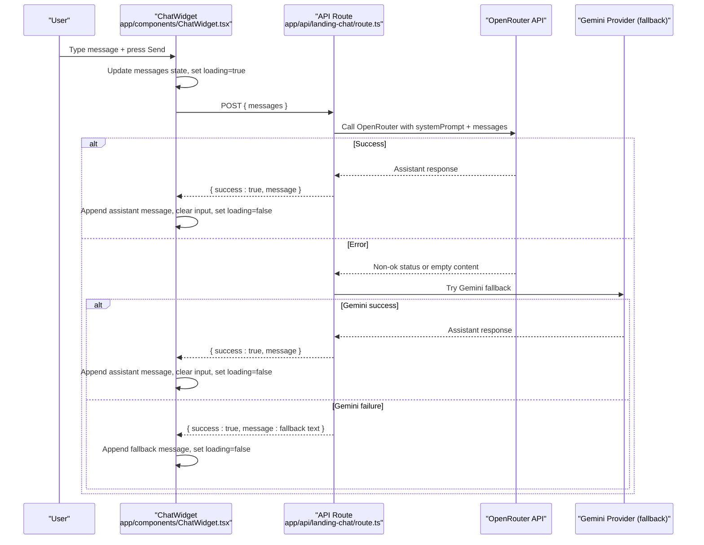
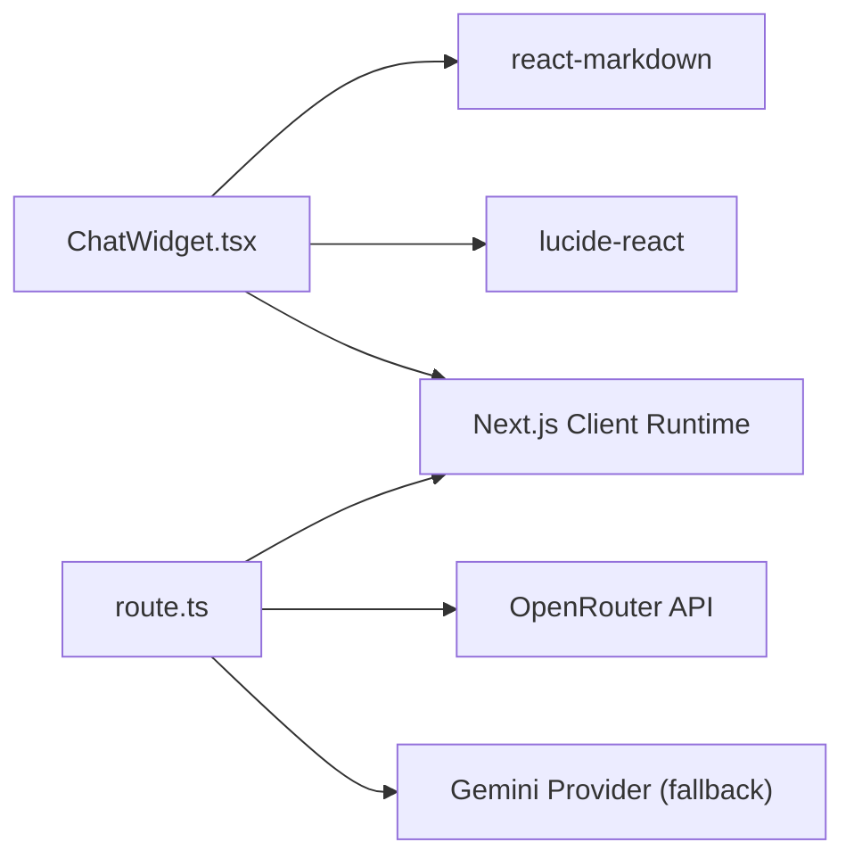
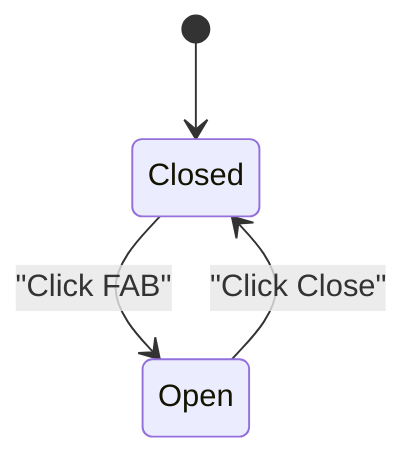

# Chat Widget Component

<cite>
**Referenced Files in This Document**
- [ChatWidget.tsx](file://app/components/ChatWidget.tsx)
- [route.ts](file://app/api/landing-chat/route.ts)
- [page.tsx](file://app/page.tsx)
- [package.json](file://package.json)
</cite>

## Table of Contents
1. [Introduction](#introduction)
2. [Project Structure](#project-structure)
3. [Core Components](#core-components)
4. [Architecture Overview](#architecture-overview)
5. [Detailed Component Analysis](#detailed-component-analysis)
6. [Dependency Analysis](#dependency-analysis)
7. [Performance Considerations](#performance-considerations)
8. [Troubleshooting Guide](#troubleshooting-guide)
9. [Conclusion](#conclusion)
10. [Appendices](#appendices)

## Introduction
The ChatWidget is a floating, client-side chat interface that provides AI-powered assistance for PETIVA platform inquiries on the public landing page. It features a floating action button that toggles an expandable chat panel with message history, real-time conversation flow, and formatted assistant responses using markdown rendering. The widget integrates with a Next.js API route to call external AI models and returns friendly, concise answers about the platform’s features, pricing, sign-up instructions, and navigation.

## Project Structure
The ChatWidget lives as a reusable client component and is mounted at the root of the public landing page. Its backend integration is implemented via a Next.js server route that handles POST requests from the frontend and calls external AI providers with fallback logic.

**Diagram sources**
- [page.tsx:14-14](file://app/page.tsx#L14-L14)
- [page.tsx:218-219](file://app/page.tsx#L218-L219)
- [ChatWidget.tsx:36-40](file://app/components/ChatWidget.tsx#L36-L40)
- [route.ts:54-112](file://app/api/landing-chat/route.ts#L54-L112)

**Section sources**
- [page.tsx:14-14](file://app/page.tsx#L14-L14)
- [page.tsx:218-219](file://app/page.tsx#L218-L219)
- [ChatWidget.tsx:1-149](file://app/components/ChatWidget.tsx#L1-L149)
- [route.ts:1-113](file://app/api/landing-chat/route.ts#L1-L113)

## Core Components
- Floating Action Button: Toggles the chat panel open/closed with visual feedback and accessibility attributes.
- Expandable Chat Panel: Contains header, scrollable message area, and input form.
- Message History Management: Maintains a messages array with roles and content; auto-scrolls to latest message.
- Input Handling: Validates non-empty input, prevents duplicate submissions during loading, supports Enter to send.
- Loading States: Shows “Writing…” indicator while awaiting backend response.
- Markdown Rendering: Renders assistant responses with ReactMarkdown using custom components for headings, lists, paragraphs, and strong text.
- API Integration: Sends chat history to /api/landing-chat and updates UI based on success or error responses.

**Section sources**
- [ChatWidget.tsx:8-19](file://app/components/ChatWidget.tsx#L8-L19)
- [ChatWidget.tsx:21-53](file://app/components/ChatWidget.tsx#L21-L53)
- [ChatWidget.tsx:55-149](file://app/components/ChatWidget.tsx#L55-L149)

## Architecture Overview
The chat flow begins when a user submits a message through the widget. The component sends the current conversation history to the server route, which constructs a system prompt and forwards the full message list to an AI provider. On success, the assistant’s response is returned and rendered with markdown formatting. Errors are handled gracefully with user-friendly messages.

**Diagram sources**
- [ChatWidget.tsx:21-53](file://app/components/ChatWidget.tsx#L21-L53)
- [route.ts:54-112](file://app/api/landing-chat/route.ts#L54-L112)

## Detailed Component Analysis

### Floating Action Button and Panel
- Button toggles visibility and switches icon between chat and close.
- Panel includes a header with branding and a close button.
- Uses responsive width and fixed positioning for overlay behavior.

**Section sources**
- [ChatWidget.tsx:55-81](file://app/components/ChatWidget.tsx#L55-L81)

### Message History and Auto-Scroll
- Messages array stores objects with role and content.
- On each update, the view scrolls to the bottom smoothly using a ref.

**Section sources**
- [ChatWidget.tsx:10-19](file://app/components/ChatWidget.tsx#L10-L19)

### Input Handling and Sending Flow
- Prevents default form submission and guards against empty input or concurrent requests.
- Appends user message immediately to UI for responsiveness.
- Sends entire conversation history to backend to preserve context.

**Section sources**
- [ChatWidget.tsx:21-40](file://app/components/ChatWidget.tsx#L21-L40)

### API Integration and Response Processing
- Posts JSON payload with messages to /api/landing-chat.
- On success, appends assistant message; on failure, shows a generic error message.
- Network errors display a connection error message.

**Section sources**
- [ChatWidget.tsx:30-53](file://app/components/ChatWidget.tsx#L30-L53)
- [route.ts:54-81](file://app/api/landing-chat/route.ts#L54-L81)

### Markdown Rendering
- Assistant messages are rendered with ReactMarkdown.
- Custom components style headings, paragraphs, lists, and emphasis for readability within the chat bubble.

**Section sources**
- [ChatWidget.tsx:97-110](file://app/components/ChatWidget.tsx#L97-L110)
- [package.json:21-21](file://package.json#L21-L21)

### Backend Routing and Fallback Logic
- Validates incoming messages array.
- Prepends a system prompt defining scope and tone.
- Calls OpenRouter with model fallback chain; if all fail, attempts Gemini provider fallback.
- Returns a consistent JSON envelope with success flag and message.

**Section sources**
- [route.ts:3-52](file://app/api/landing-chat/route.ts#L3-L52)
- [route.ts:54-112](file://app/api/landing-chat/route.ts#L54-L112)

### Usage Example: Integrating the Widget
- Import and render the ChatWidget in the home page layout so it appears across the landing experience.

**Section sources**
- [page.tsx:14-14](file://app/page.tsx#L14-L14)
- [page.tsx:218-219](file://app/page.tsx#L218-L219)

### Customization Options
- Styling: Adjust Tailwind classes for colors, sizes, and spacing to match brand guidelines.
- Behavior: Modify placeholder text, initial greeting, and error messages directly in the component.
- Markdown: Extend or override ReactMarkdown components to support additional elements like links or code blocks.

[No sources needed since this section provides general guidance]

### Accessibility Features
- Keyboard Navigation: Enter key submits the message; Shift+Enter allows line breaks.
- Focus Management: Input has visible focus ring styling for keyboard users.
- Screen Reader Support: Buttons include titles; semantic HTML elements provide structure.

**Section sources**
- [ChatWidget.tsx:122-143](file://app/components/ChatWidget.tsx#L122-L143)
- [ChatWidget.tsx:58-64](file://app/components/ChatWidget.tsx#L58-L64)

### Responsive Design Behavior
- Fixed position ensures the widget remains accessible on all screen sizes.
- Panel width adapts between mobile and larger screens for optimal readability.

**Section sources**
- [ChatWidget.tsx:56-69](file://app/components/ChatWidget.tsx#L56-L69)

### Performance Optimizations
- Immediate UI update for user messages reduces perceived latency.
- Smooth scrolling avoids layout thrashing by using refs.
- Markdown rendering is scoped to assistant messages only, minimizing overhead.

**Section sources**
- [ChatWidget.tsx:17-19](file://app/components/ChatWidget.tsx#L17-L19)
- [ChatWidget.tsx:25-28](file://app/components/ChatWidget.tsx#L25-L28)
- [ChatWidget.tsx:97-110](file://app/components/ChatWidget.tsx#L97-L110)

### Security Considerations
- User Input: Input is validated for emptiness before sending; consider adding length limits and sanitization if needed.
- API Communication: Server route validates request shape and uses environment variables for secrets; ensure OPENROUTER_API_KEY is configured securely.
- External Providers: Fallback logic mitigates service outages; monitor logs for errors and adjust timeouts as necessary.

**Section sources**
- [ChatWidget.tsx:21-24](file://app/components/ChatWidget.tsx#L21-L24)
- [route.ts:10-13](file://app/api/landing-chat/route.ts#L10-L13)
- [route.ts:56-63](file://app/api/landing-chat/route.ts#L56-L63)

## Dependency Analysis
The ChatWidget depends on React hooks for state and effects, ReactMarkdown for rendering, and Lucide icons for UI elements. The backend route depends on Next.js server utilities and external AI providers.

**Diagram sources**
- [ChatWidget.tsx:1-6](file://app/components/ChatWidget.tsx#L1-L6)
- [package.json:16-21](file://package.json#L16-L21)
- [route.ts:1-7](file://app/api/landing-chat/route.ts#L1-L7)
- [route.ts:17-31](file://app/api/landing-chat/route.ts#L17-L31)
- [route.ts:86-103](file://app/api/landing-chat/route.ts#L86-L103)

**Section sources**
- [package.json:16-21](file://package.json#L16-L21)
- [ChatWidget.tsx:1-6](file://app/components/ChatWidget.tsx#L1-L6)
- [route.ts:1-7](file://app/api/landing-chat/route.ts#L1-L7)

## Performance Considerations
- Minimize re-renders by keeping message objects lightweight and avoiding unnecessary state updates.
- Use memoization for expensive markdown rendering if message volume grows significantly.
- Debounce rapid inputs if needed to reduce network requests.
- Monitor API response times and implement retry/backoff strategies for robustness.

[No sources needed since this section provides general guidance]

## Troubleshooting Guide
- Empty or invalid messages: Ensure the messages array is present and well-formed before sending.
- Network errors: Check connectivity and verify that the API endpoint is reachable.
- Provider failures: If OpenRouter fails, the route attempts Gemini fallback; review logs for detailed errors.
- Missing environment variables: Confirm OPENROUTER_API_KEY is set in the server environment.

**Section sources**
- [ChatWidget.tsx:30-53](file://app/components/ChatWidget.tsx#L30-L53)
- [route.ts:10-13](file://app/api/landing-chat/route.ts#L10-L13)
- [route.ts:33-51](file://app/api/landing-chat/route.ts#L33-L51)
- [route.ts:82-111](file://app/api/landing-chat/route.ts#L82-L111)

## Conclusion
The ChatWidget delivers a polished, accessible, and responsive AI-powered chat experience on the PETIVA landing page. It manages conversation state efficiently, renders formatted responses, and integrates robustly with backend AI services through a resilient routing layer. With straightforward customization points and clear error handling, it can be adapted to various branding and functional requirements while maintaining performance and security best practices.

## Appendices

### API Contract Summary
- Endpoint: POST /api/landing-chat
- Request body: { messages: [{ role: 'user' | 'assistant', content: string }] }
- Response: { success: boolean, message?: string, error?: string }

**Section sources**
- [ChatWidget.tsx:36-40](file://app/components/ChatWidget.tsx#L36-L40)
- [route.ts:54-81](file://app/api/landing-chat/route.ts#L54-L81)

### State Diagram: Chat Widget Visibility

[No sources needed since this diagram shows conceptual workflow, not actual code structure]