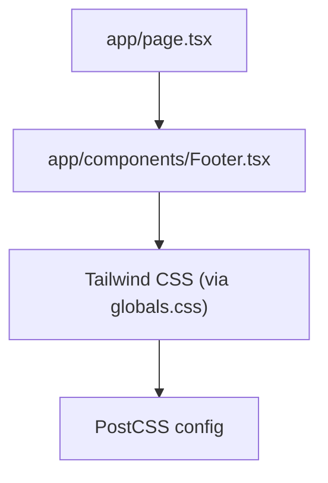
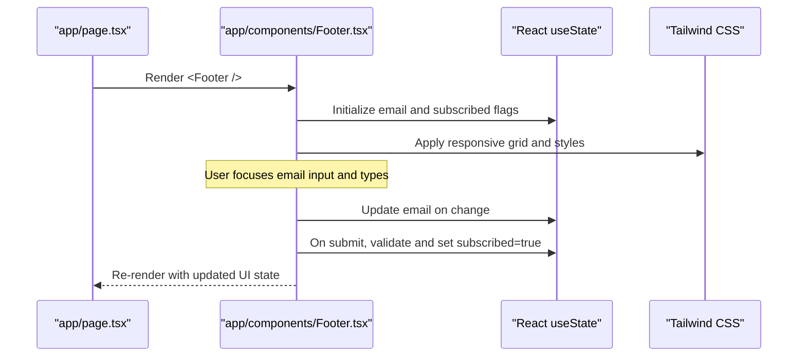
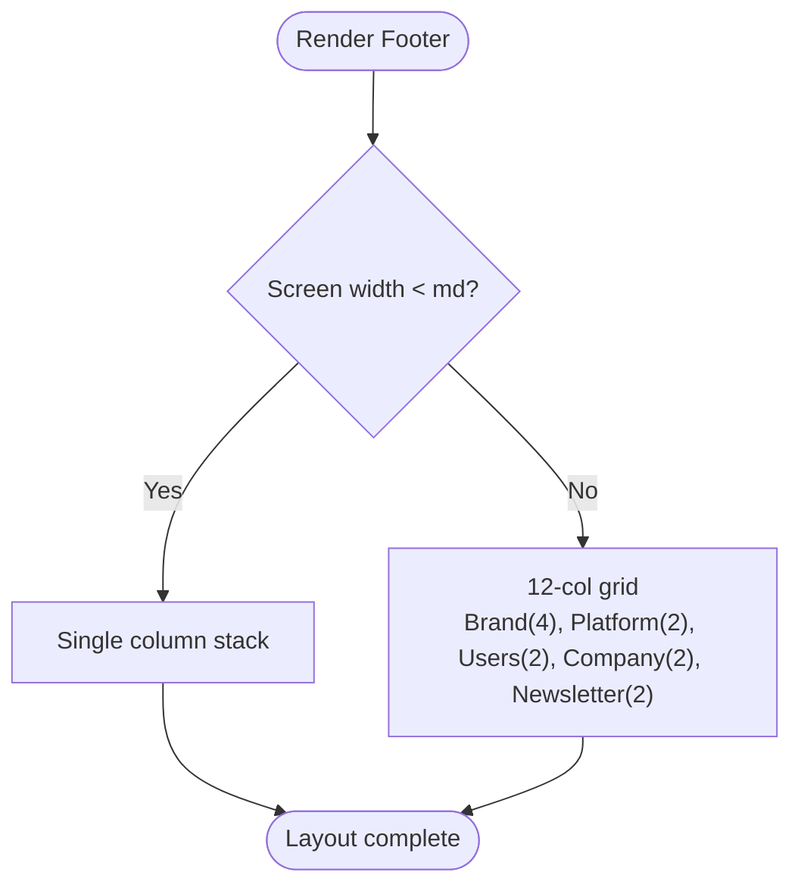
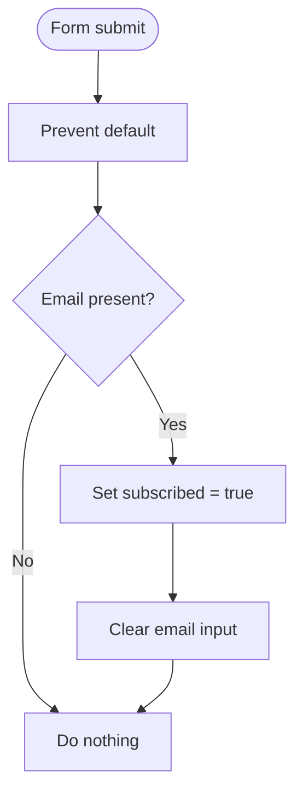
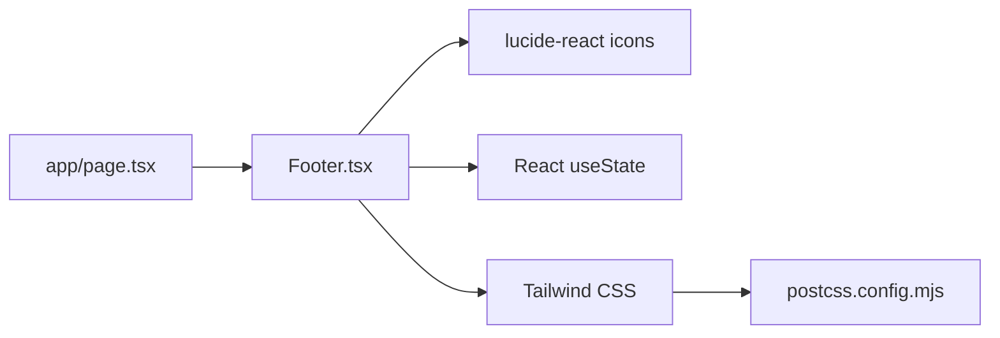

# Footer Component

<cite>
**Referenced Files in This Document**
- [Footer.tsx](file://app/components/Footer.tsx)
- [page.tsx](file://app/page.tsx)
- [globals.css](file://app/globals.css)
- [postcss.config.mjs](file://postcss.config.mjs)
</cite>

## Table of Contents
1. [Introduction](#introduction)
2. [Project Structure](#project-structure)
3. [Core Components](#core-components)
4. [Architecture Overview](#architecture-overview)
5. [Detailed Component Analysis](#detailed-component-analysis)
6. [Dependency Analysis](#dependency-analysis)
7. [Performance Considerations](#performance-considerations)
8. [Troubleshooting Guide](#troubleshooting-guide)
9. [Conclusion](#conclusion)
10. [Appendices](#appendices)

## Introduction
The Footer component is a multi-column footer that provides site navigation, company information, and a newsletter subscription form. It uses a responsive grid layout to organize content into brand, platform links, user resources, company information, and a newsletter subscription column. The component includes social media links, organized link categories, and a copyright bar at the bottom. It manages internal state for email subscription handling with basic validation and success feedback.

## Project Structure
The Footer component is implemented as a client-side React component and is rendered on the main landing page. Styling is handled via Tailwind CSS classes imported through PostCSS.

**Diagram sources**
- [page.tsx:190-191](file://app/page.tsx#L190-L191)
- [Footer.tsx:1-108](file://app/components/Footer.tsx#L1-L108)
- [globals.css:1-20](file://app/globals.css#L1-L20)
- [postcss.config.mjs:1-7](file://postcss.config.mjs#L1-L7)

**Section sources**
- [page.tsx:190-191](file://app/page.tsx#L190-L191)
- [Footer.tsx:1-108](file://app/components/Footer.tsx#L1-L108)
- [globals.css:1-20](file://app/globals.css#L1-L20)
- [postcss.config.mjs:1-7](file://postcss.config.mjs#L1-L7)

## Core Components
- Brand column: Displays logo icon, brand name, short description, and social media links.
- Platform links: Navigation links for product features and information.
- For Users links: Links targeting pet owners, veterinarians, clinics, help center, and FAQs.
- Company links: About, blog, careers, contact, press kit.
- Newsletter subscription: Email input and subscribe button with local state-driven success feedback.
- Copyright bar: Legal links and branding statement.

Key behaviors:
- Responsive grid: Single column on small screens; multi-column grid on medium and larger screens.
- Form handling: Prevents default submission, validates non-empty email, shows success state, clears input.
- Accessibility: Uses semantic HTML elements like footer, headings, and anchor tags; keyboard navigable inputs and buttons.

**Section sources**
- [Footer.tsx:20-105](file://app/components/Footer.tsx#L20-L105)

## Architecture Overview
The Footer is a self-contained UI component integrated into the application’s root page. It relies on Tailwind utility classes for layout and styling and lucide-react icons for visual elements.

**Diagram sources**
- [page.tsx:190-191](file://app/page.tsx#L190-L191)
- [Footer.tsx:7-17](file://app/components/Footer.tsx#L7-L17)
- [Footer.tsx:77-89](file://app/components/Footer.tsx#L77-L89)
- [globals.css:1-20](file://app/globals.css#L1-L20)

## Detailed Component Analysis

### Layout and Responsiveness
- Grid structure: A single-column layout on mobile, transitioning to a 12-column grid on medium screens and above. Columns are distributed across brand (span 4), platform (span 2), users (span 2), company (span 2), and newsletter (span 2).
- Spacing and typography: Consistent spacing and text sizes ensure readability across devices. Headings use uppercase tracking for clear section separation.
- Visual hierarchy: Brand column contains logo, name, description, and social links; other columns group related links under descriptive headings.

**Diagram sources**
- [Footer.tsx:21-91](file://app/components/Footer.tsx#L21-L91)

**Section sources**
- [Footer.tsx:21-91](file://app/components/Footer.tsx#L21-L91)

### Newsletter Subscription Flow
- Inputs and state: Controlled email input bound to local state; boolean flag indicates successful subscription.
- Validation: Prevents default form submission; checks if email is non-empty before marking as subscribed.
- Feedback: Button text changes to show a success indicator when subscribed; input is cleared after submission.

**Diagram sources**
- [Footer.tsx:11-17](file://app/components/Footer.tsx#L11-L17)
- [Footer.tsx:77-89](file://app/components/Footer.tsx#L77-L89)

**Section sources**
- [Footer.tsx:11-17](file://app/components/Footer.tsx#L11-L17)
- [Footer.tsx:77-89](file://app/components/Footer.tsx#L77-L89)

### Social Media Links
- Social icons and labels: Social links include Facebook, Instagram, Twitter, LinkedIn (represented by briefcase icon), and YouTube.
- Customization: Replace href values with actual URLs and update labels or icons as needed.

**Section sources**
- [Footer.tsx:32-38](file://app/components/Footer.tsx#L32-L38)

### Link Categories and Organization
- Platform: Features, How It Works, Pricing, AI Assistant, Security.
- For Users: Pet Owners, Veterinarians, Veterinary Clinics, Help Center, FAQs.
- Company: About Us, Blog, Careers, Contact Us, Press Kit.
- Each category has a heading and a list of anchor links with hover transitions.

**Section sources**
- [Footer.tsx:41-69](file://app/components/Footer.tsx#L41-L69)

### Copyright Bar
- Elements: Copyright notice with dynamic year, Privacy Policy, Terms of Service, Cookie Policy, and a branded message.
- Layout: Flexbox row on medium screens and above; stacked on smaller screens.

**Section sources**
- [Footer.tsx:93-104](file://app/components/Footer.tsx#L93-L104)

### Accessibility
- Semantic HTML: Uses footer element for landmark region; headings for sections; anchor tags for links; form with input and button for subscription.
- Keyboard navigation: Input and button are focusable; form submission via Enter key supported by native behavior.
- Focus states: Input has visible focus border color for accessibility.

**Section sources**
- [Footer.tsx:20-105](file://app/components/Footer.tsx#L20-L105)

### Styling and Theming
- Tailwind utilities: Background colors, text colors, borders, padding, grid, and typography classes control appearance.
- Global theme: Tailwind is imported via PostCSS; global variables define background and foreground colors used elsewhere.

**Section sources**
- [Footer.tsx:20-105](file://app/components/Footer.tsx#L20-L105)
- [globals.css:1-20](file://app/globals.css#L1-L20)
- [postcss.config.mjs:1-7](file://postcss.config.mjs#L1-L7)

## Dependency Analysis
- External dependencies:
  - lucide-react icons: PawPrint, Briefcase, Check, Copyright, Heart.
  - React hooks: useState for local state management.
- Integration:
  - Rendered within app/page.tsx.
  - Styled using Tailwind CSS configured via PostCSS.

**Diagram sources**
- [Footer.tsx:1-108](file://app/components/Footer.tsx#L1-L108)
- [page.tsx:190-191](file://app/page.tsx#L190-L191)
- [postcss.config.mjs:1-7](file://postcss.config.mjs#L1-L7)

**Section sources**
- [Footer.tsx:1-108](file://app/components/Footer.tsx#L1-L108)
- [page.tsx:190-191](file://app/page.tsx#L190-L191)
- [postcss.config.mjs:1-7](file://postcss.config.mjs#L1-L7)

## Performance Considerations
- Lightweight component: Minimal state and no external API calls keep rendering fast.
- Client-only: Marked as a client component; consider server-side rendering implications if moving logic to server components.
- Styling efficiency: Utility-first approach avoids heavy custom CSS; ensure unused classes are purged in production builds.

[No sources needed since this section provides general guidance]

## Troubleshooting Guide
- Form does not submit: Ensure preventDefault is called and email input has a value before setting subscribed state.
- Success feedback not showing: Verify the subscribed state toggles correctly and the conditional render updates the button text.
- Styling issues: Confirm Tailwind is properly configured via PostCSS and that global CSS imports Tailwind.
- Accessibility concerns: Use semantic elements and ensure focus states are visible; test keyboard navigation.

**Section sources**
- [Footer.tsx:11-17](file://app/components/Footer.tsx#L11-L17)
- [Footer.tsx:77-89](file://app/components/Footer.tsx#L77-L89)
- [globals.css:1-20](file://app/globals.css#L1-L20)
- [postcss.config.mjs:1-7](file://postcss.config.mjs#L1-L7)

## Conclusion
The Footer component provides a clean, responsive, and accessible multi-column layout with essential site navigation and a simple newsletter subscription flow. Its design leverages Tailwind CSS for efficient styling and React state for interactive behavior. Customization is straightforward through updating link destinations, branding elements, and extending the subscription flow as needed.

[No sources needed since this section summarizes without analyzing specific files]

## Appendices

### Usage Examples and Customization
- Customize link destinations:
  - Update href attributes in Platform, For Users, and Company link sections to point to actual routes or pages.
  - Reference: [Footer.tsx:41-69](file://app/components/Footer.tsx#L41-L69)
- Update branding:
  - Modify brand name, description, and social links in the brand column.
  - Reference: [Footer.tsx:23-38](file://app/components/Footer.tsx#L23-L38)
- Modify newsletter subscription flow:
  - Extend handleSubscribe to call an API endpoint for subscription.
  - Add error handling for invalid emails and network failures.
  - Reference: [Footer.tsx:11-17](file://app/components/Footer.tsx#L11-L17), [Footer.tsx:77-89](file://app/components/Footer.tsx#L77-L89)

### SEO Considerations
- Semantic structure: Using footer and headings improves document outline for crawlers.
- Link structure: Ensure all anchor tags have meaningful text and valid hrefs to aid indexing.
- Meta information: Footer itself does not manage meta tags; configure meta tags in page-level components or layout files.

[No sources needed since this section provides general guidance]