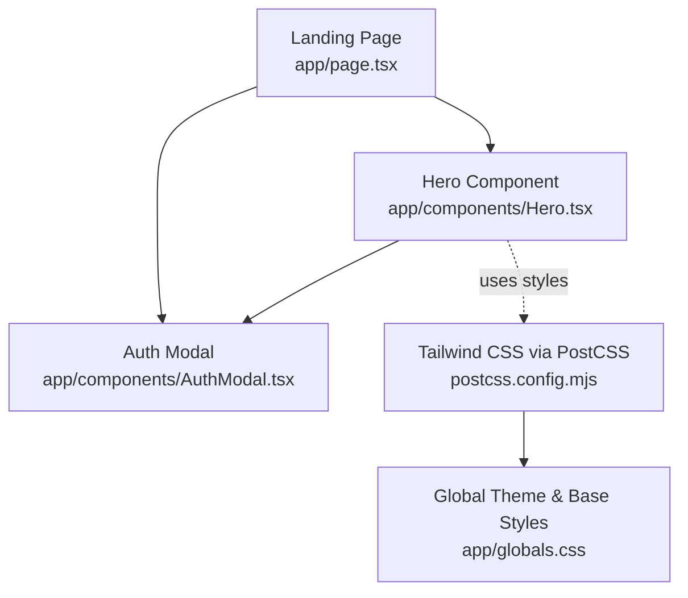
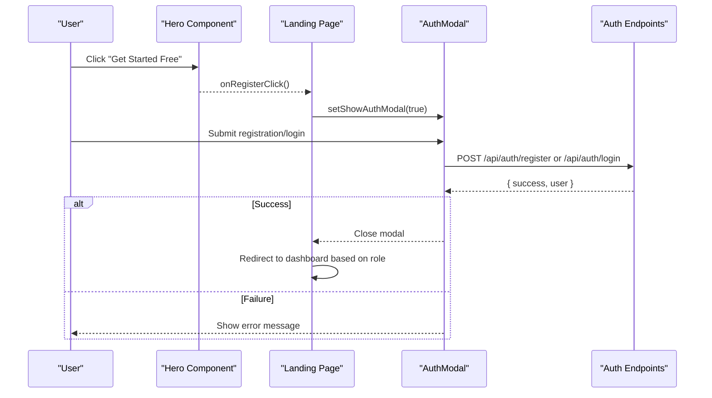
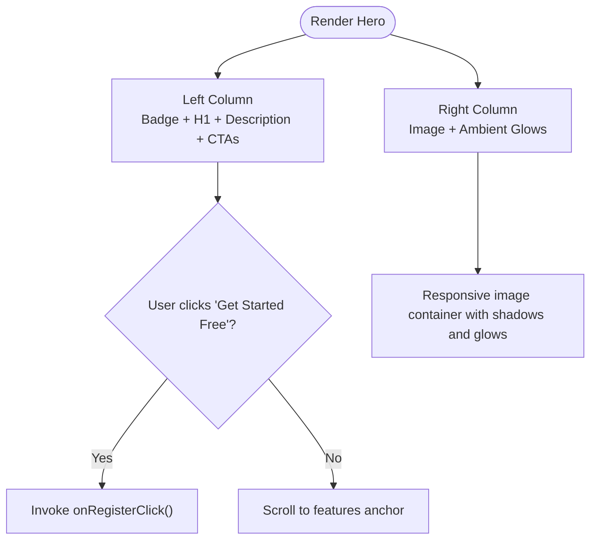
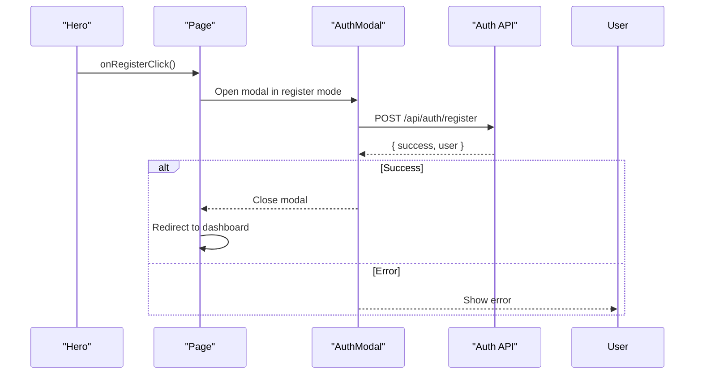
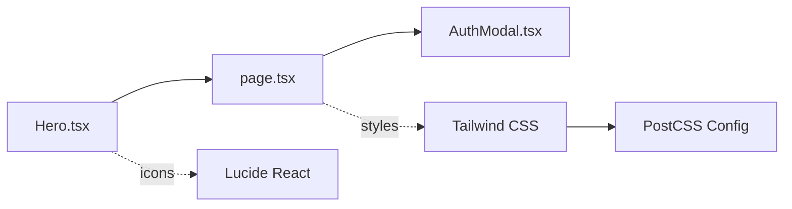

# Hero Component

<cite>
**Referenced Files in This Document**
- [Hero.tsx](file://app/components/Hero.tsx)
- [page.tsx](file://app/page.tsx)
- [AuthModal.tsx](file://app/components/AuthModal.tsx)
- [globals.css](file://app/globals.css)
- [postcss.config.mjs](file://postcss.config.mjs)
</cite>

## Table of Contents
1. Introduction
2. Project Structure
3. Core Components
4. Architecture Overview
5. Detailed Component Analysis
6. Dependency Analysis
7. Performance Considerations
8. Troubleshooting Guide
9. Conclusion

## Introduction
The Hero component is the landing page hero section that showcases PETIVA’s value proposition. It presents a compelling headline, supporting description, and call-to-action buttons within a visually engaging layout featuring gradient backgrounds, responsive grid behavior, and pet-themed imagery with ambient background effects. The primary user action is registration, which triggers a callback to open the unified authentication modal and guide users through sign-up or sign-in flows.

## Project Structure
The Hero component lives under app/components and is rendered on the root landing page. The parent page wires up the registration flow by passing an onRegisterClick handler that opens the AuthModal. Styling is implemented with Tailwind CSS classes and global theme variables are defined in the application’s global stylesheet.

**Diagram sources**
- [page.tsx:163-188](file://app/page.tsx#L163-L188)
- [Hero.tsx:9-58](file://app/components/Hero.tsx#L9-L58)
- [AuthModal.tsx:71-203](file://app/components/AuthModal.tsx#L71-L203)
- [postcss.config.mjs:1-7](file://postcss.config.mjs#L1-L7)
- [globals.css:1-20](file://app/globals.css#L1-L20)

**Section sources**
- [page.tsx:163-188](file://app/page.tsx#L163-L188)
- [Hero.tsx:9-58](file://app/components/Hero.tsx#L9-L58)
- [postcss.config.mjs:1-7](file://postcss.config.mjs#L1-L7)
- [globals.css:1-20](file://app/globals.css#L1-L20)

## Core Components
- Hero.tsx: Renders the hero section with a two-column layout (left text, right illustration), gradient background, and pet-themed visuals. It exposes a single prop for handling registration actions.
- AuthModal.tsx: Unified modal for login/register flows triggered from the Hero’s call-to-action.
- Landing Page (page.tsx): Hosts the Hero and wires up state and handlers for opening the modal and processing authentication.

Key responsibilities:
- Hero: Visual presentation and user interaction entry point for registration.
- AuthModal: Form rendering, validation, and submission logic for both login and registration.
- Page: State management for modal visibility and form data, plus integration with backend auth endpoints.

**Section sources**
- [Hero.tsx:5-58](file://app/components/Hero.tsx#L5-L58)
- [AuthModal.tsx:7-203](file://app/components/AuthModal.tsx#L7-L203)
- [page.tsx:16-222](file://app/page.tsx#L16-L222)

## Architecture Overview
The Hero component is a presentational component that delegates user actions to its parent via props. When a user clicks “Get Started Free,” the parent page opens the AuthModal, which handles registration or login. After successful authentication, the user is redirected to the appropriate dashboard based on their role.

**Diagram sources**
- [Hero.tsx:28-41](file://app/components/Hero.tsx#L28-L41)
- [page.tsx:157-161](file://app/page.tsx#L157-L161)
- [page.tsx:113-149](file://app/page.tsx#L113-L149)
- [AuthModal.tsx:98-166](file://app/components/AuthModal.tsx#L98-L166)

## Detailed Component Analysis

### Hero Component
- Purpose: Present PETIVA’s value proposition and drive registration.
- Props:
  - onRegisterClick: Function invoked when the primary CTA button is clicked. Used to open the registration flow.
- Layout:
  - Left column: Badge, headline, description, and two CTAs (“Get Started Free” and “Explore Features”).
  - Right column: Pet-themed image container with rounded corners, shadow, and ambient glow shapes for visual depth.
- Styling:
  - Gradient background using Tailwind utilities.
  - Responsive grid switching from single column on small screens to two columns on medium+ screens.
  - Typography scales responsively for readability across devices.
- Accessibility:
  - Uses semantic heading hierarchy with h1 for the main headline.
  - Image includes descriptive alt text for screen readers.
  - Buttons are interactive elements with clear labels.

**Diagram sources**
- [Hero.tsx:11-58](file://app/components/Hero.tsx#L11-L58)

**Section sources**
- [Hero.tsx:5-58](file://app/components/Hero.tsx#L5-L58)

### Registration Flow Integration
- Parent wiring:
  - The landing page defines openRegister to set modal state and mode to registration.
  - The Hero receives onRegisterClick bound to openRegister.
- Modal behavior:
  - Displays email/password fields and additional registration fields when in register mode.
  - Submits to /api/auth/register or /api/auth/login depending on mode.
  - On success, closes modal and redirects based on user role.

**Diagram sources**
- [page.tsx:157-161](file://app/page.tsx#L157-L161)
- [page.tsx:113-149](file://app/page.tsx#L113-L149)
- [AuthModal.tsx:98-166](file://app/components/AuthModal.tsx#L98-L166)

**Section sources**
- [page.tsx:157-161](file://app/page.tsx#L157-L161)
- [page.tsx:113-149](file://app/page.tsx#L113-L149)
- [AuthModal.tsx:98-166](file://app/components/AuthModal.tsx#L98-L166)

### Usage Examples
- Basic usage in the landing page:
  - Import Hero and pass onRegisterClick to open the registration modal.
  - Example reference: [page.tsx:170-171](file://app/page.tsx#L170-L171)
- Customizing the registration flow:
  - Modify openRegister to prefill roles or redirect to specific onboarding steps.
  - Extend AuthModal to include additional fields or third-party integrations.
  - Reference: [page.tsx:157-161](file://app/page.tsx#L157-L161), [AuthModal.tsx:117-157](file://app/components/AuthModal.tsx#L117-L157)

**Section sources**
- [page.tsx:170-171](file://app/page.tsx#L170-L171)
- [page.tsx:157-161](file://app/page.tsx#L157-L161)
- [AuthModal.tsx:117-157](file://app/components/AuthModal.tsx#L117-L157)

### Responsive Design Behavior
- Grid layout:
  - Single column on small screens; switches to two columns on medium+ screens for side-by-side content.
- Typography:
  - Headline font size increases on larger screens for emphasis.
- Spacing:
  - Padding and gaps adjust for better readability and balance across breakpoints.
- Image container:
  - Fixed height on desktop with responsive scaling; maintains aspect ratio and overflow handling.

References:
- Grid and spacing: [Hero.tsx:11-12](file://app/components/Hero.tsx#L11-L12)
- Typography scaling: [Hero.tsx:19-25](file://app/components/Hero.tsx#L19-L25)
- Image container: [Hero.tsx:45-55](file://app/components/Hero.tsx#L45-L55)

**Section sources**
- [Hero.tsx:11-12](file://app/components/Hero.tsx#L11-L12)
- [Hero.tsx:19-25](file://app/components/Hero.tsx#L19-L25)
- [Hero.tsx:45-55](file://app/components/Hero.tsx#L45-L55)

### Accessibility Features
- Semantic headings:
  - Uses h1 for the primary headline to establish proper document outline.
- Image alt text:
  - Descriptive alt attribute ensures meaningful context for assistive technologies.
- Interactive controls:
  - Buttons provide clear labels and keyboard focusability.

References:
- Heading: [Hero.tsx:19-22](file://app/components/Hero.tsx#L19-L22)
- Image alt: [Hero.tsx:47-51](file://app/components/Hero.tsx#L47-L51)

**Section sources**
- [Hero.tsx:19-22](file://app/components/Hero.tsx#L19-L22)
- [Hero.tsx:47-51](file://app/components/Hero.tsx#L47-L51)

### Styling Customization Options
- Tailwind CSS:
  - Colors, gradients, spacing, typography, and shadows are applied via utility classes throughout the component.
- Global theme:
  - Root color variables and base fonts are defined in globals.css and consumed by Tailwind.
- PostCSS configuration:
  - Tailwind is integrated via PostCSS plugin for processing styles.

References:
- Tailwind usage: [Hero.tsx:11-55](file://app/components/Hero.tsx#L11-L55)
- Global theme: [globals.css:3-13](file://app/globals.css#L3-L13)
- PostCSS setup: [postcss.config.mjs:1-7](file://postcss.config.mjs#L1-L7)

**Section sources**
- [Hero.tsx:11-55](file://app/components/Hero.tsx#L11-L55)
- [globals.css:3-13](file://app/globals.css#L3-L13)
- [postcss.config.mjs:1-7](file://postcss.config.mjs#L1-L7)

## Dependency Analysis
- Internal dependencies:
  - Hero depends on the parent page for handling registration callbacks.
  - AuthModal is used by the page to manage authentication UI and logic.
- External dependencies:
  - Tailwind CSS for styling.
  - Lucide icons for paw print and other UI icons.

**Diagram sources**
- [Hero.tsx:2](file://app/components/Hero.tsx#L2)
- [page.tsx:6-14](file://app/page.tsx#L6-L14)
- [postcss.config.mjs:1-7](file://postcss.config.mjs#L1-L7)

**Section sources**
- [Hero.tsx:2](file://app/components/Hero.tsx#L2)
- [page.tsx:6-14](file://app/page.tsx#L6-L14)
- [postcss.config.mjs:1-7](file://postcss.config.mjs#L1-L7)

## Performance Considerations
- Image optimization:
  - Ensure images are optimized and served with appropriate formats and sizes to reduce load times.
- Lazy loading:
  - Consider lazy-loading non-critical assets if the hero image is large.
- Minimal re-renders:
  - Keep Hero stateless; rely on props to avoid unnecessary updates.
- CSS efficiency:
  - Tailwind utilities are tree-shaken; ensure unused classes are not added to keep bundle size low.

[No sources needed since this section provides general guidance]

## Troubleshooting Guide
- Registration does not open modal:
  - Verify onRegisterClick is passed correctly to Hero and bound to openRegister in the page.
  - Check console for errors in event binding.
  - References: [page.tsx:157-161](file://app/page.tsx#L157-L161), [Hero.tsx:28-41](file://app/components/Hero.tsx#L28-L41)
- Authentication fails:
  - Inspect network requests to /api/auth/register or /api/auth/login for error responses.
  - Confirm form fields are correctly bound and validated in AuthModal.
  - References: [page.tsx:113-149](file://app/page.tsx#L113-L149), [AuthModal.tsx:98-166](file://app/components/AuthModal.tsx#L98-L166)
- Styling issues:
  - Ensure Tailwind is properly configured via PostCSS and globals.css is imported.
  - Check browser dev tools for missing utility classes or theme variables.
  - References: [postcss.config.mjs:1-7](file://postcss.config.mjs#L1-L7), [globals.css:1-20](file://app/globals.css#L1-L20)

**Section sources**
- [page.tsx:157-161](file://app/page.tsx#L157-L161)
- [Hero.tsx:28-41](file://app/components/Hero.tsx#L28-L41)
- [page.tsx:113-149](file://app/page.tsx#L113-L149)
- [AuthModal.tsx:98-166](file://app/components/AuthModal.tsx#L98-L166)
- [postcss.config.mjs:1-7](file://postcss.config.mjs#L1-L7)
- [globals.css:1-20](file://app/globals.css#L1-L20)

## Conclusion
The Hero component effectively communicates PETIVA’s value proposition with a clean, responsive design and clear calls to action. Its integration with the AuthModal provides a seamless registration experience, while Tailwind CSS enables flexible styling and accessibility best practices. By following the usage examples and troubleshooting guidance, developers can confidently customize and extend the component to meet evolving product needs.

[No sources needed since this section summarizes without analyzing specific files]