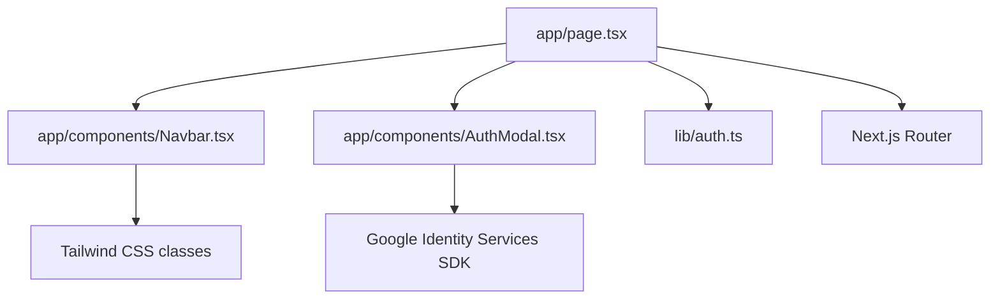
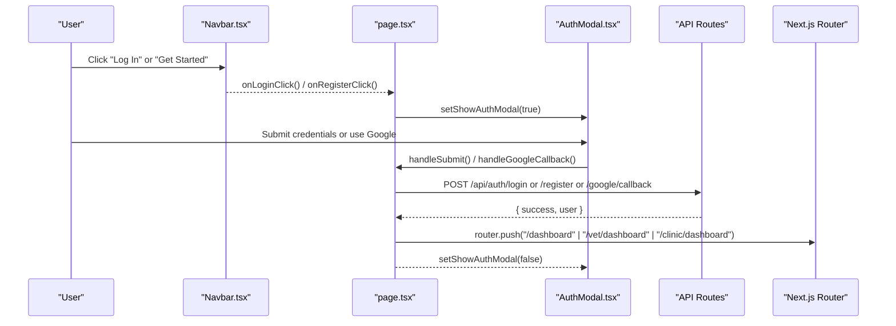
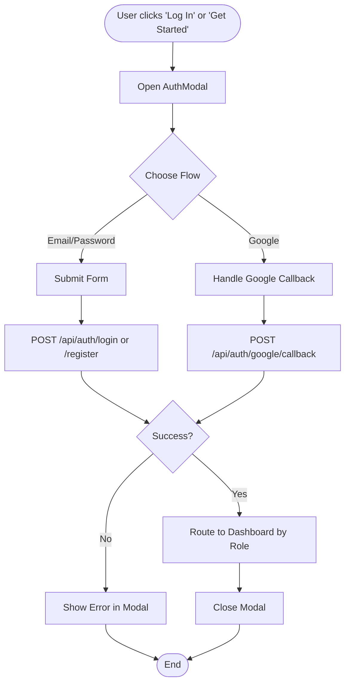
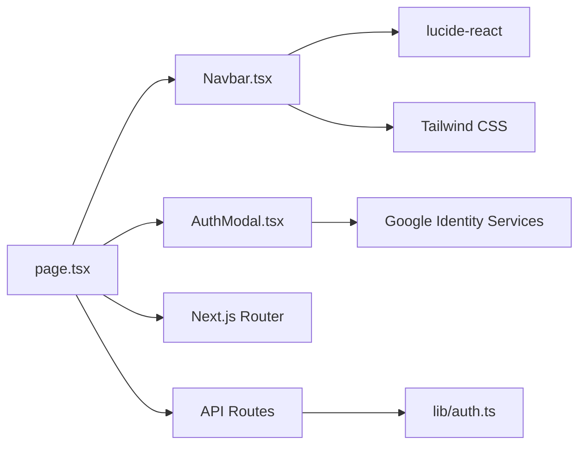

# Navbar Component

<cite>
**Referenced Files in This Document**
- [Navbar.tsx](file://app/components/Navbar.tsx)
- [page.tsx](file://app/page.tsx)
- [AuthModal.tsx](file://app/components/AuthModal.tsx)
- [auth.ts](file://lib/auth.ts)
- [globals.css](file://app/globals.css)
</cite>

## Table of Contents
1. [Introduction](#introduction)
2. [Project Structure](#project-structure)
3. [Core Components](#core-components)
4. [Architecture Overview](#architecture-overview)
5. [Detailed Component Analysis](#detailed-component-analysis)
6. [Dependency Analysis](#dependency-analysis)
7. [Performance Considerations](#performance-considerations)
8. [Troubleshooting Guide](#troubleshooting-guide)
9. [Conclusion](#conclusion)
10. [Appendices](#appendices)

## Introduction
The Navbar component is a sticky, responsive navigation header that provides site-wide navigation and authentication controls for the PETIVA pet healthcare application. It features a logo with a paw print icon, desktop navigation links to key sections (Features, For Pet Owners, For Veterinarians, For Clinics, Pricing, About Us), and an authentication area with Log In and Get Started buttons. The component uses a mobile-first approach: on small screens, only the logo and auth buttons are visible; on medium and larger screens, the full set of navigation links appears.

It integrates with the application’s authentication flow by exposing two event handlers—onLoginClick and onRegisterClick—which the parent page uses to open a unified AuthModal and manage routing after successful authentication.

## Project Structure
The Navbar lives under app/components and is consumed by the root landing page at app/page.tsx. Authentication state and modal logic are managed in the same page, while server-side session utilities live in lib/auth.ts. Global styles are defined in app/globals.css using Tailwind CSS.

**Diagram sources**
- [page.tsx:6-166](file://app/page.tsx#L6-L166)
- [Navbar.tsx:1-48](file://app/components/Navbar.tsx#L1-L48)
- [AuthModal.tsx:1-205](file://app/components/AuthModal.tsx#L1-L205)
- [auth.ts:1-125](file://lib/auth.ts#L1-L125)

**Section sources**
- [page.tsx:1-223](file://app/page.tsx#L1-L223)
- [Navbar.tsx:1-48](file://app/components/Navbar.tsx#L1-L48)
- [globals.css:1-20](file://app/globals.css#L1-L20)

## Core Components
- Sticky Header: Uses a sticky top positioning with a subtle backdrop blur and border for visual separation.
- Logo: Displays a paw print icon alongside the brand name and scrolls to the top when clicked.
- Desktop Navigation Links: Hidden on small screens and shown on medium+ screens via responsive utility classes.
- Authentication Buttons: Log In and Get Started buttons wired to parent-provided callbacks.

Props interface:
- onLoginClick: Function invoked when the user clicks Log In.
- onRegisterClick: Function invoked when the user clicks Get Started.

These props decouple UI from behavior, allowing the parent page to control authentication flows and routing.

**Section sources**
- [Navbar.tsx:5-48](file://app/components/Navbar.tsx#L5-L48)

## Architecture Overview
The Navbar delegates all interactive behavior to its parent page through props. The parent manages:
- Opening/closing the AuthModal
- Handling form submission and Google OAuth callback
- Redirecting users to role-based dashboards after login/register

**Diagram sources**
- [page.tsx:113-161](file://app/page.tsx#L113-L161)
- [page.tsx:84-111](file://app/page.tsx#L84-L111)
- [page.tsx:163-166](file://app/page.tsx#L163-L166)
- [AuthModal.tsx:98-166](file://app/components/AuthModal.tsx#L98-L166)

## Detailed Component Analysis

### Props and Behavior
- Props:
  - onLoginClick: Triggers opening the login mode in the AuthModal.
  - onRegisterClick: Triggers opening the registration mode in the AuthModal.
- Behavior:
  - No internal state; fully controlled by parent.
  - Provides semantic anchor links for section navigation on desktop.
  - Implements hover states for links and buttons for better UX.

Integration example (conceptual):
- Parent page defines openLogin/openRegister functions that toggle modal visibility and form state.
- These functions are passed to Navbar as onLoginClick/onRegisterClick.

**Section sources**
- [Navbar.tsx:5-48](file://app/components/Navbar.tsx#L5-L48)
- [page.tsx:151-166](file://app/page.tsx#L151-L166)

### Responsive Design and Mobile-First Approach
- Small screens: Only logo and auth buttons are visible.
- Medium and up: Full navigation links appear horizontally.
- Implementation uses responsive utility classes to show/hide the nav block based on viewport width.

Accessibility considerations:
- Links have clear hover states and consistent typography.
- Focus management is delegated to native browser behavior for anchors and buttons.
- Consider adding aria-labels to the logo if it acts as a link to improve screen reader context.

**Section sources**
- [Navbar.tsx:20-28](file://app/components/Navbar.tsx#L20-L28)

### Authentication Flow Integration
- The Navbar triggers events handled by the parent page.
- The parent opens the AuthModal and processes either email/password submission or Google OAuth callback.
- After successful authentication, the parent routes users to role-specific dashboards.

Server-side session handling:
- Session creation, validation, and cookie management are implemented in lib/auth.ts.
- The API routes (not shown here) use these utilities to authenticate requests and set cookies.

**Diagram sources**
- [page.tsx:113-149](file://app/page.tsx#L113-L149)
- [page.tsx:84-111](file://app/page.tsx#L84-L111)
- [auth.ts:33-97](file://lib/auth.ts#L33-L97)

**Section sources**
- [page.tsx:84-161](file://app/page.tsx#L84-L161)
- [auth.ts:1-125](file://lib/auth.ts#L1-L125)

### Styling and Visual States
- Sticky header with backdrop blur and border for visual separation.
- Hover states for links and buttons provide feedback.
- Primary action button uses a prominent background color and rounded corners.
- Global theme variables and Tailwind configuration are applied via globals.css.

**Section sources**
- [Navbar.tsx:11-46](file://app/components/Navbar.tsx#L11-L46)
- [globals.css:1-20](file://app/globals.css#L1-L20)

### Accessibility Notes
- Semantic elements: header, nav, a, button.
- Keyboard navigation works out-of-the-box for anchors and buttons.
- Ensure focus outlines remain visible for keyboard users.
- Consider adding aria attributes to enhance context (e.g., aria-label on logo link).

[No sources needed since this section provides general guidance]

## Dependency Analysis
- Navbar depends on:
  - lucide-react for icons (PawPrint).
  - Tailwind CSS classes for layout and styling.
- Parent page depends on:
  - Next.js Router for navigation.
  - AuthModal for authentication UI.
  - API routes for authentication endpoints.
- Server-side auth utilities in lib/auth.ts support session management used by API routes.

**Diagram sources**
- [Navbar.tsx:1-48](file://app/components/Navbar.tsx#L1-L48)
- [page.tsx:1-223](file://app/page.tsx#L1-L223)
- [AuthModal.tsx:1-205](file://app/components/AuthModal.tsx#L1-L205)
- [auth.ts:1-125](file://lib/auth.ts#L1-L125)

**Section sources**
- [Navbar.tsx:1-48](file://app/components/Navbar.tsx#L1-L48)
- [page.tsx:1-223](file://app/page.tsx#L1-L223)
- [auth.ts:1-125](file://lib/auth.ts#L1-L125)

## Performance Considerations
- Lightweight component with minimal dependencies and no heavy computations.
- Sticky header uses backdrop blur; ensure performance on low-end devices by limiting excessive effects elsewhere.
- Avoid unnecessary re-renders by keeping Navbar stateless and relying on parent-controlled props.

[No sources needed since this section provides general guidance]

## Troubleshooting Guide
Common issues and resolutions:
- Auth modal does not open:
  - Verify onLoginClick/onRegisterClick are passed correctly to Navbar.
  - Check parent state for showAuthModal toggling.
- Google sign-in button not rendering:
  - Ensure Google SDK script is loaded before attempting to render.
  - Confirm clientId is fetched from /api/auth/google/config.
- Post-auth redirect not working:
  - Validate API response contains user.role and that router.push is called accordingly.
- Session-related errors:
  - Confirm cookies are set and validated using lib/auth.ts utilities.
  - Check expiration and sliding window logic for session extension.

**Section sources**
- [page.tsx:35-82](file://app/page.tsx#L35-L82)
- [page.tsx:84-149](file://app/page.tsx#L84-L149)
- [auth.ts:33-97](file://lib/auth.ts#L33-L97)

## Conclusion
The Navbar component provides a clean, accessible, and responsive navigation experience with integrated authentication controls. By delegating behavior to the parent page through props, it remains reusable and easy to integrate into different contexts. Combined with the AuthModal and server-side session utilities, it supports a complete authentication flow with role-based routing.

[No sources needed since this section summarizes without analyzing specific files]

## Appendices

### Props Interface Summary
- onLoginClick: Function to trigger login flow.
- onRegisterClick: Function to trigger registration flow.

### Integration Example (Conceptual)
- In the parent page, define openLogin and openRegister to toggle modal state and form fields.
- Pass these functions to Navbar as onLoginClick and onRegisterClick.
- Handle form submissions and Google callbacks in the parent to update session and navigate.

[No sources needed since this section provides general guidance]