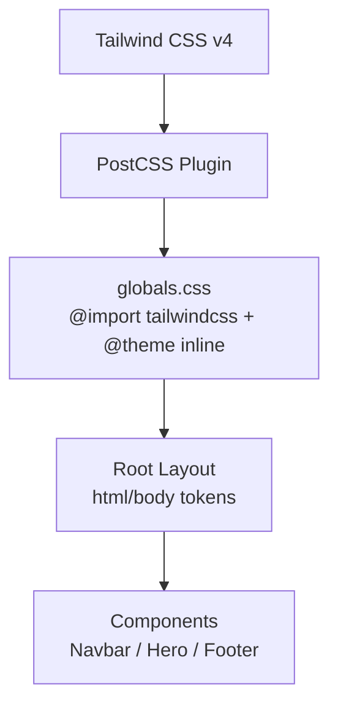
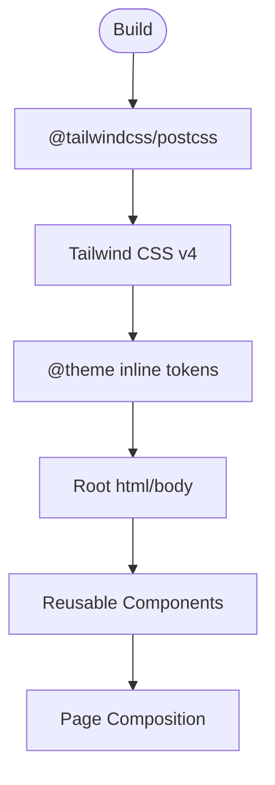
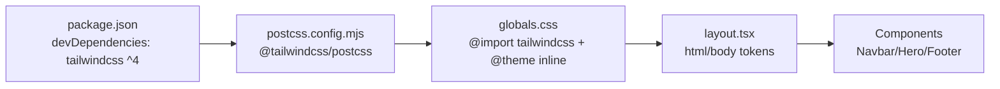

# Styling System & Design Tokens

<cite>
**Referenced Files in This Document**
- [globals.css](file://app/globals.css)
- [postcss.config.mjs](file://postcss.config.mjs)
- [package.json](file://package.json)
- [layout.tsx](file://app/layout.tsx)
- [page.tsx](file://app/page.tsx)
- [Navbar.tsx](file://app/components/Navbar.tsx)
- [Hero.tsx](file://app/components/Hero.tsx)
- [Footer.tsx](file://app/components/Footer.tsx)
</cite>

## Table of Contents
1. Introduction
2. Project Structure
3. Core Components
4. Architecture Overview
5. Detailed Component Analysis
6. Dependency Analysis
7. Performance Considerations
8. Troubleshooting Guide
9. Conclusion

## Introduction
This document explains the PETIVA styling system built on Tailwind CSS v4 with custom design tokens and global styles. It covers the color palette, typography, spacing, responsive breakpoints, consistent styling patterns, theme customization, accessibility considerations, and guidance for extending the system with new components while preserving consistency.

## Project Structure
The styling system is centered around a minimal global stylesheet that imports Tailwind and defines design tokens via CSS variables and Tailwind’s inline theme. The root layout applies these tokens to the document, and components compose utility classes from Tailwind to build UI elements consistently.

**Diagram sources**
- [postcss.config.mjs:1-8](file://postcss.config.mjs#L1-L8)
- [globals.css:1-19](file://app/globals.css#L1-L19)
- [layout.tsx:9-15](file://app/layout.tsx#L9-L15)
- [Navbar.tsx:10-48](file://app/components/Navbar.tsx#L10-L48)
- [Hero.tsx:9-61](file://app/components/Hero.tsx#L9-L61)
- [Footer.tsx:7-108](file://app/components/Footer.tsx#L7-L108)

**Section sources**
- [postcss.config.mjs:1-8](file://postcss.config.mjs#L1-L8)
- [globals.css:1-19](file://app/globals.css#L1-L19)
- [layout.tsx:9-15](file://app/layout.tsx#L9-L15)

## Core Components
- Global tokens: Background and foreground colors are defined as CSS variables and exposed to Tailwind through an inline theme. Font families are also mapped into the theme.
- Root application: The root layout sets language, antialiasing, and base background/text colors using both CSS variables and Tailwind utilities.
- Components: Reusable UI pieces (Navbar, Hero, Footer) apply consistent spacing, typography, and color utilities across the app.

Key implementation references:
- Token definitions and theme mapping: [globals.css:3-13](file://app/globals.css#L3-L13)
- Root html/body styling: [layout.tsx:11-12](file://app/layout.tsx#L11-L12)
- Component usage of tokens/utilities: [Navbar.tsx:12-44](file://app/components/Navbar.tsx#L12-L44), [Hero.tsx:11-55](file://app/components/Hero.tsx#L11-L55), [Footer.tsx:20-104](file://app/components/Footer.tsx#L20-L104)

**Section sources**
- [globals.css:3-13](file://app/globals.css#L3-L13)
- [layout.tsx:11-12](file://app/layout.tsx#L11-L12)
- [Navbar.tsx:12-44](file://app/components/Navbar.tsx#L12-L44)
- [Hero.tsx:11-55](file://app/components/Hero.tsx#L11-L55)
- [Footer.tsx:20-104](file://app/components/Footer.tsx#L20-L104)

## Architecture Overview
The styling architecture follows a layered approach:
- Build layer: PostCSS processes Tailwind v4.
- Theme layer: CSS variables define semantic tokens; Tailwind’s inline theme exposes them as design tokens.
- Application layer: Root layout applies tokens globally; components compose utilities for layout, color, typography, and responsiveness.

**Diagram sources**
- [postcss.config.mjs:1-8](file://postcss.config.mjs#L1-L8)
- [globals.css:1-13](file://app/globals.css#L1-L13)
- [layout.tsx:11-12](file://app/layout.tsx#L11-L12)
- [page.tsx:163-191](file://app/page.tsx#L163-L191)

## Detailed Component Analysis

### Color Palette and Semantic Usage
- Primary blue tones: Blue shades are used for brand accents, interactive states, and highlights. Examples include primary buttons, hover states, and badges.
- Neutral zinc colors: Zinc is used for text hierarchy, borders, backgrounds, and subtle surfaces.
- Semantic roles:
  - Backgrounds: Light backgrounds for page sections and cards; dark footer surface.
  - Foreground: High-contrast text for readability.
  - Interactive: Blue for primary actions; zinc for secondary or muted states.

References:
- Brand and accent usage: [Navbar.tsx:22-27](file://app/components/Navbar.tsx#L22-L27), [Navbar.tsx:32-43](file://app/components/Navbar.tsx#L32-L43), [Hero.tsx:15-22](file://app/components/Hero.tsx#L15-L22), [Hero.tsx:29-40](file://app/components/Hero.tsx#L29-L40)
- Surface and neutral usage: [Footer.tsx:20-21](file://app/components/Footer.tsx#L20-L21), [Footer.tsx:78-88](file://app/components/Footer.tsx#L78-L88)

Guidelines:
- Use blue for primary actions and emphasis; reserve zinc for text and structure.
- Maintain sufficient contrast between text and background by pairing zinc variants with white or light backgrounds.

**Section sources**
- [Navbar.tsx:22-43](file://app/components/Navbar.tsx#L22-L43)
- [Hero.tsx:15-40](file://app/components/Hero.tsx#L15-L40)
- [Footer.tsx:20-21](file://app/components/Footer.tsx#L20-L21)
- [Footer.tsx:78-88](file://app/components/Footer.tsx#L78-L88)

### Typography System
- Font families: Sans-serif and monospace fonts are mapped via the inline theme. The body explicitly sets a font stack for broad compatibility.
- Sizing and hierarchy:
  - Headings use large sizes with tight tracking for impact.
  - Body text uses readable sizes with relaxed line height.
  - Small labels and badges use uppercase tracking for clarity.

References:
- Theme font mapping: [globals.css:8-13](file://app/globals.css#L8-L13)
- Body font stack: [globals.css:15-19](file://app/globals.css#L15-L19)
- Heading and body usage: [Hero.tsx:19-26](file://app/components/Hero.tsx#L19-L26)
- Badge and label typography: [Hero.tsx:15-17](file://app/components/Hero.tsx#L15-L17)

Guidelines:
- Prefer theme font tokens for consistency.
- Use heading sizes progressively; avoid mixing arbitrary sizes when Tailwind scales suffice.

**Section sources**
- [globals.css:8-19](file://app/globals.css#L8-L19)
- [Hero.tsx:15-26](file://app/components/Hero.tsx#L15-L26)

### Spacing System
- Spacing scale: Consistent use of Tailwind spacing utilities for margins, padding, gaps, and sizing.
- Layout containers: Max-width containers with horizontal padding create consistent content widths.
- Component spacing: Gaps and paddings align visual rhythm across sections.

References:
- Container and spacing: [Navbar.tsx:13](file://app/components/Navbar.tsx#L13), [Hero.tsx:12](file://app/components/Hero.tsx#L12), [Footer.tsx:21](file://app/components/Footer.tsx#L21)
- Section padding and vertical rhythm: [Hero.tsx:11](file://app/components/Hero.tsx#L11), [Footer.tsx:20](file://app/components/Footer.tsx#L20)

Guidelines:
- Use consistent gap values within flex/grid layouts.
- Keep container max-widths aligned to maintain alignment across components.

**Section sources**
- [Navbar.tsx:13](file://app/components/Navbar.tsx#L13)
- [Hero.tsx:11-12](file://app/components/Hero.tsx#L11-L12)
- [Footer.tsx:20-21](file://app/components/Footer.tsx#L20-L21)

### Responsive Design Breakpoints and Mobile-First Approach
- Breakpoints: Components switch layouts at medium screens and above (e.g., grid columns, navigation visibility).
- Mobile-first: Default styles target small screens; enhancements apply at larger breakpoints.

References:
- Grid and nav visibility: [Hero.tsx:12](file://app/components/Hero.tsx#L12), [Navbar.tsx:21](file://app/components/Navbar.tsx#L21)
- Footer column layout: [Footer.tsx:21](file://app/components/Footer.tsx#L21)

Guidelines:
- Start with single-column layouts and add multi-column grids at md+.
- Hide complex navigation on small screens and reveal it at md+.

**Section sources**
- [Hero.tsx:12](file://app/components/Hero.tsx#L12)
- [Navbar.tsx:21](file://app/components/Navbar.tsx#L21)
- [Footer.tsx:21](file://app/components/Footer.tsx#L21)

### Consistent Styling Patterns and Best Practices
- Utility composition: Combine spacing, color, and typography utilities rather than creating ad-hoc styles.
- Reusability: Encapsulate repeated patterns into components (e.g., Navbar, Hero, Footer).
- Visual hierarchy: Use size, weight, and color to guide attention; keep interactions predictable.

References:
- Button patterns: [Navbar.tsx:32-43](file://app/components/Navbar.tsx#L32-L43), [Hero.tsx:29-40](file://app/components/Hero.tsx#L29-L40)
- Section composition: [page.tsx:163-191](file://app/page.tsx#L163-L191)

**Section sources**
- [Navbar.tsx:32-43](file://app/components/Navbar.tsx#L32-L43)
- [Hero.tsx:29-40](file://app/components/Hero.tsx#L29-L40)
- [page.tsx:163-191](file://app/page.tsx#L163-L191)

### Theme Customization Approaches
- Add or override tokens: Extend or modify CSS variables in the root and map them via the inline theme.
- Integrate fonts: Define font variables and expose them through the theme for consistent usage.
- PostCSS pipeline: Ensure Tailwind v4 processing is configured to pick up changes.

References:
- Inline theme token mapping: [globals.css:8-13](file://app/globals.css#L8-L13)
- PostCSS configuration: [postcss.config.mjs:1-8](file://postcss.config.mjs#L1-L8)

**Section sources**
- [globals.css:8-13](file://app/globals.css#L8-L13)
- [postcss.config.mjs:1-8](file://postcss.config.mjs#L1-L8)

### Accessibility Considerations
- Color contrast: Ensure text meets contrast guidelines against backgrounds; prefer zinc over low-contrast variants for body text.
- Focus states: Provide visible focus indicators for interactive elements (inputs, buttons).
- Screen reader compatibility: Use semantic HTML and descriptive alt text for images.

References:
- Input focus style: [Footer.tsx:81](file://app/components/Footer.tsx#L81)
- Image alt text: [Hero.tsx:49](file://app/components/Hero.tsx#L49)

Guidelines:
- Test contrast ratios for all text/background combinations.
- Add explicit focus rings where needed to improve keyboard navigation.
- Validate screen reader announcements for dynamic content.

**Section sources**
- [Footer.tsx:81](file://app/components/Footer.tsx#L81)
- [Hero.tsx:49](file://app/components/Hero.tsx#L49)

### Extending the Design System with Custom Components
- Follow established patterns: Use the same spacing, color, and typography tokens.
- Compose utilities: Build components by combining Tailwind utilities rather than writing custom CSS.
- Maintain consistency: Align new components with existing button, input, and section patterns.

References:
- Button and input patterns: [Navbar.tsx:32-43](file://app/components/Navbar.tsx#L32-L43), [Footer.tsx:78-88](file://app/components/Footer.tsx#L78-L88)
- Section composition: [page.tsx:163-191](file://app/page.tsx#L163-L191)

**Section sources**
- [Navbar.tsx:32-43](file://app/components/Navbar.tsx#L32-L43)
- [Footer.tsx:78-88](file://app/components/Footer.tsx#L78-L88)
- [page.tsx:163-191](file://app/page.tsx#L163-L191)

## Dependency Analysis
The styling stack depends on Tailwind v4 processed by PostCSS. The root layout consumes the generated styles and applies tokens globally. Components depend on the resulting utility classes.

**Diagram sources**
- [package.json:23-33](file://package.json#L23-L33)
- [postcss.config.mjs:1-8](file://postcss.config.mjs#L1-L8)
- [globals.css:1-13](file://app/globals.css#L1-L13)
- [layout.tsx:11-12](file://app/layout.tsx#L11-L12)
- [Navbar.tsx:12-44](file://app/components/Navbar.tsx#L12-L44)
- [Hero.tsx:11-55](file://app/components/Hero.tsx#L11-L55)
- [Footer.tsx:20-104](file://app/components/Footer.tsx#L20-L104)

**Section sources**
- [package.json:23-33](file://package.json#L23-L33)
- [postcss.config.mjs:1-8](file://postcss.config.mjs#L1-L8)
- [globals.css:1-13](file://app/globals.css#L1-L13)
- [layout.tsx:11-12](file://app/layout.tsx#L11-L12)

## Performance Considerations
- Rely on Tailwind utilities to minimize custom CSS and reduce bundle size.
- Avoid excessive arbitrary values; prefer the design token scale for consistency and tree-shaking.
- Keep global styles minimal; defer heavy assets and optimize images.

[No sources needed since this section provides general guidance]

## Troubleshooting Guide
- Styles not applying: Verify PostCSS plugin is configured and Tailwind v4 is installed.
- Tokens not recognized: Ensure CSS variables are declared before being referenced in the inline theme.
- Focus states missing: Add explicit focus styles to interactive elements if they are not visible by default.

References:
- PostCSS setup: [postcss.config.mjs:1-8](file://postcss.config.mjs#L1-L8)
- Token declaration and theme mapping: [globals.css:3-13](file://app/globals.css#L3-L13)
- Focus state example: [Footer.tsx:81](file://app/components/Footer.tsx#L81)

**Section sources**
- [postcss.config.mjs:1-8](file://postcss.config.mjs#L1-L8)
- [globals.css:3-13](file://app/globals.css#L3-L13)
- [Footer.tsx:81](file://app/components/Footer.tsx#L81)

## Conclusion
PETIVA’s styling system leverages Tailwind CSS v4 with a concise set of design tokens and global styles to ensure consistency, accessibility, and scalability. By adhering to the established color, typography, spacing, and responsive patterns, teams can extend the system confidently while maintaining a cohesive user experience.

[No sources needed since this section summarizes without analyzing specific files]