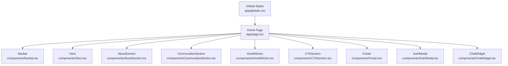
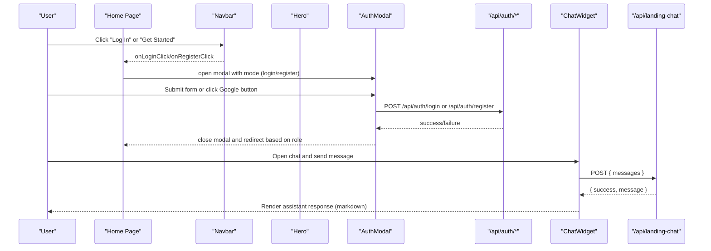
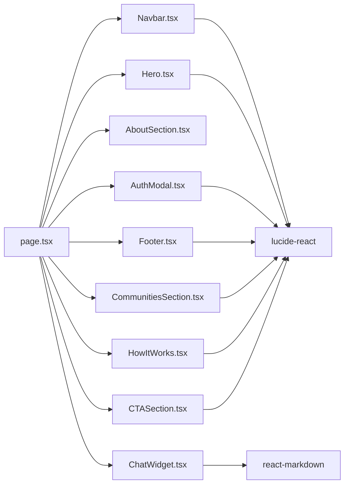

# UI Components

<cite>
**Referenced Files in This Document**
- [page.tsx](file://app/page.tsx)
- [Hero.tsx](file://app/components/Hero.tsx)
- [Navbar.tsx](file://app/components/Navbar.tsx)
- [AuthModal.tsx](file://app/components/AuthModal.tsx)
- [Footer.tsx](file://app/components/Footer.tsx)
- [ChatWidget.tsx](file://app/components/ChatWidget.tsx)
- [AboutSection.tsx](file://app/components/AboutSection.tsx)
- [CTASection.tsx](file://app/components/CTASection.tsx)
- [CommunitiesSection.tsx](file://app/components/CommunitiesSection.tsx)
- [HowItWorks.tsx](file://app/components/HowItWorks.tsx)
- [globals.css](file://app/globals.css)
- [package.json](file://package.json)
</cite>

## Table of Contents
1. Introduction
2. Project Structure
3. Core Components
4. Architecture Overview
5. Detailed Component Analysis
6. Dependency Analysis
7. Performance Considerations
8. Troubleshooting Guide
9. Conclusion
10. Appendices

## Introduction
This document provides comprehensive documentation for the PETIVA UI Component library built with React and Tailwind CSS. It covers visual appearance, behavior, user interactions, props, events, state management, customization options, responsive design guidelines, composition patterns, accessibility considerations, cross-browser compatibility, performance optimization, and integration instructions for incorporating these components into new pages while maintaining consistency across the application.

## Project Structure
The UI components are organized under app/components and composed on the landing page (app/page.tsx). The styling system uses Tailwind CSS v4 with a minimal global theme defined in app/globals.css. Dependencies include lucide-react for icons and react-markdown for rendering assistant responses in the chat widget.

**Diagram sources**
- [page.tsx:166-219](file://app/page.tsx#L166-L219)
- [globals.css:1-20](file://app/globals.css#L1-L20)

**Section sources**
- [page.tsx:1-223](file://app/page.tsx#L1-L223)
- [globals.css:1-20](file://app/globals.css#L1-L20)
- [package.json:11-22](file://package.json#L11-L22)

## Core Components
- Hero: Prominent landing banner with headline, description, and call-to-action buttons. Triggers registration flow via prop callback.
- Navbar: Sticky top navigation with logo, links, and authentication actions. Delegates login/register to parent handlers.
- AuthModal: Unified modal for sign-in/sign-up, including Google OAuth integration and form state management passed from parent.
- Footer: Multi-column footer with branding, platform/user/company links, newsletter subscription, and legal links.
- ChatWidget: Floating AI assistant panel that sends messages to /api/landing-chat and renders markdown responses.
- AboutSection, CommunitiesSection, HowItWorks, CTASection: Content sections that compose the landing experience and trigger registration flows via callbacks.

Key behaviors:
- All interactive elements use Tailwind utility classes for consistent styling and responsiveness.
- Event-driven architecture: Parent page manages auth state and passes handlers down to child components.
- Client-side interactivity is enabled with 'use client' directives where needed.

**Section sources**
- [Hero.tsx:5-61](file://app/components/Hero.tsx#L5-L61)
- [Navbar.tsx:5-49](file://app/components/Navbar.tsx#L5-L49)
- [AuthModal.tsx:7-205](file://app/components/AuthModal.tsx#L7-L205)
- [Footer.tsx:7-108](file://app/components/Footer.tsx#L7-L108)
- [ChatWidget.tsx:8-149](file://app/components/ChatWidget.tsx#L8-L149)
- [AboutSection.tsx:3-40](file://app/components/AboutSection.tsx#L3-L40)
- [CTASection.tsx:5-50](file://app/components/CTASection.tsx#L5-L50)
- [CommunitiesSection.tsx:5-183](file://app/components/CommunitiesSection.tsx#L5-L183)
- [HowItWorks.tsx:5-78](file://app/components/HowItWorks.tsx#L5-L78)

## Architecture Overview
The Home page orchestrates component composition and shared state. Authentication flows are centralized in the page and exposed to child components through props. The ChatWidget communicates with a server route for AI-powered responses.

**Diagram sources**
- [page.tsx:84-149](file://app/page.tsx#L84-L149)
- [AuthModal.tsx:55-69](file://app/components/AuthModal.tsx#L55-L69)
- [ChatWidget.tsx:21-53](file://app/components/ChatWidget.tsx#L21-L53)

## Detailed Component Analysis

### Hero
- Purpose: Introduce PETIVA with a strong headline, description, and primary CTAs.
- Props:
  - onRegisterClick: Function invoked when "Get Started Free" is clicked.
- Visuals: Gradient background, two-column layout (text left, image right), rounded image container, ambient glow shapes.
- Behavior: Button triggers registration flow; secondary link scrolls to features section.
- Responsiveness: Single column on mobile, two columns on md+.
- Accessibility: Semantic section, descriptive alt text for image, keyboard-focusable buttons.
- Customization: Update colors, typography, and imagery via Tailwind utilities; adjust gradient and spacing.

Usage example references:
- Instantiation and prop passing are handled in the Home page where Hero receives onRegisterClick.

**Section sources**
- [Hero.tsx:5-61](file://app/components/Hero.tsx#L5-L61)
- [page.tsx:170-171](file://app/page.tsx#L170-L171)

### Navbar
- Purpose: Sticky header with logo, navigation links, and authentication actions.
- Props:
  - onLoginClick: Opens login modal.
  - onRegisterClick: Opens registration modal.
- Visuals: Transparent backdrop blur header, centered logo with paw icon, desktop nav links, action buttons.
- Behavior: Logo smooth-scrolls to top; links anchor to sections; buttons open modals.
- Responsiveness: Links hidden on small screens; actions visible on all sizes.
- Accessibility: Keyboard navigable links and buttons; semantic header and nav.
- Customization: Modify link destinations, add/remove items, adjust brand colors and spacing.

Usage example references:
- Passed handlers from Home page to Navbar.

**Section sources**
- [Navbar.tsx:5-49](file://app/components/Navbar.tsx#L5-L49)
- [page.tsx:166-166](file://app/page.tsx#L166-L166)

### AuthModal
- Purpose: Unified modal for sign-in and sign-up, including Google OAuth and mock dev button.
- Props:
  - isOpen: Controls visibility.
  - onClose: Closes modal.
  - isRegistering: Toggles between login and register modes.
  - setIsRegistering: Updates mode.
  - email/password/firstName/lastName/phone/role: Form fields bound to parent state setters.
  - error/loading: Display and disable states.
  - handleSubmit: Handles form submission (login/register).
  - handleGoogleCallback: Processes Google OAuth credential.
- Visuals: Centered modal with backdrop blur, form inputs, divider, Google button area, toggle link between login/register.
- Behavior: Renders Google button when modal opens; handles form submit; shows errors; disables submit during loading.
- Responsiveness: Full-width on mobile, constrained max-width on larger screens.
- Accessibility: Close button, labeled inputs, focus styles, screen-reader-friendly status updates.
- Customization: Theme variants via Tailwind dark mode classes; modify form fields and validation messages.

Integration notes:
- Parent page manages all form state and API calls; modal remains presentational.

**Section sources**
- [AuthModal.tsx:7-205](file://app/components/AuthModal.tsx#L7-L205)
- [page.tsx:194-216](file://app/page.tsx#L194-L216)

### Footer
- Purpose: Branding, site links, newsletter subscription, and legal information.
- State: Local email input and subscribed flag for feedback.
- Visuals: Dark background, multi-column grid, social links, newsletter form, copyright bar.
- Behavior: Prevents default form submission; clears input and shows confirmation on subscribe.
- Responsiveness: Single column on mobile, multi-column grid on md+.
- Accessibility: Semantic footer, accessible form controls, clear labels and placeholders.
- Customization: Update links, social URLs, and branding copy.

**Section sources**
- [Footer.tsx:7-108](file://app/components/Footer.tsx#L7-L108)

### ChatWidget
- Purpose: Floating AI assistant panel for platform help and feature questions.
- State: Open/close, messages array, input text, loading indicator, scroll ref.
- Visuals: Fixed bottom-right FAB; slide-in panel with header, message list, and input form.
- Behavior: Sends chat history to /api/landing-chat; renders assistant responses using react-markdown; auto-scrolls to latest message; supports Enter to send.
- Responsiveness: Wider panel on sm+; fixed positioning ensures usability across devices.
- Accessibility: Title attribute on FAB; keyboard support for textarea and submit; aria-like semantics via native elements.
- Customization: Adjust panel size, colors, and markdown rendering via component props or internal overrides.

API interaction:
- POST to /api/landing-chat with messages payload; displays error fallbacks on failure.

**Section sources**
- [ChatWidget.tsx:8-149](file://app/components/ChatWidget.tsx#L8-L149)

### AboutSection
- Purpose: Brand story and value proposition with image and call-to-action.
- Visuals: Two-column layout with image and text; accent color tag; CTA button.
- Responsiveness: Stacks vertically on smaller screens.
- Accessibility: Descriptive alt text and semantic headings.

**Section sources**
- [AboutSection.tsx:3-40](file://app/components/AboutSection.tsx#L3-L40)

### CommunitiesSection
- Purpose: Showcase three communities (Pet Owners, Veterinarians, Clinics) with feature lists and images.
- Props:
  - onOwnerClick, onVetClick, onClinicClick: Trigger registration flows.
- Visuals: Card grid with colored accents per community; images and feature checklists.
- Behavior: Buttons open registration modal via parent handlers.
- Responsiveness: Single column on mobile, three columns on lg+.
- Accessibility: Clear headings, list items, and actionable buttons.

**Section sources**
- [CommunitiesSection.tsx:5-183](file://app/components/CommunitiesSection.tsx#L5-L183)
- [page.tsx:177-181](file://app/page.tsx#L177-L181)

### HowItWorks
- Purpose: Step-by-step guide illustrating the user journey.
- Visuals: Four steps with icons and connecting line on desktop; concise descriptions.
- Responsiveness: Vertical stack on mobile; horizontal flow on md+.
- Accessibility: Numbered steps with clear headings and descriptions.

**Section sources**
- [HowItWorks.tsx:5-78](file://app/components/HowItWorks.tsx#L5-L78)

### CTASection
- Purpose: Final call-to-action before footer to encourage sign-ups.
- Props:
  - onRegisterClick: Opens registration modal.
- Visuals: Gradient card with circular image, headline, subtext, and prominent CTA.
- Behavior: Button triggers registration flow.
- Responsiveness: Three-column layout on md+, stacked on mobile.
- Accessibility: Clear heading hierarchy and button labeling.

**Section sources**
- [CTASection.tsx:5-50](file://app/components/CTASection.tsx#L5-L50)
- [page.tsx:187-187](file://app/page.tsx#L187-L187)

## Dependency Analysis
Components rely on:
- Tailwind CSS v4 for styling and responsive utilities.
- lucide-react for icons used throughout components.
- react-markdown for rendering assistant messages in ChatWidget.
- Next.js routing and server routes for authentication and chat endpoints.

**Diagram sources**
- [page.tsx:6-14](file://app/page.tsx#L6-L14)
- [package.json:11-22](file://package.json#L11-L22)

**Section sources**
- [package.json:11-22](file://package.json#L11-L22)
- [page.tsx:6-14](file://app/page.tsx#L6-L14)

## Performance Considerations
- Client-only components: Use 'use client' only where necessary to minimize server bundle overhead.
- Image optimization: External images are loaded directly; consider optimizing or hosting within the project for better caching and compression.
- Lazy rendering: Modals and floating panels render conditionally to avoid unnecessary DOM work.
- Network requests: Debounce or throttle repeated requests if expanding chat functionality; ensure proper error handling to prevent excessive retries.
- Markdown rendering: react-markdown is lightweight; keep response content concise to reduce reflows.
- Styling: Prefer Tailwind utilities for predictable performance and reduced custom CSS.

[No sources needed since this section provides general guidance]

## Troubleshooting Guide
Common issues and resolutions:
- Google Sign-In not rendering: Ensure the Google SDK script loads and the modal is open before rendering the button; verify clientId configuration from /api/auth/google/config.
- Authentication failures: Check network connectivity and server responses; inspect error messages set by parent handlers.
- ChatWidget connection errors: Validate /api/landing-chat availability; display user-friendly fallback messages.
- Modal state inconsistencies: Ensure parent state is correctly passed and updated; reset error and loading flags appropriately.

**Section sources**
- [AuthModal.tsx:55-69](file://app/components/AuthModal.tsx#L55-L69)
- [page.tsx:35-82](file://app/page.tsx#L35-L82)
- [page.tsx:84-149](file://app/page.tsx#L84-L149)
- [ChatWidget.tsx:21-53](file://app/components/ChatWidget.tsx#L21-L53)

## Conclusion
The PETIVA UI Component library offers a cohesive, responsive, and accessible set of reusable components built with React and Tailwind CSS. Centralized state management in the Home page ensures consistent behavior across authentication and registration flows. The modular design enables easy composition and customization while maintaining a unified visual language. Following the guidelines in this document will help integrate these components effectively into new pages and maintain consistency across the application.

[No sources needed since this section summarizes without analyzing specific files]

## Appendices

### Responsive Design Guidelines
- Use Tailwind breakpoints (sm, md, lg) to adapt layouts: single-column stacks on mobile, multi-column grids on larger screens.
- Ensure touch targets are adequately sized and spaced for mobile users.
- Test components across viewport sizes to confirm readability and usability.

[No sources needed since this section provides general guidance]

### Style Customization and Theme Support
- Global theme variables are defined in globals.css; extend or override as needed.
- Tailwind utilities provide extensive customization for colors, spacing, typography, and shadows.
- Dark mode classes are used in some components; ensure consistent theme application across your app.

**Section sources**
- [globals.css:1-20](file://app/globals.css#L1-L20)

### Accessibility Compliance
- Provide descriptive alt text for images.
- Use semantic HTML elements (header, nav, main, footer, section).
- Ensure keyboard navigation works for all interactive elements.
- Maintain sufficient color contrast and focus indicators.

**Section sources**
- [Hero.tsx:47-51](file://app/components/Hero.tsx#L47-L51)
- [Navbar.tsx:12-45](file://app/components/Navbar.tsx#L12-L45)
- [AuthModal.tsx:73-202](file://app/components/AuthModal.tsx#L73-L202)
- [Footer.tsx:19-105](file://app/components/Footer.tsx#L19-L105)
- [ChatWidget.tsx:56-145](file://app/components/ChatWidget.tsx#L56-L145)

### Cross-Browser Compatibility
- Tailwind CSS v4 and modern React features are supported in current browsers; test on Chrome, Firefox, Safari, and Edge.
- Google Identity Services requires compatible environments; fallbacks should be considered for unsupported contexts.

[No sources needed since this section provides general guidance]

### Integration Guidelines
- Import components in your page file and pass required props/handlers.
- Manage shared state (auth, modal visibility) at the page level and delegate to components via props.
- Ensure server routes exist for authentication and chat endpoints.
- Follow consistent naming and structure conventions to maintain clarity and scalability.

**Section sources**
- [page.tsx:163-219](file://app/page.tsx#L163-L219)