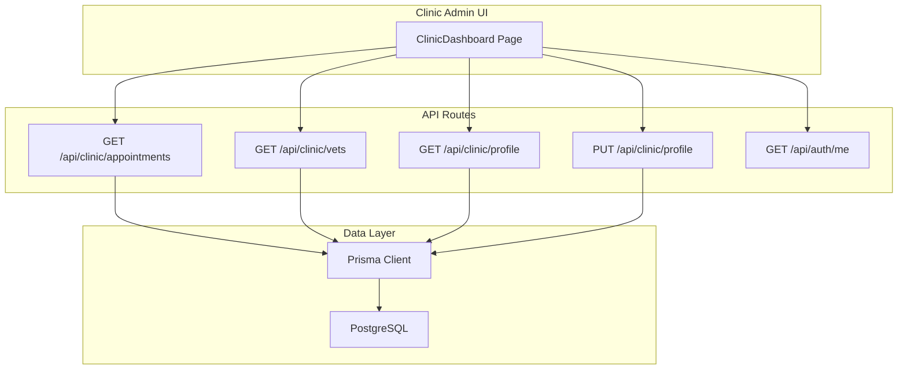
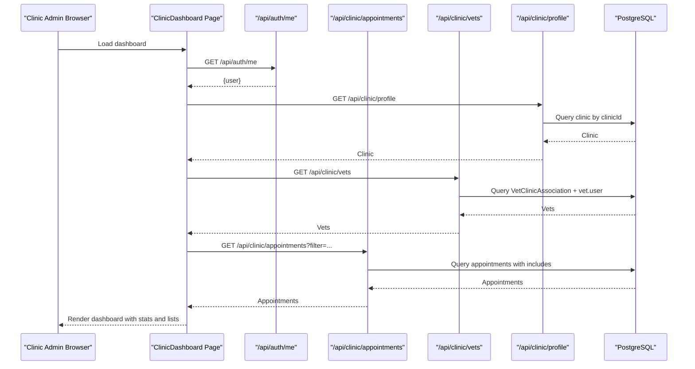
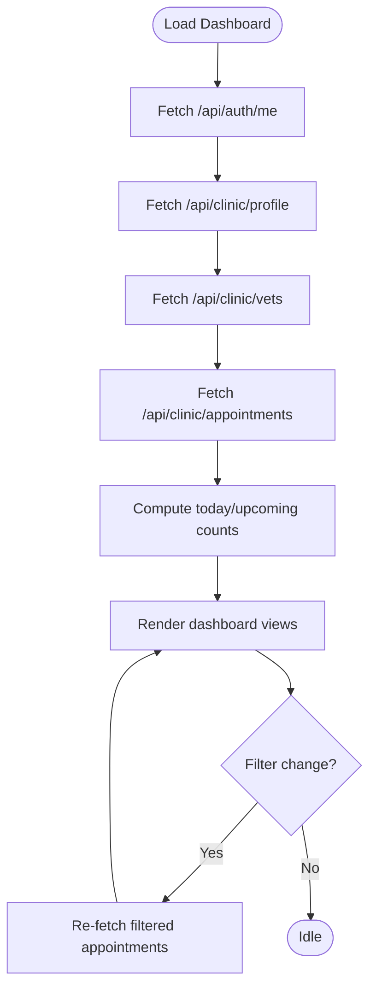
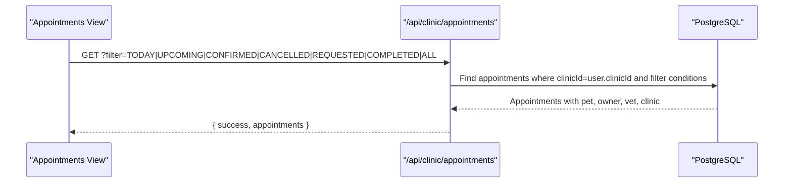
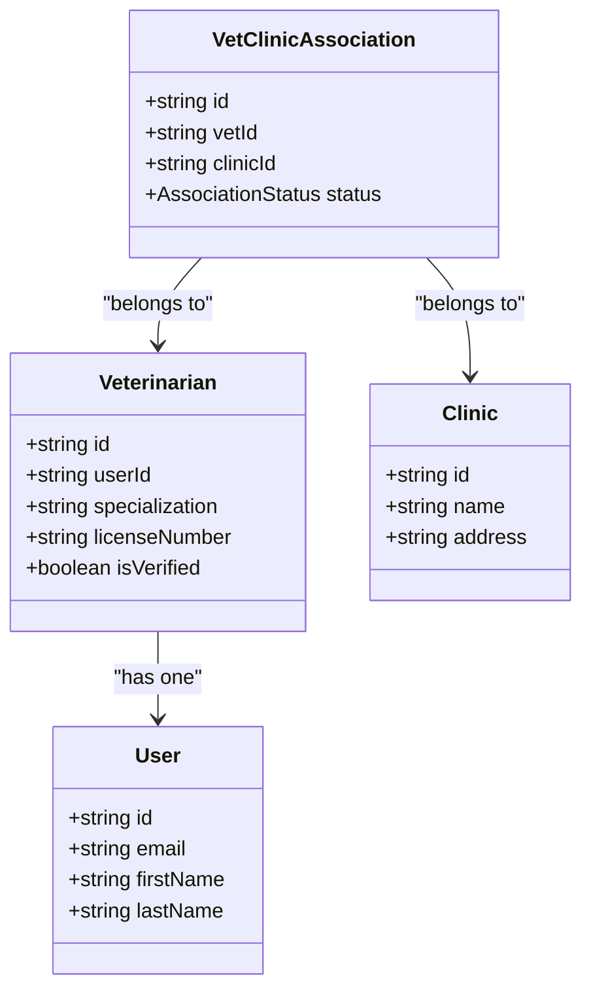
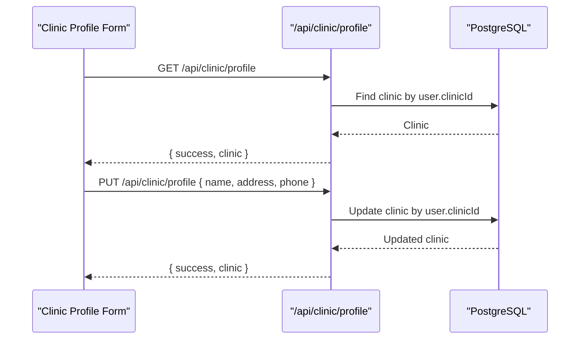
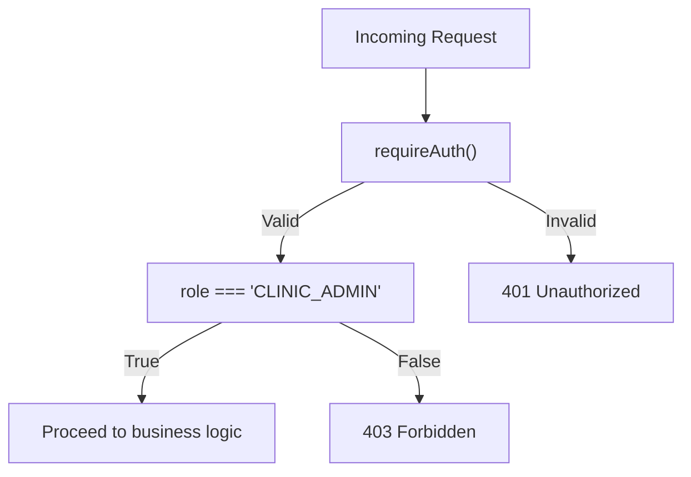
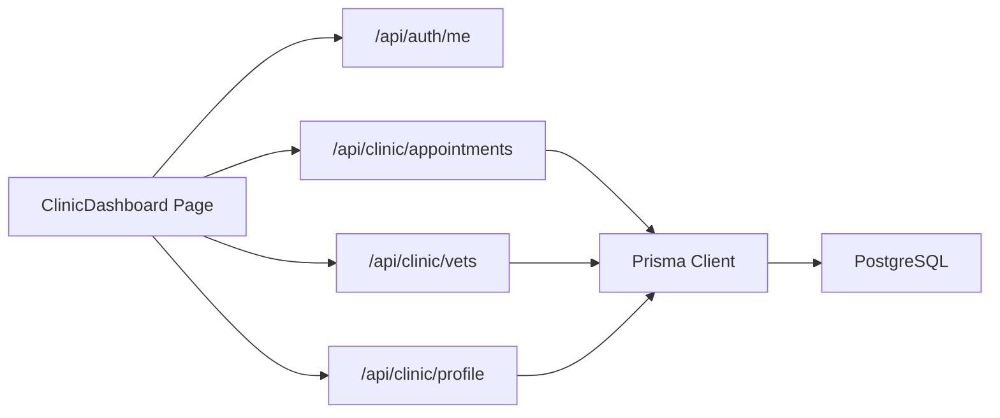

# Clinic Administration Dashboard

<cite>
**Referenced Files in This Document**
- [page.tsx](file://app/clinic/dashboard/page.tsx)
- [route.ts](file://app/api/clinic/appointments/route.ts)
- [route.ts](file://app/api/clinic/vets/route.ts)
- [route.ts](file://app/api/clinic/profile/route.ts)
- [schema.prisma](file://prisma/schema.prisma)
- [auth.ts](file://lib/auth.ts)
- [db.ts](file://lib/db.ts)
- [route.ts](file://app/api/auth/me/route.ts)
- [system-architecture.md](file://docs/03-architecture/01-system-architecture.md)
- [security.md](file://docs/03-architecture/06-security.md)
- [route.ts](file://app/api/clinics/route.ts)
- [route.ts](file://app/api/clinics/[clinicId]/route.ts)
</cite>

## Table of Contents
1. [Introduction](#introduction)
2. [Project Structure](#project-structure)
3. [Core Components](#core-components)
4. [Architecture Overview](#architecture-overview)
5. [Detailed Component Analysis](#detailed-component-analysis)
6. [Dependency Analysis](#dependency-analysis)
7. [Performance Considerations](#performance-considerations)
8. [Troubleshooting Guide](#troubleshooting-guide)
9. [Conclusion](#conclusion)
10. [Appendices](#appendices)

## Introduction
This document describes the Clinic Administration Dashboard for PETIVA, focusing on how clinic administrators manage operations such as staff (veterinarian) associations, appointment oversight, and clinic profile configuration. It also outlines analytics and reporting capabilities present in the current implementation, including appointment volume metrics and operational visibility. The dashboard supports responsive design to enable management from various devices.

## Project Structure
The clinic administration feature is implemented using Next.js App Router:
- Client-side dashboard UI under app/clinic/dashboard/page.tsx
- Server-side API routes under app/api/clinic/* for appointments, vets, and profile
- Data models defined in Prisma schema
- Authentication and session handling via lib/auth.ts
- Database connection via lib/db.ts

**Diagram sources**
- [page.tsx:38-82](file://app/clinic/dashboard/page.tsx#L38-L82)
- [route.ts:5-84](file://app/api/clinic/appointments/route.ts#L5-L84)
- [route.ts:5-51](file://app/api/clinic/vets/route.ts#L5-L51)
- [route.ts:5-34](file://app/api/clinic/profile/route.ts#L5-L34)
- [route.ts:49-81](file://app/api/clinic/profile/route.ts#L49-L81)
- [route.ts:4-23](file://app/api/auth/me/route.ts#L4-L23)
- [db.ts:1-33](file://lib/db.ts#L1-L33)

**Section sources**
- [page.tsx:1-592](file://app/clinic/dashboard/page.tsx#L1-L592)
- [schema.prisma:1-312](file://prisma/schema.prisma#L1-L312)

## Core Components
- Clinic Dashboard UI: Displays today’s appointments, upcoming counts, associated veterinarians, and clinic profile editing. Supports filtering by status and viewing detailed appointment information.
- Appointments API: Retrieves clinic-bound appointments with filters (ALL, TODAY, UPCOMING, COMPLETED, CANCELLED, REQUESTED, CONFIRMED), including pet, owner, vet, and clinic details.
- Veterinarians API: Lists veterinarians associated with the authenticated admin’s clinic, including specialization, license, verification status, and association status.
- Clinic Profile API: Reads and updates clinic name, address, and phone number for the admin’s clinic.
- Authentication: Enforces role-based access control requiring CLINIC_ADMIN role and a valid session.

Key responsibilities:
- Appointment monitoring and filtering
- Vet association overview
- Clinic profile management
- Secure data access based on user role and clinic context

**Section sources**
- [page.tsx:11-35](file://app/clinic/dashboard/page.tsx#L11-L35)
- [route.ts:5-84](file://app/api/clinic/appointments/route.ts#L5-L84)
- [route.ts:5-51](file://app/api/clinic/vets/route.ts#L5-L51)
- [route.ts:5-34](file://app/api/clinic/profile/route.ts#L5-L34)
- [route.ts:49-81](file://app/api/clinic/profile/route.ts#L49-L81)
- [auth.ts:109-124](file://lib/auth.ts#L109-L124)

## Architecture Overview
The clinic dashboard follows a layered architecture:
- Presentation layer: React client components render the dashboard and handle user interactions.
- API layer: Next.js route handlers enforce authentication and authorization, query the database via Prisma, and return JSON responses.
- Data layer: PostgreSQL stores users, clinics, veterinarians, appointments, and audit logs.

Security boundaries:
- Session-based authentication with HTTP-only cookies
- Role-based access control ensuring only CLINIC_ADMIN can access clinic endpoints
- Consent-based access model documented for broader platform security

**Diagram sources**
- [page.tsx:38-82](file://app/clinic/dashboard/page.tsx#L38-L82)
- [route.ts:5-84](file://app/api/clinic/appointments/route.ts#L5-L84)
- [route.ts:5-51](file://app/api/clinic/vets/route.ts#L5-L51)
- [route.ts:5-34](file://app/api/clinic/profile/route.ts#L5-L34)
- [route.ts:4-23](file://app/api/auth/me/route.ts#L4-L23)

## Detailed Component Analysis

### Clinic Dashboard UI
- Loads admin profile, clinic info, associated vets, and appointments on mount
- Provides navigation tabs: Dashboard, Appointments, Veterinarians, Clinic Profile
- Displays key metrics: Today’s appointments count, Upcoming appointments count, Number of associated vets, Clinic location
- Filters appointments by status and shows detailed modal for selected appointment
- Allows editing clinic profile fields (name, address, phone)

**Diagram sources**
- [page.tsx:38-82](file://app/clinic/dashboard/page.tsx#L38-L82)
- [page.tsx:84-99](file://app/clinic/dashboard/page.tsx#L84-L99)
- [page.tsx:151-155](file://app/clinic/dashboard/page.tsx#L151-L155)

**Section sources**
- [page.tsx:38-155](file://app/clinic/dashboard/page.tsx#L38-L155)
- [page.tsx:254-402](file://app/clinic/dashboard/page.tsx#L254-L402)
- [page.tsx:404-453](file://app/clinic/dashboard/page.tsx#L404-L453)
- [page.tsx:456-473](file://app/clinic/dashboard/page.tsx#L456-L473)
- [page.tsx:475-544](file://app/clinic/dashboard/page.tsx#L475-L544)
- [page.tsx:547-587](file://app/clinic/dashboard/page.tsx#L547-L587)

### Appointments Management
- Filtering supports ALL, TODAY, UPCOMING, COMPLETED, CANCELLED, REQUESTED, CONFIRMED
- Includes pet, owner, vet, and clinic details in response
- Orders by date ascending

**Diagram sources**
- [route.ts:5-84](file://app/api/clinic/appointments/route.ts#L5-L84)

**Section sources**
- [route.ts:5-84](file://app/api/clinic/appointments/route.ts#L5-L84)

### Veterinarian Associations
- Lists vets associated with the admin’s clinic
- Returns vet details including specialization, licenseNumber, isVerified, and association status
- Uses VetClinicAssociation to link vets to clinics

**Diagram sources**
- [schema.prisma:90-131](file://prisma/schema.prisma#L90-L131)

**Section sources**
- [route.ts:5-51](file://app/api/clinic/vets/route.ts#L5-L51)
- [schema.prisma:90-131](file://prisma/schema.prisma#L90-L131)

### Clinic Profile Management
- GET returns clinic details for the authenticated admin’s clinic
- PUT updates clinic name, address, and phone with validation
- Requires CLINIC_ADMIN role and associated clinicId

**Diagram sources**
- [route.ts:5-34](file://app/api/clinic/profile/route.ts#L5-L34)
- [route.ts:49-81](file://app/api/clinic/profile/route.ts#L49-L81)

**Section sources**
- [route.ts:5-34](file://app/api/clinic/profile/route.ts#L5-L34)
- [route.ts:49-81](file://app/api/clinic/profile/route.ts#L49-L81)

### Authentication and Authorization
- All clinic endpoints require an authenticated session and CLINIC_ADMIN role
- Sessions are stored server-side with hashed tokens and expiration handling
- Current user endpoint exposes minimal user info for UI personalization

**Diagram sources**
- [auth.ts:109-124](file://lib/auth.ts#L109-L124)
- [route.ts:5-21](file://app/api/clinic/appointments/route.ts#L5-L21)
- [route.ts:5-21](file://app/api/clinic/vets/route.ts#L5-L21)
- [route.ts:5-21](file://app/api/clinic/profile/route.ts#L5-L21)

**Section sources**
- [auth.ts:1-125](file://lib/auth.ts#L1-L125)
- [route.ts:4-23](file://app/api/auth/me/route.ts#L4-L23)

## Dependency Analysis
- Clinic dashboard depends on:
  - /api/auth/me for user context
  - /api/clinic/profile for clinic settings
  - /api/clinic/vets for staff list
  - /api/clinic/appointments for scheduling data
- APIs depend on:
  - Prisma ORM for data access
  - PostgreSQL for persistence
  - Authentication utilities for session validation and role checks

**Diagram sources**
- [page.tsx:38-82](file://app/clinic/dashboard/page.tsx#L38-L82)
- [route.ts:5-84](file://app/api/clinic/appointments/route.ts#L5-L84)
- [route.ts:5-51](file://app/api/clinic/vets/route.ts#L5-L51)
- [route.ts:5-34](file://app/api/clinic/profile/route.ts#L5-L34)
- [db.ts:1-33](file://lib/db.ts#L1-L33)

**Section sources**
- [page.tsx:38-82](file://app/clinic/dashboard/page.tsx#L38-L82)
- [route.ts:5-84](file://app/api/clinic/appointments/route.ts#L5-L84)
- [route.ts:5-51](file://app/api/clinic/vets/route.ts#L5-L51)
- [route.ts:5-34](file://app/api/clinic/profile/route.ts#L5-L34)
- [db.ts:1-33](file://lib/db.ts#L1-L33)

## Performance Considerations
- Efficient queries:
  - Use targeted includes to fetch related entities (pet, owner, vet, clinic) only when needed
  - Order results by dateTime to optimize display rendering
- Filtering at the API level reduces unnecessary client-side processing
- Session sliding window expiration minimizes re-authentication overhead while maintaining security
- Connection pooling in production ensures scalable database access

[No sources needed since this section provides general guidance]

## Troubleshooting Guide
Common issues and resolutions:
- Unauthenticated access: Ensure a valid session cookie exists; check /api/auth/me for user context
- Forbidden access: Verify user role is CLINIC_ADMIN and that the user has an associated clinicId
- Not found clinic: Confirm the admin’s clinicId maps to an existing clinic record
- Validation errors: When updating clinic profile, ensure name and address are provided

Error handling patterns:
- API routes return structured error objects with codes like UNAUTHORIZED, FORBIDDEN, BAD_REQUEST, NOT_FOUND, INTERNAL_SERVER_ERROR
- UI displays error and success messages to guide administrators

**Section sources**
- [route.ts:5-21](file://app/api/clinic/appointments/route.ts#L5-L21)
- [route.ts:5-21](file://app/api/clinic/vets/route.ts#L5-L21)
- [route.ts:5-21](file://app/api/clinic/profile/route.ts#L5-L21)
- [route.ts:49-81](file://app/api/clinic/profile/route.ts#L49-L81)
- [route.ts:4-23](file://app/api/auth/me/route.ts#L4-L23)

## Conclusion
The Clinic Administration Dashboard provides essential tools for managing clinic operations, including appointment oversight, veterinarian associations, and clinic profile configuration. It enforces secure access through role-based controls and offers a responsive interface suitable for various devices. While advanced analytics, financial reporting, insurance claims, and external integrations are not fully implemented in the current codebase, the foundation supports future expansion into these areas.

[No sources needed since this section summarizes without analyzing specific files]

## Appendices

### Security Controls and Compliance
- Authentication uses HTTP-only, secure cookies with session expiry and sliding window renewal
- Authorization enforces RBAC and consent-based access principles
- Audit logging is modeled for tracking sensitive operations and changes

**Section sources**
- [security.md:1-90](file://docs/03-architecture/06-security.md#L1-L90)
- [schema.prisma:298-311](file://prisma/schema.prisma#L298-L311)

### System Architecture Notes
- Unified Next.js App Router serves both frontend and backend layers
- Data flows through Prisma ORM to PostgreSQL
- External integrations (OSS, AI services) are bounded and secured

**Section sources**
- [system-architecture.md:1-151](file://docs/03-architecture/01-system-architecture.md#L1-L151)

### Additional Clinic APIs
- Listing clinics and fetching/editing clinic details support discovery and administrative tasks

**Section sources**
- [route.ts:5-49](file://app/api/clinics/route.ts#L5-L49)
- [route.ts:5-84](file://app/api/clinics/[clinicId]/route.ts#L5-L84)