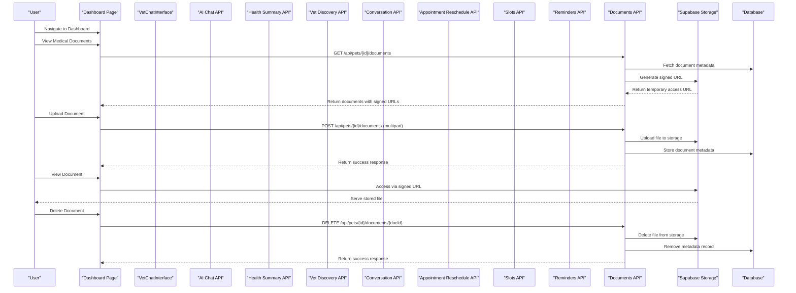
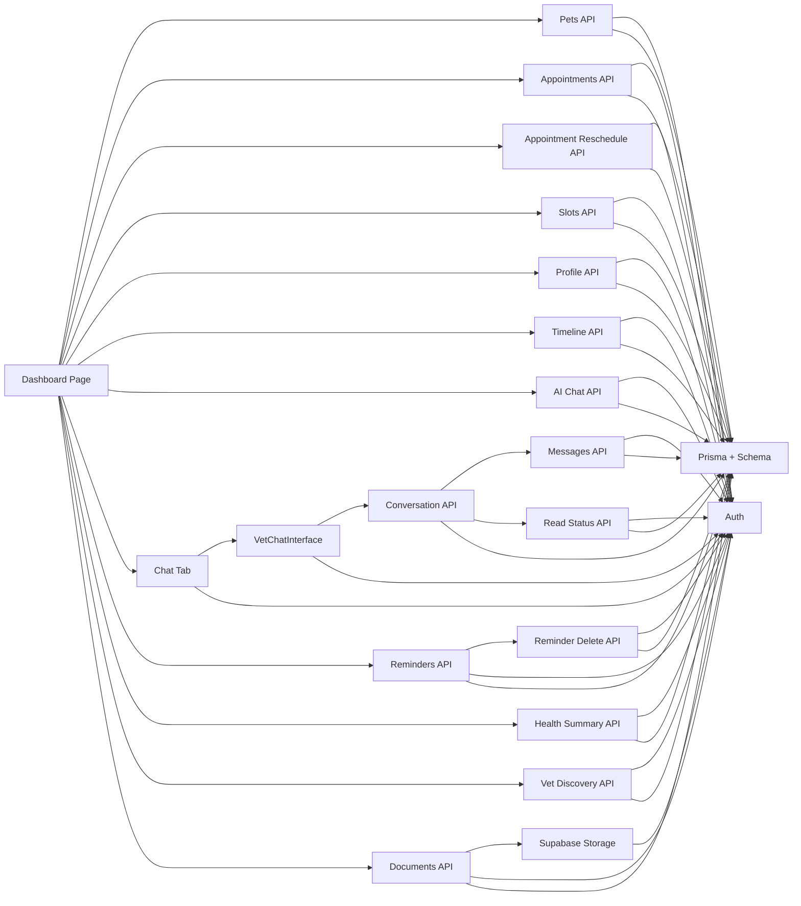

# Pet Owner Dashboard

<cite>
**Referenced Files in This Document**
- [app/dashboard/page.tsx](file://app/dashboard/page.tsx)
- [app/api/pets/[petId]/documents/route.ts](file://app/api/pets/[petId]/documents/route.ts)
- [app/api/pets/[petId]/documents/[documentId]/route.ts](file://app/api/pets/[petId]/documents/[documentId]/route.ts)
- [lib/storage.ts](file://lib/storage.ts)
- [app/api/pets/[petId]/health-summary/route.ts](file://app/api/pets/[petId]/health-summary/route.ts)
- [app/api/vet/discovery/route.ts](file://app/api/vet/discovery/route.ts)
- [app/api/appointments/[appointmentId]/slots/route.ts](file://app/api/appointments/[appointmentId]/slots/route.ts)
- [app/api/appointments/[appointmentId]/route.ts](file://app/api/appointments/[appointmentId]/route.ts)
- [app/components/ChatWidget.tsx](file://app/components/ChatWidget.tsx)
- [app/components/VetChatInterface.tsx](file://app/components/VetChatInterface.tsx)
- [app/api/pets/route.ts](file://app/api/pets/route.ts)
- [app/api/appointments/route.ts](file://app/api/appointments/route.ts)
- [app/api/profile/route.ts](file://app/api/profile/route.ts)
- [app/api/ai/chat/route.ts](file://app/api/ai/chat/route.ts)
- [app/api/pets/[petId]/timeline/route.ts](file://app/api/pets/[petId]/timeline/route.ts)
- [app/api/appointments/[appointmentId]/conversation/route.ts](file://app/api/appointments/[appointmentId]/conversation/route.ts)
- [app/api/conversations/route.ts](file://app/api/conversations/route.ts)
- [app/api/conversations/[conversationId]/messages/route.ts](file://app/api/conversations/[conversationId]/messages/route.ts)
- [app/api/conversations/[conversationId]/read/route.ts](file://app/api/conversations/[conversationId]/read/route.ts)
- [app/api/reminders/route.ts](file://app/api/reminders/route.ts)
- [app/api/reminders/[reminderId]/route.ts](file://app/api/reminders/[reminderId]/route.ts)
- [lib/auth.ts](file://lib/auth.ts)
- [prisma/schema.prisma](file://prisma/schema.prisma)
- [app/layout.tsx](file://app/layout.tsx)
- [app/globals.css](file://app/globals.css)
</cite>

## Update Summary
**Changes Made**
- Added comprehensive medical document management capabilities including upload interface, document listing, signed URL viewing, and delete functionality
- Integrated Supabase Storage for secure file storage with signed URL generation for temporary access
- Implemented owner-only document operations with proper authentication and authorization checks
- Enhanced dashboard with new Medical Documents section featuring file type badges, uploader information, and action buttons
- Added robust error handling for storage configuration issues and file validation
- Updated data flow to include document loading on pet selection and initial dashboard load

## Table of Contents
1. Introduction
2. Project Structure
3. Core Components
4. Architecture Overview
5. Detailed Component Analysis
6. Dependency Analysis
7. Performance Considerations
8. Troubleshooting Guide
9. Conclusion

## Introduction
This document explains the Pet Owner Dashboard in PETIVA, focusing on the main dashboard interface, pet portfolio management, appointment booking and rescheduling workflow, integrated AI health assistant chat, profile management, responsive design patterns, data fetching strategies, state management, and error handling. It is designed for both technical and non-technical readers to understand how the dashboard works end-to-end.

**Updated** The dashboard now features enhanced medical document management capabilities allowing pet owners to upload, view, and manage their pets' medical records including prescriptions, lab reports, vaccination certificates, and diagnostic images. The system provides secure cloud storage with time-limited signed URLs for document viewing, comprehensive file validation, and owner-only access controls. Combined with existing health reminders, vaccination and medication tracking systems, AI Health Summary section, and Veterinarian Discovery tab, the platform now offers a complete healthcare management solution.

## Project Structure
The dashboard is implemented as a Next.js client component with server-side API routes for data operations. The root layout sets global styles and metadata. Tailwind CSS provides responsive utilities across devices.

```mermaid
graph TB
subgraph "Client"
D["Dashboard Page<br/>app/dashboard/page.tsx"]
W["Chat Widget<br/>app/components/ChatWidget.tsx"]
VC["Vet Chat Interface<br/>app/components/VetChatInterface.tsx"]
end
subgraph "API Routes"
PETS["Pets API<br/>app/api/pets/route.ts"]
APPTS["Appointments API<br/>app/api/appointments/route.ts"]
APPT_UPDATE["Appointment Update API<br/>app/api/appointments/[appointmentId]/route.ts"]
APPT_SLOTS["Appointment Slots API<br/>app/api/appointments/[appointmentId]/slots/route.ts"]
PROFILE["Profile API<br/>app/api/profile/route.ts"]
TIMELINE["Pet Timeline API<br/>app/api/pets/[petId]/timeline/route.ts"]
AICHAT["AI Chat API<br/>app/api/ai/chat/route.ts"]
CONV["Conversation API<br/>app/api/conversations/route.ts"]
APPT_CONV["Appointment Conversation API<br/>app/api/appointments/[appointmentId]/conversation/route.ts"]
MSG_API["Messages API<br/>app/api/conversations/[conversationId]/messages/route.ts"]
READ_API["Read Status API<br/>app/api/conversations/[conversationId]/read/route.ts"]
REMINDERS["Reminders API<br/>app/api/reminders/route.ts"]
REMINDER_DELETE["Reminder Delete API<br/>app/api/reminders/[reminderId]/route.ts"]
HEALTH_SUMMARY["Health Summary API<br/>app/api/pets/[petId]/health-summary/route.ts"]
VET_DISCOVERY["Vet Discovery API<br/>app/api/vet/discovery/route.ts"]
DOCS_LIST["Documents List API<br/>app/api/pets/[petId]/documents/route.ts"]
DOCS_UPLOAD["Documents Upload API<br/>app/api/pets/[petId]/documents/route.ts"]
DOCS_DELETE["Document Delete API<br/>app/api/pets/[petId]/documents/[documentId]/route.ts"]
end
subgraph "Storage & Auth"
STORAGE["Supabase Storage<br/>lib/storage.ts"]
AUTH["Auth Utilities<br/>lib/auth.ts"]
SCHEMA["Database Schema<br/>prisma/schema.prisma"]
end
D --> PETS
D --> APPTS
D --> APPT_UPDATE
D --> APPT_SLOTS
D --> PROFILE
D --> TIMELINE
D --> AICHAT
D --> CONV
D --> APPT_CONV
D --> MSG_API
D --> READ_API
D --> REMINDERS
D --> REMINDER_DELETE
D --> HEALTH_SUMMARY
D --> VET_DISCOVERY
D --> DOCS_LIST
D --> DOCS_UPLOAD
D --> DOCS_DELETE
W --> AICHAT
VC --> MSG_API
VC --> READ_API
DOCS_LIST --> STORAGE
DOCS_UPLOAD --> STORAGE
DOCS_DELETE --> STORAGE
PETS --> AUTH
APPTS --> AUTH
APPT_UPDATE --> AUTH
APPT_SLOTS --> AUTH
PROFILE --> AUTH
TIMELINE --> AUTH
AICHAT --> AUTH
CONV --> AUTH
APPT_CONV --> AUTH
MSG_API --> AUTH
READ_API --> AUTH
REMINDERS --> AUTH
REMINDER_DELETE --> AUTH
HEALTH_SUMMARY --> AUTH
VET_DISCOVERY --> AUTH
DOCS_LIST --> AUTH
DOCS_UPLOAD --> AUTH
DOCS_DELETE --> AUTH
PETS --> SCHEMA
APPTS --> SCHEMA
APPT_UPDATE --> SCHEMA
APPT_SLOTS --> SCHEMA
PROFILE --> SCHEMA
TIMELINE --> SCHEMA
AICHAT --> SCHEMA
CONV --> SCHEMA
APPT_CONV --> SCHEMA
MSG_API --> SCHEMA
READ_API --> SCHEMA
REMINDERS --> SCHEMA
REMINDER_DELETE --> SCHEMA
HEALTH_SUMMARY --> SCHEMA
VET_DISCOVERY --> SCHEMA
DOCS_LIST --> SCHEMA
DOCS_UPLOAD --> SCHEMA
DOCS_DELETE --> SCHEMA
```

**Diagram sources**
- [app/dashboard/page.tsx:1-2487](file://app/dashboard/page.tsx#L1-L2487)
- [app/components/ChatWidget.tsx:1-149](file://app/components/ChatWidget.tsx#L1-L149)
- [app/components/VetChatInterface.tsx:1-222](file://app/components/VetChatInterface.tsx#L1-L222)
- [app/api/pets/route.ts:1-69](file://app/api/pets/route.ts#L1-L69)
- [app/api/appointments/route.ts:1-143](file://app/api/appointments/route.ts#L1-L143)
- [app/api/appointments/[appointmentId]/route.ts:1-242](file://app/api/appointments/[appointmentId]/route.ts#L1-L242)
- [app/api/appointments/[appointmentId]/slots/route.ts:1-117](file://app/api/appointments/[appointmentId]/slots/route.ts#L1-L117)
- [app/api/profile/route.ts:1-82](file://app/api/profile/route.ts#L1-L82)
- [app/api/pets/[petId]/timeline/route.ts:1-149](file://app/api/pets/[petId]/timeline/route.ts#L1-L149)
- [app/api/ai/chat/route.ts:1-120](file://app/api/ai/chat/route.ts#L1-L120)
- [app/api/appointments/[appointmentId]/conversation/route.ts:1-65](file://app/api/appointments/[appointmentId]/conversation/route.ts#L1-L65)
- [app/api/conversations/route.ts:1-90](file://app/api/conversations/route.ts#L1-L90)
- [app/api/conversations/[conversationId]/messages/route.ts:1-104](file://app/api/conversations/[conversationId]/messages/route.ts#L1-L104)
- [app/api/conversations/[conversationId]/read/route.ts:1-49](file://app/api/conversations/[conversationId]/read/route.ts#L1-L49)
- [app/api/reminders/route.ts:1-30](file://app/api/reminders/route.ts#L1-L30)
- [app/api/reminders/[reminderId]/route.ts:1-46](file://app/api/reminders/[reminderId]/route.ts#L1-L46)
- [app/api/pets/[petId]/health-summary/route.ts:1-206](file://app/api/pets/[petId]/health-summary/route.ts#L1-L206)
- [app/api/vet/discovery/route.ts:1-206](file://app/api/vet/discovery/route.ts#L1-L206)
- [app/api/pets/[petId]/documents/route.ts:1-223](file://app/api/pets/[petId]/documents/route.ts#L1-L223)
- [app/api/pets/[petId]/documents/[documentId]/route.ts:1-67](file://app/api/pets/[petId]/documents/[documentId]/route.ts#L1-L67)
- [lib/storage.ts:1-125](file://lib/storage.ts#L1-L125)
- [lib/auth.ts:1-125](file://lib/auth.ts#L1-L125)
- [prisma/schema.prisma:1-312](file://prisma/schema.prisma#L1-L312)

**Section sources**
- [app/layout.tsx:1-16](file://app/layout.tsx#L1-L16)
- [app/globals.css:1-20](file://app/globals.css#L1-L20)

## Core Components
- Dashboard page: Central UI for health overview, upcoming appointments, pet profiles, quick actions, and navigation between tabs (dashboard, pets, appointments, discover, AI assistant, chat, profile).
- Chat widget: Floating assistant for general platform help; separate from the pet-specific AI assistant in the dashboard.
- VetChatInterface: Dedicated component for real-time conversation between pet owners and veterinarians with message polling and read status tracking.
- API routes: Secure endpoints for pets, appointments, profile updates, pet timeline aggregation, AI chat with streaming responses, comprehensive conversation management, health reminders, AI health summaries, veterinarian discovery, and medical document management.
- Storage layer: Supabase Storage integration for secure file storage with signed URL generation and bucket management.
- Auth middleware: Ensures all requests are authenticated and enforces ownership checks.
- Database schema: Defines entities like User, Pet, Appointment, MedicalRecord, Vaccination, Medication, Allergy, HealthCondition, HealthMetric, AIConversation, AIMessage, Conversation, Message, Reminder, Document.

Key responsibilities:
- Dashboard orchestrates data fetching, local state, and user interactions across multiple tabs including the new medical documents section.
- API routes enforce authentication, authorization, validation, and business rules for all features including document uploads, storage operations, and access controls.
- Storage utilities provide secure file operations, signed URL generation, and bucket management.
- Auth utilities provide session management and role-based guards.
- Schema models ensure consistent data structure and relationships including new document entities.

**Section sources**
- [app/dashboard/page.tsx:1-2487](file://app/dashboard/page.tsx#L1-L2487)
- [app/components/ChatWidget.tsx:1-149](file://app/components/ChatWidget.tsx#L1-L149)
- [app/components/VetChatInterface.tsx:1-222](file://app/components/VetChatInterface.tsx#L1-L222)
- [app/api/pets/route.ts:1-69](file://app/api/pets/route.ts#L1-L69)
- [app/api/appointments/route.ts:1-143](file://app/api/appointments/route.ts#L1-L143)
- [app/api/appointments/[appointmentId]/route.ts:1-242](file://app/api/appointments/[appointmentId]/route.ts#L1-L242)
- [app/api/appointments/[appointmentId]/slots/route.ts:1-117](file://app/api/appointments/[appointmentId]/slots/route.ts#L1-L117)
- [app/api/profile/route.ts:1-82](file://app/api/profile/route.ts#L1-L82)
- [app/api/pets/[petId]/timeline/route.ts:1-149](file://app/api/pets/[petId]/timeline/route.ts#L1-L149)
- [app/api/ai/chat/route.ts:1-120](file://app/api/ai/chat/route.ts#L1-L120)
- [app/api/appointments/[appointmentId]/conversation/route.ts:1-65](file://app/api/appointments/[appointmentId]/conversation/route.ts#L1-L65)
- [app/api/conversations/route.ts:1-90](file://app/api/conversations/route.ts#L1-L90)
- [app/api/conversations/[conversationId]/messages/route.ts:1-104](file://app/api/conversations/[conversationId]/messages/route.ts#L1-L104)
- [app/api/conversations/[conversationId]/read/route.ts:1-49](file://app/api/conversations/[conversationId]/read/route.ts#L1-L49)
- [app/api/reminders/route.ts:1-30](file://app/api/reminders/route.ts#L1-L30)
- [app/api/reminders/[reminderId]/route.ts:1-46](file://app/api/reminders/[reminderId]/route.ts#L1-L46)
- [app/api/pets/[petId]/health-summary/route.ts:1-206](file://app/api/pets/[petId]/health-summary/route.ts#L1-L206)
- [app/api/vet/discovery/route.ts:1-206](file://app/api/vet/discovery/route.ts#L1-L206)
- [app/api/pets/[petId]/documents/route.ts:1-223](file://app/api/pets/[petId]/documents/route.ts#L1-L223)
- [app/api/pets/[petId]/documents/[documentId]/route.ts:1-67](file://app/api/pets/[petId]/documents/[documentId]/route.ts#L1-L67)
- [lib/storage.ts:1-125](file://lib/storage.ts#L1-L125)
- [lib/auth.ts:1-125](file://lib/auth.ts#L1-L125)
- [prisma/schema.prisma:1-312](file://prisma/schema.prisma#L1-L312)

## Architecture Overview
The dashboard follows a client-server architecture with enhanced conversation management, slot-based appointment rescheduling, comprehensive health reminders, AI health summaries, veterinarian discovery, and medical document management capabilities:
- Client: React components manage UI state and call APIs for multiple tabs including the new discover tab, chat functionality, slot-based rescheduling features, health reminders management, AI health summaries, and medical document operations.
- Server: Next.js API routes handle authentication, authorization, database queries, business logic, real-time conversation updates, reminder management, AI health summary generation, veterinarian discovery with availability checking, and secure document storage operations.
- Storage: Supabase Storage provides secure file storage with automatic bucket creation, file validation, signed URL generation, and object deletion capabilities.
- Data: Prisma ORM interacts with PostgreSQL based on the defined schema including new document tables for metadata storage.
- AI: Streaming NDJSON responses enable real-time status updates and results during AI processing.
- Real-time Messaging: Polling-based messaging system with automatic read status updates.

**Diagram sources**
- [app/dashboard/page.tsx:280-331](file://app/dashboard/page.tsx#L280-L331)
- [app/dashboard/page.tsx:1361-1419](file://app/dashboard/page.tsx#L1361-L1419)
- [app/api/pets/[petId]/documents/route.ts:42-106](file://app/api/pets/[petId]/documents/route.ts#L42-L106)
- [app/api/pets/[petId]/documents/route.ts:108-223](file://app/api/pets/[petId]/documents/route.ts#L108-L223)
- [app/api/pets/[petId]/documents/[documentId]/route.ts:10-67](file://app/api/pets/[petId]/documents/[documentId]/route.ts#L10-L67)
- [lib/storage.ts:55-87](file://lib/storage.ts#L55-L87)
- [lib/storage.ts:89-125](file://lib/storage.ts#L89-L125)

## Detailed Component Analysis

### Dashboard Interface
- Navigation sidebar with tabs: Dashboard, My Pets, Appointments, **Find a Vet**, AI Assistant, Profile.
- Health overview panels: Counts for vaccinations, medications, allergies, last visit date derived from timeline.
- Upcoming appointment card: Shows next future appointment details with both Reschedule and Cancel options.
- Recent health activity timeline: Aggregated events from medical records, vaccinations, medications, allergies, conditions, metrics, and appointments.
- **Enhanced**: Health reminders section displaying pending tasks with due date badges and clearance functionality.
- **New**: Medical Documents section with upload interface, document listing, signed URL viewing, and delete functionality.
- **New**: AI Health Summary section with stored health facts and AI-generated interpretations.
- **New**: Veterinarian Discovery tab with advanced search capabilities.
- Quick actions: Add new pet and book appointment buttons.

Data flow:
- On mount, fetch profile, pets, appointments, discovery vets, initial timeline, reminders, health summary, and documents for the first pet.
- Selecting a pet updates selected pet, AI pet context, reloads timeline, vaccinations, medications, and clears health summary and documents.
- Booking an appointment posts to API and refreshes list.
- **Updated**: Reschedule functionality uses slot-based selection with dynamic time slot grid instead of datetime picker.
- **Updated**: Health reminders automatically refresh when vaccinations or medications are added.
- **New**: Medical Documents load automatically when pet is selected and display with signed URLs for viewing.
- **New**: Document upload triggers file validation, storage upload, and metadata persistence.
- **New**: AI Health Summary generates structured overviews combining stored facts with AI interpretations.
- **New**: Veterinarian Discovery provides filtered searches with real-time availability checking.

Error handling:
- Displays error or success banners for user feedback.
- Redirects to home if profile fetch fails (unauthenticated).
- **Updated**: Handles storage configuration errors gracefully with appropriate user feedback.
- **Updated**: Validates file types and sizes before upload attempts.

Responsive behavior:
- Uses Tailwind grid and flex layouts to adapt across screen sizes.

**Section sources**
- [app/dashboard/page.tsx:76-144](file://app/dashboard/page.tsx#L76-L144)
- [app/dashboard/page.tsx:194-220](file://app/dashboard/page.tsx#L194-L220)
- [app/dashboard/page.tsx:1361-1419](file://app/dashboard/page.tsx#L1361-L1419)
- [app/dashboard/page.tsx:1421-1549](file://app/dashboard/page.tsx#L1421-L1549)
- [app/dashboard/page.tsx:721-795](file://app/dashboard/page.tsx#L721-L795)

### Medical Document Management
- **New Feature**: Comprehensive medical document management system for storing and accessing pet health records.
- **New Feature**: Secure file upload with validation for PDF, PNG, JPEG, and WebP formats up to 10 MB.
- **New Feature**: Cloud storage integration using Supabase Storage with automatic bucket creation and management.
- **New Feature**: Time-limited signed URLs (1 hour expiration) for secure document viewing.
- **New Feature**: Owner-only access controls ensuring only pet owners can upload, view, and delete documents.

Features:
- File upload interface with drag-and-drop support and file type validation.
- Document listing showing file names, types, upload dates, and uploader information.
- Signed URL generation for secure document viewing in new browser tabs.
- Delete functionality with confirmation prompts and cascading storage cleanup.
- Error handling for storage configuration issues and network failures.

Operations:
- Upload document: POST multipart form data to `/api/pets/{petId}/documents` endpoint.
- List documents: GET request to `/api/pets/{petId}/documents` returns metadata with signed URLs.
- Delete document: DELETE request to `/api/pets/{petId}/documents/{documentId}` removes both metadata and stored file.
- View document: Direct access via signed URL to stored file in Supabase Storage.

Validation and security:
- File size validation (10 MB limit) and MIME type checking.
- Authentication required for all operations with role-based authorization.
- Ownership verification ensures users can only access their own pets' documents.
- Sanitized file naming prevents path traversal and special character issues.

Display features:
- Clean card-based layout with file type badges and uploader information.
- Responsive design adapting to different screen sizes.
- Empty state guidance encouraging users to upload their first document.
- Loading states during upload operations with appropriate feedback.

**Section sources**
- [app/dashboard/page.tsx:64-67](file://app/dashboard/page.tsx#L64-L67)
- [app/dashboard/page.tsx:280-331](file://app/dashboard/page.tsx#L280-L331)
- [app/dashboard/page.tsx:1361-1419](file://app/dashboard/page.tsx#L1361-L1419)
- [app/api/pets/[petId]/documents/route.ts:16-223](file://app/api/pets/[petId]/documents/route.ts#L16-L223)
- [app/api/pets/[petId]/documents/[documentId]/route.ts:6-67](file://app/api/pets/[petId]/documents/[documentId]/route.ts#L6-L67)
- [lib/storage.ts:1-125](file://lib/storage.ts#L1-L125)

### Pet Portfolio Management
- Lists all pets with selection highlighting and improved visual indicators.
- Provides add/edit/delete operations via forms and API calls.
- Displays detailed pet profile view including health overview and timeline access.

Operations:
- Add pet: POST to /api/pets, then update local state and select newly added pet.
- Edit pet: PUT to /api/pets/{id}, update local state.
- Delete pet: DELETE to /api/pets/{id}, remove from list and reset selection if needed.

Validation and errors:
- Required fields enforced server-side; errors surfaced to UI.

**Section sources**
- [app/dashboard/page.tsx:421-487](file://app/dashboard/page.tsx#L421-L487)
- [app/dashboard/page.tsx:1986-2047](file://app/dashboard/page.tsx#L1986-L2047)
- [app/api/pets/route.ts:30-69](file://app/api/pets/route.ts#L30-L69)

### Health Tracking with Vaccinations and Medications
- **New Feature**: Comprehensive vaccination tracking with due date management and automatic reminder generation.
- **New Feature**: Medication tracking with dosage, frequency, and active/inactive status monitoring.
- **New Feature**: Due date calculation helpers providing consistent badge styling (overdue, due soon, upcoming).
- **New Feature**: Interactive forms for adding vaccinations and medications with validation.

Operations:
- Add vaccination: POST to `/api/pets/{petId}/vaccinations` with vaccine name, administered date, due date, and vet name.
- Add medication: POST to `/api/pets/{petId}/medications` with medication details, dosage, frequency, and date range.
- Automatic reminder creation when due dates are set.
- Real-time refresh of reminders and timeline after additions.

Display features:
- Visual due date badges with color coding (red for overdue, orange for due soon, green for upcoming).
- Active medication status indicators.
- Integration with health reminders system.

**Section sources**
- [app/dashboard/page.tsx:43-52](file://app/dashboard/page.tsx#L43-L52)
- [app/dashboard/page.tsx:209-225](file://app/dashboard/page.tsx#L209-L225)
- [app/dashboard/page.tsx:251-309](file://app/dashboard/page.tsx#L251-L309)
- [app/dashboard/page.tsx:2217-2353](file://app/dashboard/page.tsx#L2217-L2353)

### Health Reminders System
- **New Feature**: Centralized health reminders display showing all pending tasks with due dates.
- **New Feature**: Automatic reminder generation from vaccination due dates and medication end dates.
- **New Feature**: Clear functionality allowing users to dismiss completed reminders.
- **New Feature**: Due date calculation with contextual labels (overdue, due today, due in X days).

Features:
- Grid layout displaying reminders with title, due date, and clearance button.
- Color-coded due date badges matching the health tracking system.
- Empty state guidance encouraging users to record vaccinations or medications.
- Real-time updates when reminders are cleared or new ones are created.

Integration points:
- Automatically refreshed after vaccination and medication additions.
- Fetches from `/api/reminders` endpoint with proper authentication.
- Supports deletion via `/api/reminders/{reminderId}` endpoint.

**Section sources**
- [app/dashboard/page.tsx:114-118](file://app/dashboard/page.tsx#L114-L118)
- [app/dashboard/page.tsx:226-236](file://app/dashboard/page.tsx#L226-L236)
- [app/dashboard/page.tsx:311-321](file://app/dashboard/page.tsx#L311-L321)
- [app/dashboard/page.tsx:996-1026](file://app/dashboard/page.tsx#L996-L1026)
- [app/api/reminders/route.ts:7-16](file://app/api/reminders/route.ts#L7-L16)
- [app/api/reminders/[reminderId]/route.ts:8-32](file://app/api/reminders/[reminderId]/route.ts#L8-L32)

### AI Health Summary Section
- **New Feature**: Comprehensive AI-powered health summary generation that combines stored health facts with AI-generated interpretations.
- **New Feature**: Distinct separation between stored facts (from database) and AI-generated insights (for discussion with veterinarians).
- **New Feature**: Structured presentation of conditions, allergies, consultations, medications, vaccinations, and metrics.
- **New Feature**: AI-generated overview, recurring concerns, observations, and suggested topics for veterinary discussions.

Features:
- Generate/Regenerate button for creating health summaries.
- Loading states with appropriate feedback messages.
- Two-section layout: Stored Health Facts (blue-themed) and AI-Generated Interpretation (purple-themed).
- Error handling for AI provider failures with graceful fallback to stored facts only.
- Metadata display showing AI provider and generation timestamp.

Data flow:
- Calls `/api/pets/{petId}/health-summary` endpoint with proper authentication.
- Receives structured response with `facts` (stored data) and `summary` (AI interpretation).
- Handles both successful AI responses and error cases gracefully.

Display features:
- Color-coded sections with clear visual distinction between factual data and AI insights.
- Responsive grid layout for optimal viewing across devices.
- Proper empty states and loading indicators.

**Section sources**
- [app/dashboard/page.tsx:264-283](file://app/dashboard/page.tsx#L264-L283)
- [app/dashboard/page.tsx:1292-1431](file://app/dashboard/page.tsx#L1292-L1431)
- [app/api/pets/[petId]/health-summary/route.ts:32-192](file://app/api/pets/[petId]/health-summary/route.ts#L32-L192)

### Veterinarian Discovery Tab
- **New Feature**: Advanced veterinarian search and discovery system with multiple filtering capabilities.
- **New Feature**: Real-time availability checking based on working hours (9 AM - 5 PM Karachi time).
- **New Feature**: Server-side filtering by name, specialization, clinic, location, and availability date.
- **New Feature**: Direct booking integration from discovery results.

Features:
- Multi-criteria search form with name, specialization, clinic, location, and availability date filters.
- Dynamic filter dropdowns populated from available data.
- Real-time availability display showing free time slots for each veterinarian.
- Verification status indicators for veterinarians.
- Direct "Book Appointment" button for seamless transition to booking flow.

Search capabilities:
- Name search: Case-insensitive matching against first and last names.
- Specialization filter: Matches against veterinarian specializations.
- Clinic filter: Searches by clinic affiliation.
- Location filter: Searches by clinic address.
- Availability filter: Filters veterinarians with available slots on specific dates.

Data flow:
- Calls `/api/vet/discovery` endpoint with query parameters.
- Receives formatted veterinarian data with clinic information and availability.
- Updates filter dropdowns with available options from meta data.
- Handles loading states and error conditions appropriately.

Display features:
- Card-based layout showing veterinarian details, clinics, and availability.
- Color-coded verification status and specialization badges.
- Responsive grid layout adapting to different screen sizes.
- Clear empty states and loading indicators.

**Section sources**
- [app/dashboard/page.tsx:285-311](file://app/dashboard/page.tsx#L285-L311)
- [app/dashboard/page.tsx:1509-1650](file://app/dashboard/page.tsx#L1509-L1650)
- [app/api/vet/discovery/route.ts:24-192](file://app/api/vet/discovery/route.ts#L24-L192)

### Pet Timeline and Health Records
- Aggregates multiple data sources into a unified chronological timeline:
  - Medical records (current version), vaccinations, medications, allergies, health conditions, health metrics, and appointments.
- Ownership check ensures users can only access their own pets' timelines.

Complexity:
- Parallel queries using Promise.all for performance.
- Sorting by date descending to present newest events first.

**Section sources**
- [app/api/pets/[petId]/timeline/route.ts:1-149](file://app/api/pets/[petId]/timeline/route.ts#L1-L149)

### Appointment Booking and Slot-Based Rescheduling Workflow
- **Booking**: Inputs include pet, vet, clinic, date/time, reason. Validation checks required fields server-side. Authorization verifies pet ownership before booking. Conflict detection prevents double-booking within transactional scope. Result creates appointment with REQUESTED status and includes related entities.
- **Slot-Based Rescheduling**: **Updated** Comprehensive rescheduling system with dynamic time slot selection grid. Users select a date first, then choose from available time slots displayed in a grid format. System validates appointment eligibility (only REQUESTED or CONFIRMED status), checks for time conflicts, and resets status to REQUESTED for vet approval.

Cancellation:
- Updates appointment status to CANCELLED and refreshes list.

**Section sources**
- [app/dashboard/page.tsx:490-515](file://app/dashboard/page.tsx#L490-L515)
- [app/dashboard/page.tsx:541-609](file://app/dashboard/page.tsx#L541-L609)
- [app/dashboard/page.tsx:2049-2215](file://app/dashboard/page.tsx#L2049-L2215)
- [app/api/appointments/route.ts:69-143](file://app/api/appointments/route.ts#L69-L143)
- [app/api/appointments/[appointmentId]/route.ts:17-125](file://app/api/appointments/[appointmentId]/route.ts#L17-L125)

### Integrated AI Health Assistant Chat
- Conversation persistence per user and pet.
- Streaming NDJSON responses for real-time status and final result.
- Tool usage for retrieving pet info, health timeline, vaccination records, finding vets, checking slots, and creating bookings.
- Explicit confirmation flow for booking to avoid unintended actions.

Flow:
- Load conversation history for selected pet.
- Send message; stream status updates while processing.
- Append assistant message to history and persist.

Error handling:
- Handles connection errors and tool failures gracefully.

**Section sources**
- [app/dashboard/page.tsx:160-179](file://app/dashboard/page.tsx#L160-L179)
- [app/dashboard/page.tsx:611-681](file://app/dashboard/page.tsx#L611-L681)
- [app/dashboard/page.tsx:1657-1733](file://app/dashboard/page.tsx#L1657-L1733)
- [app/api/ai/chat/route.ts:7-66](file://app/api/ai/chat/route.ts#L7-L66)
- [app/api/ai/chat/route.ts:68-349](file://app/api/ai/chat/route.ts#L68-L349)

### Profile Management
- Fetch current profile on load.
- Update personal information (first name, last name, phone).
- Enforce required fields and return updated profile.

**Section sources**
- [app/dashboard/page.tsx:134-153](file://app/dashboard/page.tsx#L134-L153)
- [app/dashboard/page.tsx:397-419](file://app/dashboard/page.tsx#L397-L419)
- [app/dashboard/page.tsx:1735-1808](file://app/dashboard/page.tsx#L1735-L1808)
- [app/api/profile/route.ts:5-82](file://app/api/profile/route.ts#L5-L82)

### Floating Chat Widget (Platform Help)
- Separate from pet-specific AI assistant; used for general platform questions.
- Sends chat history to landing chat endpoint and renders markdown-formatted responses.

**Section sources**
- [app/components/ChatWidget.tsx:1-149](file://app/components/ChatWidget.tsx#L1-L149)

## Dependency Analysis
- Authentication dependency: All API routes use requireAuth to validate sessions and protect resources.
- Data dependencies: Dashboard depends on multiple API routes; timeline aggregates several models.
- AI integration: AI chat route depends on AI provider and tool execution, interacting with database for conversations and messages.
- **Updated**: Rescheduling dependencies include new slots API for availability calculation, appointment validation, conflict detection, and status management.
- **Updated**: Conversation management dependencies include message polling, read status tracking, and real-time updates.
- **Updated**: Health reminders dependencies include reminder CRUD operations with proper ownership validation.
- **New**: Medical document management dependencies include Supabase Storage integration, file validation, signed URL generation, and secure access controls.
- **New**: AI Health Summary dependencies include AI provider integration, structured data extraction, and error handling for AI failures.
- **New**: Veterinarian Discovery dependencies include complex filtering logic, availability calculations, and timezone-aware date handling.

**Diagram sources**
- [app/dashboard/page.tsx:1-2487](file://app/dashboard/page.tsx#L1-L2487)
- [app/components/VetChatInterface.tsx:1-222](file://app/components/VetChatInterface.tsx#L1-L222)
- [app/api/pets/route.ts:1-69](file://app/api/pets/route.ts#L1-L69)
- [app/api/appointments/route.ts:1-143](file://app/api/appointments/route.ts#L1-L143)
- [app/api/appointments/[appointmentId]/route.ts:1-242](file://app/api/appointments/[appointmentId]/route.ts#L1-L242)
- [app/api/appointments/[appointmentId]/slots/route.ts:1-117](file://app/api/appointments/[appointmentId]/slots/route.ts#L1-L117)
- [app/api/profile/route.ts:1-82](file://app/api/profile/route.ts#L1-L82)
- [app/api/pets/[petId]/timeline/route.ts:1-149](file://app/api/pets/[petId]/timeline/route.ts#L1-L149)
- [app/api/ai/chat/route.ts:1-120](file://app/api/ai/chat/route.ts#L1-L120)
- [app/api/appointments/[appointmentId]/conversation/route.ts:1-65](file://app/api/appointments/[appointmentId]/conversation/route.ts#L1-L65)
- [app/api/conversations/route.ts:1-90](file://app/api/conversations/route.ts#L1-L90)
- [app/api/conversations/[conversationId]/messages/route.ts:1-104](file://app/api/conversations/[conversationId]/messages/route.ts#L1-L104)
- [app/api/conversations/[conversationId]/read/route.ts:1-49](file://app/api/conversations/[conversationId]/read/route.ts#L1-L49)
- [app/api/reminders/route.ts:1-30](file://app/api/reminders/route.ts#L1-L30)
- [app/api/reminders/[reminderId]/route.ts:1-46](file://app/api/reminders/[reminderId]/route.ts#L1-L46)
- [app/api/pets/[petId]/health-summary/route.ts:1-206](file://app/api/pets/[petId]/health-summary/route.ts#L1-L206)
- [app/api/vet/discovery/route.ts:1-206](file://app/api/vet/discovery/route.ts#L1-L206)
- [app/api/pets/[petId]/documents/route.ts:1-223](file://app/api/pets/[petId]/documents/route.ts#L1-L223)
- [app/api/pets/[petId]/documents/[documentId]/route.ts:1-67](file://app/api/pets/[petId]/documents/[documentId]/route.ts#L1-L67)
- [lib/storage.ts:1-125](file://lib/storage.ts#L1-L125)
- [lib/auth.ts:1-125](file://lib/auth.ts#L1-L125)
- [prisma/schema.prisma:1-312](file://prisma/schema.prisma#L1-L312)

**Section sources**
- [lib/auth.ts:99-125](file://lib/auth.ts#L99-L125)
- [prisma/schema.prisma:30-312](file://prisma/schema.prisma#L30-L312)

## Performance Considerations
- Parallel data loading: Timeline API uses Promise.all to fetch multiple entities concurrently, reducing latency.
- Streaming AI responses: NDJSON streaming provides immediate feedback and reduces perceived wait time.
- Local state updates: Dashboard updates UI optimistically where appropriate and refetches lists after mutations to keep data consistent.
- Pagination/context limits: AI chat loads recent messages (up to 20) to prevent context bloat and maintain performance.
- **Updated**: Efficient slot-based rescheduling with server-side availability calculation and immediate UI updates.
- **Updated**: Optimized modal rendering with conditional loading to minimize unnecessary re-renders.
- **Updated**: Date validation performed client-side with timezone-aware minimum date setting.
- **Updated**: Dynamic slot loading triggered only on date changes to reduce server round trips.
- **Updated**: Message polling with 3-second intervals to balance real-time updates with server load.
- **Updated**: Message read status optimization to reduce unnecessary database updates.
- **Updated**: Conversation listing with unread count optimization using database-level counting.
- **Updated**: Health reminders refresh only when necessary (after vaccination/medication additions) to minimize API calls.
- **Updated**: Due date calculations performed client-side using efficient mathematical operations.
- **New**: Medical document operations optimized with batch signed URL generation and efficient storage queries.
- **New**: File upload validation performed client-side to prevent unnecessary server requests.
- **New**: Document listing uses parallel signed URL generation for better performance.
- **New**: Storage bucket creation cached to avoid repeated initialization overhead.
- **New**: Signed URL expiration set to 1 hour balancing security with usability.

## Troubleshooting Guide
Common issues and resolutions:
- Unauthenticated access: If profile fetch fails, dashboard redirects to home. Ensure session cookie is valid and not expired.
- Forbidden access: Timeline and AI chat enforce pet ownership; verify that the logged-in user owns the selected pet.
- Double-booking conflicts: Appointment creation checks for existing REQUESTED or CONFIRMED appointments at the same time slot; choose a different time or vet.
- Network errors: Handle connection errors in UI and retry operations; check backend logs for internal server errors.
- **Updated**: Rescheduling errors: Verify appointment status is REQUESTED or CONFIRMED and user has proper authorization.
- **Updated**: Slot availability issues: Check that selected date is in the future and within clinic working hours (9 AM - 5 PM Karachi time).
- **Updated**: Timezone problems: Ensure all date calculations use Asia/Karachi timezone (UTC+5) consistently.
- **Updated**: Modal display problems: Check for proper state management and event handler bindings.
- **Updated**: Chat access issues: Verify appointment status is CONFIRMED or COMPLETED and user has proper authorization.
- **Updated**: Message delivery problems: Check network connectivity and server response times; implement retry logic for failed message sends.
- **Updated**: Reminder clearance issues: Verify reminder ownership and proper authentication before deletion attempts.
- **Updated**: Vaccination/medication form validation: Ensure all required fields are properly filled and formatted before submission.
- **New**: Document upload issues: Check file size (10 MB limit), supported file types (PDF, PNG, JPEG, WebP), and storage configuration.
- **New**: Signed URL problems: Verify storage is configured and accessible; check file permissions and bucket settings.
- **New**: Document deletion errors: Ensure user owns the document and storage service is available for file cleanup.
- **New**: Storage configuration errors: Verify SUPABASE_URL and SUPABASE_SERVICE_ROLE_KEY environment variables are set correctly.
- **New**: File validation failures: Check MIME types and file extensions match allowed formats.
- **New**: Bucket creation issues: Ensure storage service is accessible and has proper credentials.

Error handling patterns:
- Consistent error objects returned by APIs with code and message.
- UI displays error banners and disables actions during loading states.
- **Updated**: Graceful degradation for slot-based rescheduling features when underlying services are unavailable.
- **Updated**: Comprehensive error handling for modal dialogs with user-friendly error messages.
- **Updated**: Fallback UI states for slot loading failures and network interruptions.
- **Updated**: Proper error handling for reminder operations with clear user feedback.
- **New**: Storage error handling with informative messages about configuration requirements.
- **New**: File upload error handling with specific guidance about supported formats and size limits.
- **New**: Signed URL error handling with fallback to document listing without view links.
- **New**: Graceful degradation when storage service is unavailable while maintaining document metadata access.

**Section sources**
- [app/dashboard/page.tsx:76-144](file://app/dashboard/page.tsx#L76-L144)
- [app/dashboard/page.tsx:541-609](file://app/dashboard/page.tsx#L541-L609)
- [app/api/pets/[petId]/timeline/route.ts:14-31](file://app/api/pets/[petId]/timeline/route.ts#L14-L31)
- [app/api/ai/chat/route.ts:20-27](file://app/api/ai/chat/route.ts#L20-L27)
- [app/api/appointments/route.ts:84-110](file://app/api/appointments/route.ts#L84-L110)
- [app/api/appointments/[appointmentId]/route.ts:44-79](file://app/api/appointments/[appointmentId]/route.ts#L44-L79)
- [app/api/appointments/[appointmentId]/slots/route.ts:68-74](file://app/api/appointments/[appointmentId]/slots/route.ts#L68-L74)
- [app/api/appointments/[appointmentId]/conversation/route.ts:26-38](file://app/api/appointments/[appointmentId]/conversation/route.ts#L26-L38)
- [app/components/VetChatInterface.tsx:69-75](file://app/components/VetChatInterface.tsx#L69-L75)
- [app/api/reminders/route.ts:17-27](file://app/api/reminders/route.ts#L17-L27)
- [app/api/reminders/[reminderId]/route.ts:33-43](file://app/api/reminders/[reminderId]/route.ts#L33-L43)
- [app/api/pets/[petId]/health-summary/route.ts:193-204](file://app/api/pets/[petId]/health-summary/route.ts#L193-L204)
- [app/api/vet/discovery/route.ts:193-204](file://app/api/vet/discovery/route.ts#L193-L204)
- [app/api/pets/[petId]/documents/route.ts:137-142](file://app/api/pets/[petId]/documents/route.ts#L137-L142)
- [lib/storage.ts:23-25](file://lib/storage.ts#L23-L25)

## Conclusion
The Pet Owner Dashboard integrates comprehensive health overview, pet portfolio management, appointment scheduling and slot-based rescheduling, health reminders and tracking, AI health summaries, veterinarian discovery, medical document management, and an AI-powered assistant with robust authentication, authorization, and error handling. Its responsive design ensures usability across devices, while efficient data fetching and streaming AI responses deliver a smooth user experience. The modular architecture separates concerns between client UI, API routes, and data layer, enabling maintainability and scalability.

**Updated** The addition of comprehensive medical document management capabilities significantly enhances the platform's ability to store and organize pet health records securely. The new document system provides secure cloud storage with time-limited access through signed URLs, comprehensive file validation, and owner-only access controls. Combined with existing health reminders, vaccination and medication tracking systems, AI Health Summary section, and Veterinarian Discovery tab, the dashboard now provides a complete healthcare management solution that seamlessly integrates preventive care tracking, AI-powered insights, veterinarian discovery, appointment scheduling, veterinary communication, and secure medical record management. The real-time messaging system, automatic reminder generation, enhanced health tracking features, AI-powered health summaries, and comprehensive document management work together to create a complete pet healthcare management platform that helps pet owners stay organized, informed, and proactive about their pets' health needs while maintaining strict security and privacy standards for sensitive medical information.

[No sources needed since this section summarizes without analyzing specific files]