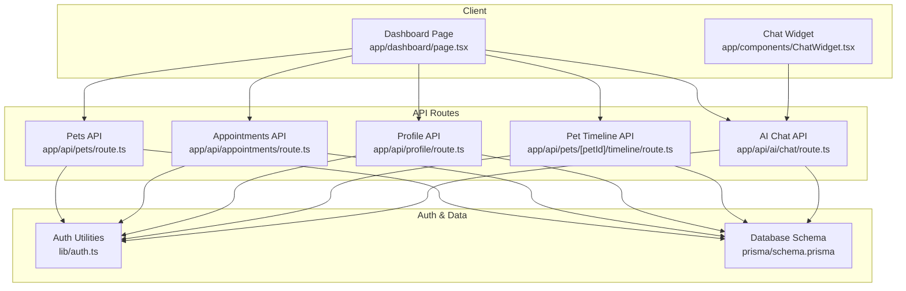
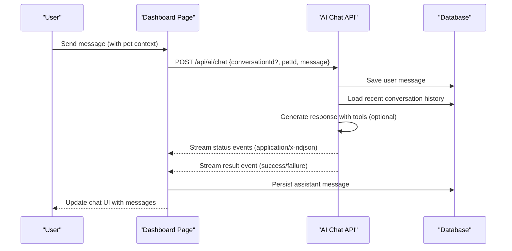
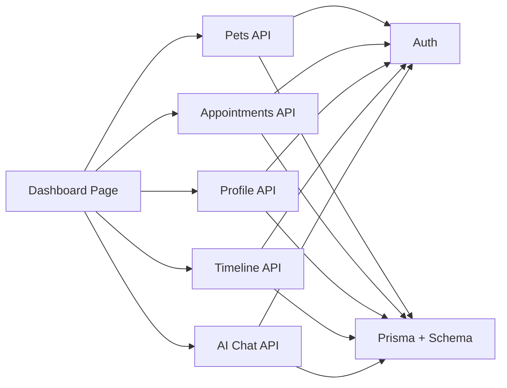

# Pet Owner Dashboard

<cite>
**Referenced Files in This Document**
- [app/dashboard/page.tsx](file://app/dashboard/page.tsx)
- [app/components/ChatWidget.tsx](file://app/components/ChatWidget.tsx)
- [app/api/pets/route.ts](file://app/api/pets/route.ts)
- [app/api/appointments/route.ts](file://app/api/appointments/route.ts)
- [app/api/profile/route.ts](file://app/api/profile/route.ts)
- [app/api/ai/chat/route.ts](file://app/api/ai/chat/route.ts)
- [app/api/pets/[petId]/timeline/route.ts](file://app/api/pets/[petId]/timeline/route.ts)
- [lib/auth.ts](file://lib/auth.ts)
- [prisma/schema.prisma](file://prisma/schema.prisma)
- [app/layout.tsx](file://app/layout.tsx)
- [app/globals.css](file://app/globals.css)
</cite>

## Table of Contents
1. Introduction
2. Project Structure
3. Core Components
4. Architecture Overview
5. Detailed Component Analysis
6. Dependency Analysis
7. Performance Considerations
8. Troubleshooting Guide
9. Conclusion

## Introduction
This document explains the Pet Owner Dashboard in PETIVA, focusing on the main dashboard interface, pet portfolio management, appointment booking workflow, integrated AI health assistant chat, profile management, responsive design patterns, data fetching strategies, state management, and error handling. It is designed for both technical and non-technical readers to understand how the dashboard works end-to-end.

## Project Structure
The dashboard is implemented as a Next.js client component with server-side API routes for data operations. The root layout sets global styles and metadata. Tailwind CSS provides responsive utilities across devices.

**Diagram sources**
- [app/dashboard/page.tsx:1-120](file://app/dashboard/page.tsx#L1-L120)
- [app/components/ChatWidget.tsx:1-60](file://app/components/ChatWidget.tsx#L1-L60)
- [app/api/pets/route.ts:1-69](file://app/api/pets/route.ts#L1-L69)
- [app/api/appointments/route.ts:1-143](file://app/api/appointments/route.ts#L1-L143)
- [app/api/profile/route.ts:1-82](file://app/api/profile/route.ts#L1-L82)
- [app/api/pets/[petId]/timeline/route.ts:1-149](file://app/api/pets/[petId]/timeline/route.ts#L1-L149)
- [app/api/ai/chat/route.ts:1-120](file://app/api/ai/chat/route.ts#L1-L120)
- [lib/auth.ts:1-125](file://lib/auth.ts#L1-L125)
- [prisma/schema.prisma:1-312](file://prisma/schema.prisma#L1-L312)

**Section sources**
- [app/layout.tsx:1-16](file://app/layout.tsx#L1-L16)
- [app/globals.css:1-20](file://app/globals.css#L1-L20)

## Core Components
- Dashboard page: Central UI for health overview, upcoming appointments, pet profiles, quick actions, and navigation between tabs (dashboard, pets, appointments, AI assistant, profile).
- Chat widget: Floating assistant for general platform help; separate from the pet-specific AI assistant in the dashboard.
- API routes: Secure endpoints for pets, appointments, profile updates, pet timeline aggregation, and AI chat with streaming responses.
- Auth middleware: Ensures all requests are authenticated and enforces ownership checks.
- Database schema: Defines entities like User, Pet, Appointment, MedicalRecord, Vaccination, Medication, Allergy, HealthCondition, HealthMetric, AIConversation, AIMessage.

Key responsibilities:
- Dashboard orchestrates data fetching, local state, and user interactions.
- API routes enforce authentication, authorization, validation, and business rules.
- Auth utilities provide session management and role-based guards.
- Schema models ensure consistent data structure and relationships.

**Section sources**
- [app/dashboard/page.tsx:1-120](file://app/dashboard/page.tsx#L1-L120)
- [app/components/ChatWidget.tsx:1-60](file://app/components/ChatWidget.tsx#L1-L60)
- [app/api/pets/route.ts:1-69](file://app/api/pets/route.ts#L1-L69)
- [app/api/appointments/route.ts:1-143](file://app/api/appointments/route.ts#L1-L143)
- [app/api/profile/route.ts:1-82](file://app/api/profile/route.ts#L1-L82)
- [app/api/pets/[petId]/timeline/route.ts:1-149](file://app/api/pets/[petId]/timeline/route.ts#L1-L149)
- [app/api/ai/chat/route.ts:1-120](file://app/api/ai/chat/route.ts#L1-L120)
- [lib/auth.ts:1-125](file://lib/auth.ts#L1-L125)
- [prisma/schema.prisma:1-312](file://prisma/schema.prisma#L1-L312)

## Architecture Overview
The dashboard follows a client-server architecture:
- Client: React components manage UI state and call APIs.
- Server: Next.js API routes handle authentication, authorization, database queries, and business logic.
- Data: Prisma ORM interacts with PostgreSQL based on the defined schema.
- AI: Streaming NDJSON responses enable real-time status updates and results during AI processing.

**Diagram sources**
- [app/dashboard/page.tsx:282-352](file://app/dashboard/page.tsx#L282-L352)
- [app/api/ai/chat/route.ts:68-349](file://app/api/ai/chat/route.ts#L68-L349)

## Detailed Component Analysis

### Dashboard Interface
- Navigation sidebar with tabs: Dashboard, My Pets, Appointments, AI Assistant, Profile.
- Health overview panels: Counts for vaccinations, medications, allergies, last visit date derived from timeline.
- Upcoming appointment card: Shows next future appointment details and cancellation option.
- Recent health activity timeline: Aggregated events from medical records, vaccinations, medications, allergies, conditions, metrics, and appointments.
- Quick actions: Add new pet and book appointment buttons.

Data flow:
- On mount, fetch profile, pets, appointments, discovery vets, and initial timeline for the first pet.
- Selecting a pet updates selected pet, AI pet context, and reloads timeline.
- Booking an appointment posts to API and refreshes list.

Error handling:
- Displays error or success banners for user feedback.
- Redirects to home if profile fetch fails (unauthenticated).

Responsive behavior:
- Uses Tailwind grid and flex layouts to adapt across screen sizes.

**Section sources**
- [app/dashboard/page.tsx:45-138](file://app/dashboard/page.tsx#L45-L138)
- [app/dashboard/page.tsx:382-759](file://app/dashboard/page.tsx#L382-L759)

### Pet Portfolio Management
- Lists all pets with selection highlighting.
- Provides add/edit/delete operations via forms and API calls.
- Displays detailed pet profile view including health overview and timeline access.

Operations:
- Add pet: POST to /api/pets, then update local state and select newly added pet.
- Edit pet: PUT to /api/pets/{id}, update local state.
- Delete pet: DELETE to /api/pets/{id}, remove from list and reset selection if needed.

Validation and errors:
- Required fields enforced server-side; errors surfaced to UI.

**Section sources**
- [app/dashboard/page.tsx:164-230](file://app/dashboard/page.tsx#L164-L230)
- [app/api/pets/route.ts:30-69](file://app/api/pets/route.ts#L30-L69)

### Pet Timeline and Health Records
- Aggregates multiple data sources into a unified chronological timeline:
  - Medical records (current version), vaccinations, medications, allergies, health conditions, health metrics, and appointments.
- Ownership check ensures users can only access their own pets’ timelines.

Complexity:
- Parallel queries using Promise.all for performance.
- Sorting by date descending to present newest events first.

**Section sources**
- [app/api/pets/[petId]/timeline/route.ts:1-149](file://app/api/pets/[petId]/timeline/route.ts#L1-L149)

### Appointment Booking Workflow
- Inputs: pet, vet, clinic, date/time, reason.
- Validation: Required fields checked server-side.
- Authorization: Verifies pet ownership before booking.
- Conflict detection: Prevents double-booking within transactional scope.
- Result: Creates appointment with REQUESTED status and includes related entities.

Cancellation:
- Updates appointment status to CANCELLED and refreshes list.

**Section sources**
- [app/dashboard/page.tsx:232-280](file://app/dashboard/page.tsx#L232-L280)
- [app/api/appointments/route.ts:69-143](file://app/api/appointments/route.ts#L69-L143)

### Integrated AI Health Assistant Chat
- Conversation persistence per user and pet.
- Streaming NDJSON responses for real-time status and final result.
- Tool usage for retrieving pet info, health timeline, vaccination records, finding vets, checking slots, and creating bookings.
- Explicit confirmation flow for booking to avoid unintended actions.

Flow:
- Load conversation history for selected pet.
- Send message; stream status updates while processing.
- Append assistant message to history and persist.

Error handling:
- Handles connection errors and tool failures gracefully.

**Section sources**
- [app/dashboard/page.tsx:103-122](file://app/dashboard/page.tsx#L103-L122)
- [app/dashboard/page.tsx:282-352](file://app/dashboard/page.tsx#L282-L352)
- [app/api/ai/chat/route.ts:7-66](file://app/api/ai/chat/route.ts#L7-L66)
- [app/api/ai/chat/route.ts:68-349](file://app/api/ai/chat/route.ts#L68-L349)

### Profile Management
- Fetch current profile on load.
- Update personal information (first name, last name, phone).
- Enforce required fields and return updated profile.

**Section sources**
- [app/dashboard/page.tsx:140-162](file://app/dashboard/page.tsx#L140-L162)
- [app/api/profile/route.ts:5-82](file://app/api/profile/route.ts#L5-L82)

### Floating Chat Widget (Platform Help)
- Separate from pet-specific AI assistant; used for general platform questions.
- Sends chat history to landing chat endpoint and renders markdown-formatted responses.

**Section sources**
- [app/components/ChatWidget.tsx:1-149](file://app/components/ChatWidget.tsx#L1-L149)

## Dependency Analysis
- Authentication dependency: All API routes use requireAuth to validate sessions and protect resources.
- Data dependencies: Dashboard depends on multiple API routes; timeline aggregates several models.
- AI integration: AI chat route depends on AI provider and tool execution, interacting with database for conversations and messages.

**Diagram sources**
- [app/dashboard/page.tsx:45-138](file://app/dashboard/page.tsx#L45-L138)
- [app/api/pets/route.ts:1-69](file://app/api/pets/route.ts#L1-L69)
- [app/api/appointments/route.ts:1-143](file://app/api/appointments/route.ts#L1-L143)
- [app/api/profile/route.ts:1-82](file://app/api/profile/route.ts#L1-L82)
- [app/api/pets/[petId]/timeline/route.ts:1-149](file://app/api/pets/[petId]/timeline/route.ts#L1-L149)
- [app/api/ai/chat/route.ts:1-120](file://app/api/ai/chat/route.ts#L1-L120)
- [lib/auth.ts:1-125](file://lib/auth.ts#L1-L125)
- [prisma/schema.prisma:1-312](file://prisma/schema.prisma#L1-L312)

**Section sources**
- [lib/auth.ts:99-125](file://lib/auth.ts#L99-L125)
- [prisma/schema.prisma:30-312](file://prisma/schema.prisma#L30-L312)

## Performance Considerations
- Parallel data loading: Timeline API uses Promise.all to fetch multiple entities concurrently, reducing latency.
- Streaming AI responses: NDJSON streaming provides immediate feedback and reduces perceived wait time.
- Local state updates: Dashboard updates UI optimistically where appropriate and refetches lists after mutations to keep data consistent.
- Pagination/context limits: AI chat loads recent messages (up to 20) to prevent context bloat and maintain performance.

[No sources needed since this section provides general guidance]

## Troubleshooting Guide
Common issues and resolutions:
- Unauthenticated access: If profile fetch fails, dashboard redirects to home. Ensure session cookie is valid and not expired.
- Forbidden access: Timeline and AI chat enforce pet ownership; verify that the logged-in user owns the selected pet.
- Double-booking conflicts: Appointment creation checks for existing REQUESTED or CONFIRMED appointments at the same time slot; choose a different time or vet.
- Network errors: Handle connection errors in UI and retry operations; check backend logs for internal server errors.

Error handling patterns:
- Consistent error objects returned by APIs with code and message.
- UI displays error banners and disables actions during loading states.

**Section sources**
- [app/dashboard/page.tsx:45-96](file://app/dashboard/page.tsx#L45-L96)
- [app/api/pets/[petId]/timeline/route.ts:14-31](file://app/api/pets/[petId]/timeline/route.ts#L14-L31)
- [app/api/ai/chat/route.ts:20-27](file://app/api/ai/chat/route.ts#L20-L27)
- [app/api/appointments/route.ts:84-110](file://app/api/appointments/route.ts#L84-L110)

## Conclusion
The Pet Owner Dashboard integrates comprehensive health overview, pet portfolio management, appointment scheduling, and an AI-powered assistant with robust authentication, authorization, and error handling. Its responsive design ensures usability across devices, while efficient data fetching and streaming AI responses deliver a smooth user experience. The modular architecture separates concerns between client UI, API routes, and data layer, enabling maintainability and scalability.

[No sources needed since this section summarizes without analyzing specific files]