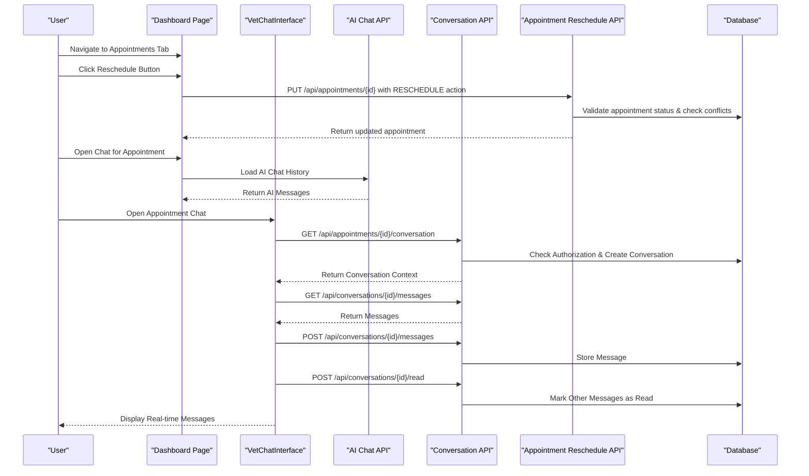
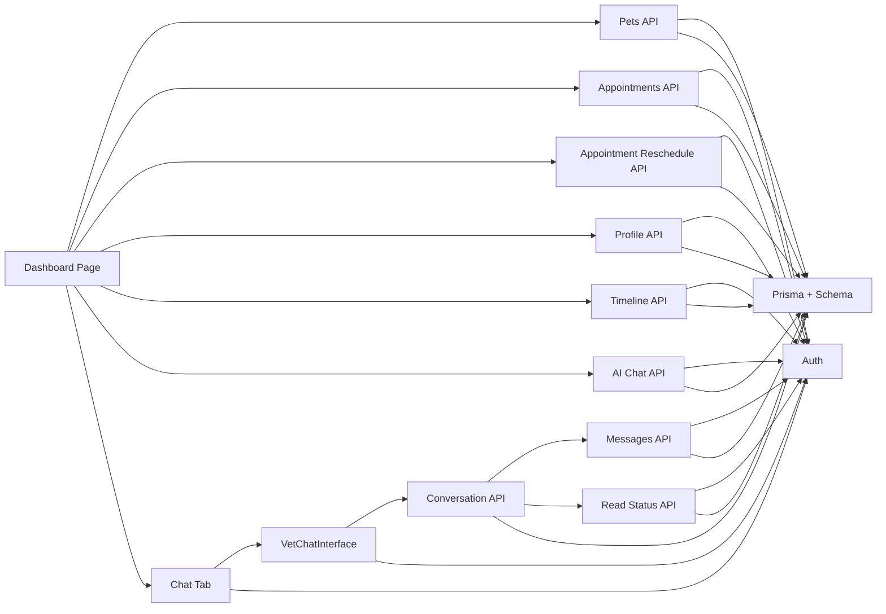

# Pet Owner Dashboard

<cite>
**Referenced Files in This Document**
- [app/dashboard/page.tsx](file://app/dashboard/page.tsx)
- [app/components/ChatWidget.tsx](file://app/components/ChatWidget.tsx)
- [app/components/VetChatInterface.tsx](file://app/components/VetChatInterface.tsx)
- [app/api/pets/route.ts](file://app/api/pets/route.ts)
- [app/api/appointments/route.ts](file://app/api/appointments/route.ts)
- [app/api/appointments/[appointmentId]/route.ts](file://app/api/appointments/[appointmentId]/route.ts)
- [app/api/profile/route.ts](file://app/api/profile/route.ts)
- [app/api/ai/chat/route.ts](file://app/api/ai/chat/route.ts)
- [app/api/pets/[petId]/timeline/route.ts](file://app/api/pets/[petId]/timeline/route.ts)
- [app/api/appointments/[appointmentId]/conversation/route.ts](file://app/api/appointments/[appointmentId]/conversation/route.ts)
- [app/api/conversations/route.ts](file://app/api/conversations/route.ts)
- [app/api/conversations/[conversationId]/messages/route.ts](file://app/api/conversations/[conversationId]/messages/route.ts)
- [app/api/conversations/[conversationId]/read/route.ts](file://app/api/conversations/[conversationId]/read/route.ts)
- [lib/auth.ts](file://lib/auth.ts)
- [prisma/schema.prisma](file://prisma/schema.prisma)
- [app/layout.tsx](file://app/layout.tsx)
- [app/globals.css](file://app/globals.css)
</cite>

## Update Summary
**Changes Made**
- Added comprehensive documentation for the new appointment rescheduling functionality including modal dialog, datetime-local input field, and state management
- Updated appointment workflow documentation to include reschedule operations alongside existing cancel functionality
- Enhanced dashboard interface documentation with new reschedule buttons and modal implementation
- Updated API documentation to cover the new reschedule endpoint with validation and business logic
- Added detailed coverage of reschedule state management and user interaction patterns

## Table of Contents
1. Introduction
2. Project Structure
3. Core Components
4. Architecture Overview
5. Detailed Component Analysis
6. Dependency Analysis
7. Performance Considerations
8. Troubleshooting Guide
9. Conclusion

## Introduction
This document explains the Pet Owner Dashboard in PETIVA, focusing on the main dashboard interface, pet portfolio management, appointment booking and rescheduling workflow, integrated AI health assistant chat, profile management, responsive design patterns, data fetching strategies, state management, and error handling. It is designed for both technical and non-technical readers to understand how the dashboard works end-to-end.

**Updated** The dashboard now features a complete appointment rescheduling system with an intuitive modal interface, allowing users to easily modify their appointment times while maintaining proper validation and workflow integration.

## Project Structure
The dashboard is implemented as a Next.js client component with server-side API routes for data operations. The root layout sets global styles and metadata. Tailwind CSS provides responsive utilities across devices.

```mermaid
graph TB
subgraph "Client"
D["Dashboard Page<br/>app/dashboard/page.tsx"]
W["Chat Widget<br/>app/components/ChatWidget.tsx"]
VC["Vet Chat Interface<br/>app/components/VetChatInterface.tsx"]
end
subgraph "API Routes"
PETS["Pets API<br/>app/api/pets/route.ts"]
APPTS["Appointments API<br/>app/api/appointments/route.ts"]
APPT_UPDATE["Appointment Update API<br/>app/api/appointments/[appointmentId]/route.ts"]
PROFILE["Profile API<br/>app/api/profile/route.ts"]
TIMELINE["Pet Timeline API<br/>app/api/pets/[petId]/timeline/route.ts"]
AICHAT["AI Chat API<br/>app/api/ai/chat/route.ts"]
CONV["Conversation API<br/>app/api/conversations/route.ts"]
APPT_CONV["Appointment Conversation API<br/>app/api/appointments/[appointmentId]/conversation/route.ts"]
MSG_API["Messages API<br/>app/api/conversations/[conversationId]/messages/route.ts"]
READ_API["Read Status API<br/>app/api/conversations/[conversationId]/read/route.ts"]
end
subgraph "Auth & Data"
AUTH["Auth Utilities<br/>lib/auth.ts"]
SCHEMA["Database Schema<br/>prisma/schema.prisma"]
end
D --> PETS
D --> APPTS
D --> APPT_UPDATE
D --> PROFILE
D --> TIMELINE
D --> AICHAT
D --> CONV
D --> APPT_CONV
D --> MSG_API
D --> READ_API
W --> AICHAT
VC --> MSG_API
VC --> READ_API
PETS --> AUTH
APPTS --> AUTH
APPT_UPDATE --> AUTH
PROFILE --> AUTH
TIMELINE --> AUTH
AICHAT --> AUTH
CONV --> AUTH
APPT_CONV --> AUTH
MSG_API --> AUTH
READ_API --> AUTH
PETS --> SCHEMA
APPTS --> SCHEMA
APPT_UPDATE --> SCHEMA
PROFILE --> SCHEMA
TIMELINE --> SCHEMA
AICHAT --> SCHEMA
CONV --> SCHEMA
APPT_CONV --> SCHEMA
MSG_API --> SCHEMA
READ_API --> SCHEMA
```

**Diagram sources**
- [app/dashboard/page.tsx:1-1505](file://app/dashboard/page.tsx#L1-L1505)
- [app/components/ChatWidget.tsx:1-149](file://app/components/ChatWidget.tsx#L1-L149)
- [app/components/VetChatInterface.tsx:1-222](file://app/components/VetChatInterface.tsx#L1-L222)
- [app/api/pets/route.ts:1-69](file://app/api/pets/route.ts#L1-L69)
- [app/api/appointments/route.ts:1-143](file://app/api/appointments/route.ts#L1-L143)
- [app/api/appointments/[appointmentId]/route.ts:1-230](file://app/api/appointments/[appointmentId]/route.ts#L1-L230)
- [app/api/profile/route.ts:1-82](file://app/api/profile/route.ts#L1-L82)
- [app/api/pets/[petId]/timeline/route.ts:1-149](file://app/api/pets/[petId]/timeline/route.ts#L1-L149)
- [app/api/ai/chat/route.ts:1-120](file://app/api/ai/chat/route.ts#L1-L120)
- [app/api/appointments/[appointmentId]/conversation/route.ts:1-65](file://app/api/appointments/[appointmentId]/conversation/route.ts#L1-L65)
- [app/api/conversations/route.ts:1-90](file://app/api/conversations/route.ts#L1-L90)
- [app/api/conversations/[conversationId]/messages/route.ts:1-104](file://app/api/conversations/[conversationId]/messages/route.ts#L1-L104)
- [app/api/conversations/[conversationId]/read/route.ts:1-49](file://app/api/conversations/[conversationId]/read/route.ts#L1-L49)
- [lib/auth.ts:1-125](file://lib/auth.ts#L1-L125)
- [prisma/schema.prisma:1-312](file://prisma/schema.prisma#L1-L312)

**Section sources**
- [app/layout.tsx:1-16](file://app/layout.tsx#L1-L16)
- [app/globals.css:1-20](file://app/globals.css#L1-L20)

## Core Components
- Dashboard page: Central UI for health overview, upcoming appointments, pet profiles, quick actions, and navigation between tabs (dashboard, pets, appointments, AI assistant, chat, profile).
- Chat widget: Floating assistant for general platform help; separate from the pet-specific AI assistant in the dashboard.
- VetChatInterface: Dedicated component for real-time conversation between pet owners and veterinarians with message polling and read status tracking.
- API routes: Secure endpoints for pets, appointments, profile updates, pet timeline aggregation, AI chat with streaming responses, and comprehensive conversation management.
- Auth middleware: Ensures all requests are authenticated and enforces ownership checks.
- Database schema: Defines entities like User, Pet, Appointment, MedicalRecord, Vaccination, Medication, Allergy, HealthCondition, HealthMetric, AIConversation, AIMessage, Conversation, Message.

Key responsibilities:
- Dashboard orchestrates data fetching, local state, and user interactions across multiple tabs.
- API routes enforce authentication, authorization, validation, and business rules for all features.
- Auth utilities provide session management and role-based guards.
- Schema models ensure consistent data structure and relationships including new conversation and message entities.

**Section sources**
- [app/dashboard/page.tsx:1-1505](file://app/dashboard/page.tsx#L1-L1505)
- [app/components/ChatWidget.tsx:1-149](file://app/components/ChatWidget.tsx#L1-L149)
- [app/components/VetChatInterface.tsx:1-222](file://app/components/VetChatInterface.tsx#L1-L222)
- [app/api/pets/route.ts:1-69](file://app/api/pets/route.ts#L1-L69)
- [app/api/appointments/route.ts:1-143](file://app/api/appointments/route.ts#L1-L143)
- [app/api/appointments/[appointmentId]/route.ts:1-230](file://app/api/appointments/[appointmentId]/route.ts#L1-L230)
- [app/api/profile/route.ts:1-82](file://app/api/profile/route.ts#L1-L82)
- [app/api/pets/[petId]/timeline/route.ts:1-149](file://app/api/pets/[petId]/timeline/route.ts#L1-L149)
- [app/api/ai/chat/route.ts:1-120](file://app/api/ai/chat/route.ts#L1-L120)
- [app/api/appointments/[appointmentId]/conversation/route.ts:1-65](file://app/api/appointments/[appointmentId]/conversation/route.ts#L1-L65)
- [app/api/conversations/route.ts:1-90](file://app/api/conversations/route.ts#L1-L90)
- [app/api/conversations/[conversationId]/messages/route.ts:1-104](file://app/api/conversations/[conversationId]/messages/route.ts#L1-L104)
- [app/api/conversations/[conversationId]/read/route.ts:1-49](file://app/api/conversations/[conversationId]/read/route.ts#L1-L49)
- [lib/auth.ts:1-125](file://lib/auth.ts#L1-L125)
- [prisma/schema.prisma:1-312](file://prisma/schema.prisma#L1-L312)

## Architecture Overview
The dashboard follows a client-server architecture with enhanced conversation management and appointment rescheduling capabilities:
- Client: React components manage UI state and call APIs for multiple tabs including the new chat functionality and rescheduling features.
- Server: Next.js API routes handle authentication, authorization, database queries, business logic, and real-time conversation updates.
- Data: Prisma ORM interacts with PostgreSQL based on the defined schema including new conversation and message tables.
- AI: Streaming NDJSON responses enable real-time status updates and results during AI processing.
- Real-time Messaging: Polling-based messaging system with automatic read status updates.

**Diagram sources**
- [app/dashboard/page.tsx:100-118](file://app/dashboard/page.tsx#L100-L118)
- [app/dashboard/page.tsx:319-351](file://app/dashboard/page.tsx#L319-L351)
- [app/components/VetChatInterface.tsx:56-85](file://app/components/VetChatInterface.tsx#L56-L85)
- [app/api/appointments/[appointmentId]/route.ts:17-125](file://app/api/appointments/[appointmentId]/route.ts#L17-L125)
- [app/api/appointments/[appointmentId]/conversation/route.ts:10-55](file://app/api/appointments/[appointmentId]/conversation/route.ts#L10-L55)
- [app/api/conversations/[conversationId]/messages/route.ts:5-38](file://app/api/conversations/[conversationId]/messages/route.ts#L5-L38)
- [app/api/conversations/[conversationId]/read/route.ts:5-41](file://app/api/conversations/[conversationId]/read/route.ts#L5-L41)

## Detailed Component Analysis

### Dashboard Interface
- Navigation sidebar with tabs: Dashboard, My Pets, Appointments, AI Assistant, Profile.
- Health overview panels: Counts for vaccinations, medications, allergies, last visit date derived from timeline.
- Upcoming appointment card: Shows next future appointment details with both Reschedule and Cancel options.
- Recent health activity timeline: Aggregated events from medical records, vaccinations, medications, allergies, conditions, metrics, and appointments.
- Quick actions: Add new pet and book appointment buttons.

Data flow:
- On mount, fetch profile, pets, appointments, discovery vets, and initial timeline for the first pet.
- Selecting a pet updates selected pet, AI pet context, and reloads timeline.
- Booking an appointment posts to API and refreshes list.
- **New**: Reschedule functionality integrated into appointment cards with modal dialog interface.

Error handling:
- Displays error or success banners for user feedback.
- Redirects to home if profile fetch fails (unauthenticated).

Responsive behavior:
- Uses Tailwind grid and flex layouts to adapt across screen sizes.

**Section sources**
- [app/dashboard/page.tsx:45-138](file://app/dashboard/page.tsx#L45-L138)
- [app/dashboard/page.tsx:382-759](file://app/dashboard/page.tsx#L382-L759)
- [app/dashboard/page.tsx:858-922](file://app/dashboard/page.tsx#L858-L922)

### Pet Portfolio Management
- Lists all pets with selection highlighting.
- Provides add/edit/delete operations via forms and API calls.
- Displays detailed pet profile view including health overview and timeline access.

Operations:
- Add pet: POST to /api/pets, then update local state and select newly added pet.
- Edit pet: PUT to /api/pets/{id}, update local state.
- Delete pet: DELETE to /api/pets/{id}, remove from list and reset selection if needed.

Validation and errors:
- Required fields enforced server-side; errors surfaced to UI.

**Section sources**
- [app/dashboard/page.tsx:164-230](file://app/dashboard/page.tsx#L164-L230)
- [app/api/pets/route.ts:30-69](file://app/api/pets/route.ts#L30-L69)

### Pet Timeline and Health Records
- Aggregates multiple data sources into a unified chronological timeline:
  - Medical records (current version), vaccinations, medications, allergies, health conditions, health metrics, and appointments.
- Ownership check ensures users can only access their own pets' timelines.

Complexity:
- Parallel queries using Promise.all for performance.
- Sorting by date descending to present newest events first.

**Section sources**
- [app/api/pets/[petId]/timeline/route.ts:1-149](file://app/api/pets/[petId]/timeline/route.ts#L1-L149)

### Appointment Booking and Rescheduling Workflow
- **Booking**: Inputs include pet, vet, clinic, date/time, reason. Validation checks required fields server-side. Authorization verifies pet ownership before booking. Conflict detection prevents double-booking within transactional scope. Result creates appointment with REQUESTED status and includes related entities.
- **Rescheduling**: New comprehensive rescheduling system with modal dialog interface. Users can select new date/time using datetime-local input field. System validates appointment eligibility (only REQUESTED or CONFIRMED status), checks for time conflicts, and resets status to REQUESTED for vet approval.

Cancellation:
- Updates appointment status to CANCELLED and refreshes list.

**Section sources**
- [app/dashboard/page.tsx:232-280](file://app/dashboard/page.tsx#L232-L280)
- [app/dashboard/page.tsx:311-351](file://app/dashboard/page.tsx#L311-L351)
- [app/api/appointments/route.ts:69-143](file://app/api/appointments/route.ts#L69-L143)
- [app/api/appointments/[appointmentId]/route.ts:17-125](file://app/api/appointments/[appointmentId]/route.ts#L17-L125)

### Integrated AI Health Assistant Chat
- Conversation persistence per user and pet.
- Streaming NDJSON responses for real-time status and final result.
- Tool usage for retrieving pet info, health timeline, vaccination records, finding vets, checking slots, and creating bookings.
- Explicit confirmation flow for booking to avoid unintended actions.

Flow:
- Load conversation history for selected pet.
- Send message; stream status updates while processing.
- Append assistant message to history and persist.

Error handling:
- Handles connection errors and tool failures gracefully.

**Section sources**
- [app/dashboard/page.tsx:103-122](file://app/dashboard/page.tsx#L103-L122)
- [app/dashboard/page.tsx:282-352](file://app/dashboard/page.tsx#L282-L352)
- [app/api/ai/chat/route.ts:7-66](file://app/api/ai/chat/route.ts#L7-L66)
- [app/api/ai/chat/route.ts:68-349](file://app/api/ai/chat/route.ts#L68-L349)

### **Enhanced: Appointment Rescheduling System**

The dashboard now features a comprehensive appointment rescheduling system that allows pet owners to easily modify their scheduled appointments through an intuitive modal interface.

#### Rescheduling Modal Implementation
- **Modal Dialog**: Full-screen overlay with backdrop blur effect providing focused rescheduling experience.
- **Date/Time Selection**: Native datetime-local input field with proper formatting and validation.
- **State Management**: Dedicated state variables for reschedule target, date/time selection, and modal visibility.
- **Form Handling**: Complete form submission with error handling and success feedback.

#### Rescheduling Business Logic
- **Eligibility Checks**: Only appointments with REQUESTED or CONFIRMED status can be rescheduled.
- **Authorization**: Validates user owns the appointment and has appropriate permissions.
- **Conflict Detection**: Prevents double-booking by checking for existing appointments at the same time slot.
- **Status Management**: Resets appointment status to REQUESTED after rescheduling, requiring vet approval.

#### User Experience Features
- **Visual Feedback**: Clear display of current appointment details including pet, vet, clinic, and current time.
- **Error Handling**: Comprehensive error messages for invalid dates, past times, and conflict scenarios.
- **Success Confirmation**: Clear feedback when rescheduling is successful with status change notification.

#### Integration Points
- **Dashboard Integration**: Reschedule buttons appear alongside Cancel buttons for eligible appointments.
- **API Communication**: Seamless integration with appointment update API using standardized request format.
- **State Synchronization**: Automatic refresh of appointment lists after successful rescheduling.

**Section sources**
- [app/dashboard/page.tsx:34-37](file://app/dashboard/page.tsx#L34-L37)
- [app/dashboard/page.tsx:311-351](file://app/dashboard/page.tsx#L311-L351)
- [app/dashboard/page.tsx:751-764](file://app/dashboard/page.tsx#L751-L764)
- [app/dashboard/page.tsx:960-976](file://app/dashboard/page.tsx#L960-L976)
- [app/dashboard/page.tsx:1454-1500](file://app/dashboard/page.tsx#L1454-L1500)
- [app/api/appointments/[appointmentId]/route.ts:17-125](file://app/api/appointments/[appointmentId]/route.ts#L17-L125)

### Profile Management
- Fetch current profile on load.
- Update personal information (first name, last name, phone).
- Enforce required fields and return updated profile.

**Section sources**
- [app/dashboard/page.tsx:140-162](file://app/dashboard/page.tsx#L140-L162)
- [app/api/profile/route.ts:5-82](file://app/api/profile/route.ts#L5-L82)

### Floating Chat Widget (Platform Help)
- Separate from pet-specific AI assistant; used for general platform questions.
- Sends chat history to landing chat endpoint and renders markdown-formatted responses.

**Section sources**
- [app/components/ChatWidget.tsx:1-149](file://app/components/ChatWidget.tsx#L1-L149)

## Dependency Analysis
- Authentication dependency: All API routes use requireAuth to validate sessions and protect resources.
- Data dependencies: Dashboard depends on multiple API routes; timeline aggregates several models.
- AI integration: AI chat route depends on AI provider and tool execution, interacting with database for conversations and messages.
- **New**: Rescheduling dependencies include appointment validation, conflict detection, and status management.
- **New**: Conversation management dependencies include message polling, read status tracking, and real-time updates.

**Diagram sources**
- [app/dashboard/page.tsx:1-1505](file://app/dashboard/page.tsx#L1-L1505)
- [app/components/VetChatInterface.tsx:1-222](file://app/components/VetChatInterface.tsx#L1-L222)
- [app/api/pets/route.ts:1-69](file://app/api/pets/route.ts#L1-L69)
- [app/api/appointments/route.ts:1-143](file://app/api/appointments/route.ts#L1-L143)
- [app/api/appointments/[appointmentId]/route.ts:1-230](file://app/api/appointments/[appointmentId]/route.ts#L1-L230)
- [app/api/profile/route.ts:1-82](file://app/api/profile/route.ts#L1-L82)
- [app/api/pets/[petId]/timeline/route.ts:1-149](file://app/api/pets/[petId]/timeline/route.ts#L1-L149)
- [app/api/ai/chat/route.ts:1-120](file://app/api/ai/chat/route.ts#L1-L120)
- [app/api/appointments/[appointmentId]/conversation/route.ts:1-65](file://app/api/appointments/[appointmentId]/conversation/route.ts#L1-L65)
- [app/api/conversations/route.ts:1-90](file://app/api/conversations/route.ts#L1-L90)
- [app/api/conversations/[conversationId]/messages/route.ts:1-104](file://app/api/conversations/[conversationId]/messages/route.ts#L1-L104)
- [app/api/conversations/[conversationId]/read/route.ts:1-49](file://app/api/conversations/[conversationId]/read/route.ts#L1-L49)
- [lib/auth.ts:1-125](file://lib/auth.ts#L1-L125)
- [prisma/schema.prisma:1-312](file://prisma/schema.prisma#L1-L312)

**Section sources**
- [lib/auth.ts:99-125](file://lib/auth.ts#L99-L125)
- [prisma/schema.prisma:30-312](file://prisma/schema.prisma#L30-L312)

## Performance Considerations
- Parallel data loading: Timeline API uses Promise.all to fetch multiple entities concurrently, reducing latency.
- Streaming AI responses: NDJSON streaming provides immediate feedback and reduces perceived wait time.
- Local state updates: Dashboard updates UI optimistically where appropriate and refetches lists after mutations to keep data consistent.
- Pagination/context limits: AI chat loads recent messages (up to 20) to prevent context bloat and maintain performance.
- **New**: Efficient rescheduling with immediate UI updates and background list refresh.
- **New**: Optimized modal rendering with conditional loading to minimize unnecessary re-renders.
- **New**: Date/time validation performed client-side to reduce server round trips.
- **New**: Message polling with 3-second intervals to balance real-time updates with server load.
- **New**: Message read status optimization to reduce unnecessary database updates.
- **New**: Conversation listing with unread count optimization using database-level counting.

## Troubleshooting Guide
Common issues and resolutions:
- Unauthenticated access: If profile fetch fails, dashboard redirects to home. Ensure session cookie is valid and not expired.
- Forbidden access: Timeline and AI chat enforce pet ownership; verify that the logged-in user owns the selected pet.
- Double-booking conflicts: Appointment creation checks for existing REQUESTED or CONFIRMED appointments at the same time slot; choose a different time or vet.
- Network errors: Handle connection errors in UI and retry operations; check backend logs for internal server errors.
- **New**: Rescheduling errors: Verify appointment status is REQUESTED or CONFIRMED and user has proper authorization.
- **New**: Date/time validation issues: Ensure selected date is in the future and not conflicting with existing appointments.
- **New**: Modal display problems: Check for proper state management and event handler bindings.
- **New**: Chat access issues: Verify appointment status is CONFIRMED or COMPLETED and user has proper authorization.
- **New**: Message delivery problems: Check network connectivity and server response times; implement retry logic for failed message sends.

Error handling patterns:
- Consistent error objects returned by APIs with code and message.
- UI displays error banners and disables actions during loading states.
- **New**: Graceful degradation for rescheduling features when underlying services are unavailable.
- **New**: Comprehensive error handling for modal dialogs with user-friendly error messages.

**Section sources**
- [app/dashboard/page.tsx:45-96](file://app/dashboard/page.tsx#L45-L96)
- [app/dashboard/page.tsx:311-351](file://app/dashboard/page.tsx#L311-L351)
- [app/api/pets/[petId]/timeline/route.ts:14-31](file://app/api/pets/[petId]/timeline/route.ts#L14-L31)
- [app/api/ai/chat/route.ts:20-27](file://app/api/ai/chat/route.ts#L20-L27)
- [app/api/appointments/route.ts:84-110](file://app/api/appointments/route.ts#L84-L110)
- [app/api/appointments/[appointmentId]/route.ts:44-79](file://app/api/appointments/[appointmentId]/route.ts#L44-L79)
- [app/api/appointments/[appointmentId]/conversation/route.ts:26-38](file://app/api/appointments/[appointmentId]/conversation/route.ts#L26-L38)
- [app/components/VetChatInterface.tsx:69-75](file://app/components/VetChatInterface.tsx#L69-L75)

## Conclusion
The Pet Owner Dashboard integrates comprehensive health overview, pet portfolio management, appointment scheduling and rescheduling, and an AI-powered assistant with robust authentication, authorization, and error handling. Its responsive design ensures usability across devices, while efficient data fetching and streaming AI responses deliver a smooth user experience. The modular architecture separates concerns between client UI, API routes, and data layer, enabling maintainability and scalability.

**Updated** The addition of the complete appointment rescheduling system significantly enhances the platform's flexibility, allowing pet owners to easily modify their scheduled appointments through an intuitive modal interface. Combined with the dedicated chat tab with complete conversation management, the dashboard now provides comprehensive communication capabilities, enabling seamless interaction between pet owners and veterinarians through both appointment-based chat initiation and flexible scheduling options. The real-time messaging system with automatic read status tracking and the new rescheduling workflow provide professional features that complement the existing health management capabilities.

[No sources needed since this section summarizes without analyzing specific files]