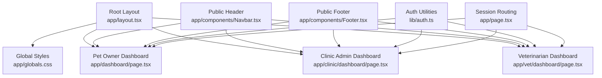
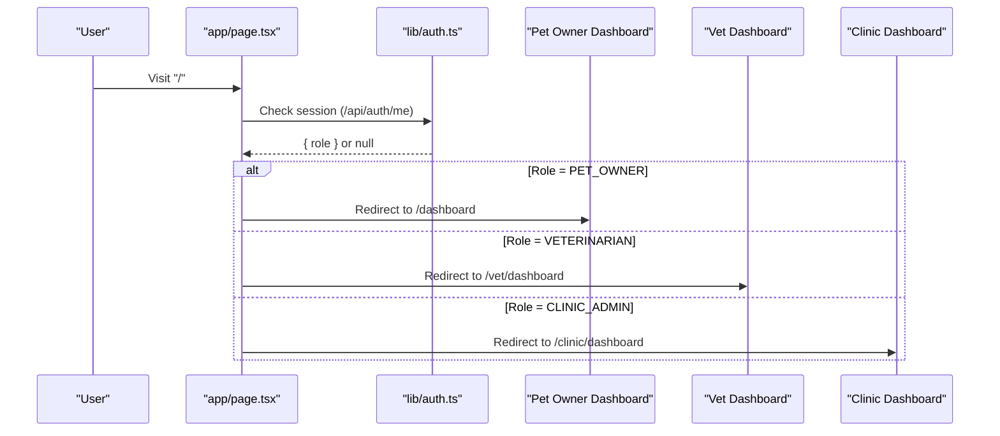
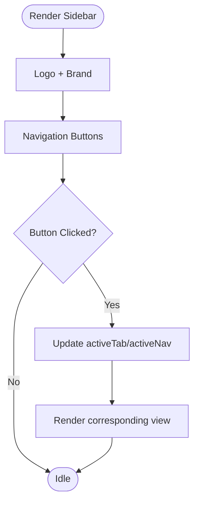
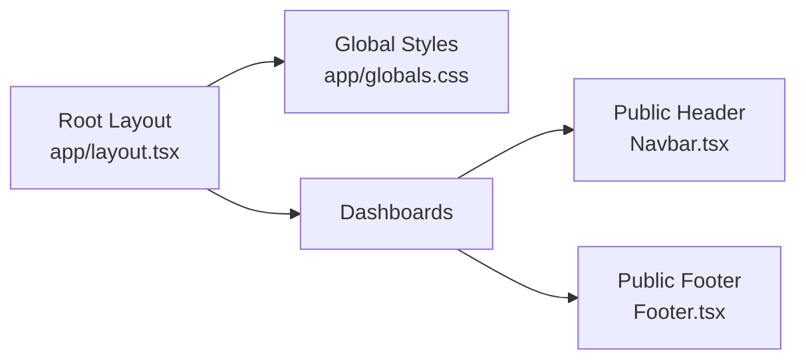
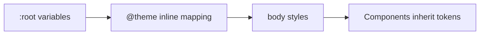
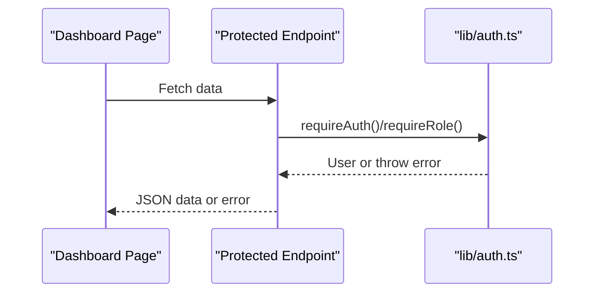
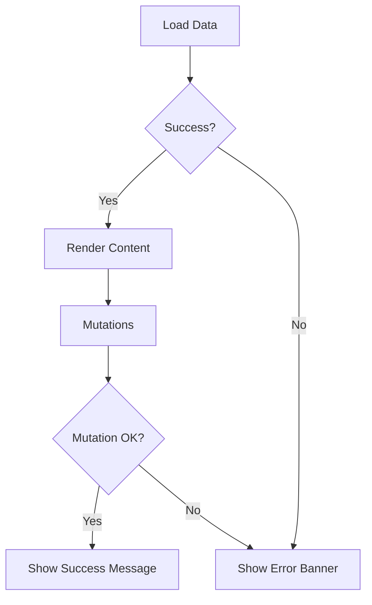
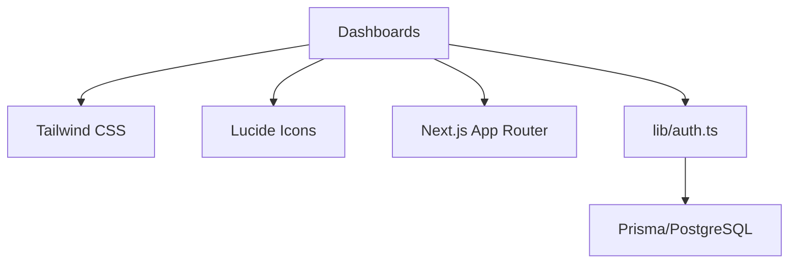

# Shared Dashboard Components

<cite>
**Referenced Files in This Document**
- [layout.tsx](file://app/layout.tsx)
- [globals.css](file://app/globals.css)
- [dashboard/page.tsx](file://app/dashboard/page.tsx)
- [clinic/dashboard/page.tsx](file://app/clinic/dashboard/page.tsx)
- [vet/dashboard/page.tsx](file://app/vet/dashboard/page.tsx)
- [Navbar.tsx](file://app/components/Navbar.tsx)
- [Footer.tsx](file://app/components/Footer.tsx)
- [AuthModal.tsx](file://app/components/AuthModal.tsx)
- [auth.ts](file://lib/auth.ts)
- [page.tsx](file://app/page.tsx)
</cite>

## Table of Contents
1. [Introduction](#introduction)
2. [Project Structure](#project-structure)
3. [Core Components](#core-components)
4. [Architecture Overview](#architecture-overview)
5. [Detailed Component Analysis](#detailed-component-analysis)
6. [Dependency Analysis](#dependency-analysis)
7. [Performance Considerations](#performance-considerations)
8. [Troubleshooting Guide](#troubleshooting-guide)
9. [Conclusion](#conclusion)

## Introduction
This document explains the shared dashboard components used across role-based interfaces in PETIVA (Pet Owner, Veterinarian, and Clinic Admin). It covers navigation architecture (sidebar, tabs, responsive patterns), layout structure (header/footer), reusable UI elements (cards, modals, forms, tables, status indicators), styling system (CSS custom properties and theme variables), authentication-aware behavior (session state, role-based rendering, access control), loading/error/fallback patterns, accessibility considerations, and performance techniques observed in the codebase.

## Project Structure
PETIVA uses a Next.js App Router with role-specific dashboards:
- Pet Owner dashboard at app/dashboard/page.tsx
- Clinic Admin dashboard at app/clinic/dashboard/page.tsx
- Veterinarian dashboard at app/vet/dashboard/page.tsx
- Global layout and base styles at app/layout.tsx and app/globals.css
- Public-facing header/footer components at app/components/Navbar.tsx and app/components/Footer.tsx
- Authentication utilities at lib/auth.ts and session routing at app/page.tsx

**Diagram sources**
- [layout.tsx:9-15](file://app/layout.tsx#L9-L15)
- [globals.css:1-20](file://app/globals.css#L1-L20)
- [dashboard/page.tsx:1-120](file://app/dashboard/page.tsx#L1-L120)
- [clinic/dashboard/page.tsx:1-120](file://app/clinic/dashboard/page.tsx#L1-L120)
- [vet/dashboard/page.tsx:1-120](file://app/vet/dashboard/page.tsx#L1-L120)
- [Navbar.tsx:1-49](file://app/components/Navbar.tsx#L1-L49)
- [Footer.tsx:1-108](file://app/components/Footer.tsx#L1-L108)
- [auth.ts:1-125](file://lib/auth.ts#L1-L125)
- [page.tsx:31-77](file://app/page.tsx#L31-L77)

**Section sources**
- [layout.tsx:9-15](file://app/layout.tsx#L9-L15)
- [globals.css:1-20](file://app/globals.css#L1-L20)
- [dashboard/page.tsx:1-120](file://app/dashboard/page.tsx#L1-L120)
- [clinic/dashboard/page.tsx:1-120](file://app/clinic/dashboard/page.tsx#L1-L120)
- [vet/dashboard/page.tsx:1-120](file://app/vet/dashboard/page.tsx#L1-L120)
- [Navbar.tsx:1-49](file://app/components/Navbar.tsx#L1-L49)
- [Footer.tsx:1-108](file://app/components/Footer.tsx#L1-L108)
- [auth.ts:1-125](file://lib/auth.ts#L1-L125)
- [page.tsx:31-77](file://app/page.tsx#L31-L77)

## Core Components
- Sidebar navigation: Each dashboard implements a fixed left sidebar with logo, tabbed navigation buttons, user profile card, and logout action. Active tab is highlighted using conditional classes.
- Tab switching: State-driven view switching within each dashboard page to render different sections (e.g., dashboard, pets, appointments, AI assistant, profile).
- Responsive patterns: Dashboards use Tailwind utility classes for grid layouts and spacing; public Navbar hides links on small screens via hidden/md:flex.
- Layout shell: Root layout sets global HTML/body classes and imports global CSS.
- Reusable UI: Cards, modals, forms, data tables, and status badges are composed inline within dashboards and shared components.

Key implementation references:
- Sidebar and tabs: [dashboard/page.tsx:385-473](file://app/dashboard/page.tsx#L385-L473), [clinic/dashboard/page.tsx:159-238](file://app/clinic/dashboard/page.tsx#L159-L238), [vet/dashboard/page.tsx:219-320](file://app/vet/dashboard/page.tsx#L219-L320)
- Tab views: [dashboard/page.tsx:489-760](file://app/dashboard/page.tsx#L489-L760), [clinic/dashboard/page.tsx:254-545](file://app/clinic/dashboard/page.tsx#L254-L545), [vet/dashboard/page.tsx:336-702](file://app/vet/dashboard/page.tsx#L336-L702)
- Navbar responsiveness: [Navbar.tsx:20-28](file://app/components/Navbar.tsx#L20-L28)

**Section sources**
- [dashboard/page.tsx:385-473](file://app/dashboard/page.tsx#L385-L473)
- [clinic/dashboard/page.tsx:159-238](file://app/clinic/dashboard/page.tsx#L159-L238)
- [vet/dashboard/page.tsx:219-320](file://app/vet/dashboard/page.tsx#L219-L320)
- [dashboard/page.tsx:489-760](file://app/dashboard/page.tsx#L489-L760)
- [clinic/dashboard/page.tsx:254-545](file://app/clinic/dashboard/page.tsx#L254-L545)
- [vet/dashboard/page.tsx:336-702](file://app/vet/dashboard/page.tsx#L336-L702)
- [Navbar.tsx:20-28](file://app/components/Navbar.tsx#L20-L28)

## Architecture Overview
The dashboards share a consistent layout pattern:
- Root layout provides global HTML/body and imports global CSS.
- Each dashboard renders a sidebar with role-appropriate navigation and a main content area that switches views based on active tab state.
- Authentication flows route users to the correct dashboard based on role after login.

**Diagram sources**
- [page.tsx:31-77](file://app/page.tsx#L31-L77)
- [auth.ts:99-125](file://lib/auth.ts#L99-L125)

**Section sources**
- [layout.tsx:9-15](file://app/layout.tsx#L9-L15)
- [page.tsx:31-77](file://app/page.tsx#L31-L77)
- [auth.ts:99-125](file://lib/auth.ts#L99-L125)

## Detailed Component Analysis

### Navigation Component Architecture
- Sidebar: Fixed width, contains logo, nav buttons, user profile card, and logout. Active state is driven by local state and applied via conditional classes.
- Tabs: Each dashboard maintains an activeTab/activeNav state to switch between views without full page reloads.
- Responsive menu: The public Navbar uses responsive classes to show/hide desktop links on smaller screens.

**Diagram sources**
- [dashboard/page.tsx:385-473](file://app/dashboard/page.tsx#L385-L473)
- [clinic/dashboard/page.tsx:159-238](file://app/clinic/dashboard/page.tsx#L159-L238)
- [vet/dashboard/page.tsx:219-320](file://app/vet/dashboard/page.tsx#L219-L320)
- [Navbar.tsx:20-28](file://app/components/Navbar.tsx#L20-L28)

**Section sources**
- [dashboard/page.tsx:385-473](file://app/dashboard/page.tsx#L385-L473)
- [clinic/dashboard/page.tsx:159-238](file://app/clinic/dashboard/page.tsx#L159-L238)
- [vet/dashboard/page.tsx:219-320](file://app/vet/dashboard/page.tsx#L219-L320)
- [Navbar.tsx:20-28](file://app/components/Navbar.tsx#L20-L28)

### Layout Components (Header/Footer)
- Root layout sets global body background and text colors, importing Tailwind and defining CSS custom properties for theme tokens.
- Public header (Navbar) provides branding and navigation links, with responsive visibility for desktop-only links.
- Public footer (Footer) includes brand info, platform/user/company links, newsletter subscription form, and legal links.

**Diagram sources**
- [layout.tsx:9-15](file://app/layout.tsx#L9-L15)
- [globals.css:1-20](file://app/globals.css#L1-L20)
- [Navbar.tsx:1-49](file://app/components/Navbar.tsx#L1-L49)
- [Footer.tsx:1-108](file://app/components/Footer.tsx#L1-L108)

**Section sources**
- [layout.tsx:9-15](file://app/layout.tsx#L9-L15)
- [globals.css:1-20](file://app/globals.css#L1-L20)
- [Navbar.tsx:1-49](file://app/components/Navbar.tsx#L1-L49)
- [Footer.tsx:1-108](file://app/components/Footer.tsx#L1-L108)

### Reusable UI Components
- Cards: Used extensively in dashboards to display pet profiles, stats, and quick actions.
- Modals: Appointment details dialog in clinic dashboard and patient chart dialog in vet dashboard; AuthModal for login/register.
- Forms: Profile editing forms in each dashboard; record entry form in vet dashboard; auth form in AuthModal.
- Data Tables: Clinic and vet dashboards include tables for today’s appointments and lists for patients/vets.
- Status Indicators: Badge-like spans for appointment statuses and health metrics.

Examples:
- Modal overlays: [clinic/dashboard/page.tsx:547-587](file://app/clinic/dashboard/page.tsx#L547-L587), [vet/dashboard/page.tsx:704-800](file://app/vet/dashboard/page.tsx#L704-L800), [AuthModal.tsx:71-203](file://app/components/AuthModal.tsx#L71-L203)
- Forms: [clinic/dashboard/page.tsx:491-526](file://app/clinic/dashboard/page.tsx#L491-L526), [vet/dashboard/page.tsx:748-785](file://app/vet/dashboard/page.tsx#L748-L785), [AuthModal.tsx:98-166](file://app/components/AuthModal.tsx#L98-L166)
- Tables: [clinic/dashboard/page.tsx:315-358](file://app/clinic/dashboard/page.tsx#L315-L358), [vet/dashboard/page.tsx:401-445](file://app/vet/dashboard/page.tsx#L401-L445)
- Status badges: [clinic/dashboard/page.tsx:338-344](file://app/clinic/dashboard/page.tsx#L338-L344), [vet/dashboard/page.tsx:426-432](file://app/vet/dashboard/page.tsx#L426-L432)

**Section sources**
- [clinic/dashboard/page.tsx:315-358](file://app/clinic/dashboard/page.tsx#L315-L358)
- [vet/dashboard/page.tsx:401-445](file://app/vet/dashboard/page.tsx#L401-L445)
- [clinic/dashboard/page.tsx:547-587](file://app/clinic/dashboard/page.tsx#L547-L587)
- [vet/dashboard/page.tsx:704-800](file://app/vet/dashboard/page.tsx#L704-L800)
- [AuthModal.tsx:71-203](file://app/components/AuthModal.tsx#L71-L203)
- [clinic/dashboard/page.tsx:491-526](file://app/clinic/dashboard/page.tsx#L491-L526)
- [vet/dashboard/page.tsx:748-785](file://app/vet/dashboard/page.tsx#L748-L785)

### Styling System
- CSS Custom Properties: Defined in :root for background and foreground colors.
- Theme Variables: Tailwind @theme inline maps design tokens to CSS variables.
- Body defaults: Base font family and color/background set globally.

**Diagram sources**
- [globals.css:3-19](file://app/globals.css#L3-L19)

**Section sources**
- [globals.css:3-19](file://app/globals.css#L3-L19)

### Authentication-Aware Components
- Session management: Server-side helpers create, validate, and invalidate sessions; set/clear cookies; enforce authentication and role checks.
- Role-based routing: On landing page, check current session and redirect to appropriate dashboard based on role.
- Dashboard integration: Dashboards call protected endpoints and handle redirects when unauthenticated.

**Diagram sources**
- [auth.ts:33-125](file://lib/auth.ts#L33-L125)
- [page.tsx:31-77](file://app/page.tsx#L31-L77)

**Section sources**
- [auth.ts:33-125](file://lib/auth.ts#L33-L125)
- [page.tsx:31-77](file://app/page.tsx#L31-L77)
- [dashboard/page.tsx:45-96](file://app/dashboard/page.tsx#L45-L96)
- [clinic/dashboard/page.tsx:37-82](file://app/clinic/dashboard/page.tsx#L37-L82)
- [vet/dashboard/page.tsx:42-84](file://app/vet/dashboard/page.tsx#L42-L84)

### Loading States, Error Boundaries, and Fallback UI
- Loading states: Each dashboard shows a spinner while initial data loads.
- Error handling: Inline error banners displayed when API calls fail.
- Success feedback: Success messages shown after mutations.
- Fallback UI: Empty states for pets list, timeline, and appointments.

**Diagram sources**
- [dashboard/page.tsx:369-378](file://app/dashboard/page.tsx#L369-L378)
- [clinic/dashboard/page.tsx:140-149](file://app/clinic/dashboard/page.tsx#L140-L149)
- [vet/dashboard/page.tsx:200-209](file://app/vet/dashboard/page.tsx#L200-L209)
- [dashboard/page.tsx:477-487](file://app/dashboard/page.tsx#L477-L487)
- [clinic/dashboard/page.tsx:242-252](file://app/clinic/dashboard/page.tsx#L242-L252)
- [vet/dashboard/page.tsx:324-334](file://app/vet/dashboard/page.tsx#L324-L334)

**Section sources**
- [dashboard/page.tsx:369-378](file://app/dashboard/page.tsx#L369-L378)
- [clinic/dashboard/page.tsx:140-149](file://app/clinic/dashboard/page.tsx#L140-L149)
- [vet/dashboard/page.tsx:200-209](file://app/vet/dashboard/page.tsx#L200-L209)
- [dashboard/page.tsx:477-487](file://app/dashboard/page.tsx#L477-L487)
- [clinic/dashboard/page.tsx:242-252](file://app/clinic/dashboard/page.tsx#L242-L252)
- [vet/dashboard/page.tsx:324-334](file://app/vet/dashboard/page.tsx#L324-L334)

### Accessibility Features
Observed patterns:
- Semantic elements: Use of <nav>, <main>, <aside>, <header>, <footer>.
- Keyboard interaction: Buttons trigger actions; forms use native submit behaviors.
- Focus management: Inputs have labels; focus outlines are styled via Tailwind focus utilities.
- Screen reader support: Alt attributes on images; descriptive button text.

Areas for improvement:
- Add aria-live regions for dynamic success/error messages.
- Ensure modal dialogs trap focus and manage focus return on close.
- Provide skip links for keyboard users.

**Section sources**
- [Navbar.tsx:12-46](file://app/components/Navbar.tsx#L12-L46)
- [Footer.tsx:77-89](file://app/components/Footer.tsx#L77-L89)
- [AuthModal.tsx:78-83](file://app/components/AuthModal.tsx#L78-L83)
- [clinic/dashboard/page.tsx:547-587](file://app/clinic/dashboard/page.tsx#L547-L587)
- [vet/dashboard/page.tsx:704-800](file://app/vet/dashboard/page.tsx#L704-L800)

### Performance Optimization Techniques
Observed techniques:
- Client-side state-driven tab switching avoids full page reloads.
- Conditional rendering of views reduces unnecessary DOM updates.
- Streaming responses from AI chat endpoint update UI incrementally.
- Minimal re-renders by updating specific state slices (e.g., chatMessages, filteredAppts).

Recommendations:
- Implement React.lazy and Suspense for heavy subviews if they grow large.
- Memoize expensive computations (e.g., filtered lists) with useMemo.
- Debounce search/filter inputs where applicable.

**Section sources**
- [dashboard/page.tsx:282-352](file://app/dashboard/page.tsx#L282-L352)
- [clinic/dashboard/page.tsx:84-99](file://app/clinic/dashboard/page.tsx#L84-L99)
- [vet/dashboard/page.tsx:162-189](file://app/vet/dashboard/page.tsx#L162-L189)

## Dependency Analysis
The dashboards depend on:
- Next.js App Router for routing and server/client boundaries.
- Tailwind CSS for styling.
- Lucide icons for consistent iconography.
- Prisma and database-backed session utilities for authentication.

**Diagram sources**
- [dashboard/page.tsx:1-120](file://app/dashboard/page.tsx#L1-L120)
- [clinic/dashboard/page.tsx:1-120](file://app/clinic/dashboard/page.tsx#L1-L120)
- [vet/dashboard/page.tsx:1-120](file://app/vet/dashboard/page.tsx#L1-L120)
- [auth.ts:1-125](file://lib/auth.ts#L1-L125)

**Section sources**
- [dashboard/page.tsx:1-120](file://app/dashboard/page.tsx#L1-L120)
- [clinic/dashboard/page.tsx:1-120](file://app/clinic/dashboard/page.tsx#L1-L120)
- [vet/dashboard/page.tsx:1-120](file://app/vet/dashboard/page.tsx#L1-L120)
- [auth.ts:1-125](file://lib/auth.ts#L1-L125)

## Performance Considerations
- Prefer client-side tab switching to avoid network overhead.
- Use streaming for long-running operations (AI chat) to keep UI responsive.
- Keep component trees shallow; extract reusable pieces into separate files if complexity grows.
- Avoid unnecessary re-renders by scoping state updates and memoizing derived data.

[No sources needed since this section provides general guidance]

## Troubleshooting Guide
Common issues and resolutions:
- Unauthenticated access: If protected endpoints return errors, ensure session cookie exists and is valid; verify role-based routing.
- Data load failures: Check network requests and error banners; retry or clear stale state.
- Form submission errors: Validate inputs and review server response messages; reset form state on failure.
- Modal focus traps: Ensure closing buttons work and focus returns to triggering element.

**Section sources**
- [dashboard/page.tsx:45-96](file://app/dashboard/page.tsx#L45-L96)
- [clinic/dashboard/page.tsx:37-82](file://app/clinic/dashboard/page.tsx#L37-L82)
- [vet/dashboard/page.tsx:42-84](file://app/vet/dashboard/page.tsx#L42-L84)
- [auth.ts:99-125](file://lib/auth.ts#L99-L125)

## Conclusion
PETIVA’s dashboards implement a consistent, role-aware architecture with shared navigation patterns, layout shells, and reusable UI elements. The styling system leverages CSS custom properties and Tailwind theme variables for consistency. Authentication is enforced server-side with robust session management and role checks, while dashboards provide clear loading, error, and fallback states. Accessibility is partially addressed through semantic markup and keyboard-friendly interactions, with opportunities to enhance focus management and screen reader support. Performance is optimized via client-side state management and streaming responses, with room for further improvements like lazy loading and memoization.

[No sources needed since this section summarizes without analyzing specific files]