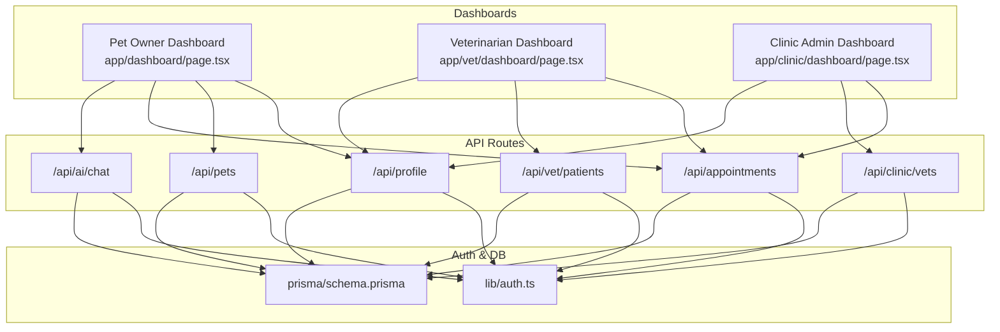
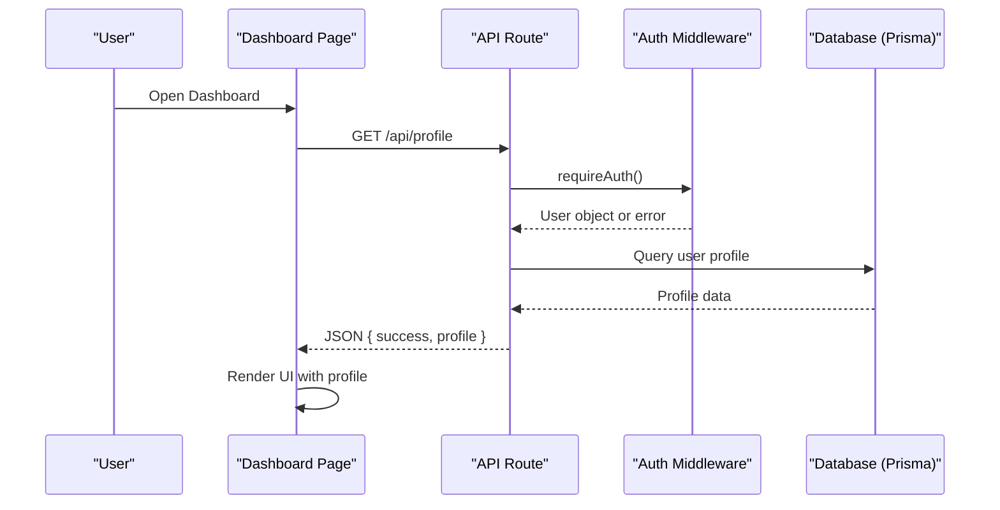
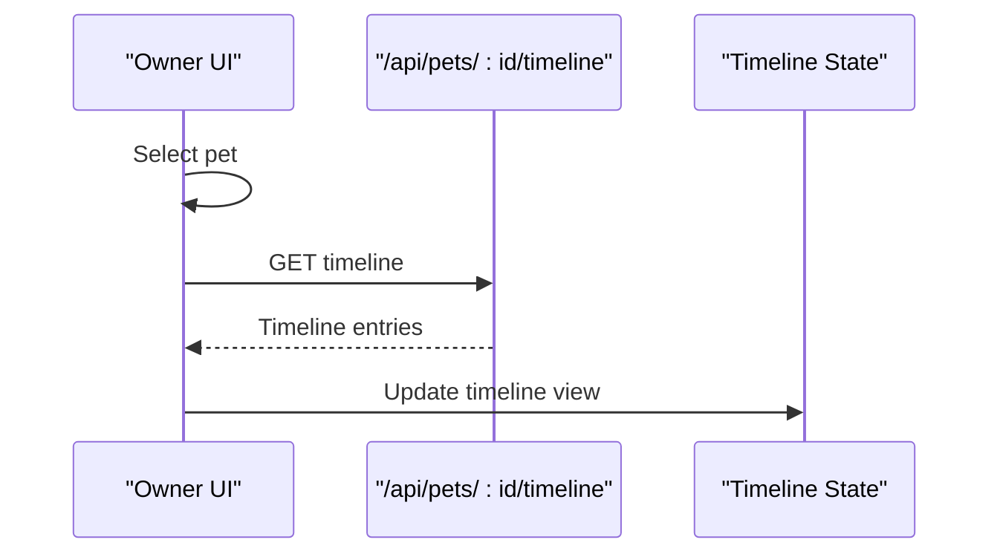
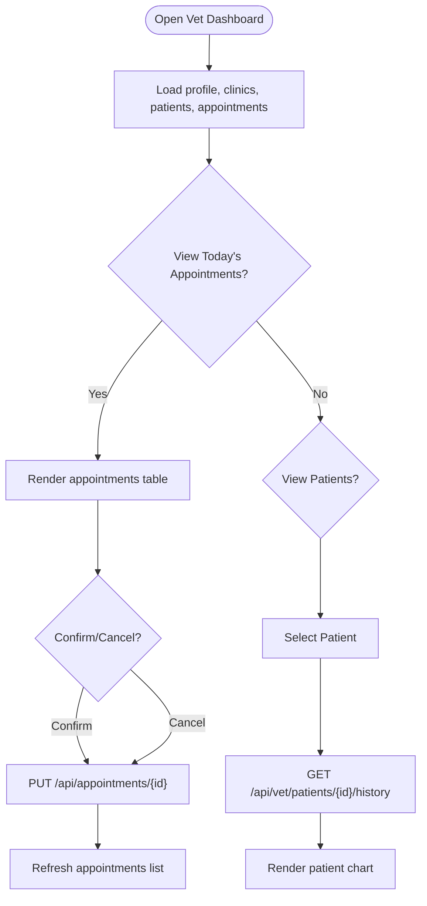
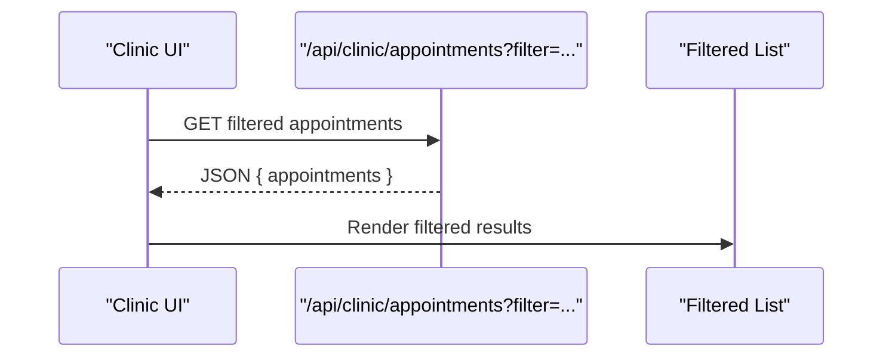
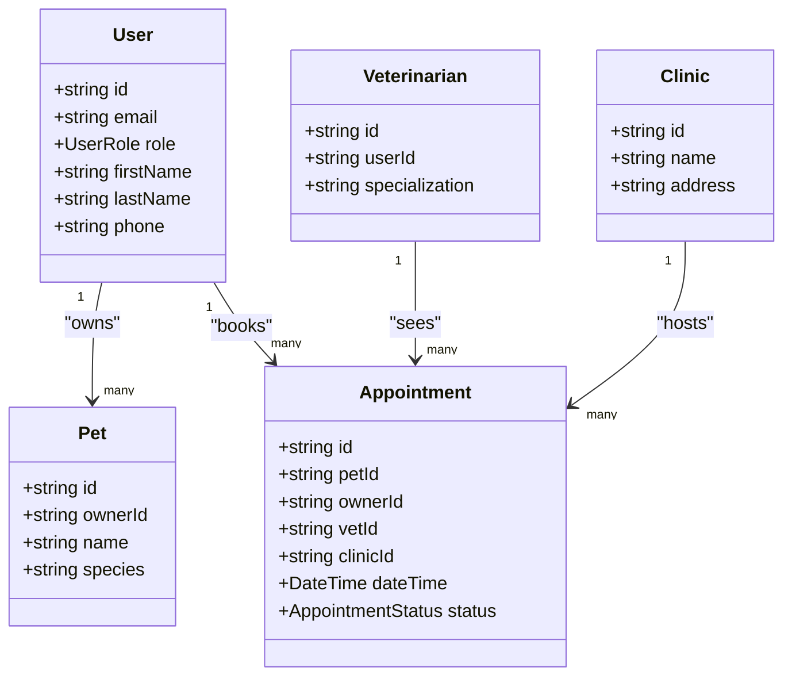

# User Dashboards

<cite>
**Referenced Files in This Document**
- [page.tsx](file://app/dashboard/page.tsx)
- [page.tsx](file://app/vet/dashboard/page.tsx)
- [page.tsx](file://app/clinic/dashboard/page.tsx)
- [route.ts](file://app/api/profile/route.ts)
- [route.ts](file://app/api/pets/route.ts)
- [route.ts](file://app/api/appointments/route.ts)
- [route.ts](file://app/api/ai/chat/route.ts)
- [route.ts](file://app/api/vet/patients/route.ts)
- [route.ts](file://app/api/clinic/vets/route.ts)
- [schema.prisma](file://prisma/schema.prisma)
- [auth.ts](file://lib/auth.ts)
- [layout.tsx](file://app/layout.tsx)
- [globals.css](file://app/globals.css)
</cite>

## Table of Contents
1. Introduction
2. Project Structure
3. Core Components
4. Architecture Overview
5. Detailed Component Analysis
6. Dependency Analysis
7. Performance Considerations
8. Troubleshooting Guide
9. Conclusion
10. Appendices

## Introduction
This document explains the PETIVA user dashboards for three roles: Pet Owners, Veterinarians, and Clinic Administrators. It covers role-specific interfaces, shared component architecture, data flows, performance strategies, accessibility considerations, and customization options. The dashboards are implemented as Next.js client components with server-side API routes that enforce authentication and authorization.

## Project Structure
The dashboard UIs live under app/[role]/dashboard/page.tsx. Each dashboard is a self-contained client component that:
- Renders a sidebar navigation
- Displays role-specific content panels
- Fetches data from Next.js API routes
- Manages local state for modals, forms, and tabs

Shared styling uses Tailwind CSS via globals.css and a root layout that sets base styles and metadata.

**Diagram sources**
- [page.tsx:1-120](file://app/dashboard/page.tsx#L1-L120)
- [page.tsx:1-120](file://app/vet/dashboard/page.tsx#L1-L120)
- [page.tsx:1-120](file://app/clinic/dashboard/page.tsx#L1-L120)
- [route.ts:1-82](file://app/api/profile/route.ts#L1-L82)
- [route.ts:1-69](file://app/api/pets/route.ts#L1-L69)
- [route.ts:1-143](file://app/api/appointments/route.ts#L1-L143)
- [route.ts:1-71](file://app/api/vet/patients/route.ts#L1-L71)
- [route.ts:1-65](file://app/api/clinic/vets/route.ts#L1-L65)
- [route.ts:1-349](file://app/api/ai/chat/route.ts#L1-L349)
- [auth.ts:1-125](file://lib/auth.ts#L1-L125)
- [schema.prisma:1-312](file://prisma/schema.prisma#L1-L312)

**Section sources**
- [layout.tsx:1-16](file://app/layout.tsx#L1-L16)
- [globals.css:1-20](file://app/globals.css#L1-L20)

## Core Components
- Shared layout pattern:
  - Sidebar navigation with role label (e.g., “Veterinarian”, “Clinic Admin”)
  - Main workspace area with tabbed sections
  - Error and success banners
  - Logout action
- Role-specific features:
  - Pet Owner: health overview panels, upcoming appointments, pet profiles, quick actions, AI assistant chat
  - Veterinarian: patient management, medical record access, schedule visualization, clinical tools
  - Clinic Admin: staff management, analytics reporting, performance metrics, operational controls

**Section sources**
- [page.tsx:380-760](file://app/dashboard/page.tsx#L380-L760)
- [page.tsx:216-529](file://app/vet/dashboard/page.tsx#L216-L529)
- [page.tsx:156-402](file://app/clinic/dashboard/page.tsx#L156-L402)

## Architecture Overview
The dashboards follow a client-server model:
- Client components manage UI state and render views
- Server API routes handle authentication, authorization, and database operations
- Prisma schema defines entities such as User, Pet, Appointment, Veterinarian, Clinic, MedicalRecord, and AIConversation

**Diagram sources**
- [route.ts:1-82](file://app/api/profile/route.ts#L1-L82)
- [auth.ts:99-125](file://lib/auth.ts#L99-L125)
- [schema.prisma:30-53](file://prisma/schema.prisma#L30-L53)

## Detailed Component Analysis

### Pet Owner Dashboard
Key capabilities:
- Health overview panels: vaccinations, medications, allergies, last visit
- Upcoming appointment card with cancel action
- Recent health activity timeline
- Quick actions: add pet, book appointment
- AI Assistant chat with streaming responses and conversation history per pet

Data flow highlights:
- Loads profile, pets, appointments, discovery vets on mount
- Selecting a pet fetches its timeline
- Booking creates an appointment and refreshes lists
- AI chat persists messages and supports NDJSON streaming

**Diagram sources**
- [page.tsx:124-138](file://app/dashboard/page.tsx#L124-L138)

Accessibility and keyboard support:
- All interactive elements are buttons with clear labels
- Forms use semantic inputs and labels
- Focus management is implicit; consider adding explicit focus traps for modals if expanded

Performance notes:
- Initial load batches multiple fetches; consider parallelization where appropriate
- AI chat uses streaming to improve perceived responsiveness

Customization:
- Tabs allow switching between dashboard, pets, appointments, AI, and profile
- Quick actions provide shortcuts to common tasks

**Section sources**
- [page.tsx:45-96](file://app/dashboard/page.tsx#L45-L96)
- [page.tsx:124-138](file://app/dashboard/page.tsx#L124-L138)
- [page.tsx:232-280](file://app/dashboard/page.tsx#L232-L280)
- [page.tsx:282-358](file://app/dashboard/page.tsx#L282-L358)
- [page.tsx:489-760](file://app/dashboard/page.tsx#L489-L760)

### Veterinarian Dashboard
Key capabilities:
- Stats row: today’s appointments, upcoming count, patients under care, pending actions
- Today’s appointments table with confirm/cancel actions
- Patients index and detail modal with medical records
- Health records entry form within patient chart
- Clinic associations view

Data flow highlights:
- Loads vet profile, clinics, patients, appointments on mount
- Selecting a patient loads detailed history
- Updating appointment status refreshes related lists

**Diagram sources**
- [page.tsx:43-84](file://app/vet/dashboard/page.tsx#L43-L84)
- [page.tsx:86-108](file://app/vet/dashboard/page.tsx#L86-L108)
- [page.tsx:162-189](file://app/vet/dashboard/page.tsx#L162-L189)

Accessibility and keyboard support:
- Tables and lists are navigable via keyboard
- Modal dialogs include close button; ensure focus trapping when implementing full modal behavior

Performance notes:
- Filtering and pagination can be added for large appointment lists
- De-duplication of patients avoids redundant rows

Customization:
- Navigation tabs: dashboard, appointments, patients, records, clinic, profile
- Quick actions streamline scheduling and record entry

**Section sources**
- [page.tsx:216-529](file://app/vet/dashboard/page.tsx#L216-L529)
- [page.tsx:531-598](file://app/vet/dashboard/page.tsx#L531-L598)
- [page.tsx:599-701](file://app/vet/dashboard/page.tsx#L599-L701)

### Clinic Administration Dashboard
Key capabilities:
- Stats row: today’s appointments, upcoming count, number of veterinarians, clinic location
- Today’s scheduled visits table with details modal
- Filtered appointments view with status filters
- Associated veterinarians index
- Clinic profile editing

Data flow highlights:
- Loads admin profile, clinic info, vets, and appointments on mount
- Filtering triggers server-side query with filter parameter
- Profile updates persist changes and refresh UI

**Diagram sources**
- [page.tsx:84-99](file://app/clinic/dashboard/page.tsx#L84-L99)

Accessibility and keyboard support:
- Filters use accessible select elements
- Buttons have descriptive text for screen readers

Performance notes:
- Server-side filtering reduces payload size
- Lazy loading of details via modal improves initial load time

Customization:
- Navigation tabs: dashboard, appointments, vets, profile
- Filters: ALL, TODAY, UPCOMING, CONFIRMED, CANCELLED

**Section sources**
- [page.tsx:156-402](file://app/clinic/dashboard/page.tsx#L156-L402)
- [page.tsx:404-454](file://app/clinic/dashboard/page.tsx#L404-L454)
- [page.tsx:456-544](file://app/clinic/dashboard/page.tsx#L456-L544)

## Dependency Analysis
Role-based routing and permissions:
- API routes enforce authentication via requireAuth and role checks via requireRole
- Data access is scoped by role:
  - Pet Owner: own pets and appointments
  - Veterinarian: associated patients and appointments
  - Clinic Admin: clinic-scoped appointments and vets

**Diagram sources**
- [schema.prisma:30-53](file://prisma/schema.prisma#L30-L53)
- [schema.prisma:68-88](file://prisma/schema.prisma#L68-L88)
- [schema.prisma:90-105](file://prisma/schema.prisma#L90-L105)
- [schema.prisma:107-131](file://prisma/schema.prisma#L107-L131)
- [schema.prisma:164-182](file://prisma/schema.prisma#L164-L182)

**Section sources**
- [route.ts:1-143](file://app/api/appointments/route.ts#L1-L143)
- [route.ts:1-71](file://app/api/vet/patients/route.ts#L1-L71)
- [route.ts:1-65](file://app/api/clinic/vets/route.ts#L1-L65)
- [auth.ts:99-125](file://lib/auth.ts#L99-L125)

## Performance Considerations
- Parallel data fetching:
  - Dashboards fetch multiple resources on mount; consider using Promise.all for concurrent requests to reduce total load time
- Lazy loading:
  - Load pet timelines and patient histories only when selected
  - Use modals for detailed views to avoid heavy initial renders
- Efficient data fetching:
  - Server-side filtering for appointments reduces payload size
  - De-duplicate patient lists on the server to minimize client processing
- Streaming AI responses:
  - NDJSON streaming provides immediate feedback during long-running AI operations
- Pagination and virtualization:
  - For large datasets (e.g., many appointments), implement server-side pagination and client-side virtual scrolling
- Caching:
  - Consider React Query or SWR for caching and background refetching of dashboard data
- Image optimization:
  - Use optimized images and lazy loading for pet photos and avatars

[No sources needed since this section provides general guidance]

## Troubleshooting Guide
Common issues and resolutions:
- Authentication failures:
  - Ensure session cookie is present and valid; check requireAuth behavior
  - Verify session expiration and sliding window logic
- Authorization errors:
  - Confirm role-based access; e.g., clinic admins must have clinicId set
- Data not loading:
  - Check API route responses and network errors
  - Validate required fields in POST requests (e.g., booking fields)
- Double-booking prevention:
  - Appointment creation includes conflict detection; handle 409 conflicts gracefully
- AI chat errors:
  - Handle stream interruptions and malformed responses
  - Validate pet ownership before starting new conversations

**Section sources**
- [route.ts:1-82](file://app/api/profile/route.ts#L1-L82)
- [route.ts:1-143](file://app/api/appointments/route.ts#L1-L143)
- [route.ts:1-349](file://app/api/ai/chat/route.ts#L1-L349)
- [auth.ts:1-125](file://lib/auth.ts#L1-L125)

## Conclusion
PETIVA’s dashboards provide role-specific experiences with consistent navigation patterns and robust data flows. The Pet Owner dashboard emphasizes health insights and convenience, the Veterinarian dashboard focuses on patient management and clinical workflows, and the Clinic Admin dashboard offers operational oversight. Shared architecture ensures maintainability, while performance and accessibility considerations enhance usability across devices.

[No sources needed since this section summarizes without analyzing specific files]

## Appendices

### Responsive Design Approach
- Mobile-first layouts using Tailwind utilities
- Flexible grids adapt from single-column on small screens to multi-column on larger screens
- Sidebar remains fixed width on desktop; consider collapsible navigation on mobile for improved ergonomics

[No sources needed since this section provides general guidance]

### Accessibility and Keyboard Navigation
- Semantic HTML elements and ARIA attributes where necessary
- Keyboard operable controls with visible focus states
- Screen reader-friendly labels and descriptions for icons and buttons

[No sources needed since this section provides general guidance]

### Customization Options and Personalization
- Tab-based navigation allows users to switch contexts quickly
- Quick action panels provide shortcuts to frequent tasks
- AI assistant chat personalizes responses based on selected pet context

[No sources needed since this section provides general guidance]