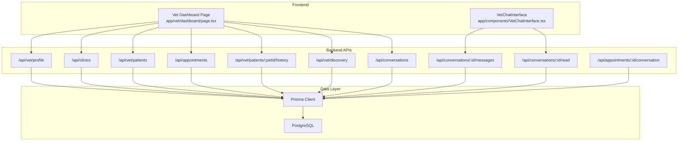
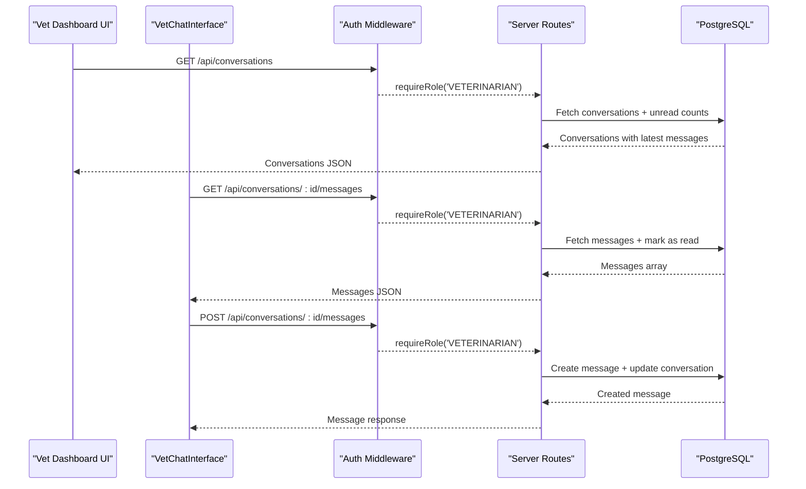
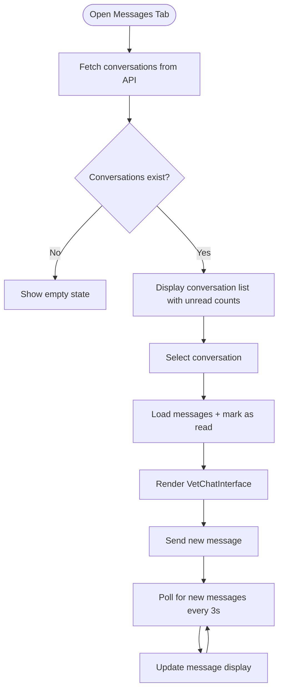
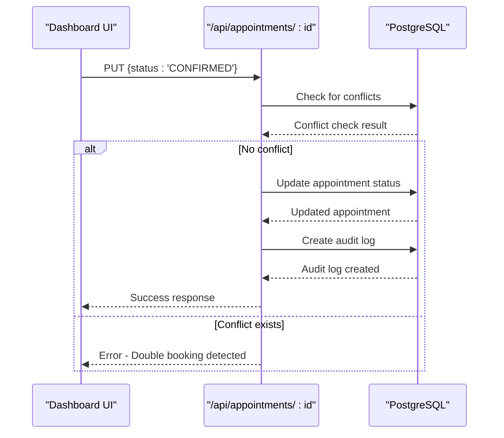
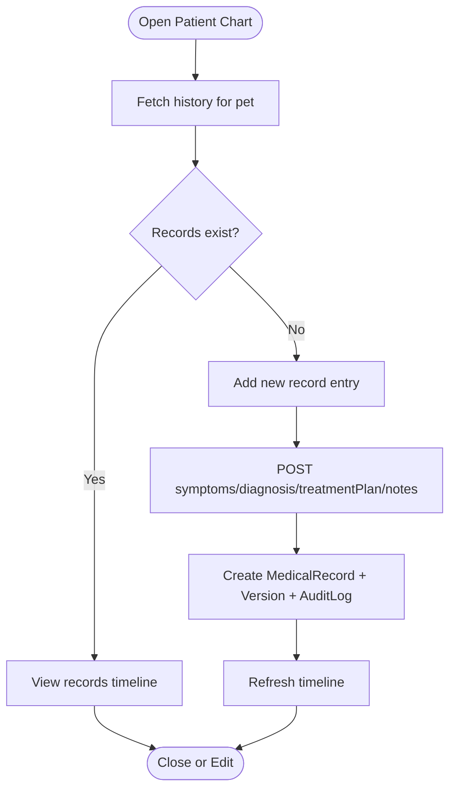
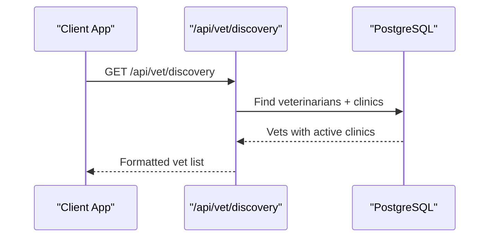
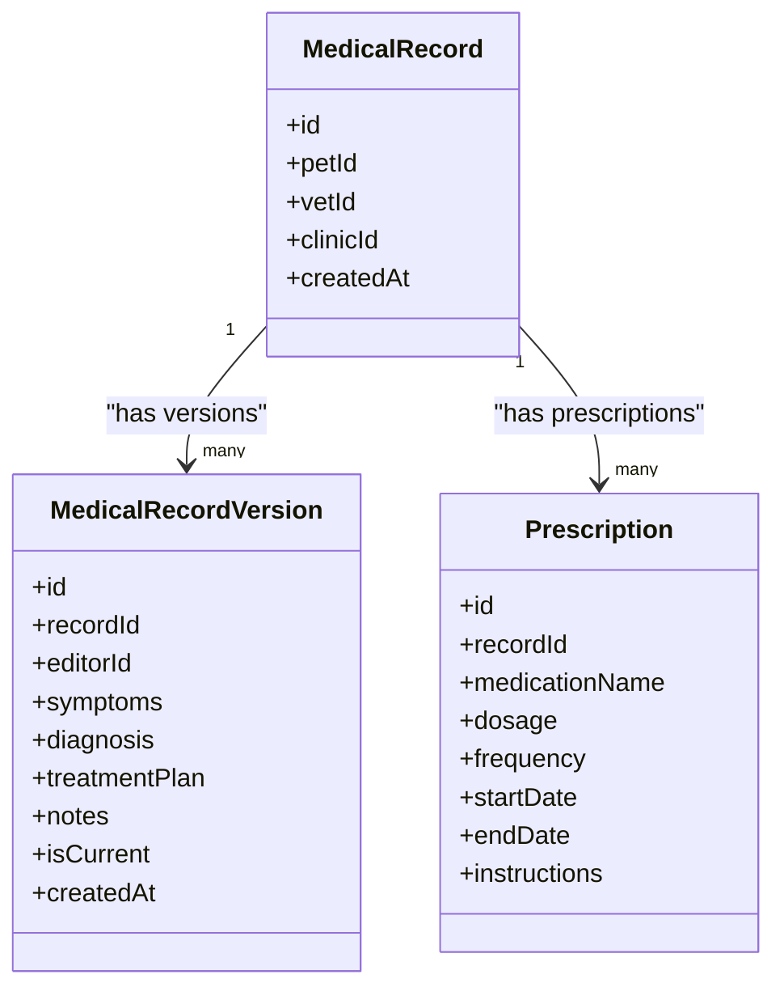
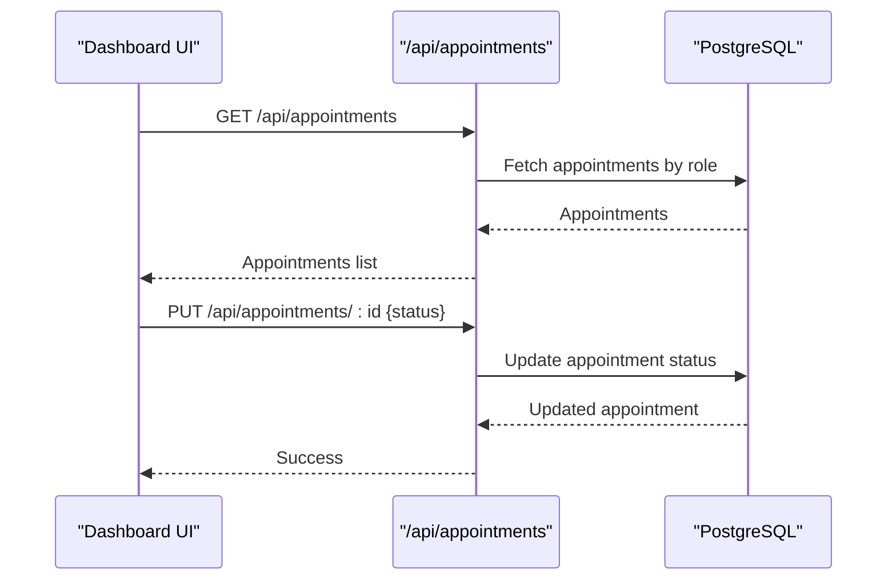
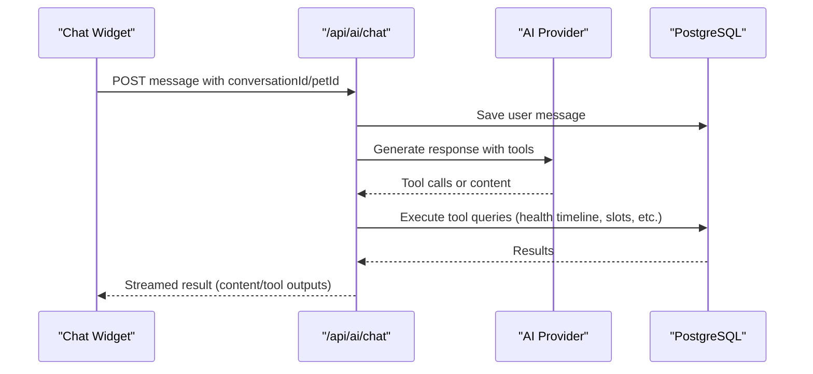
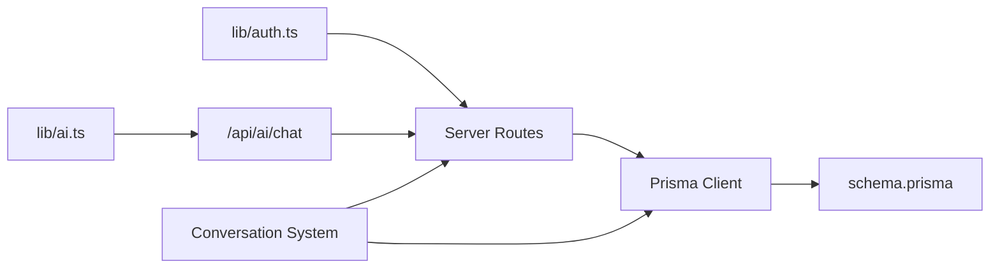

# Veterinarian Dashboard

<cite>
**Referenced Files in This Document**
- [page.tsx](file://app/vet/dashboard/page.tsx)
- [VetChatInterface.tsx](file://app/components/VetChatInterface.tsx)
- [route.ts (patients)](file://app/api/vet/patients/route.ts)
- [route.ts (patient detail)](file://app/api/vet/patients/[petId]/route.ts)
- [route.ts (history)](file://app/api/vet/patients/[petId]/history/route.ts)
- [route.ts (discovery)](file://app/api/vet/discovery/route.ts)
- [route.ts (profile)](file://app/api/vet/profile/route.ts)
- [route.ts (appointments)](file://app/api/appointments/route.ts)
- [route.ts (appointment status)](file://app/api/appointments/[appointmentId]/route.ts)
- [route.ts (clinics)](file://app/api/clinics/route.ts)
- [route.ts (conversations)](file://app/api/conversations/route.ts)
- [route.ts (conversation messages)](file://app/api/conversations/[conversationId]/messages/route.ts)
- [route.ts (mark read)](file://app/api/conversations/[conversationId]/read/route.ts)
- [route.ts (appointment conversation)](file://app/api/appointments/[appointmentId]/conversation/route.ts)
- [schema.prisma](file://prisma/schema.prisma)
- [auth.ts](file://lib/auth.ts)
- [chat route.ts](file://app/api/ai/chat/route.ts)
- [ai.ts](file://lib/ai.ts)
</cite>

## Update Summary
**Changes Made**
- Added comprehensive conversation viewing capabilities with real-time messaging
- Enhanced appointment management with improved status handling and conflict detection
- Integrated VetChatInterface component for seamless communication between veterinarians and pet owners
- Added unread message tracking and notification system
- Implemented conversation persistence linked to appointments
- Enhanced security with role-based access control for conversations

## Table of Contents
1. [Introduction](#introduction)
2. [Project Structure](#project-structure)
3. [Core Components](#core-components)
4. [Architecture Overview](#architecture-overview)
5. [Detailed Component Analysis](#detailed-component-analysis)
6. [Dependency Analysis](#dependency-analysis)
7. [Performance Considerations](#performance-considerations)
8. [Troubleshooting Guide](#troubleshooting-guide)
9. [Conclusion](#conclusion)
10. [Appendices](#appendices)

## Introduction
This document explains the Veterinarian Dashboard in PETIVA, focusing on how veterinarians manage patients, view medical histories and vaccination status, create treatment plans, schedule appointments, discover new clients and pets, collaborate with clinic staff, use AI-assisted clinical decision support, and access analytics. The dashboard now includes comprehensive conversation viewing capabilities, allowing veterinarians to communicate directly with pet owners through an integrated chat interface, while maintaining enhanced appointment management features and improved workflow efficiency.

## Project Structure
The dashboard is a Next.js client component that orchestrates multiple server routes to load vet profile, clinics, patients, appointments, and conversations. It provides views for:
- Dashboard overview with stats and quick actions
- Appointments scheduling and management with enhanced status handling
- Patient index and detailed chart modal
- Health records entry and viewing
- **New**: Conversation management with real-time messaging
- Clinic associations
- Profile settings

**Diagram sources**
- [page.tsx:42-84](file://app/vet/dashboard/page.tsx#L42-L84)
- [VetChatInterface.tsx:56-85](file://app/components/VetChatInterface.tsx#L56-L85)
- [route.ts (conversations):5-82](file://app/api/conversations/route.ts#L5-L82)
- [route.ts (conversation messages):5-38](file://app/api/conversations/[conversationId]/messages/route.ts#L5-L38)
- [route.ts (mark read):5-41](file://app/api/conversations/[conversationId]/read/route.ts#L5-L41)

**Section sources**
- [page.tsx:42-84](file://app/vet/dashboard/page.tsx#L42-L84)
- [schema.prisma:30-350](file://prisma/schema.prisma#L30-L350)

## Core Components
- Vet Dashboard UI: Loads profile, clinics, patients, appointments, and conversations; renders today's appointments, patient list, quick actions, and profile editor.
- **New**: Conversation Management: Displays all conversations with unread message counts and provides access to real-time chat interface.
- **New**: VetChatInterface: Real-time messaging component with auto-refresh, message sending, and read receipt functionality.
- Patient Management: Lists authorized patients based on confirmed appointments; opens a modal to view full history and add records.
- Appointment Management: Displays all appointments with confirm/cancel actions; enforces role-based filtering and conflict detection.
- Health Records: Creates structured medical record entries with symptoms, diagnosis, treatment plan, and notes; persists as versions with audit logging.
- Discovery: Retrieves available veterinarians and their active clinic associations for discovery workflows.
- Profile Settings: Updates veterinarian personal and professional details.

**Section sources**
- [page.tsx:216-948](file://app/vet/dashboard/page.tsx#L216-L948)
- [VetChatInterface.tsx:1-222](file://app/components/VetChatInterface.tsx#L1-L222)
- [route.ts (patients):6-71](file://app/api/vet/patients/route.ts#L6-L71)
- [route.ts (history):7-153](file://app/api/vet/patients/[petId]/history/route.ts#L7-L153)
- [route.ts (appointments):7-143](file://app/api/appointments/route.ts#L7-L143)
- [route.ts (conversations):5-82](file://app/api/conversations/route.ts#L5-L82)

## Architecture Overview
The dashboard uses a client-server architecture with Next.js App Router. The frontend calls REST endpoints secured by role-based middleware. Data is modeled with Prisma and stored in PostgreSQL. AI features are integrated via a chat endpoint that streams responses and executes tools to query or modify data. **Enhanced** with conversation management system supporting real-time messaging between veterinarians and pet owners.

**Diagram sources**
- [route.ts (conversations):5-82](file://app/api/conversations/route.ts#L5-L82)
- [route.ts (conversation messages):5-38](file://app/api/conversations/[conversationId]/messages/route.ts#L5-L38)
- [route.ts (mark read):5-41](file://app/api/conversations/[conversationId]/read/route.ts#L5-L41)
- [auth.ts:109-125](file://lib/auth.ts#L109-L125)

## Detailed Component Analysis

### Conversation Viewing and Messaging System
**New Feature**: The dashboard now includes comprehensive conversation management capabilities, allowing veterinarians to communicate directly with pet owners through an integrated chat interface.

- **Conversation List**: Displays all conversations associated with the veterinarian, showing pet names, owner information, latest messages, and unread message counts with visual indicators.
- **Real-time Messaging**: The VetChatInterface component provides real-time messaging with automatic polling every 3 seconds to fetch new messages and mark them as read.
- **Message Persistence**: All conversations are linked to specific appointments, ensuring proper context and traceability for veterinary consultations.
- **Read Receipts**: Automatic marking of messages as read when viewed, with unread count tracking for both veterinarians and pet owners.
- **Authorization**: Role-based access control ensures only authorized parties can access conversations related to their appointments.

**Diagram sources**
- [page.tsx:167-182](file://app/vet/dashboard/page.tsx#L167-L182)
- [page.tsx:742-806](file://app/vet/dashboard/page.tsx#L742-L806)
- [VetChatInterface.tsx:56-85](file://app/components/VetChatInterface.tsx#L56-L85)
- [route.ts (conversations):5-82](file://app/api/conversations/route.ts#L5-L82)

**Section sources**
- [page.tsx:167-182](file://app/vet/dashboard/page.tsx#L167-L182)
- [page.tsx:742-806](file://app/vet/dashboard/page.tsx#L742-L806)
- [VetChatInterface.tsx:1-222](file://app/components/VetChatInterface.tsx#L1-L222)
- [route.ts (conversations):5-82](file://app/api/conversations/route.ts#L5-L82)
- [route.ts (conversation messages):5-104](file://app/api/conversations/[conversationId]/messages/route.ts#L5-L104)
- [route.ts (mark read):5-41](file://app/api/conversations/[conversationId]/read/route.ts#L5-L41)

### Enhanced Appointment Management
**Enhanced**: Appointment management now includes improved status handling, conflict detection, and better integration with the conversation system.

- **Status Validation**: Enhanced validation ensures only valid status transitions are allowed based on user roles and appointment context.
- **Conflict Detection**: Prevents double bookings by checking for existing confirmed appointments at the same time slot before confirming new ones.
- **Audit Logging**: All appointment status changes are logged with detailed payload information for security and compliance purposes.
- **Conversation Integration**: Appointments automatically generate conversation threads when they reach CONFIRMED or COMPLETED status.

**Diagram sources**
- [route.ts (appointment status):66-82](file://app/api/appointments/[appointmentId]/route.ts#L66-L82)
- [route.ts (appointment status):84-105](file://app/api/appointments/[appointmentId]/route.ts#L84-L105)

**Section sources**
- [route.ts (appointment status):6-119](file://app/api/appointments/[appointmentId]/route.ts#L6-L119)
- [page.tsx:184-210](file://app/vet/dashboard/page.tsx#L184-L210)

### Patient Management Interface
- Assigned Patients: The dashboard lists patients associated with the logged-in veterinarian through confirmed appointments. The backend de-duplicates pets and includes owner contact details.
- Patient Chart Modal: Selecting a patient opens a modal showing species, breed, gender, weight, and a timeline of clinical records.
- Medical History Access: The history endpoint aggregates medical records, vaccinations, medications, allergies, conditions, and metrics in parallel for performance.
- Treatment Plan Creation: The UI allows adding symptoms, diagnosis, treatment plan, and notes. The backend creates a new medical record header and version within a transaction and logs an audit event.

**Diagram sources**
- [route.ts (history):7-69](file://app/api/vet/patients/[petId]/history/route.ts#L7-L69)
- [route.ts (history):72-153](file://app/api/vet/patients/[petId]/history/route.ts#L72-L153)
- [page.tsx:86-108](file://app/vet/dashboard/page.tsx#L86-L108)
- [page.tsx:134-160](file://app/vet/dashboard/page.tsx#L134-L160)

**Section sources**
- [route.ts (patients):6-71](file://app/api/vet/patients/route.ts#L6-L71)
- [route.ts (history):7-153](file://app/api/vet/patients/[petId]/history/route.ts#L7-L153)
- [page.tsx:86-108](file://app/vet/dashboard/page.tsx#L86-L108)
- [page.tsx:134-160](file://app/vet/dashboard/page.tsx#L134-L160)
- [schema.prisma:133-162](file://prisma/schema.prisma#L133-L162)

### Discovery System for New Clients and Pets
- Veterinarian Discovery: The discovery endpoint returns verified veterinarians with their active clinic associations, enabling clients to find specialists and locations.
- Filtering Capabilities: While the current implementation returns all vets with optional specialization context via AI tools, future enhancements can add location-based filters using clinic addresses.

**Diagram sources**
- [route.ts (discovery):6-60](file://app/api/vet/discovery/route.ts#L6-L60)
- [schema.prisma:90-131](file://prisma/schema.prisma#L90-L131)

**Section sources**
- [route.ts (discovery):6-60](file://app/api/vet/discovery/route.ts#L6-L60)
- [schema.prisma:90-131](file://prisma/schema.prisma#L90-L131)

### Clinical Tools: Medical Records, Prescriptions, Diagnosis Logging, Treatment Plans
- Medical Record Writing: The dashboard form captures symptoms, diagnosis, treatment plan, and optional notes. The backend validates required fields and persists a new record and version atomically.
- Prescription Management: The schema supports prescriptions linked to medical records with medication name, dosage, frequency, start/end dates, and instructions.
- Diagnosis Logging: Each record version stores diagnosis and timestamps, enabling revision tracking and audit trails.
- Treatment Plan Creation: Stored per record version; visible in the patient chart timeline.

**Diagram sources**
- [schema.prisma:133-194](file://prisma/schema.prisma#L133-L194)

**Section sources**
- [route.ts (history):72-153](file://app/api/vet/patients/[petId]/history/route.ts#L72-L153)
- [schema.prisma:133-194](file://prisma/schema.prisma#L133-L194)

### Schedule Visualization: Daily Appointments, Time Slots, Availability Management
- Today's Appointments: The dashboard computes today's non-cancelled appointments and displays them in a table with time, pet, owner, reason, clinic, and status.
- Appointment Actions: Confirm or cancel actions update appointment status and refresh both appointments and patients lists.
- Availability Management: The AI assistant integrates slot checking and booking logic to prevent double bookings and enforce working hours.

**Diagram sources**
- [page.tsx:162-189](file://app/vet/dashboard/page.tsx#L162-L189)
- [route.ts (appointments):7-67](file://app/api/appointments/route.ts#L7-L67)
- [route.ts (appointments):69-143](file://app/api/appointments/route.ts#L69-L143)

**Section sources**
- [page.tsx:211-215](file://app/vet/dashboard/page.tsx#L211-L215)
- [page.tsx:531-566](file://app/vet/dashboard/page.tsx#L531-L566)
- [route.ts (appointments):69-143](file://app/api/appointments/route.ts#L69-L143)

### Patient Search and Filtering, Medical History Access, Collaborative Features
- Patient Index: Lists all patients under care with quick "View Chart" actions.
- Filtering: Current implementation shows all assigned patients; additional filters (e.g., by species or upcoming appointments) can be added at the UI layer.
- Collaborative Features: Medical records include editor tracking and audit logs, supporting multi-staff collaboration and traceability.

**Section sources**
- [page.tsx:568-590](file://app/vet/dashboard/page.tsx#L568-L590)
- [route.ts (history):7-69](file://app/api/vet/patients/[petId]/history/route.ts#L7-L69)
- [schema.prisma:148-162](file://prisma/schema.prisma#L148-L162)
- [schema.prisma:298-311](file://prisma/schema.prisma#L298-L311)

### Performance Metrics and Analytics
- Dashboard Metrics: Displays counts for today's appointments, upcoming appointments (next 7 days), total patients under care, and pending actions (REQUESTED).
- Analytics Extensibility: The schema supports health metrics and audit logs; future dashboards can aggregate these for practice analytics.

**Section sources**
- [page.tsx:354-386](file://app/vet/dashboard/page.tsx#L354-L386)
- [schema.prisma:236-244](file://prisma/schema.prisma#L236-L244)
- [schema.prisma:298-311](file://prisma/schema.prisma#L298-L311)

### AI Assistant Integration: Clinical Decision Support and Automated Reports
- Chat Endpoint: Streams AI responses, manages conversation context per user and pet, and executes tools to retrieve health timelines, vaccinations, medications, allergies, appointments, and to book visits.
- Tool Execution: Validates ownership, checks availability, prevents double bookings, enforces working hours, and persists results.
- Report Generation: The AI can summarize health timelines and generate understandable summaries based on retrieved data.

**Diagram sources**
- [chat route.ts:68-349](file://app/api/ai/chat/route.ts#L68-L349)
- [ai.ts:141-467](file://lib/ai.ts#L141-L467)

**Section sources**
- [chat route.ts:68-349](file://app/api/ai/chat/route.ts#L68-L349)
- [ai.ts:141-467](file://lib/ai.ts#L141-L467)

### Responsive Design and Accessibility Considerations
- Responsive Layout: Uses Tailwind CSS classes for flexible grids and spacing; adapts from mobile to desktop layouts.
- Dark Mode: Supports dark theme toggling via utility classes.
- Accessibility: Buttons and inputs have clear labels; icons are used alongside text for clarity; focus states are styled for keyboard navigation.

**Section sources**
- [page.tsx:216-948](file://app/vet/dashboard/page.tsx#L216-L948)

## Dependency Analysis
- Authentication and Authorization: All protected routes rely on middleware to validate sessions and roles.
- Data Models: Prisma schema defines relationships between User, Pet, Veterinarian, Clinic, Appointment, MedicalRecord, Conversation, and Message entities.
- AI Tools: The AI module defines tool schemas and execution logic that interact with the database to provide clinical insights and scheduling capabilities.
- **New**: Conversation System: Integrated messaging system with real-time updates, read receipts, and appointment linkage.

**Diagram sources**
- [auth.ts:109-125](file://lib/auth.ts#L109-L125)
- [schema.prisma:30-350](file://prisma/schema.prisma#L30-L350)
- [ai.ts:141-467](file://lib/ai.ts#L141-L467)
- [chat route.ts:68-349](file://app/api/ai/chat/route.ts#L68-L349)

**Section sources**
- [auth.ts:109-125](file://lib/auth.ts#L109-L125)
- [schema.prisma:30-350](file://prisma/schema.prisma#L30-L350)
- [ai.ts:141-467](file://lib/ai.ts#L141-L467)

## Performance Considerations
- Parallel Queries: The history endpoint uses Promise.all to fetch multiple datasets concurrently, reducing latency.
- De-duplication: Patient lists are de-duplicated to avoid redundant rows.
- Session Expiration: Sliding window session extension improves UX while maintaining security.
- AI Context Limiting: Conversation history is limited to recent messages to control context size and cost.
- **New**: Real-time Polling: Conversation messages are polled every 3 seconds to ensure timely delivery without overwhelming the server.
- **New**: Read Receipt Optimization: Messages are marked as read efficiently using bulk updates to minimize database operations.

**Section sources**
- [route.ts (history):23-44](file://app/api/vet/patients/[petId]/history/route.ts#L23-L44)
- [route.ts (patients):43-57](file://app/api/vet/patients/route.ts#L43-L57)
- [auth.ts:65-75](file://lib/auth.ts#L65-L75)
- [chat route.ts:137-143](file://app/api/ai/chat/route.ts#L137-L143)
- [VetChatInterface.tsx:77-85](file://app/components/VetChatInterface.tsx#L77-L85)
- [route.ts (mark read):29-39](file://app/api/conversations/[conversationId]/read/route.ts#L29-L39)

## Troubleshooting Guide
- Authentication Errors: If a route returns FORBIDDEN or UNAUTHORIZED, verify the session cookie and role requirements.
- Not Found Errors: Ensure the veterinarian profile exists and is linked to the authenticated user.
- Validation Errors: Required fields like symptoms, diagnosis, and treatment plan must be provided when creating records.
- Double Booking Prevention: When booking via AI, ensure the selected slot is not already requested or confirmed.
- **New**: Conversation Access Issues: Verify that the conversation exists and the user has proper authorization to access it.
- **New**: Message Delivery Problems: Check network connectivity and ensure the conversation ID is valid when sending messages.

**Section sources**
- [route.ts (profile):36-48](file://app/api/vet/profile/route.ts#L36-L48)
- [route.ts (patients):58-71](file://app/api/vet/patients/route.ts#L58-L71)
- [route.ts (history):89-94](file://app/api/vet/patients/[petId]/history/route.ts#L89-L94)
- [route.ts (appointments):93-110](file://app/api/appointments/route.ts#L93-L110)
- [route.ts (conversation messages):18-28](file://app/api/conversations/[conversationId]/messages/route.ts#L18-L28)
- [route.ts (mark read):18-27](file://app/api/conversations/[conversationId]/read/route.ts#L18-L27)

## Conclusion
The Veterinarian Dashboard provides a comprehensive interface for managing patients, viewing medical histories, scheduling appointments, and collaborating with clinic staff. **Enhanced** with a robust conversation management system that enables real-time communication between veterinarians and pet owners, improving patient care coordination and client engagement. The integrated chat interface, combined with enhanced appointment management and AI-assisted clinical decision support, creates a complete veterinary practice management solution. The system emphasizes secure access, efficient data retrieval, scalable architecture suitable for veterinary practice management, and seamless communication capabilities.

## Appendices

### Key API Endpoints Summary
- GET /api/vet/profile: Retrieve vet profile
- PUT /api/vet/profile: Update vet profile
- GET /api/vet/patients: List assigned patients
- GET /api/vet/patients/:petId: Get authorized patient details
- GET /api/vet/patients/:petId/history: Fetch full medical history
- POST /api/vet/patients/:petId/history: Create medical record entry
- GET /api/appointments: List appointments by role
- POST /api/appointments: Create appointment request
- PUT /api/appointments/:id: Update appointment status
- GET /api/clinics: List clinics for user or discovery
- GET /api/vet/discovery: Browse available veterinarians
- **New**: GET /api/conversations: List conversations for user
- **New**: GET /api/conversations/:id/messages: Get conversation messages
- **New**: POST /api/conversations/:id/messages: Send message to conversation
- **New**: POST /api/conversations/:id/read: Mark messages as read
- **New**: GET /api/appointments/:id/conversation: Get or create conversation for appointment

**Section sources**
- [route.ts (profile):6-100](file://app/api/vet/profile/route.ts#L6-L100)
- [route.ts (patients):6-80](file://app/api/vet/patients/route.ts#L6-L80)
- [route.ts (history):7-153](file://app/api/vet/patients/[petId]/history/route.ts#L7-L153)
- [route.ts (appointments):7-143](file://app/api/appointments/route.ts#L7-L143)
- [route.ts (appointment status):6-119](file://app/api/appointments/[appointmentId]/route.ts#L6-L119)
- [route.ts (clinics):6-49](file://app/api/clinics/route.ts#L6-L49)
- [route.ts (discovery):6-60](file://app/api/vet/discovery/route.ts#L6-L60)
- [route.ts (conversations):5-82](file://app/api/conversations/route.ts#L5-L82)
- [route.ts (conversation messages):5-104](file://app/api/conversations/[conversationId]/messages/route.ts#L5-L104)
- [route.ts (mark read):5-41](file://app/api/conversations/[conversationId]/read/route.ts#L5-L41)
- [route.ts (appointment conversation):6-64](file://app/api/appointments/[appointmentId]/conversation/route.ts#L6-L64)