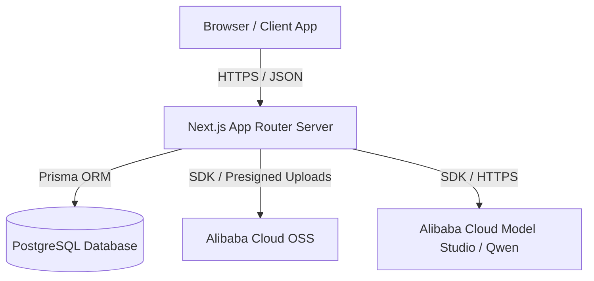
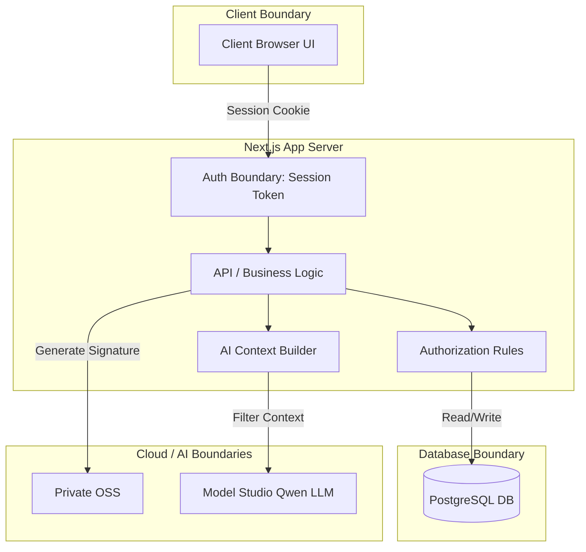
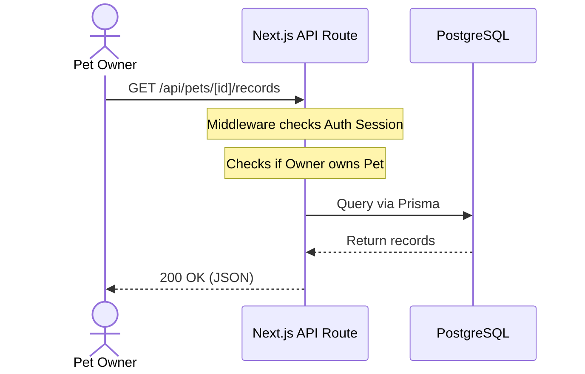
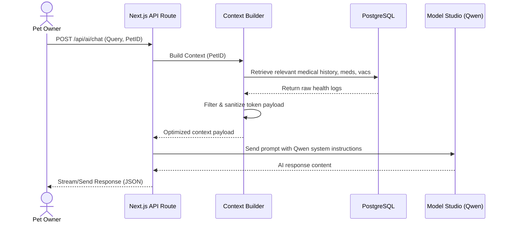

# System Architecture

This document defines the high-level system architecture for the Pet Healthcare Ecosystem MVP, detailing the framework boundaries, data flows, and runtime layers.

---

## 1. Overall Architecture

The platform uses a unified **Next.js (App Router)** structure acting as both the presentation layer (React Server/Client Components) and the backend api/business logic layer (Next.js Route Handlers). This minimizes deployment overhead for the hackathon while preserving a clean separation of concerns.

---

## 2. Layered Component Architecture

### 2.1 Frontend Architecture
*   **Framework:** Next.js (React Server Components for data fetching, Client Components for interactive UI).
*   **State Management:** React Context / Server Actions for state propagation.
*   **Routing:** File-based routing under `/app` directory.

### 2.2 Backend/API Architecture
*   **Routing:** Serverless API endpoints under `/app/api/...`.
*   **Language:** TypeScript with strong parameter typing and runtime validation (using Zod).

### 2.3 Business Logic Layer
*   Encapsulated in reusable service modules under `/lib/services/` (e.g., `petService.ts`, `appointmentService.ts`, `aiContextService.ts`).
*   Decoupled from both direct route handlers and the database ORM, easing testability.

### 2.4 Data Access Layer
*   **ORM:** Prisma Client.
*   **Data Models:** Synchronized automatically via Prisma Migrations to PostgreSQL.

---

## 3. Boundaries & Security Perimeters

### 3.1 Authentication Boundary
*   Protects all private frontend routes and `/api` routes (except signup/login).
*   Validates session tokens/cookies on every request.

### 3.2 Authorization Boundary
*   Enforces Role-Based Access Control (RBAC) at the server layer.
*   Enforces **Consent-Based Access**: Verifies that a veterinarian has a confirmed appointment or direct owner consent to read a pet's health records.

### 3.3 AI Integration Boundary
*   Limits the data sent to Model Studio/Qwen LLM to only the minimum authorized context.
*   No API credentials or system prompts are ever exposed to the client browser.

### 3.4 File Storage Boundary
*   All medical files are uploaded to private OSS buckets.
*   The browser retrieves time-limited, Signature V4 presigned URLs from Next.js server handlers.

### 3.5 Notification Architecture
*   **In-App first:** Stored in a `Notification` database table.
*   **Subscription:** The client polls or listens to notifications via state updates.
*   **Future extension:** Webhooks to Alibaba Cloud Direct Mail / SMS.

---

## 4. Request Lifecycles

### 4.1 Standard Data Operations Flow

### 4.2 AI Assistant Response Flow

---

## 5. System Operations & Maintenance

### 5.1 Error-Handling Strategy
*   **API Layer:** Catch all uncaught exceptions in custom API middleware and map them to standard HTTP status codes (e.g., 400 Bad Request, 401 Unauthorized, 403 Forbidden, 404 Not Found, 500 Internal Error).
*   **UI Layer:** React Error Boundaries display graceful fallbacks without exposing raw stack traces.

### 5.2 Logging & Observability
*   Console logs are structured as JSON (timestamp, log level, event code, user ID, context) for compatibility with cloud log services.
*   Audit logs persist critical state modifications (such as appointment bookings and record corrections) to the PostgreSQL `AuditLog` table.

### 5.3 Development vs. Production Architecture
*   **Development:** SQLite or Local PostgreSQL container, mock OSS local directories, and stub AI models (if offline) or real sandbox credentials via `.env.local`.
*   **Production:** Alibaba Cloud hosted PostgreSQL database, private OSS buckets, secure environment variables on compute instances, and HTTPS-enforced APIs.
