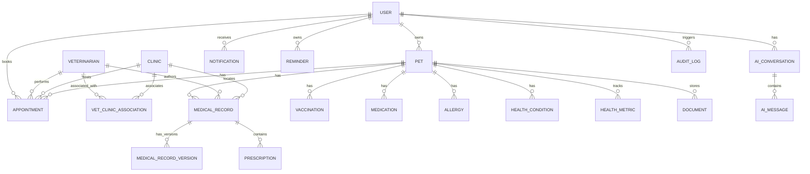

# Database Design

This document details the relational data model for the Pet Healthcare Ecosystem, built on PostgreSQL and managed via Prisma ORM.

---

## 1. Entity Relationship Model



---

## 2. Entity Descriptions & Field Specifications

### 2.1 User
*   **Purpose:** Base credentials, session profile, and role identifier.
*   **Fields:**
    *   `id`: UUID (Primary Key)
    *   `email`: VARCHAR (Unique, Indexed)
    *   `passwordHash`: VARCHAR
    *   `role`: ENUM (`PET_OWNER`, `VETERINARIAN`, `CLINIC_ADMIN`, `PLATFORM_ADMIN`)
    *   `firstName`: VARCHAR
    *   `lastName`: VARCHAR
    *   `phone`: VARCHAR
    *   `createdAt`: TIMESTAMP
    *   `updatedAt`: TIMESTAMP

### 2.2 Pet
*   **Purpose:** Tracks basic profile metrics for each animal.
*   **Fields:**
    *   `id`: UUID (Primary Key)
    *   `ownerId`: UUID (Foreign Key referencing User, Cascades on delete)
    *   `name`: VARCHAR
    *   `species`: VARCHAR (Indexed)
    *   `breed`: VARCHAR
    *   `gender`: VARCHAR
    *   `dateOfBirth`: TIMESTAMP
    *   `weight`: DECIMAL
    *   `createdAt`: TIMESTAMP
    *   `updatedAt`: TIMESTAMP

### 2.3 Veterinarian
*   **Purpose:** Contains profile information and license status for practitioners.
*   **Fields:**
    *   `id`: UUID (Primary Key)
    *   `userId`: UUID (Foreign Key referencing User, Unique)
    *   `specialization`: VARCHAR
    *   `licenseNumber`: VARCHAR (Unique)
    *   `isVerified`: BOOLEAN (Default: false)
    *   `createdAt`: TIMESTAMP
    *   `updatedAt`: TIMESTAMP

### 2.4 Clinic
*   **Purpose:** Defines clinic properties and opening hours.
*   **Fields:**
    *   `id`: UUID (Primary Key)
    *   `name`: VARCHAR
    *   `address`: VARCHAR
    *   `phone`: VARCHAR
    *   `isVerified`: BOOLEAN (Default: false)
    *   `createdAt`: TIMESTAMP
    *   `updatedAt`: TIMESTAMP

### 2.5 VetClinicAssociation (Many-to-Many Join Table)
*   **Purpose:** Maps veterinarians to the clinics they practice in.
*   **Fields:**
    *   `id`: UUID (Primary Key)
    *   `vetId`: UUID (Foreign Key referencing Veterinarian)
    *   `clinicId`: UUID (Foreign Key referencing Clinic)
    *   `status`: ENUM (`PENDING`, `ACTIVE`, `INACTIVE`)
    *   `createdAt`: TIMESTAMP
    *   *Constraints:* Unique composite index on `(vetId, clinicId)`.

### 2.6 MedicalRecord (Chronological, Auditable Header)
*   **Purpose:** Master record locator. The main record header that references the current active version.
*   **Fields:**
    *   `id`: UUID (Primary Key)
    *   `petId`: UUID (Foreign Key referencing Pet)
    *   `vetId`: UUID (Foreign Key referencing Veterinarian, Nullable for external uploads)
    *   `clinicId`: UUID (Foreign Key referencing Clinic, Nullable)
    *   `createdAt`: TIMESTAMP

### 2.7 MedicalRecordVersion (Audit trail/Revisions)
*   **Purpose:** Stores the actual textual inputs, symptoms, and diagnoses. Standard updates append new rows here to preserve the audit trail.
*   **Fields:**
    *   `id`: UUID (Primary Key)
    *   `recordId`: UUID (Foreign Key referencing MedicalRecord, Cascades on delete)
    *   `editorId`: UUID (Foreign Key referencing User)
    *   `symptoms`: TEXT
    *   `diagnosis`: TEXT
    *   `treatmentPlan`: TEXT
    *   `notes`: TEXT
    *   `isCurrent`: BOOLEAN (Default: true)
    *   `createdAt`: TIMESTAMP
    *   *Indexes:* Compound index on `(recordId, isCurrent)`.

### 2.8 Appointment
*   **Purpose:** Reservation workflow and trigger for veterinarian data access.
*   **Fields:**
    *   `id`: UUID (Primary Key)
    *   `petId`: UUID (Foreign Key referencing Pet)
    *   `ownerId`: UUID (Foreign Key referencing User)
    *   `vetId`: UUID (Foreign Key referencing Veterinarian)
    *   `clinicId`: UUID (Foreign Key referencing Clinic)
    *   `dateTime`: TIMESTAMP
    *   `reason`: VARCHAR
    *   `status`: ENUM (`REQUESTED`, `CONFIRMED`, `CANCELLED`, `COMPLETED`, `NO_SHOW`)
    *   `createdAt`: TIMESTAMP

### 2.9 Prescription
*   **Purpose:** Tracks prescribed medications associated with medical records.
*   **Fields:**
    *   `id`: UUID (Primary Key)
    *   `recordId`: UUID (Foreign Key referencing MedicalRecord)
    *   `medicationName`: VARCHAR
    *   `dosage`: VARCHAR
    *   `frequency`: VARCHAR
    *   `startDate`: TIMESTAMP
    *   `endDate`: TIMESTAMP
    *   `instructions`: TEXT

### 2.10 Document
*   **Purpose:** References medical files stored securely inside Alibaba Cloud OSS.
*   **Fields:**
    *   `id`: UUID (Primary Key)
    *   `petId`: UUID (Foreign Key referencing Pet)
    *   `uploaderId`: UUID (Foreign Key referencing User)
    *   `ossKey`: VARCHAR (The private path within OSS)
    *   `fileName`: VARCHAR
    *   `fileType`: VARCHAR
    *   `createdAt`: TIMESTAMP

---

## 3. Proposed Prisma Schema (Conceptual representation)

```prisma
datasource db {
  provider = "postgresql"
  url      = env("DATABASE_URL")
}

generator client {
  provider = "prisma-client-js"
}

enum UserRole {
  PET_OWNER
  VETERINARIAN
  CLINIC_ADMIN
  PLATFORM_ADMIN
}

enum AssociationStatus {
  PENDING
  ACTIVE
  INACTIVE
}

enum AppointmentStatus {
  REQUESTED
  CONFIRMED
  CANCELLED
  COMPLETED
  NO_SHOW
}

model User {
  id           String        @id @default(uuid())
  email        String        @unique
  passwordHash String
  role         UserRole
  firstName    String
  lastName     String
  phone        String?
  createdAt    DateTime      @default(now())
  updatedAt    DateTime      @updatedAt
  pets         Pet[]
  vetProfile   Veterinarian?
  appointments Appointment[]
  notifications Notification[]
  reminders    Reminder[]
  conversations AIConversation[]
  auditLogs    AuditLog[]
  editedVersions MedicalRecordVersion[]
  uploadedDocs Document[]
}

model Pet {
  id             String          @id @default(uuid())
  ownerId        String
  owner          User            @relation(fields: [ownerId], references: [id], onDelete: Cascade)
  name           String
  species        String
  breed          String?
  gender         String?
  dateOfBirth    DateTime?
  weight         Decimal?
  createdAt      DateTime        @default(now())
  updatedAt      DateTime        @updatedAt
  medicalRecords MedicalRecord[]
  vaccinations   Vaccination[]
  medications    Medication[]
  allergies      Allergy[]
  conditions     HealthCondition[]
  metrics        HealthMetric[]
  documents      Document[]
  appointments   Appointment[]
}

model Veterinarian {
  id             String                 @id @default(uuid())
  userId         String                 @unique
  user           User                   @relation(fields: [userId], references: [id], onDelete: Cascade)
  specialization String?
  licenseNumber  String                 @unique
  isVerified     Boolean                @default(false)
  createdAt      DateTime               @default(now())
  updatedAt      DateTime               @updatedAt
  clinics        VetClinicAssociation[]
  appointments   Appointment[]
  medicalRecords MedicalRecord[]
}

model Clinic {
  id             String                 @id @default(uuid())
  name           String
  address        String
  phone          String?
  isVerified     Boolean                @default(false)
  createdAt      DateTime               @default(now())
  updatedAt      DateTime               @updatedAt
  vets           VetClinicAssociation[]
  appointments   Appointment[]
  medicalRecords MedicalRecord[]
}

model VetClinicAssociation {
  id        String            @id @default(uuid())
  vetId     String
  vet       Veterinarian      @relation(fields: [vetId], references: [id], onDelete: Cascade)
  clinicId  String
  clinic    Clinic            @relation(fields: [clinicId], references: [id], onDelete: Cascade)
  status    AssociationStatus @default(PENDING)
  createdAt DateTime          @default(now())

  @@unique([vetId, clinicId])
}

model MedicalRecord {
  id        String                 @id @default(uuid())
  petId     String
  pet       Pet                    @relation(fields: [petId], references: [id], onDelete: Cascade)
  vetId     String?
  vet       Veterinarian?          @relation(fields: [vetId], references: [id])
  clinicId  String?
  clinic    Clinic?                @relation(fields: [clinicId], references: [id])
  createdAt DateTime               @default(now())
  versions  MedicalRecordVersion[]
  prescriptions Prescription[]
}

model MedicalRecordVersion {
  id           String        @id @default(uuid())
  recordId     String
  record       MedicalRecord @relation(fields: [recordId], references: [id], onDelete: Cascade)
  editorId     String
  editor       User          @relation(fields: [editorId], references: [id])
  symptoms     String
  diagnosis    String
  treatmentPlan String
  notes        String?
  isCurrent    Boolean       @default(true)
  createdAt    DateTime      @default(now())

  @@index([recordId, isCurrent])
}

model Appointment {
  id        String            @id @default(uuid())
  petId     String
  pet       Pet               @relation(fields: [petId], references: [id], onDelete: Cascade)
  ownerId   String
  owner     User              @relation(fields: [ownerId], references: [id])
  vetId     String
  vet       Veterinarian      @relation(fields: [vetId], references: [id])
  clinicId  String
  clinic    Clinic            @relation(fields: [clinicId], references: [id])
  dateTime  DateTime
  reason    String
  status    AppointmentStatus @default(REQUESTED)
  createdAt DateTime          @default(now())
}

model Prescription {
  id             String        @id @default(uuid())
  recordId       String
  record         MedicalRecord @relation(fields: [recordId], references: [id], onDelete: Cascade)
  medicationName String
  dosage         String
  frequency      String
  startDate      DateTime
  endDate        DateTime?
  instructions   String?
}

model Vaccination {
  id              String    @id @default(uuid())
  petId           String
  pet             Pet       @relation(fields: [petId], references: [id], onDelete: Cascade)
  vaccineName     String
  administeredDate DateTime
  dueDate         DateTime?
  vetName         String?
}

model Medication {
  id             String    @id @default(uuid())
  petId          String
  pet            Pet       @relation(fields: [petId], references: [id], onDelete: Cascade)
  medicationName String
  dosage         String
  frequency      String
  startDate      DateTime
  endDate        DateTime?
  status         String    @default("ACTIVE")
}

model Allergy {
  id        String   @id @default(uuid())
  petId     String
  pet       Pet      @relation(fields: [petId], references: [id], onDelete: Cascade)
  allergen  String
  severity  String?
  createdAt DateTime @default(now())
}

model HealthCondition {
  id         String    @id @default(uuid())
  petId      String
  pet        Pet       @relation(fields: [petId], references: [id], onDelete: Cascade)
  name       String
  onsetOpened DateTime?
  status     String    @default("ACTIVE")
}

model HealthMetric {
  id        String   @id @default(uuid())
  petId     String
  pet       Pet      @relation(fields: [petId], references: [id], onDelete: Cascade)
  metricType String   // e.g. "WEIGHT", "TEMPERATURE"
  value     Decimal
  unit      String
  takenAt   DateTime @default(now())
}

model Document {
  id         String   @id @default(uuid())
  petId      String
  pet        Pet      @relation(fields: [petId], references: [id], onDelete: Cascade)
  uploaderId String
  uploader   User     @relation(fields: [uploaderId], references: [id])
  ossKey     String
  fileName   String
  fileType   String
  createdAt  DateTime @default(now())
}

model Notification {
  id        String   @id @default(uuid())
  userId    String
  user      User     @relation(fields: [userId], references: [id], onDelete: Cascade)
  title     String
  message   String
  isRead    Boolean  @default(false)
  createdAt DateTime @default(now())
}

model Reminder {
  id        String   @id @default(uuid())
  userId    String
  user      User     @relation(fields: [userId], references: [id], onDelete: Cascade)
  title     String
  dueAt     DateTime
  isCleared Boolean  @default(false)
  createdAt DateTime @default(now())
}

model AIConversation {
  id        String      @id @default(uuid())
  userId    String
  user      User        @relation(fields: [userId], references: [id], onDelete: Cascade)
  petId     String
  createdAt DateTime    @default(now())
  messages  AIMessage[]
}

model AIMessage {
  id             String         @id @default(uuid())
  conversationId String
  conversation   AIConversation @relation(fields: [conversationId], references: [id], onDelete: Cascade)
  role           String         // "user" or "assistant"
  content        String
  createdAt      DateTime       @default(now())
}

model AuditLog {
  id        String   @id @default(uuid())
  userId    String?
  user      User?    @relation(fields: [userId], references: [id])
  action    String   // e.g. "RECORD_CORRECTED", "VET_GRANTED_ACCESS"
  entity    String   // e.g. "MedicalRecord", "Pet"
  entityId  String
  payload   String   // JSON string of changes
  timestamp DateTime @default(now())
}
```
