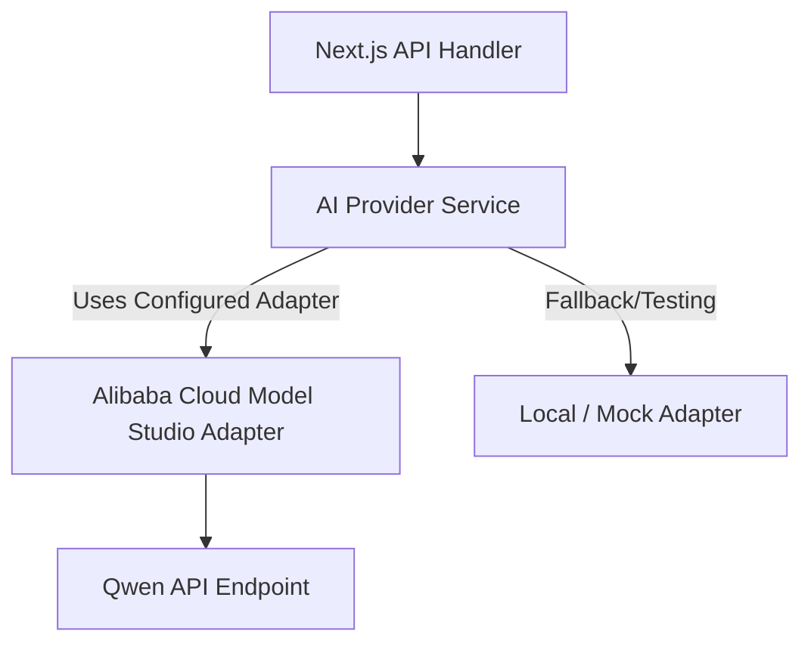
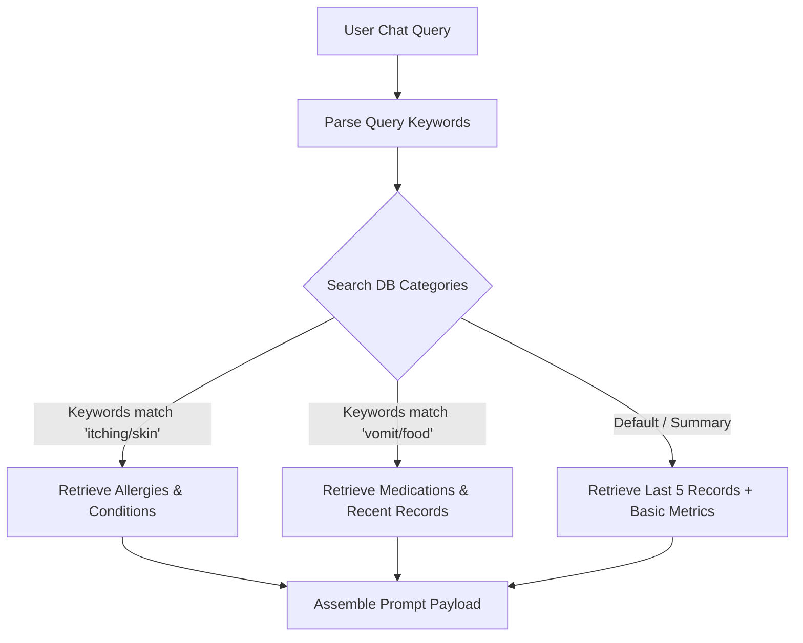

# AI Architecture

This document defines the AI subsystem architecture for the Pet Healthcare Ecosystem, targeting Alibaba Cloud's Model Studio (Qwen LLM) and ensuring context-aware, secure, and cost-efficient execution.

---

## 1. Abstracted AI Model Interface

To prevent vendor lock-in and allow seamless transitions between model sizes (e.g., `qwen-plus`, `qwen-max`) or alternative platforms, all AI tasks run through an abstraction layer.



### Abstraction Interface (Conceptual TypeScript)
```typescript
export interface AIChatMessage {
  role: 'user' | 'assistant' | 'system';
  content: string;
}

export interface AIPromptOptions {
  temperature?: number;
  maxTokens?: number;
}

export interface AIProvider {
  generateChat(messages: AIChatMessage[], options?: AIPromptOptions): Promise<string>;
  generateStream(messages: AIChatMessage[], options?: AIPromptOptions): AsyncGenerator<string>;
}
```

---

## 2. Dynamic Context Retrieval & Selection

To avoid context bloat, high token costs, and security risks, the platform performs **Dynamic Context Retrieval** based on the user's query topic instead of sending the entire raw history.



### Context Types Gathered:
1.  **Pet Profile Context:** Name, species, breed, age, current weight, known allergies.
2.  **Medications & Vaccinations:** Active prescriptions and upcoming boosters.
3.  **Filtered Record Logs:** Health records and notes retrieved based on matching keywords (e.g., matching "ears", "allergies", "vaccine" in text fields).

---

## 3. System Prompts & Safety Guardrails

### 3.1 System Instruction Set for AI Assistant
```
You are the AI Pet Health Assistant for the Pet Healthcare Ecosystem. 
You have access to the medical history of the selected pet (enclosed in <pet_context> tags).

Rules:
1. You are NOT a veterinarian. Never make autonomous medical diagnoses.
2. Always emphasize that your suggestions are educational and do not replace professional care.
3. If the query indicates an emergency (e.g., severe bleeding, poisoning, unconsciousness, continuous vomiting), immediately output the URGENT emergency message and recommend visiting the nearest vet clinic.
4. Answer concisely, referencing the pet's active medications and allergies to prevent drug interactions or allergy triggers.
```

### 3.2 System Instruction Set for AI History Summarizer
```
Summarize the following chronological pet health events into a clear, scannable clinical summary for the owner and their vet.
Highlight major conditions, recurring symptoms, active treatments, and vaccination status.
Separate facts (stored records) clearly from any AI-generated observations.
```

---

## 4. Operational Controls & Cost Management

### 4.1 Context/Token Optimization
*   Max context window limits are set at the service level (e.g., 4000 tokens for Qwen API requests).
*   Chat logs are truncated to the last 5 messages, summarizing older loops to fit bounds.

### 4.2 Error Handling & Fallbacks
*   **Model Downtime:** If the Qwen API times out or fails, the application falls back to a structured rule-based safety triage prompt or displays a clear "AI Assistant temporarily unavailable" notice without breaking the user session.
*   **Response Validation:** Outputs are parsed for safety keywords. If the model generates a response containing prohibited recommendations (e.g., prescribing a drug dose), the safety wrapper replaces the response with a vet recommendation disclaimer.

### 4.3 Cost & Rate Limiting
*   **User Quota:** Rate-limited to 10 queries per user per hour to prevent credit depletion.
*   **Logging:** Every AI request records token counts (prompt tokens, response tokens) and maps them to the `AuditLog` for monitoring execution costs.
